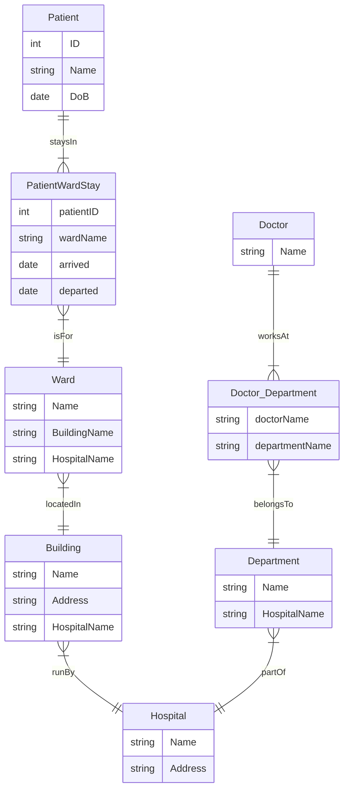

## **Question 2(a)**
**Give two examples of element names and two examples of attribute names from the provided code.**  
**[2 marks]**

### **Answer**

- **Element Names**  
  1. `<royal>`  
  2. `<title>`

- **Attribute Names**  
  1. `rank`  
  2. `territory`

### **Detailed Explanation**

- **Elements**  
  - Elements are the primary building blocks of XML, defined by opening and closing tags (e.g., `<royal>` … `</royal>`). They can contain text, other elements (children), or attributes.  
  - In the sample code, `<royal>` and `<title>` are clearly visible elements.

- **Attributes**  
  - Attributes appear within the start-tag of an element (e.g., `<title rank="king" territory="England">`). They provide additional details or properties about the element.
  - In the sample, `rank="king"` and `territory="England"` are examples of attributes.

#### **Key Points**
- Elements represent **data nodes** in the XML hierarchy.  
- Attributes store **metadata** or small bits of data describing elements.

---

## **Question 2(b)**
**What will be the result of the XPath query**  
```
//title[@rank="king" and @regnal="VIII"]/../royal[@name="Henry"]
```
**?**  
**[3 marks]**

### **Answer**

This query selects the `<royal>` element with `name="Henry"` **if** it shares the same parent as a `<title>` whose `rank="king"` **and** `regnal="VIII"`. Specifically, it matches:

```xml
<royal name="Henry" xml:id="HenryVIII">
  ...
</royal>
```

### **Detailed Explanation**

- **XPath Breakdown**  
  - `//title[@rank="king" and @regnal="VIII"]` finds all `<title>` elements with those attributes.  
  - `/..` moves *up* to their parent.  
  - `/royal[@name="Henry"]` then finds a child `<royal>` of that same parent whose `name="Henry"`.

- **Real-World Use**  
  - Perfect for genealogical or historical XML data where you want “the `<royal>` named Henry who is sibling to a `<title>` with specific attributes.”

#### **Key Points**
- `..` in XPath navigates to the **parent** element.  
- Combining conditions `[ @rank="king" and @regnal="VIII" ]` refines the search precisely.

---

## **Question 2(c)**
**What (in general) is returned by the XPath**  
```
 //title[@rank="king" or @rank="queen"]/../relationship/children/royal/relationship/children/royal/
```
**?**  
**[3 marks]**

### **Answer**

It returns all `<royal>` elements (at the end of the path) that descend from any `<title>` with `rank="king"` or `rank="queen"`, navigating through `<relationship>`, `<children>`, `<royal>`, etc. Essentially, **descendants** of royals who are kings or queens, two relationships deep.

### **Detailed Explanation**

- **Logical OR**  
  - `[ @rank="king" or @rank="queen" ]` means **any** `<title>` with `rank` set to king **or** queen.
- **Deep Navigation**  
  - `/..` moves to the parent `<royal>` (the one that has the `<title>`).  
  - Then `/relationship/children/royal/relationship/children/royal` moves down multiple levels, retrieving grandchildren or further descendants.

#### **Key Points**
- Using `or` in XPath filters broadens which `<title>` elements qualify.  
- Multiple steps (`relationship/children/royal`) can skip multiple levels to find deeply nested `<royal>` nodes.

---

## **Question 2(d)**
**Mary I of England was also queen consort of Spain from 16 January 1556 until her death. Give an XML fragment that would record this and say where you’d add it.**  
**[4 marks]**

### **Answer**

Add the following under the `<royal name="Mary">` element:

```xml
<relationship type="marriage" spouse="#PhilipOfSpain" from="1556-01-16">
  <title rank="queen" territory="Spain" regnal="consort" 
         from="1556-01-16" to="1558-11-17"/>
</relationship>
```

### **Detailed Explanation**

- **Modeling Marriage & Title**  
  - The new `<relationship>` includes `type="marriage"` and `spouse="#PhilipOfSpain"`.
  - A nested `<title>` indicates Mary’s rank as queen in Spain, with dates `from="1556-01-16"` to `to="1558-11-17"`.

- **Location in Code**  
  - Place it inside `<royal name="Mary">` so it is clear it pertains to Mary’s additional title and marriage period.

#### **Key Points**
- You can expand the same XML structure to capture additional roles or titles (like queen consort).  
- Always keep new data in the **logical** place in the hierarchy (under Mary in this case).

---

## **Question 2(e)**
**The historian argues about the strengths/weaknesses of using XML. What are they?**  
**[7 marks]**

### **Answer**

**Strengths**  
1. **Natural Hierarchy for Family Trees**: XML organizes data in nested elements, mirroring genealogical structures.  
2. **Flexibility & Extensibility**: Easy to add new attributes or child elements for more information.  
3. **Self-Describing / Readable**: Tags like `<royal>`, `<relationship>` are intuitive.

**Weaknesses**  
1. **Verbosity & Repetition**: Repeated tags can bloat large genealogical data.  
2. **Complex Queries**: Deep nesting can make queries slow or cumbersome compared to relational databases.  
3. **Scalability Issues**: Handling large, multi-branch genealogies can become difficult.

### **Detailed Explanation**

- **Hierarchy vs. Complexity**  
  - While XML suits hierarchical data well, genealogical data can become extremely large and complex, making maintenance or advanced queries tricky.
- **Performance Trade-offs**  
  - XML queries use XPath/XQuery, which can be less optimized for certain large-scale or cross-branch queries than a relational or graph-based system.

#### **Key Points**
- XML is **great** for hierarchical data with a well-defined parent-child structure.  
- Big genealogies might be better served by a **relational** or **graph** approach if complexity or performance is crucial.

---

## **Question 2(f)**
**One colleague suggests Linked Data (RDF). Another suggests a relational DB. Who’s right?**  
**[1 mark]**

### **Answer**

Both approaches can be valid. 

- **RDF** is ideal for *graph-like* data and many-to-many relationships typical in genealogies.  
- **Relational** is good if data can be structured into tables, with standard queries and well-defined relationships.

### **Detailed Explanation**

- **RDF (Linked Data)**  
  - Better for flexible, cross-branch relationships. Each person, title, marriage can be a resource with edges linking them.
- **Relational DB**  
  - Works if you can break genealogical data into tables (e.g., `Persons`, `Marriages`, etc.) with foreign keys.

#### **Key Points**
- The choice depends on how *web-like* (graphy) the data is versus how *tabular* and structured it is.

---

## **Question 2(g)**
**Choose RDF or relational. How might it address the strengths/weaknesses from (e)?**  
**[10 marks]**

### **Answer** (Example: **Relational** Approach)

- **Addresses XML Verbosity**: Data stored in tables is less verbose.  
- **Efficient Queries**: SQL joins can handle complex relationships if well-designed.  
- **Normalization** helps avoid duplication (resolving XML’s repetitiveness).

**Detailed Explanation**

1. **Relational Strengths**  
   - Use tables (e.g., `Royal`, `Relationship`, `Title`) with foreign keys for clarity.  
   - Achieves the same hierarchical ideas using *one-to-many* or *many-to-many* structures.
2. **Handling Large Data**  
   - Databases handle indexing and optimization, often outperforming XML on big genealogical sets.

#### **Key Points**
- By normalizing genealogical data (e.g., separate `Marriage` table), you reduce duplication.  
- SQL is widely used and optimized for large queries.

*(Alternatively, you could highlight how **RDF** addresses these same issues with flexible triple stores and SPARQL.)*

---

## **Question 3(a)**
**What does this SPARQL query return?**  
```
SELECT DISTINCT ?person
WHERE {
  ?person wdt:P31 wd:Q5;
          wdt:P19 wd:Q60.
}
```
**[2 marks]**

### **Answer**

It returns all distinct individuals (`?person`) who are **instance of** (`wdt:P31`) a human (`wd:Q5`) and whose **place of birth** (`wdt:P19`) is **New York City** (`wd:Q60`).

### **Detailed Explanation**

- **Wikidata**  
  - `wd:Q5` is the entity ID for “human”.  
  - `wd:Q60` is the entity ID for “New York City”.
- **SPARQL**  
  - `?person wdt:P31 wd:Q5` → “?person is instance of human”  
  - `?person wdt:P19 wd:Q60` → “?person's place of birth is New York City.”

#### **Key Points**
- This query only returns IRIs (like `http://www.wikidata.org/entity/Q...`) unless you fetch labels.  
- The `DISTINCT` ensures each person is returned once.

---

## **Question 3(b)**
**What assumptions does this query make? What data must be present?**  
**[2 marks]**

### **Answer**

1. **Assumption**: Each person has `wdt:P31 wd:Q5` (instance of human) and `wdt:P19 wd:Q60` (place of birth is explicitly New York City).  
2. **Data Must Be Present**: The relevant properties in Wikidata (P31, P19) must be defined for each entity. Also, New York City must specifically be identified by `wd:Q60`.

### **Detailed Explanation**

- If some humans in Wikidata have incomplete property definitions (e.g., no `wdt:P19`), they’re omitted.  
- If the place of birth uses a different ID or label for NYC, they won’t match.

#### **Key Points**
- SPARQL queries rely on consistent data modeling: the correct property URIs must be present.  
- If place of birth is only recorded as “Queens,” it might not appear if that’s not recognized as `Q60`.

---

## **Question 3(c)**
**How does this query differ? Does it resolve assumptions from (b)?**  
```
SELECT DISTINCT ?person
WHERE {
  ?person wdt:P31 wd:Q5;
          wdt:P19/wdt:P131* wd:Q60.
}
```
**[4 marks]**

### **Answer**

- **Difference**: It uses a path expression `wdt:P19/wdt:P131* wd:Q60` to allow multiple admin divisions leading to NYC.  
- **Resolves**: This helps if the place of birth is not directly `Q60` but nested (e.g., “Queens” within NYC).

### **Detailed Explanation**

- **wdt:P131*:** Zero or more steps of administrative territory.  
- This captures people whose birth location is a sub-entity of NYC.

#### **Key Points**
- This query is more **flexible** for hierarchical location data.  
- Overcomes the assumption that P19 must be *exactly* `Q60`.

---

## **Question 3(d)**
**Why aren’t the results human-readable?**  
**[1 mark]**

### **Answer**

They return entity URIs (like `http://www.wikidata.org/entity/Q12345`) instead of labels. Without pulling `rdfs:label` or `?label`, you see IDs, not real names.

### **Detailed Explanation**

- SPARQL returns the IRIs for each matching resource by default.  
- You must explicitly request labels from the triple store or a label service to see something like “John Smith” instead of `wd:Q9876`.

#### **Key Points**
- Linked data often uses IRIs internally.  
- Always fetch labels for user-friendly output.

---

## **Question 3(e)**
**How to rewrite (c) for more readable output?**  
**[5 marks]**

### **Answer**

Use label retrieval. For generic RDF:

```sparql
SELECT DISTINCT ?person ?personLabel
WHERE {
  ?person wdt:P31 wd:Q5;
          wdt:P19/wdt:P131* wd:Q60.
  ?person rdfs:label ?personLabel .
  FILTER (lang(?personLabel) = "en")
}
```

For **Wikidata** specifically, you can do:

```sparql
SELECT DISTINCT ?person ?personLabel
WHERE {
  ?person wdt:P31 wd:Q5;
          wdt:P19/wdt:P131* wd:Q60.
  SERVICE wikibase:label { bd:serviceParam wikibase:language "en". }
}
```

### **Detailed Explanation**

- **rdfs:label** is the standard RDF property for readable names.  
- **Wikibase** has a built-in label service.

#### **Key Points**
- Using labels is crucial for user-friendly results.  
- The `SERVICE` block for Wikidata automates label fetching.

---

## **Question 3(f)**
**Compare IMDB’s approach vs. Wikidata’s approach for place-of-birth queries.**  
**[6 marks]**

### **Answer**

- **IMDB**: Specialized in movies/actors. However, place-of-birth–based queries are not always exposed in an open API, so it’s less flexible for programmatic use.  
- **Wikidata**: A broad knowledge graph offering open SPARQL endpoints. Place-of-birth queries are straightforward with no domain-specific limitations.

### **Detailed Explanation**

- **IMDB** is great for detailed film/TV data. But if their web interface or limited API doesn’t provide direct place-of-birth queries, you’re restricted.  
- **Wikidata** is open, with a flexible SPARQL interface for arbitrary queries (including place of birth, date, etc.).

#### **Key Points**
- IMDB → specialized domain, but closed.  
- Wikidata → broad domain, open SPARQL for complex cross-domain queries.

---

## **Question 3(g)**
**IMDB has specialized movie data not in Wikidata. How to combine strengths?**  
**[4 marks]**

### **Answer**

- **Link Entities**: Use IMDB IDs (often stored in Wikidata) to cross-reference actors or films.  
- **Federated Queries**: Possibly do a two-step approach: fetch general info from Wikidata, then fetch specialized data from IMDB’s (partial) API or scraping.

### **Detailed Explanation**

- If a film or actor has an IMDB ID in Wikidata, you can match them.  
- Then you can gather extra details from IMDB (like box office, crew roles) that Wikidata may lack.

#### **Key Points**
- Data integration → synergy between broad linked data (Wikidata) and specialized DB (IMDB).  
- Must handle differences in data formats and coverage.

---

## **Question 3(h)**
**How to represent query (b) in a relational model?**  
**[2 marks]**

### **Answer**

Use a **triple table** design:

| Subject     | Predicate       | Object        |
|-------------|-----------------|---------------|
| Person123   | instanceOf      | Human         |
| Person123   | placeOfBirth    | New York City |

**Comparable SQL**:

```sql
SELECT DISTINCT t1.Subject
FROM TripleTable t1
JOIN TripleTable t2 ON t1.Subject = t2.Subject
WHERE t1.Predicate = 'instanceOf'
  AND t1.Object = 'Human'
  AND t2.Predicate = 'placeOfBirth'
  AND t2.Object = 'New York City';
```

### **Detailed Explanation**

- The triple table has 3 columns: (Subject, Predicate, Object).  
- We do a self-join to ensure *both* conditions match for the same Subject.

#### **Key Points**
- This approach mimics RDF in a relational DB.  
- Not as direct as SPARQL but fully feasible.

---

## **Question 3(i)**
**How to approach the version in (c) in SQL?**  
**[4 marks]**

### **Answer**

Similarly, we’d rely on storing hierarchical place data in multiple triples. Then:

```sql
SELECT DISTINCT t1.Subject
FROM TripleTable t1
JOIN TripleTable t2 ON t1.Subject = t2.Subject
JOIN TripleTable t3 ON t2.Object = t3.Subject
WHERE t1.Predicate = 'instanceOf'
  AND t1.Object = 'Human'
  AND t2.Predicate = 'placeOfBirth'
  AND t3.Predicate = 'locatedIn'
  AND t3.Object = 'New York City';
```

*(One possible approach—exact structure depends on how “P131*” is modeled.)*

### **Detailed Explanation**

- We simulate the path `P19/wdt:P131*` by linking place-of-birth to a chain of “locatedIn” relationships leading to “New York City.”

#### **Key Points**
- More complicated joins if we have multiple layers of location.  
- Could require recursion or repeated self-joins for deeper hierarchies.

---

# **Question 4: Hospital Database Model**

A health organization is designing a database to keep track of **doctors**, **hospitals**, and **patients**. Each **patient** stays in a **ward** (with arrival/departure dates), each ward is in a **building**, and each building is run by a **hospital**. Also, **departments** belong to a hospital, and doctors can work in multiple departments. We want to cover the sub-questions (a)–(e):

---

## **(a) Which questions could be answered by this model?**

1. **(i)** Which building did the patient named Neha Ahuja stay in?  
   - Path: **Patient** → “staysIn” → **Ward** → **Building**  

2. **(ii)** Which hospital was responsible for Neha Ahuja’s stay?  
   - Then further: **Ward** → **Building** → **Hospital**  

3. **(iii)** In which wards are Orthopedics patients housed?  
   - Must link **Ward** ↔ **Department** or have some departmental concept for the ward (see adapted model).

4. **(iv)** Which hospitals does the doctor Song Ci work in?  
   - Must handle the many–many from **Doctor** to **Department** and link **Department** → **Hospital**.

5. **(v)** What departments does the hospital have that contains a building called ‘The Alexander Fleming Building’?  
   - After linking **Building** → **Hospital**, we check **Department** (which belongs to that same hospital).

6. **(vi)** Which doctor treated Neha Ahuja?  
   - Not trivially shown in the original diagram; we might define how doctors and patients link. Possibly by a bridging table or by a “Ward→Doctor” link if the doctor in that ward treats the patients in it.

Hence the original model must be *slightly adapted* to store relationship attributes (arrival/departure) and handle many–many or “treatedBy” relationships.

---

## **(b) The part that cannot be straightforwardly implemented**

Two main issues in the original E/R for a standard relational approach:

1. **Attributes (arrived, departed) on the “staysIn” relationship**  
   - A relationship with attributes is best turned into a bridging entity (`PatientWardStay`).

2. **Many–Many** from Doctor to Department  
   - The original E/R shows `worksAt` with cardinality m..n. In a relational model, that also requires a bridging table.

We fix them by introducing associative/bridge tables—**no brand-new random attributes** needed.

---

## **(c) Adapted Model (with Cardinalities) in an ER Diagram**

Below is a **Mermaid** diagram reflecting the final structure. We keep the existing attributes (like `Name` for building/hospital/doctor, `ID` for patient) and avoid new ID fields for other entities. We do bridging for “staysIn” (with arrived/departed) and “worksAt” many–many:



### Explanation of the Diagram

- **PatientWardStay** bridges `Patient` ↔ `Ward`, storing `arrived` and `departed`.  
- **Doctor_Department** bridges `Doctor` ↔ `Department`.  
- **Ward** references **Building** plus **Hospital** by name.  
- **Building** references a single **Hospital**.  
- **Department** references a single **Hospital**.  

Now we can handle:

- (iii) Orthopedics wards, if each **Ward** references exactly one **Department** (or you do a bridging Ward_Department if multiple).  
- (vi) “treatedBy” if a doctor is assigned to that ward or a separate bridging table.

---

## **(d) Tables & Keys (SQL Implementation)**

Assuming we rely on existing *natural* attributes (Name, etc.) as PKs:

1. **Hospital**  
   - **Name** (PK)  
   - Address, etc.  

2. **Building**  
   - **(Name, HospitalName)** (composite PK)  
   - Address, etc.  

3. **Ward**  
   - **(Name, BuildingName)** (composite PK)  
   - Possibly a “DeptName” if it belongs to one department, or bridging if multiple.  

4. **Patient**  
   - **ID** (PK)  
   - Name, DoB  

5. **PatientWardStay** (handles “staysIn” plus arrival/departure)  
   - **(PatientID, WardName)** (composite PK)  
   - arrived, departed  
   - FKs referencing Patient, Ward’s composite key  

6. **Department**  
   - **(Name, HospitalName)** (composite PK)  

7. **Doctor**  
   - **Name** (PK)  

8. **Doctor_Department** (for the m..n “worksAt”)  
   - **(DoctorName, NameOfDept)** as composite PK  
   - FKs to Doctor(Name) and Department(Name)  

*(If each **Ward** is assigned a single department, you can store `DeptName, HospitalName` as an FK in **Ward**. If wards can have multiple, add a bridging `Ward_Department`.)*

---

## **(e) Sample MySQL Queries**

**(i) Which building did the patient named Neha Ahuja stay in?**
```sql
SELECT w.BuildingName
FROM Patient p
JOIN PatientWardStay pws ON p.ID = pws.PatientID
JOIN Ward w ON w.Name = pws.WardName
WHERE p.Name = 'Neha Ahuja';
```

**(ii) Which hospital was responsible for Neha Ahuja’s stay?**
```sql
SELECT b.HospitalName
FROM Patient p
JOIN PatientWardStay pws ON p.ID = pws.PatientID
JOIN Ward w ON (w.Name = pws.WardName
                AND w.BuildingName = pws.BuildingName)
JOIN Building b ON b.Name = w.BuildingName
WHERE p.Name = 'Neha Ahuja';
```

**(iii) In which wards are Orthopedics patients housed?**
- If each ward is dedicated to one department:
```sql
SELECT w.Name AS WardName
FROM Ward w
JOIN Department d 
  ON (w.DeptName = d.Name AND w.HospitalName = d.HospitalName)
WHERE d.Name = 'Orthopedics';
```
- Or if bridging `Ward_Department`, adapt similarly.

**(iv) Which hospitals does the doctor Song Ci work in?**
```sql
SELECT DISTINCT d.HospitalName
FROM Doctor doc
JOIN Doctor_Department dd 
   ON doc.Name = dd.doctorName
JOIN Department d 
   ON d.Name = dd.departmentName
WHERE doc.Name = 'Song Ci';
```

**(v) Which departments does the hospital have that contains a building called ‘The Alexander Fleming Building’?**
```sql
SELECT d.Name
FROM Building b
JOIN Hospital h ON (b.HospitalName = h.Name)
JOIN Department d ON (d.HospitalName = h.Name)
WHERE b.Name = 'The Alexander Fleming Building';
```

**(vi) Which doctor treated Neha Ahuja?**
- We will need to establish a M:N relationship between doctors and patients.
