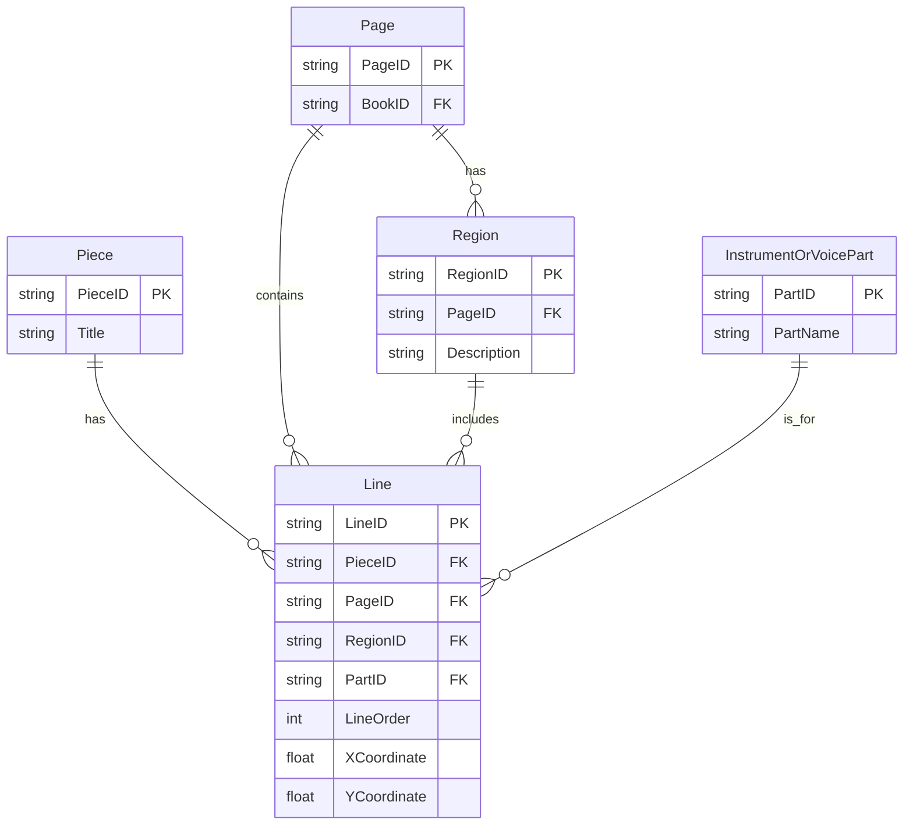

# **Question 2: Analyzing OpenDocument Format (ODF) and RelaxNG Schema**

## (a) What language is this encoded in? [1]

**Answer:**  
It is encoded in **XML**.

**Key Explanation:**  
- ODF files (e.g., `.odt` documents) are ZIP containers that include XML files plus any images, styles, metadata, etc.  
- The snippet provided shows tags like `<office:text>` and `<text:p>`, which are clearly XML elements.

---

## (b) What data structure does it use? [1]

**Answer:**  
It uses a **tree** (hierarchical) structure.

**Key Explanation:**  
- XML is inherently a tree: a single root element with nested children.  
- Elements appear inside one another, which naturally forms a hierarchy.

---

## (c) List the two namespaces that this document uses. [2]

**Answer:**  
1. `urn:oasis:names:tc:opendocument:xmlns:office:1.0`  
2. `urn:oasis:names:tc:opendocument:xmlns:text:1.0`

**Key Explanation:**  
- Namespaces help differentiate element/attribute names.  
- In the snippet, `<office:text>` and `<text:p>` map to these URIs.

---

## (d) What would the XPath expression `//text:list-item/text:p` return? Would it be different from `//text:list//text:p`? [4]

**Answer (Short Form):**  
- `//text:list-item/text:p` → selects `<text:p>` elements that are **direct children** of `<text:list-item>`.  
- `//text:list//text:p` → selects **all** `<text:p>` elements that are descendants of `<text:list>` (not necessarily direct children).

In **this** example, both expressions return the same three items (`Trees, Graphs, Relations`) because each `<text:p>` is already a direct child of `<text:list-item>`. In a more complex or nested structure, these expressions could yield different results.

---

## (e) How does this code help us assess if the document above is **well‐formed**? [2]

**Answer:**  
It **does not** directly assess well‐formedness. A RelaxNG schema only checks structure and allowed elements/attributes **after** the document is confirmed well‐formed by an XML parser.  

- **Well‐formedness** rules: correct tag nesting, matching start/end tags, a single root, properly quoted attributes, etc.  
- The schema itself cannot override or fix basic syntax errors.

---

## (f) How does this code help us assess if the document above is **valid**? [2]

**Answer:**  
It checks if the document follows the structural rules defined in the RelaxNG schema—e.g., the correct elements, their sequences, attributes, etc. If the document meets these requirements, it is **valid**; otherwise, it is invalid.  

---

## (g) Which part or parts of the document is this relevant to? [2]

**Answer:**  
It is specifically relevant to `<text:list>` elements and their child elements (`<text:list-header>`, `<text:list-item>`). The provided RelaxNG snippet defines how these list structures must be formed.

---

## (h) Give an example of an element that would not be valid given this schema code (assume `text-list-attr` only defines attributes). [3]

**Answer (Example):**
```xml
<text:list>
  <text:list-item>Item Content</text:list-item>
  <text:invalid-element>Invalid Content</text:invalid-element>
</text:list>
```
`<text:invalid-element>` is **not** part of the schema, so the file fails validation.

---

## (i) Assess the suitability of this data structure for encoding word processing documents. What advantages or disadvantages would a relational model bring? [13]

**Answer (Outline):**

1. **Using XML / Tree Structures for Word Processing**  
   - **Advantages**:  
     - **Natural Hierarchy**: Documents often have nested structures (sections, paragraphs, runs), which XML easily represents.  
     - **Standards**: Formats like ODF and OOXML are XML-based, well supported by many tools.  
     - **Flexibility**: Easy to embed metadata or styles within the document structure.
   - **Disadvantages**:  
     - **Verbosity**: XML can be large and repetitive.  
     - **Complex Queries**: Although XPath/XQuery are powerful, they may be less straightforward for certain tabular queries or large-scale data analysis.

2. **Relational Model**  
   - **Advantages**:  
     - **Strong Data Integrity**: Primary/foreign keys, constraints, transactions.  
     - **Efficient SQL**: Well-suited for structured queries, aggregations, and numeric data tasks.  
   - **Disadvantages**:  
     - **Poor Fit for Deeply Nested Data**: Many join tables might be needed for complex markup.  
     - **Rigid Schema**: Word processing documents have variable structures, which can be cumbersome to store relationally.

3. **Conclusion**:  
   - XML is **well-suited** to hierarchical, text-heavy documents.  
   - A relational DB is **better** for strongly structured, tabular data and extensive analytical queries.

---

# **Question 3: MusicBrainz / Linked Data**

*(Based on RDF/Turtle data describing a music group, e.g. BTS, with foundingDate, schema:member, etc.)*

## (a) What (approximately) was the type that we put into the `Accept` header? [1]

**Answer:**  
`text/turtle` (or `application/turtle`).

---

## (b) What is the full URL of the predicate `schema:member` in this context? [1]

**Answer:**  
```
http://schema.org/member
```

---

## (c) How many band members of BTS are listed in this snippet? [1]

**Answer:**  
Likely **2** members (based on the provided blank nodes referencing separate individuals).

---

## (d) Comment on the way the `schema:member` predicate is used in this snippet. [3]

**Answer (Short Explanation):**  
- A **role-based** approach: the band node has `schema:member` → blank node of type `schema:OrganizationRole`. That blank node itself has `schema:member` → the person’s URI.  
- This structure allows adding membership attributes like `schema:startDate` to the role object.

---

## (e) What type(s) are associated with the entity having `schema:name` of “JIN”? [1]

**Answer:**  
He is typed as **`schema:MusicGroup`** **and** **`schema:Person`** (due to how MusicBrainz RDF is auto-generated).

---

## (f) Consider this SPARQL query:
```sparql
SELECT ?a ?b WHERE {
  mba:9fe8e-ba27-4859-bb8c-2f255f346853 schema:member ?c .
  ?c schema:startDate ?b ;
     schema:member ?d .
  ?d schema:name ?a .
}
```
What prefixes need to be defined for this to work (give the full declarations)? [1]

**Answer:**  
At a minimum:
```sparql
PREFIX mba: <http://musicbrainz.org/artist/>
PREFIX schema: <http://schema.org/>
```
(And possibly `rdf:` if using `rdf:type`.)

---

## (g) What would the query return? [2]

**Answer:**  
It returns pairs of `(?a, ?b)` where `?a` = **member name** and `?b` = **startDate** from the membership role. Essentially, each band member’s name plus when they joined.

---

## (h) This data represents an export from a relational database. Construct an ER diagram that could accommodate the instance data above. [6]

Below is a **Mermaid diagram-as-code** showing a possible **Artist**–**Membership** schema:

```mermaid
erDiagram
    Artist {
        int ArtistID PK
        string Name
        string Type        %% 'Person' or 'MusicGroup'
        date FoundingDate  %% relevant if Type='MusicGroup'
    }

    Membership {
        int MembershipID PK
        int BandID FK
        int MemberID FK
        date StartDate
        string RoleName
    }

    Artist ||--o{ Membership : is_in
    Artist ||--o{ Membership : belongs_to
```

- **Artist**: holds bands or individuals (differentiated by `Type`).  
- **Membership**: join table referencing both the band (BandID) and member (MemberID), plus role details.

---

## (i) Give the CREATE TABLE commands for two tables based on your ER diagram. [4]

**Answer (Example):**

```sql
CREATE TABLE Artist (
  ArtistID     INT PRIMARY KEY,
  Name         VARCHAR(100) NOT NULL,
  Type         VARCHAR(20)  NOT NULL,   -- 'Person' or 'MusicGroup'
  FoundingDate DATE
);

CREATE TABLE Membership (
  MembershipID INT PRIMARY KEY,
  BandID       INT NOT NULL,
  MemberID     INT NOT NULL,
  StartDate    DATE,
  RoleName     VARCHAR(100),
  FOREIGN KEY (BandID)  REFERENCES Artist(ArtistID),
  FOREIGN KEY (MemberID) REFERENCES Artist(ArtistID)
);
```

---

## (j) Suggest a MySQL query to check whether any band member in the database is recorded as joining before the founding date of their band. [5]

**Answer:**
```sql
SELECT aMember.Name AS MemberName,
       aBand.Name   AS BandName,
       m.StartDate,
       aBand.FoundingDate
FROM Membership m
JOIN Artist aBand   ON m.BandID   = aBand.ArtistID
JOIN Artist aMember ON m.MemberID = aMember.ArtistID
WHERE m.StartDate < aBand.FoundingDate;
```
- Identifies anomalies where someone’s start date precedes the band’s founding date.

---

## (k) MusicBrainz makes their data available as both a downloadable database dump and as Linked Data. What are the benefits and disadvantages of each approach? [5]

**Answer (Summary):**

- **Database Dump**  
  - **Pros**: Complete offline snapshot for large queries/analytics; independent of network.  
  - **Cons**: Can become **outdated** quickly; large storage overhead.  

- **Linked Data**  
  - **Pros**: Always **up-to-date** data; easy to interlink with other semantic sources.  
  - **Cons**: Dependent on network; can be slower or unavailable if the endpoint is down.

---

# **Question 4: Enhancing an ER Model for 16th-Century European Music Records**

## (a) This model doesn't allow storing the order or coordinates for lines of music on a page. How could this be fixed? [3]

**Answer:**  
Add attributes to **Line** such as:
- `LineOrder` (integer) to track the visual or logical order.  
- `XCoordinate`, `YCoordinate` (floats/integers) to store layout positions if needed for precise rendering.

---

## (b) Some books are published in tablebook format, with multiple parts/voices to a piece and page regions with lines in different directions. How to add these aspects? [8]

**Answer (Outline):**

1. **InstrumentOrVoicePart** entity (e.g., “Soprano,” “Alto,” or “Violin Part”).  
2. **Region** entity to define different areas on a page, potentially oriented differently or for different staves.  
3. **Line** references both **Part** and **Region**.  

Hence, a line belongs to:
- A **Piece** (the composition),  
- A **Page** (the physical page it’s on),  
- A **Region** (sub-area of that page),  
- A **Part** (e.g., soprano or instrumental line).

---

## (c) List the tables, primary keys, and foreign keys for a relational implementation of your modified model. [7]

**Answer (Schema Example):**

1. **Piece**  
   - PK: `PieceID`  
   - Attributes: `Title`, etc.

2. **Page**  
   - PK: `PageID`  
   - Attributes: `BookID` (FK to `Book(BookID)`), etc.

3. **Region**  
   - PK: `RegionID`  
   - FK: `PageID → Page(PageID)`  
   - Attributes: `Description`, orientation/coordinates if needed.

4. **InstrumentOrVoicePart**  
   - PK: `PartID`  
   - Attributes: `PartName`

5. **Line**  
   - PK: `LineID`  
   - FKs: `PieceID`, `PageID`, `RegionID`, `PartID`  
   - Attributes: `LineOrder`, `XCoordinate`, `YCoordinate`

---

## (d) Give a query to list pieces with the total number of lines of music that they occupy. [5]

**Answer:**
```sql
SELECT p.Title, COUNT(*) AS TotalLines
FROM Piece p
JOIN Line l ON p.PieceID = l.PieceID
GROUP BY p.Title;
```
- This aggregates how many **Line** rows each piece has.

---

## (e) Assess the suitability of this data structure for a relational model, and compare it with ONE other database model (XML-based, document-based, or Linked Data graph). [7]

**Answer (Overview):**

1. **Relational Model**  
   - **Pros**:  
     - Great for structured queries (counts, filtering).  
     - Clear constraints and relationships (FK, PK).  
   - **Cons**:  
     - Complex hierarchical or layout data might require multiple bridging tables, making it less intuitive.  
     - Harder to represent flexible or nested markup.

2. **XML/Tree Database (Example)**  
   - **Pros**:  
     - Naturally handles nested data (like lines, staves, sub-regions).  
     - Supports metadata and variable structure easily.  
   - **Cons**:  
     - More difficult to do set-based queries or large aggregations.  
     - File size overhead and performance issues for certain large queries.

3. **Conclusion**:  
   - **Relational** is ideal if you often do structured queries (like counting lines, grouping data) with well-defined relationships.  
   - **XML** (or a document/graph DB) is often better for deeply nested or unstructured layout data that doesn’t map neatly to rows/columns.

---

## Mermaid ER Diagram for Question 4

A **Mermaid diagram-as-code** that includes `Piece`, `Page`, `Region`, `InstrumentOrVoicePart`, and `Line` might look like this:



- **Piece**: the musical piece.  
- **Page**: physical pages from the book.  
- **Region**: subdivided areas on the page (especially in tablebook format).  
- **InstrumentOrVoicePart**: each voice or instrumental line part.  
- **Line**: references which piece, which page, which region, which part, plus ordering and coordinates.

