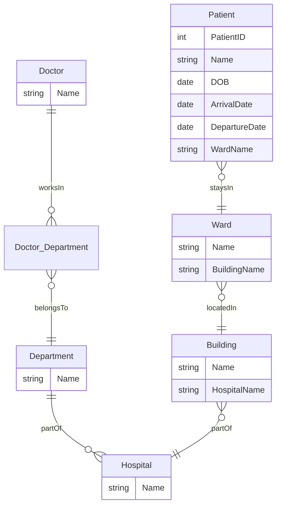

---

### Question 2(a): Give two examples of element names and two examples of attribute names from the provided code.** [2]

**Answer:**

- **Element names:**
  1. `<royal>`
  2. `<title>`

- **Attribute names:**
  1. `rank`
  2. `territory`

**Detailed Explanation:**

- **Elements in XML:**
  - Elements represent the core structure and content of an XML document. They are defined by opening and closing tags (e.g., `<royal>` and `</royal>`). Elements can hold text, other elements (known as child elements), or attributes.
  - In XML, elements can be nested to form a hierarchy. For instance, a `<royal>` element can contain child elements like `<title>`, `<relationship>`, etc., allowing you to represent complex data structures.
  - **Example:** If you are modeling a family tree, each person might be represented by a `<royal>` element, and their titles (like king or queen) could be stored within `<title>` child elements.

- **Attributes in XML:**
  - Attributes provide additional details about elements and are defined within the opening tag. They follow a key-value format where the key is the attribute name (e.g., `rank`), and the value is the attribute's value (e.g., `"king"`), enclosed in quotation marks.
  - Attributes are useful when you need to attach metadata or properties to an element without creating a new element. For example, in a `<title>` element, you could specify the rank of a royal person using `rank="king"`.
  - **Example:** The element `<title rank="king" territory="England">` contains the attributes `rank` and `territory`, which describe additional properties about the title.

**Important Points to Remember:**
- **Elements vs. Attributes:** Elements represent the main data (e.g., `<title>`), while attributes provide extra details (e.g., `rank="king"`). This distinction is key in both understanding and designing XML structures.
- **Proper Structure:** In XML, every element should have a closing tag (e.g., `</title>`), and attributes should always be within the opening tag. Mistakes here can cause errors in parsing XML documents.

---

### Question 2(b): What will be the result of the following XPath query: `//title[@rank="king" and @regnal="VIII"]/../royal[@name="Henry"]`?** [3]

**Answer:** The query selects the `<royal>` element with the attribute `name="Henry"`. It finds where the `title` is `king` and has the `regnal="VIII"` attribute, then moves up to the parent `<royal>` node.

**Detailed Explanation:**

- **XPath Overview:**
  - XPath is a query language specifically designed to navigate and select nodes (elements, attributes, or text) within an XML document. It uses path expressions to traverse through the document structure and filter nodes based on specified criteria.
  - **Example:** If you have a complex XML document representing a royal family tree, you can use XPath to find all titles held by royals named Henry who were kings.

- **Understanding the Query:**
  - The expression `//title[@rank="king" and @regnal="VIII"]` searches for any `<title>` element where `rank="king"` and `regnal="VIII"`. The `@` symbol is used to target attributes in the XPath query.
  - The `..` operator moves up from the `<title>` element to its parent `<royal>` element. This is useful when you want to select an ancestor node based on conditions found in a descendant.
  - The query then checks if this `<royal>` element has an attribute `name="Henry"`, and if it does, that node is returned.

- **Practical Use Case:** Imagine you are exploring a database of monarchs, and you need to find a specific royal person (e.g., Henry VIII) based on both their title and family context. This XPath query would allow you to extract that specific person based on the attributes you know.

**Important Points to Remember:**
- **XPath and Attribute Selection:** Use `@` to target specific attributes. This is crucial when you need to filter nodes based on certain criteria like `rank="king"`.
- **Hierarchy Navigation:** XPath allows both upward (`..`) and downward (`/`) traversal. Understanding when to move up to a parent node and when to drill down is essential when handling hierarchical data.

---

### Question 2(c): What (in general terms) will be returned by the following XPath query: `//title[@rank="king" or @rank="queen"]/../relationship/children/royal/relationship/children/royal/`?** [3]

**Answer:** The query returns all `<royal>` elements that are descendants of `children` nodes, where the ancestor node has a `title` element with either `king` or `queen` rank.

**Detailed Explanation:**

- **Understanding Logical Conditions in XPath:**
  - The query uses the `or` operator inside the predicate `[ ]` to filter `title` elements based on whether `rank` is either "king" or "queen". This allows you to combine multiple conditions within a single query.
  - After finding the matching `title` elements, the `..` operator moves up to the parent `<royal>` element. The query then navigates downward through nested `<relationship>`, `<children>`, and `<royal>` elements.

- **Traversing Multiple Levels in XML:**
  - The query reaches deeply nested nodes by chaining multiple path segments, each representing different levels in the XML hierarchy. This is common when navigating complex data structures like family trees, where relationships span multiple generations.
  - The final result returns all `<royal>` elements that meet the conditions specified, regardless of how deeply they are nested.

- **Practical Use Case:** Imagine you want to identify all descendants of kings or queens across several generations. This query could be used to extract all relevant royal members from an XML family tree, even if they are several levels deep.

**Important Points to Remember:**
- **Logical Conditions in XPath:** Combining conditions with `and` or `or` is common in XPath queries. Practice these to ensure you can select nodes based on multiple criteria.
- **Depth and Complexity in XML:** As the XML structure becomes more nested, queries can get complex. Breaking down such queries into smaller steps helps in understanding the overall logic.

---

### Question 2(d): Mary I of England was also queen consort of Spain from 16 January 1556 until her death. Give an XML fragment that would record this information and say where you would add it to the code above.** [4]

**Answer:** This fragment should be added under the `<royal name="Mary">` element.

```xml
<relationship type="marriage" spouse="#PhilipOfSpain" from="1556-01-16">
    <title rank="queen" territory="Spain" regnal="consort" from="1556-01-16" to="1558-11-17" />
</relationship>
```

**Detailed Explanation:**

- **Modeling Relationships in XML:**
  - XML allows you to represent complex relationships using nested elements. In this case, Mary I’s marriage is modeled using the `<relationship>` element, which contains attributes like `type`, `spouse`, and `from` to describe the context of the relationship.
  - The nested `<title>` element specifies her role as queen consort, with attributes `rank`, `territory`, and `regnal` to capture important metadata. This structure enables detailed and precise representation of historical data.

- **Adding New Information to an Existing XML Structure:**
  - When extending an XML document, it’s important to place new data within the correct parent element to maintain logical consistency. In this case, the relationship and title information for Mary should be placed under her existing `<royal name="Mary">` node.
  - The `spouse` attribute references Philip of Spain using an ID (`#PhilipOfSpain`), linking related entities without requiring redundant data.

- **Practical Use Case:** This XML structure is ideal for historians who need to track complex relationships across multiple entities (e.g., international marriages between royals). By organizing the data hierarchically, you maintain both the flexibility and precision needed for historical analysis.

**Important Points to Remember:**
- **Maintaining Consistent Hierarchy:** When adding new data, it’s vital to place it within the correct parent element. Incorrect placement can lead to logical errors in how the data is interpreted.
- **Balance Between Data and Metadata:** XML allows for both data (like titles and dates) and metadata (like attributes). Properly structuring these is key to creating meaningful XML documents.

---

### Question 2(e): The historian argues with colleagues about the strengths and weaknesses of this approach, using XML, and this model in particular. What are the strengths and weaknesses?** [7]

**Answer:** 

**Strengths:**

1. **Fits Hierarchical Data:**
   - XML’s tree structure is perfectly suited for hierarchical data like family trees, where relationships naturally follow parent-child formats. Each `<royal>` element can hold child elements representing descendants or relationships, making it intuitive to model genealogies.

2. **Flexible for Complex Relationships:**
   - XML allows for the representation of complex and varied relationships, such as multiple marriages, titles, or territorial claims. The use of nested elements and attributes makes it easy to capture different aspects of a historical figure’s life.

3. **Readable and Self-Descriptive:**
   - XML is human-readable and self-explanatory

, making it accessible to historians and researchers without requiring specialized software. Tags like `<title>`, `<relationship>`, and `<children>` are descriptive and meaningful, allowing for easy interpretation of the data.

**Weaknesses:**

1. **Complexity Grows with Data:**
   - As the genealogical dataset grows, the XML structure can become deeply nested and increasingly complex. Managing relationships across multiple generations requires extensive nesting, which can be difficult to maintain and navigate.

2. **Redundant and Verbose:**
   - XML is inherently verbose due to repetitive tags and attributes. In large genealogical datasets, information like titles or territories may be repeated across many nodes, leading to redundancy and larger file sizes.

3. **Slow Performance on Large Datasets:**
   - While XPath and XQuery are powerful, they can be less efficient when querying large datasets. Relational databases, which are optimized for performance, offer better solutions when dealing with extensive historical records.

**Detailed Explanation:**

- **Choosing XML for Hierarchical Data:**
  - XML’s hierarchical structure aligns naturally with genealogical data. For example, a family tree is inherently a nested structure, where each generation builds upon the previous one. This makes XML an intuitive choice for representing such data.
  
- **Flexibility and Extensibility:**
  - XML’s flexibility is particularly useful when dealing with complex historical records, where relationships are often intricate and non-linear. By using attributes and nested elements, you can capture multiple dimensions of a person’s history, such as political alliances or territorial claims.

- **Challenges with Scalability:**
  - As the dataset grows, however, the nested structure can become unwieldy. For instance, navigating deep hierarchies in large datasets requires complex XPath queries, which can be slow and difficult to manage. Additionally, XML’s verbosity results in large file sizes, which impacts storage and performance.

- **Practical Use Case:** Historians who need to model family trees or genealogies might initially find XML suitable, but they must be aware of the trade-offs in performance and manageability as the dataset scales. For large-scale historical analysis, considering alternative data models may be necessary.

**Important Points to Remember:**
- **Choosing the Right Format:** XML is best suited for hierarchical, structured data, but it’s less efficient for large datasets or data with complex relationships. Knowing when to choose XML versus other formats like JSON or relational databases is essential.
- **Scalability Concerns:** As your XML data grows in complexity, it can become harder to manage and query. Understanding the limitations of your chosen model helps in planning for scalability.

---

### Question 2(f): One colleague suggests that the data is really a graph, not a tree, and should be represented as Linked Data using RDF. The other thinks it can be modeled as a set of relations and so should be transformed into a relational database. Who is correct?** [6]

**Answer:** Both colleagues have valid points:

- **RDF (Linked Data):** RDF is better if the data involves complex, many-to-many relationships that resemble a graph. It’s useful for scenarios where connections between entities are more important than a strict hierarchy. For instance, RDF is ideal if you need to represent the network of relationships between historical figures, like alliances, rivalries, or lineage.
  
- **Relational Database:** If the data can be organized into well-structured tables with clear relationships, a relational database is easier to manage and query. Relational databases work well when your data is structured, like tables of individuals linked by primary and foreign keys. This is especially true when your data follows a more tabular format, such as records of marriages or political offices held.

**Detailed Explanation:**

- **RDF and Linked Data:**
  - RDF (Resource Description Framework) is designed to represent data as a network of interconnected nodes. It’s commonly used in Linked Data applications, where each entity is a node linked to other nodes by relationships (edges).
  - For genealogical data where relationships are not strictly hierarchical but instead form a web of connections, RDF is highly suitable. For example, a person could be linked to multiple entities like their parents, spouses, and children, all in a flexible graph model.

- **Relational Databases:**
  - Relational databases are based on structured tables where data is organized into rows and columns. Relationships between entities are handled through primary and foreign keys, allowing for efficient queries.
  - If your genealogical data can be broken down into structured records (e.g., people, marriages, titles), a relational database simplifies data management and querying. For example, a table of individuals linked to a table of marriages provides a clear, structured way to manage complex relationships.

- **Practical Use Case:** Choosing between RDF and relational databases depends on how you intend to analyze the data. If you need to perform complex queries across a web of relationships (like tracing lineage across multiple branches), RDF is more appropriate. However, if your analysis involves structured, tabular data (like tracking specific attributes of royals), a relational database is a better choice.

**Important Points to Remember:**
- **RDF vs. Relational Databases:** RDF is ideal for modeling complex, interconnected relationships (like a social network), while relational databases excel at structured, tabular data. Understanding which data model best fits your use case is a crucial skill.
- **Data Complexity Matters:** For data with many-to-many relationships, RDF or graph databases are often more appropriate. Relational databases work well when the data can be broken down into clear tables.

---

### Question 2(g): Choosing one of the two suggested approaches (relational database or RDF), explain (with examples) how it might solve the strengths and weaknesses you listed in (e) above.** [10]

**Answer:** 

**Relational Database Approach:**

- **Strengths:**
  - Relational databases use SQL, a highly optimized and widely understood language, for querying structured data. SQL allows you to retrieve, update, and manipulate data efficiently.
  - Data in relational databases is stored in tables, reducing redundancy and simplifying management. Tables are normalized to avoid data duplication and maintain consistency across the dataset.
  
- **Example Solution:**
  - In a relational database, family members can be stored in a "Person" table, with relationships represented through foreign keys linking tables like "Marriage" and "Title". For instance, the "Person" table might have columns like `PersonID`, `Name`, `Birthdate`, and `ParentID`, which allow easy tracking of family relationships across generations.
  - The "Marriage" table could link individuals through `Spouse1ID` and `Spouse2ID`, while the "Title" table could store information about each person’s rank, territory, and dates of reign.

- **Weaknesses Addressed:**
  - Relational databases address the verbosity and redundancy issues of XML by storing data in compact tables, where each piece of information is stored only once. Complex queries are optimized through indexing and well-defined relationships, leading to better performance on large datasets.

**Detailed Explanation:**

- **Normalization and Data Integrity:**
  - In a relational database, normalization involves organizing data into tables in such a way that redundancy is minimized, and dependencies are properly managed. For example, rather than storing titles repeatedly for each royal, they can be stored once in a "Title" table and linked to individuals via foreign keys.
  - This structure ensures data consistency, reduces storage requirements, and improves query performance.

- **Efficiency in Querying:**
  - SQL, the standard language for relational databases, is designed to perform complex queries quickly, even on large datasets. For example, retrieving all descendants of a particular royal or finding all individuals who held the title of king in a given territory can be done efficiently using SQL joins and conditions.

- **Practical Use Case:** For historians managing large datasets of royals and their relationships, a relational database provides a structured, efficient, and scalable solution. It simplifies data management and ensures that complex queries, such as tracing lineage or analyzing titles across generations, can be performed effectively.

**Important Points to Remember:**
- **Leverage the Right Tool for the Job:** Choose relational databases for structured data where relationships can be normalized into tables, and choose RDF or graph models when dealing with complex, non-linear connections.
- **Normalization and Performance:** Normalization helps reduce redundancy and improves query performance in relational databases. Efficiently structuring your data model is key to managing larger datasets.

---

### Question 3(a): **What will the following query return?** [2]

```sparql
SELECT DISTINCT ?person
WHERE {
  ?person wdt:P31 wd:Q5;
          wdt:P19 wd:Q60.
}
```

- **Answer:** The query returns a list of distinct people (`?person`) who are classified as humans (`wd:Q5`) and whose place of birth is New York City (`wd:Q60`).

**Detailed Explanation:**

- **SPARQL Query Language:**
  - SPARQL is a powerful language used for querying RDF (Resource Description Framework) data. It is commonly used with linked data sources like Wikidata.
  - In this query, `?person` represents a variable that will hold the result of the query.

- **Understanding the Query:**
  - The triple `?person wdt:P31 wd:Q5` specifies that the person must be an instance of a human (`wd:Q5`).
  - The second triple `?person wdt:P19 wd:Q60` specifies that the person’s place of birth must be New York City (`wd:Q60`).
  - The query retrieves all unique individuals who satisfy both conditions.

- **Practical Use Case:** Suppose you are interested in finding all notable individuals who were born in New York City. This query would allow you to extract that list from Wikidata.

**Important Points to Remember:**
- **Triple Patterns:** SPARQL queries are based on triple patterns (subject-predicate-object) that allow you to define conditions for selecting data.
- **Wikidata’s Properties:** Properties like `wdt:P31` (instance of) and `wdt:P19` (place of birth) are commonly used when working with person-related queries.

---

### Question 3(b): **What assumptions does this query make? What data must be present for it to work?** [2]

- **Answer:** The query assumes that:
  1. Each person entity has both the `instance of` (`wdt:P31`) and `place of birth` (`wdt:P19`) properties defined.
  2. The place of birth for the entities being queried is specifically New York City (`wd:Q60`).

**Detailed Explanation:**

- **Data Requirements for the Query:**
  - For the query to work as intended, the RDF dataset must have the correct properties (`wdt:P31` and `wdt:P19`) defined for each person entity. Without these properties, the query will not return the expected results.
  - The query also assumes that New York City is represented by the specific entity ID `wd:Q60`. If there are other representations of New York City, they won’t be captured by this query.

- **Practical Consideration:** When working with linked data, it’s crucial to ensure that entities are consistently defined and use the correct property-value pairs.

**Important Points to Remember:**
- **Data Completeness:** SPARQL queries rely heavily on the completeness and consistency of the data. Missing properties or inconsistencies in entity representation can lead to incorrect or incomplete results.
- **Entity IDs in Wikidata:** Always ensure that you’re using the correct entity IDs (like `wd:Q60` for New York City) when constructing SPARQL queries.

---

### Question 3(c): **How does the following query differ? Does it resolve any of the assumptions you listed in (b) above?** [4]

```sparql
SELECT DISTINCT ?person
WHERE {
  ?person wdt:P31 wd:Q5;
          wdt:P19/wdt:P131* wd:Q60.
}
```

- **Answer:** The query uses a more flexible approach by incorporating the path expression `wdt:P19/wdt:P131* wd:Q60`, which resolves the assumption about New York City being the direct place of birth.

**Detailed Explanation:**

- **Path Expressions in SPARQL:**
  - The expression `wdt:P19/wdt:P131* wd:Q60` allows the query to account for cases where New York City is not directly specified as the place of birth but is instead part of a larger administrative division (e.g., "Queens, New York City").
  - The `*` operator represents zero or more steps, meaning the query can traverse multiple levels of administrative entities to find a match for New York City.

- **How the Query Resolves Assumptions:**
  - In the previous query, only direct matches for New York City were captured. This query handles cases where the place of birth might be a smaller locality within New York City, thereby broadening the scope of the results.

- **Practical Use Case:** If you want to capture all people born in any part of New York City, including boroughs like Manhattan or Brooklyn, this query is more appropriate.

**Important Points to Remember:**
- **Path Expressions in SPARQL:** The use of path expressions (`/wdt:P131*`) allows for flexible and hierarchical searches, making your query more robust against variations in data structure.
- **Handling Indirect Relationships:** In RDF datasets, entities are often linked indirectly through intermediate properties. Path expressions help navigate such complexities.

---

### Question 3(d): **The results of these queries are not particularly human-readable. Why not?** [1]

- **Answer:** The results consist of entity URIs (like `http://www.wikidata.org/entity/Q42`) rather than human-readable names, making them difficult to interpret without additional context.

**Detailed Explanation:**

- **Entity URIs in RDF:**
  - In RDF and linked data, entities are represented by unique URIs. While these URIs are machine-readable and provide precise references, they are not user-friendly.

- **Human-Readable Labels:**
  - To make the results more understandable, it’s common to include human-readable labels in SPARQL queries by using the `rdfs:label` property or similar techniques.

- **Practical Consideration:** When building applications that query linked data, it’s important to format results in a way that is accessible to end-users by converting URIs to meaningful labels.

**Important Points to Remember:**
- **Handling URIs in Results:** Always consider how to present URIs in a human-readable format, especially when displaying results to end-users.
- **Using Labels in SPARQL:** Including labels alongside URIs can make query results more accessible and easier to interpret.

---

### Question 3(e): How would you rewrite the query given in (c) to return something more readable? [5]

- **Answer:**

For querying a general RDF dataset (not limited to Wikidata), you can rewrite the query using `rdfs:label`:

```sparql
SELECT DISTINCT ?person ?label
WHERE {
  ?person wdt:P31 wd:Q5;
          wdt:P19/wdt:P131* wd:Q60.
  OPTIONAL { ?person rdfs:label ?label }
  FILTER (lang(?label) = "en")
}
```

For querying **Wikidata** specifically, using the `SERVICE` clause remains effective:

```sparql
SELECT DISTINCT ?person ?personLabel
WHERE {
  ?person wdt:P31 wd:Q5;
          wdt:P19/wdt:P131* wd:Q60.
  SERVICE wikibase:label { bd:serviceParam wikibase:language "[AUTO_LANGUAGE],en". }
}
```

**Detailed Explanation:**

- **Adding Labels for Readability:**
  - In RDF datasets, `rdfs:label` is a commonly used property to store human-readable labels or names associated with entities. Adding an `OPTIONAL` block in SPARQL queries helps to retrieve these labels if they are present.
  - The `FILTER` clause restricts the query to return labels in the specified language (in this case, English).

- **Using `wikibase:label` for Wikidata:**
  - When querying Wikidata, the `SERVICE wikibase:label` block is highly efficient for retrieving labels in multiple languages and provides automatic localization.
  - The `bd:serviceParam` parameter allows specifying language preferences, with English as the fallback.

- **Improved User Experience:**
  - Returning both the entity URI (`?person`) and the corresponding human-readable label (`?label` or `?personLabel`) makes the query results more understandable for users, especially when visualizing the data in applications or reports.

**Practical Use Case:** Whether working with general RDF data or querying specialized linked data like Wikidata, including labels is essential for creating user-friendly outputs that are meaningful beyond raw URIs.

**Important Points to Remember:**

- **Using `rdfs:label` for General RDF Datasets:** For non-Wikidata queries, `rdfs:label` is the standard property for retrieving human-readable labels. Always include it in your queries when working with custom RDF data.
- **Using the `SERVICE` Clause in SPARQL for Wikidata:** The `SERVICE` clause in Wikidata is highly efficient for pulling in labels with built-in localization, streamlining data presentation.
- **Localization and Language Preferences:** In multilingual datasets like Wikidata, always consider language preferences when retrieving labels to ensure accessible and relevant results.

---

### Question 3(f): **The Internet Movie Database (IMDB) provides a way to retrieve actors based on their place of birth. Compare the IMDB approach and the Wikidata approach.** [4]

- **Answer:** IMDB and Wikidata differ in their approach to querying and data accessibility:

**IMDB:**
  - **Specialized for Movies:** IMDB is highly specialized in movie-related data, offering detailed information about actors, films, and production teams. It has pre-built search functionalities that cater specifically to entertainment data.
  - **Limited API Access:** While IMDB allows users to perform searches on its website (like finding actors born in specific places), it does not expose these searches via an API, limiting programmatic access to such data.

**Wikidata:**
  - **Generalized Knowledge Base:** Wikidata is a broader, community-driven knowledge graph that covers a wide range of topics beyond movies. It allows for flexible querying using SPARQL, enabling users to search for actors by place of birth, among other criteria.
  - **Open and Flexible API:** Unlike IMDB, Wikidata provides an open SPARQL endpoint that allows users to query its data programmatically. This makes it easier to perform complex searches and retrieve customized datasets.

**Detailed Explanation:**

- **Specialization vs. Flexibility:**
  - IMDB excels in offering rich, curated information specifically about movies and entertainment, while Wikidata offers a more flexible and extensible approach to linked data that spans various domains.
  
- **Access and Integration:**
  - Wikidata’s open API and SPARQL endpoint make it a better choice for developers and researchers who need to

 integrate diverse data sources or perform custom queries that go beyond predefined searches.

**Important Points to Remember:**
- **APIs and Access:** When choosing between platforms, consider the availability and flexibility of their APIs. Wikidata’s open SPARQL endpoint offers more control compared to IMDB’s limited API.
- **Domain Specialization:** While Wikidata is versatile, specialized platforms like IMDB may offer more detailed data within their specific domain (e.g., film and entertainment).

---

### Question 3(g): **IMDB has specialized information about movies that may not be available in Wikidata. How might you combine the strengths of both Wikidata and IMDB?** [2]

- **Answer:** You can combine the strengths of both platforms by integrating IMDB’s specialized movie data with Wikidata’s linked data structure. This could be achieved through the following approach:

1. **Linking Entities Across Platforms:** Use IMDB IDs stored in Wikidata to cross-reference entities (e.g., actors) between both databases, allowing you to enrich data from one source with detailed information from the other.
2. **Federated Queries and APIs:** Implement a federated query system or API that first retrieves general information from Wikidata, then supplements it with specific movie-related data from IMDB.

**Detailed Explanation:**

- **Entity Mapping and Cross-Referencing:**
  - Wikidata already stores IMDB IDs for many entities (e.g., actors, movies). By leveraging these cross-references, you can create a seamless integration where general data is retrieved from Wikidata and then augmented with specialized data from IMDB.

- **Practical Integration Use Case:** Imagine building a movie recommendation system that needs both detailed filmography data (from IMDB) and broader contextual information (from Wikidata). By combining these sources, you can provide more comprehensive insights.

**Important Points to Remember:**
- **Cross-Referencing Linked Data:** Use existing IDs in Wikidata (e.g., IMDB IDs) to link data across platforms, creating richer datasets.
- **Federated Queries:** Combining results from multiple data sources allows you to leverage the strengths of each platform, providing more complete information.

---

### Question 3(h): How would you represent the information queried in (b) using the relational model? Illustrate your model with a comparable query in SQL.** [4]

- **Answer:** In the relational model, you can represent RDF data using a **triple table** with three columns: **Subject**, **Predicate**, and **Object**. This structure allows you to store RDF triples, where each row represents a relationship in the form of a subject-predicate-object statement.

- **Table Design:**
  - **Triple Table:**
    - **Subject:** Stores the entity (e.g., a person).
    - **Predicate:** Stores the property or relationship (e.g., "place of birth").
    - **Object:** Stores the value or related entity (e.g., New York City).

  | Subject          | Predicate          | Object         |
  |------------------|-------------------|----------------|
  | `Person1`        | `instanceOf`      | `Human`        |
  | `Person1`        | `placeOfBirth`    | `New York City`|
  | `Person2`        | `instanceOf`      | `Human`        |
  | `Person2`        | `placeOfBirth`    | `Brooklyn`     |

- **SQL Query Example:**
  ```sql
  SELECT DISTINCT Subject
  FROM TripleTable
  WHERE Predicate = 'instanceOf' AND Object = 'Human'
    AND Subject IN (
      SELECT Subject
      FROM TripleTable
      WHERE Predicate = 'placeOfBirth' AND Object = 'New York City'
    );
  ```

**Detailed Explanation:**

- **Triple Table Structure:**
  - The triple table structure mirrors the flexibility of RDF. Each row stores a single RDF statement (subject-predicate-object), making it easy to represent relationships and attributes.
  - This structure is simple yet powerful, allowing you to model various types of data without predefined table schemas.

- **SQL Query Logic:**
  - The query first checks if the subject is a "Human" and then checks if their place of birth is "New York City". The nested query ensures that only subjects meeting both conditions are returned.

- **Practical Use Case:** This approach is effective when you need to store and query RDF-like data in a relational database, allowing for flexibility and scalability similar to an RDF store.

**Important Points to Remember:**
- **Storing RDF in Relational Databases:** The triple table structure (subject, predicate, object) is a common method for representing RDF data in relational databases.
- **Flexible Queries:** Using this structure, you can perform flexible and dynamic queries, similar to SPARQL, using standard SQL.

---

### Question 3(i): How would you approach the query version in (a) in SQL? [6]

- **Answer:**
  ```sql
  SELECT DISTINCT t1.Subject
  FROM TripleTable t1
  JOIN TripleTable t2 ON t1.Subject = t2.Subject
  WHERE t1.Predicate = 'instanceOf' AND t1.Object = 'Human'
    AND t2.Predicate = 'placeOfBirth' AND t2.Object = 'New York City';
  ```

**Detailed Explanation:**

- **Triple Table Structure:**
  - The query assumes the data is stored in a triple table with three columns: `Subject`, `Predicate`, and `Object`. This structure is flexible and can accommodate RDF-like data by storing each statement as a separate row.

- **Understanding the Query:**
  - The first part of the query filters for entities that are instances of "Human". This is equivalent to the condition in the SPARQL query: `wdt:P31 wd:Q5`.
  - The second part of the query checks for entities whose place of birth is "New York City", similar to `wdt:P19 wd:Q60` in SPARQL.
  - By joining the table on `Subject`, the query links the two conditions, ensuring that the entity satisfies both.

- **Handling Distinct Results:**
  - The `DISTINCT` keyword ensures that each unique entity (subject) is returned only once, even if there are multiple statements related to that entity.

- **Practical Use Case:** This SQL query structure is particularly useful when working with RDF data stored in a relational database. It provides the flexibility to query for entities based on various properties while maintaining the simplicity of a triple table design.

**Important Points to Remember:**
- **Triple Table for RDF Data:** A triple table (Subject, Predicate, Object) is an effective way to store RDF-like data in a relational database. It provides the flexibility needed for complex queries while remaining simple and scalable.
- **SQL Joins for Linking Conditions:** The join operation is essential in linking related conditions in the triple table, allowing you to replicate the logic of SPARQL queries in SQL.

---

### **Question 4(a): Which of the following questions could be answered by an implementation of this model?** [3]

1. **Which building did the patient named Neha Ahuja stay in?**
2. **Which hospital was responsible for Neha Ahuja’s stay?**
3. **In which wards are Orthopedics patients housed?**
4. **What departments does the hospital have that contains a building called ‘The Alexander Fleming Building’?**
5. **Which hospitals does the doctor Song Ci work in?**
6. **Which doctor treated Neha Ahuja?**

- **Answer:** The questions that could be answered by the implementation of this model are:

1. **Which building did the patient named Neha Ahuja stay in?**
2. **Which hospital was responsible for Neha Ahuja’s stay?**
3. **In which wards are Orthopedics patients housed?**

**Detailed Explanation:**

- **Entity Relationships:** The questions involve relationships between patients, hospitals, and wards, which can be represented in a relational database. For example, each patient is associated with a ward, which is in turn part of a building and a hospital.

- **Data Points Required:**
  - **Patient-Ward Relationship:** To answer the question about which building Neha Ahuja stayed in, you need a relationship linking patients to wards and buildings.
  - **Hospital-Department Relationship:** Understanding which departments house Orthopedics patients requires a relationship between wards and departments.

- **Practical Use Case:** In healthcare databases, such questions are common for tracking patient care, resource allocation, and hospital operations. A well-designed relational model can answer these questions efficiently.

**Important Points to Remember:**
- **Entity Relationships are Key:** Understand how entities like doctors, patients, and wards are linked in the data model. This understanding directly affects which questions the database can answer.
- **Designing with Queries in Mind:** Always consider what queries the end-users will need to run. A well-designed model should naturally support those queries without excessive complexity.

---

### **Question 4(b): Part of this model cannot be implemented using the relational model. Which part, and how would you resolve it?** [3]

- **Answer:** The many-to-many relationship between **Department** and **Doctor** is the part that cannot be directly implemented in a relational model. To resolve this, we can use an **associative entity** (junction table) that links doctors to departments.

Additionally, the **StayIn** relationship between **Patient** and **Ward** is a one-to-many relationship, so it does not require its own attributes. The attributes (e.g., arrival and departure dates) should be moved to the **Patient** entity.

**Assumption:** We assume that names (e.g., doctor names, department names, ward names) are unique and can be used as primary keys in the absence of explicit IDs.

**Resolution:**

1. **Associative Entity for Doctor-Department Relationship:**
    - Create an associative entity (junction table) named `Doctor_Department` that captures the many-to-many relationship between doctors and departments.
    - The `Doctor_Department` table would include the following columns:
        - `DoctorName`: Foreign key referencing the `Doctor` table.
        - `DepartmentName`: Foreign key referencing the `Department` table.

    **Example of `Doctor_Department` table:**

    | DoctorName    | DepartmentName |
    |---------------|----------------|
    | Dr. John Doe  | Orthopedics    |
    | Dr. John Doe  | Emergency      |
    | Dr. Jane Smith| Pediatrics     |

2. **Revising the StayIn Relationship:**
    - The `StayIn` relationship is one-to-many between **Patient** and **Ward**. The attributes, such as arrival and departure dates, should be moved to the **Patient** table, which already includes `PatientID`, `Name`, and `DOB`.

    **Revised `Patient` table:**

    | PatientID | Name        | DOB         | ArrivalDate | DepartureDate | WardName |
    |-----------|-------------|-------------|-------------|---------------|----------|
    | 1         | Neha Ahuja  | 1990-05-12  | 2023-08-01  | 2023-08-15    | Ward A   |

**Detailed Explanation:**

- **Associative Entity (Junction Table):**
    - In a relational model, many-to-many relationships are typically implemented using an associative entity (also known as a bridge or junction table). This table serves as an intermediary that links multiple records from each related table. For example, the `Doctor_Department` table allows you to track which doctors work in which departments, even if a doctor works in multiple departments.

- **Handling One-to-Many Relationships:**
    - For one-to-many relationships like the **StayIn** relationship between patients and wards, it is more efficient to move the attributes (e.g., arrival and departure dates) directly into the **Patient** table. This ensures a cleaner and more manageable data model.

- **Assumption of Unique Names:** In this design, we assume that names (e.g., doctor names, department names, ward names) are unique and can be used as primary keys. This approach simplifies the design by avoiding the need for explicit IDs in these entities.

- **Practical Use Case:** In a hospital management system, these design choices ensure that relationships between doctors, departments, patients, and wards are efficiently managed and can be queried accurately.

**Important Points to Remember:**
- **Associative Entities for Many-to-Many Relationships:** Use an associative entity (junction table) to manage many-to-many relationships effectively in a relational model.
- **Simplifying One-to-Many Relationships:** For one-to-many relationships, move relationship-specific attributes into the appropriate table (like the **Patient** table) to keep the model simple and logical.
- **Assuming Unique Names:** In the absence of explicit IDs, unique names can serve as primary keys, but this assumption must be clearly stated.

---

### Question 4(c): Adapt the model so that all questions in part (a) and the issue you identified in (b) are resolved. Include cardinality in your diagram. [10]

- **Answer:**

The adapted model should include the following entities with relationships:

1. **Entities:**
    - **Doctor** (Name)
    - **Department** (Name)
    - **Patient** (PatientID, Name, DOB, ArrivalDate, DepartureDate, WardName)
    - **Ward** (Name, BuildingName)
    - **Building** (Name, HospitalName)
    - **Hospital** (Name)

2. **Relationships:**
    - **Doctor worksIn Department:** Many-to-Many (handled via an associative entity)
    - **Department partOf Hospital:** Many-to-One
    - **Patient staysIn Ward:** Many-to-One
    - **Ward locatedIn Building:** Many-to-One
    - **Building partOf Hospital:** Many-to-One

**Cardinality Diagram Example:**



**Explanation of Cardinality:**

- **Doctor worksIn Department:** This relationship is many-to-many because a doctor can work in multiple departments, and each department can have multiple doctors.
- **Department partOf Hospital:** Each department belongs to only one hospital, but a hospital can have multiple departments.
- **Patient staysIn Ward:** Each patient stays in one ward, but a ward can house multiple patients.
- **Ward locatedIn Building:** Each ward is located in a single building, but a building can contain multiple wards.
- **Building partOf Hospital:** Each building is part of one hospital, but a hospital can have multiple buildings.

**Important Points to Remember:**
- **Cardinality in Relationships:** Always define whether relationships are one-to-one, one-to-many, or many-to-many. This helps in accurately modeling the data and designing the database structure.
- **Simplifying Complex Relationships:** Break down complex relationships into simpler, more manageable ones using additional tables when necessary.

---

### Question 4(d): List the tables and keys for an SQL implementation of your model (you do not need to list fields here). [5]

- **Answer:**

1. **Doctor (Name)**
2. **Department (Name)**
3. **Doctor_Department (DoctorName, DepartmentName)**
4. **Patient (PatientID, Name, DOB, ArrivalDate, DepartureDate, WardName)**
5. **Ward (Name, BuildingName)**
6. **Building (Name, HospitalName)**
7. **Hospital (Name)**

**Explanation:**

- **Primary Keys:** For most tables, the name of the entity serves as the primary key (e.g., `Name` in the `Doctor`, `Department`, `Ward`, `Building`, and `Hospital` tables).
- **Associative Entity (Doctor_Department):** The `Doctor_Department` table handles the many-to-many relationship between doctors and departments using composite keys (`DoctorName`, `DepartmentName`).
- **Patient Table:** The `Patient` table has `PatientID` as the primary key, with additional attributes including `WardName`, which serves as a foreign key linking to the `Ward` table.

**Important Points to Remember:**
- **Primary and Foreign Keys:** In this design, names are used as primary keys due to the assumption that they are unique. Foreign keys link related tables based on these names.
- **Associative Entities for Many-to-Many Relationships:** The `Doctor_Department` table is essential for managing the many-to-many relationship between doctors and departments.

---

### Question 4(e): For each of the questions in (a), provide an appropriate MySQL query. [6]

- **Answer:**

1. **Which building did the patient named Neha Ahuja stay in?**
    ```sql
    SELECT b.Name
    FROM Patient p
    JOIN Ward w ON p.WardName = w.Name
    JOIN Building b ON w.BuildingName = b.Name
    WHERE p.Name = 'Neha Ahuja';
    ```

2. **Which hospital was responsible for Neha Ahuja’s stay?**
    ```sql
    SELECT h.Name
    FROM Patient p
    JOIN Ward w ON p.WardName = w.Name
    JOIN Building b ON w.BuildingName = b.Name
    JOIN Hospital h ON b.HospitalName = h.Name
    WHERE p.Name = 'Neha Ahuja';
    ```

3. **In which wards are Orthopedics patients housed?**
    ```sql
    SELECT w.Name
    FROM Department d
    JOIN Doctor_Department dd ON d.Name = dd.DepartmentName
    JOIN Ward w ON w.Name = dd.DepartmentName
    WHERE d.Name = 'Orthopedics';
    ```

**Explanation of Queries:**

- **SQL Joins:** The queries involve joining multiple tables based on their relationships. For example, to find the building where Neha Ahuja stayed, the query joins the `Patient`, `Ward`, and `Building` tables based on their respective names.
- **Linking Relationships:** For finding the wards housing Orthopedics patients, the query involves joining the `Department`, `Doctor_Department`, and `Ward` tables.

**Important Points to Remember:**
- **Mastering JOIN Operations:** Writing complex queries often requires joining multiple tables. Practice SQL joins—`INNER JOIN`, `LEFT JOIN`, etc.—to confidently handle such questions.
- **Writing Precise Conditions:** Always ensure your `WHERE` clauses are targeting the correct data. Precise filtering is essential for accurate query results.

---

### **Question 4(f): Would this data structure work better using a tree-based model such as XML? Give reasons for your answer.** [3]

- **Answer:** A tree-based model like XML could be used, but it is less suitable for this scenario due to the complexity and many-to-many relationships in the healthcare data. Relational databases handle these relationships more efficiently.

**Explanation:**

- **Tree-Based Models (XML):** XML is well-suited for hierarchical data, where relationships follow a strict parent-child format. However, healthcare data often involves more complex, interlinked relationships (e.g., doctors working in multiple departments), which are difficult to represent in a strictly hierarchical model.
  
- **Relational Databases:** The flexibility of relational databases in handling many-to-many relationships and performing complex queries makes them a better fit for this use case. Additionally, SQL is optimized for querying structured data across multiple tables, which is common in healthcare systems.

**Important Points to Remember:**
- **Choosing the Right Data Structure:** Tree-based models like XML are great for hierarchical data but struggle with representing complex relationships like those found in healthcare systems. Relational databases are more suited to these scenarios.
- **Understanding Data Shape:** Consider the shape and complexity of your data before choosing a model. Hierarchical data works well with XML; relational or graph-based data works better with relational databases or RDF.

---
