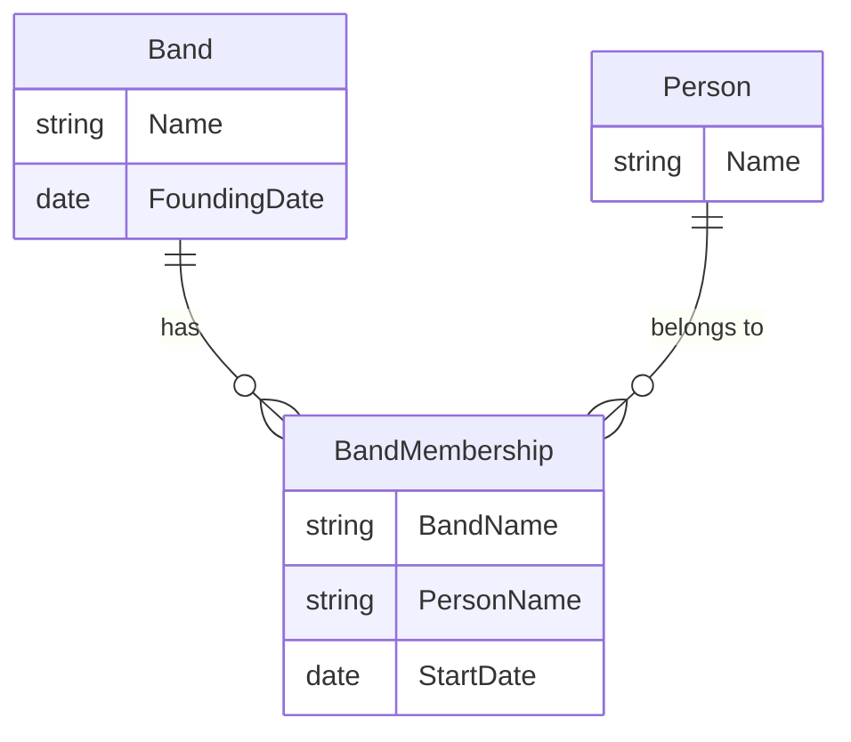
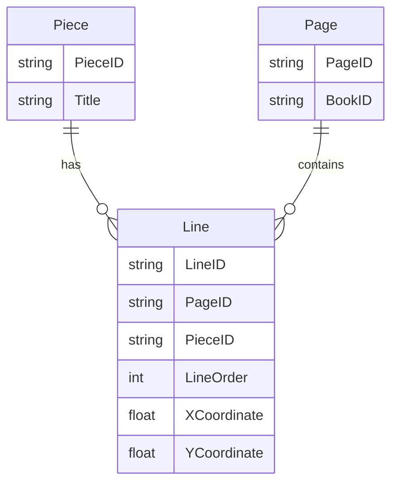
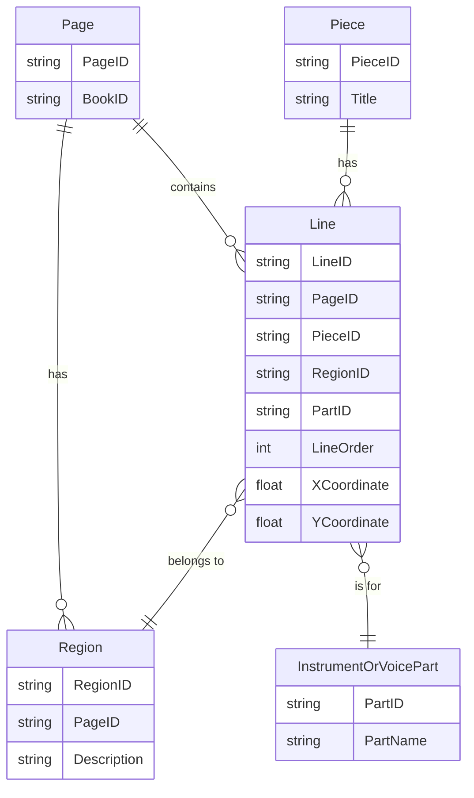

---

### **Question 2: Analyzing OpenDocument Format (ODF) and RelaxNG Schema**

---

**(a) What language is this encoded in?** [1]

- **Answer:** XML.

**Detailed Explanation:**

- **Understanding XML (Extensible Markup Language):** XML is a markup language designed to store and transport data. It is widely used in various applications due to its platform-independent nature and human-readable format. XML uses elements (tags) to define the structure and content of the document, making it versatile for both data storage and document representation.

- **Recognizing XML Syntax:** The structure in the question includes elements enclosed in angle brackets (e.g., `<text:p>`), which are characteristic of XML. Additionally, XML supports attributes within elements (e.g., `text:name="Illustration"`) that provide additional information.

- **Common Applications of XML:** XML is used in a variety of domains, including configuration files, document formats (like OpenDocument), web services (like SOAP), and data interchange (like RSS and Atom feeds).

**Important Points to Remember:**
- XML is platform-independent and is widely used for data interchange between systems.
- XML’s hierarchical structure makes it suitable for representing nested data, such as word processing documents, configuration files, and more.
- Always ensure XML documents are both well-formed (correct syntax) and valid (conform to a defined schema).

---

**(b) What data structure does it use?** [1]

- **Answer:** Tree structure.

**Detailed Explanation:**

- **Tree Structure in XML:** XML documents are inherently hierarchical, with elements nested inside one another to form a tree. The tree structure starts with a single root element and branches out into child elements, which may have their own children, forming a parent-child relationship. This hierarchical organization allows XML to represent complex data relationships.

- **Practical Use in Document Formats:** In word processing formats like OpenDocument, a tree structure is used to represent the document’s content, such as paragraphs, lists, and tables. The tree structure ensures that the document’s logical flow and nested elements are maintained correctly.

- **Traversing the Tree with XPath:** XPath is commonly used to navigate and query XML trees. Understanding tree structures is key to effectively querying and manipulating XML documents.

**Important Points to Remember:**
- Tree structures in XML are well-suited for representing hierarchical data like nested lists, organizational charts, or document structures.
- Understanding parent-child relationships is crucial when working with XML documents.
- Tree structures are inherently recursive, allowing for nesting at multiple levels.

---

**(c) List the two namespaces that this document uses.** [2]

- **Answer:** The document uses the following namespaces:
  1. `urn:oasis:names:tc:opendocument:xmlns:text:1.0`
  2. `urn:oasis:names:tc:opendocument:xmlns:office:1.0`

**Detailed Explanation:**

- **Namespaces in XML:** In XML, namespaces are used to differentiate elements and attributes that might have the same name but belong to different contexts. A namespace is declared using a URI (Uniform Resource Identifier), which uniquely identifies the context. In the example provided, the namespaces correspond to elements used in the OpenDocument format.

- **Using Namespaces in Documents:** Namespaces are particularly useful when combining XML data from different sources or when using standard vocabularies. They prevent naming conflicts and ensure that each element is understood within its intended context.

- **Namespace Syntax:** In the document, namespaces are declared with a URI and are associated with a prefix (like `text` or `office`). This prefix is then used in the element tags, such as `<text:p>` and `<office:text>`, to indicate which namespace the element belongs to.

**Important Points to Remember:**
- Namespaces help avoid conflicts when elements or attributes have the same name but different meanings.
- When working with XML documents, ensure that all namespaces are correctly declared and applied to the relevant elements.
- Namespace URIs are unique identifiers but do not necessarily point to an accessible web resource; they are purely identifiers.

---

**(d) What would the XPath expression `//text:list-item/text:p` return? Would it be different from `//text:list//text:p`?** [4]

- **Answer:** Both expressions return paragraphs (`<text:p>`) within list items (`<text:list-item>`), but they differ in scope:
  - `//text:list-item/text:p`: Returns `<text:p>` elements that are direct children of `<text:list-item>` elements.
  - `//text:list//text:p`: Returns all `<text:p>` elements within any descendant of `<text:list>`, including nested or deeply embedded paragraphs.

**Detailed Explanation:**

- **XPath Overview:** XPath is a powerful language for querying XML documents. It allows you to navigate through the tree structure of an XML document and select nodes based on their relationships and attributes.

- **Understanding the Expressions:**
  - `//text:list-item/text:p` targets only `<text:p>` elements that are immediate children of `<text:list-item>`. This is more restrictive and avoids capturing nested paragraphs.
  - `//text:list//text:p` is broader and captures all `<text:p>` elements within any descendant of `<text:list>`, regardless of depth. This means it can retrieve paragraphs buried multiple levels deep within other nested elements.

- **When to Use Each Expression:** The first expression is useful when you need to select specific elements without including nested content. The second expression is beneficial when you want to retrieve all relevant content within a broader scope.

**Important Points to Remember:**
- The difference between `/` and `//` in XPath is crucial: `/` selects direct children, while `//` selects all descendants.
- XPath expressions can be fine-tuned to be either very specific or broad, depending on the query’s needs.
- Practice reading and writing XPath expressions to build familiarity with how XML documents are structured and queried.

---

**(e) How does this code help us assess if the document above is valid?** [2]

- **Answer:** The RelaxNG schema code defines the structure, element names, and attributes that the XML document must follow. It specifies which elements are required, optional, or repeatable, allowing for validation against these rules.

**Detailed Explanation:**

- **Understanding RelaxNG Schemas:** RelaxNG is a schema language used to define the structure and rules for XML documents. It specifies the allowed elements, their order, and attributes, ensuring that an XML document adheres to a predefined structure.

- **Schema Definitions in the Code:** The provided code defines the structure of `<text:list>`, specifying that it can have optional headers (`<text:list-header>`) and multiple list items (`<text:list-item>`). The schema enforces these rules during validation, ensuring the document conforms to this structure.

- **Practical Use in Validation:** When validating an XML document, the RelaxNG schema acts as a blueprint, checking that all elements are correctly used, attributes are present where required, and no undefined elements are introduced.

**Important Points to Remember:**
- Validation ensures that an XML document is not only well-formed but also follows a specific structure.
- RelaxNG schemas are an alternative to DTDs (Document Type Definitions) and XSDs (XML Schema Definitions) for XML validation.
- Understanding the structure defined by a schema is key to designing XML documents that meet the required specifications.

---

**(f) Which part or parts of the document is this relevant to?** [2]

- **Answer:** The RelaxNG code is relevant to validating the `<text:list>` element, including its attributes and child elements like `<text:list-item>` and `<text:list-header>`.

**Detailed Explanation:**

- **Scope of the Schema:** The provided schema specifically covers the `<text:list>` structure, ensuring that lists in the document follow the correct format. This includes checking that the list contains valid headers and items, in the correct order.

- **Targeted Validation:** The RelaxNG schema focuses only on elements it defines. In this case, it ensures that the `<text:list>` structure is consistent throughout the document, providing a standardized format for lists.

**Important Points to Remember:**
- When validating XML documents, only the elements defined in the schema are checked; any deviations can lead to validation errors.
- Use RelaxNG to define flexible yet precise rules for complex XML structures.

---

**(g) How does this code help us assess if the document above is well-formed?** [2]

- **Answer:** The RelaxNG schema focuses on validating the structure, but well-formedness is determined by whether the XML document follows basic syntax rules, such as correct nesting and proper closing of tags.

**Detailed Explanation:**

- **Well-formedness in XML:** A well-formed XML document follows the core rules of XML syntax:
  1. Elements must be properly nested.
  2. All tags must be closed.
  3. Attribute values must be enclosed in quotes.
  4. There must be a single root element.

- **Schema vs. Well-formedness:** While the schema ensures that the document’s structure adheres to specific rules, well-formedness checks are more fundamental and are independent of the schema. Even if a document is valid according to its schema, it must first be well-formed to be parsed correctly.

**Important Points to Remember:**
- Well-formedness is a prerequisite for an XML document to be processed by an XML parser.
- A document can be well-formed but still not valid if it does not adhere to the schema’s rules.

---

**(h) Give an example of an element that would not be valid given this schema code (assume that `text-list-attr` only defines attributes).** [3]

- **Answer:** An invalid example would be:

```xml
<text:list>
  <text:list-header>Header Content</text:list-header>
  <text:list-item>Item Content</text:list-item>
  <text:invalid-element>Invalid Content</text:invalid-element>
</text:list>
```

- The `<text:invalid-element>` is not defined in the schema and would be considered invalid.

**Detailed Explanation:**

- **Invalid Elements in XML Documents:** XML validation against a schema ensures that only elements defined in the schema are allowed. In this case, the schema defines valid elements like `<text:list-item>` and `<text:list-header>`, but an element like `<text:invalid-element>` is not part of the schema and would trigger a validation error.

- **Importance of Schema Definitions:** When designing XML documents, adhering to the defined schema is crucial. Introducing elements that are not in the schema leads to validation failures and potential issues in data processing.

**Important Points to Remember:**
- Always ensure that all elements used in your XML document are defined in the schema.
- Use validation tools to check for any elements or attributes that do not conform to the schema.

---

**(i) Assess the suitability of this data structure for encoding word processing documents. What advantages or disadvantages would a relational model bring?** [13]

- **Answer:**

**Suitability of XML for Word Processing Documents:**
- **Advantages:**
  - **Hierarchical Structure:** XML’s tree structure is perfectly aligned with the hierarchical nature of word processing documents. Elements like paragraphs, sections, and lists naturally fit into a nested structure, making XML ideal for encoding document formats.
  - **Standardization and Extensibility:** XML is widely used and standardized across many industries. Formats like OpenDocument rely on XML because of its flexibility and ability to incorporate various namespaces and metadata.
  - **Interoperability:** Many word processing tools support XML-based formats, ensuring compatibility and easy data exchange between different applications.

- **Disadvantages:**
  - **Complexity in Querying:** XML can become challenging to query and manipulate, especially as documents grow in complexity. Although XPath and XQuery provide powerful querying capabilities, they require expertise and can be difficult to optimize.
  - **Verbosity and Redundancy:** XML tends to be verbose, leading to larger file sizes. For documents with a lot of nested elements, the repeated tags can lead to inefficiency in both storage and processing.

**Comparing with a Relational Model:**
- **Advantages of a Relational Model:**
  - **Efficiency in Querying:** Relational databases use SQL, which is optimized for structured queries, making it faster and more efficient to retrieve specific information.
  - **Data Normalization:** A relational model can eliminate redundancy through normalization, leading to more efficient data storage and consistent updates.

- **Disadvantages of a Relational Model:**
  - **Inflexibility for Hierarchical Data:** Word processing documents involve a lot of nested structures (e.g., paragraphs within sections), which do not translate well into flat relational tables. Representing such data in a relational model would require complex joins and additional tables, leading to inefficiency.
  - **Difficulty in Handling Unstructured Data:** Relational models are better suited for structured data with well-defined relationships, whereas documents often contain a mix of structured and unstructured content.

**Conclusion:** While XML is highly suitable for representing hierarchical word processing documents, a relational model may be more efficient for certain structured queries. However, the complexity and rigidity of relational databases make them less suitable for encoding document formats, where flexibility and extensibility are key.

**Important Points to Remember:**
- XML is ideal for document formats due to its ability to represent nested and hierarchical data.
- Relational databases excel at structured queries and data integrity but struggle with representing complex nested relationships.
- Always choose the data model that best fits the nature of your data—hierarchical for XML, tabular for relational databases.

---

### **Question 3: Exploring RDF and SPARQL in MusicBrainz**

---

**(a) What (approximately) was the type that we put into the accept header?** [1]

- **Answer:** The accept header likely included `application/rdf+xml` or `text/turtle`.

**Detailed Explanation:**

- **RDF and Accept Headers:** When requesting RDF data from an endpoint like MusicBrainz, the client specifies the desired format using the accept header. Common formats include `application/rdf+xml` (for RDF/XML) and `text/turtle` (for Turtle format). These formats provide different ways of serializing RDF data based on the application’s needs. RDF/XML is more verbose but widely supported, while Turtle is more compact and easier to read.

- **Understanding MIME Types:** MIME types like `application/rdf+xml` and `text/turtle` indicate the serialization format in which the server returns RDF data. Choosing the right format depends on factors like ease of parsing, human readability, and the specific tools or libraries in use.

**Important Points to Remember:**
- RDF can be serialized in multiple formats, including RDF/XML, Turtle, and JSON-LD. Understanding when to use each format is important when working with linked data.
- The accept header is a critical part of the HTTP request that informs the server about the client’s preferred data format.

---

**(b) To indicate that someone is a member of a band in this model, the person is associated with a role using `schema:member` and then that role is associated with the group, also using `schema:member`. What is the full URL of the predicate `schema:member`?** [1]

- **Answer:** The full URL is `http://schema.org/member`.

**Detailed Explanation:**

- **Understanding Predicates in RDF:** In RDF, predicates define relationships between subjects and objects. The `schema:member` predicate, which is fully expanded as `http://schema.org/member`, is used to represent membership in an organization, group, or band. This approach is standardized within the `schema.org` vocabulary, making it interoperable across different systems.

- **Namespaces in RDF:** The `schema:` prefix is shorthand for the `http://schema.org/` namespace. Using standardized vocabularies like `schema.org` ensures that the RDF data can be easily understood and integrated with other datasets following the same schema.

**Important Points to Remember:**
- RDF predicates are expressed as fully qualified URIs but can be abbreviated using prefixes (like `schema:`) for easier readability and management.
- Understanding common RDF namespaces, such as `schema.org` and `foaf`, is essential when modeling linked data.

---

**(c) How many band members of BTS are listed in this snippet?** [1]

- **Answer:** Two band members are listed in the snippet.

**Detailed Explanation:**

- **Analyzing RDF Data for Membership Information:** The RDF snippet includes two instances of `schema:member`, each associated with a URI representing a band member. These members are identified by URIs such as `http://musicbrainz.org/artist/09720eec-3871-49d5-932d-eb7542768cd3` and `http://musicbrainz.org/artist/23c8056b-ee13-4cfc-a772-2f5292e35bb5`. The associated labels (like JIN) provide human-readable names for these members.

- **Understanding RDF Triples:** In RDF, each relationship is represented as a triple (subject-predicate-object). The subject (the band) is linked to each member through the `schema:member` predicate, forming triples that convey membership.

**Important Points to Remember:**
- Understanding how RDF triples represent relationships is key when analyzing RDF data. Each triple expresses a fact, such as the relationship between a band and its members.
- In linked data, URIs are used to uniquely identify resources, while labels (like names) are often included to provide more human-readable information.

---

**(d) Comment on the way the `schema:member` predicate is used in this context.** [3]

- **Answer:**
  - The `schema:member` predicate is used to model the relationship between a music group (in this case, BTS) and its members. The RDF data structures each membership as an instance of `schema:OrganizationRole`, which allows for richer context (like roles and start dates) to be included.
  - This approach is consistent with linked data best practices, which encourage the use of standardized predicates and vocabularies to describe relationships. The use of `schema:member` ensures that the data is interoperable and can be understood by different systems adhering to the `schema.org` vocabulary.

**Detailed Explanation:**

- **Modeling Complex Relationships in RDF:** In RDF, relationships like membership can be represented with additional context by introducing intermediate nodes (like roles). Here, `schema:member` is used twice: first to link the group to a role, and then to link the role to an individual member. This structure allows for more granular control over how relationships are described, such as indicating specific roles or dates.

- **Extensibility and Interoperability in Linked Data:** The flexibility of RDF and the use of standardized vocabularies like `schema.org` make the data easily extendable. Additional properties (like start dates) can be attached without breaking the overall structure, enabling richer queries and integration with other datasets.

**Important Points to Remember:**
- RDF’s flexibility allows for the representation of complex relationships by combining predicates like `schema:member` and `rdf:type` to capture nuanced details.
- When working with linked data, using established vocabularies ensures that your data is interoperable and can be integrated with other datasets.

---

**(e) What type(s) are associated with the entity with a `schema:name` of "JIN"?** [2]

- **Answer:** The types associated with the entity "JIN" are:
  1. `schema:MusicGroup`
  2. `schema:Person`

**Detailed Explanation:**

- **Understanding RDF Types:** In RDF, the `rdf:type` predicate is used to associate an entity with one or more classes or types. The entity "JIN" is classified as both a `schema:MusicGroup` and a `schema:Person`, reflecting the dual nature of this entity within the dataset.

- **Why Multiple Types are Useful:** Assigning multiple types to an entity allows for more versatile queries. For instance, you could query for all entities that are either `schema:MusicGroup` or `schema:Person` or both. This flexibility makes RDF particularly powerful for modeling real-world scenarios where entities might fit multiple categories.

**Important Points to Remember:**
- In RDF, an entity can have multiple types, which enhances query flexibility and makes the data model more versatile.
- Understanding the type hierarchy and classes in vocabularies like `schema.org` is key when working with linked data.

---

**(f) Consider the following SPARQL query:**

```sparql
SELECT ?a ?b WHERE {
  mba:9fe8e-ba27-4859-bb8c-2f255f346853 schema:member ?c .
  ?c schema:startDate ?b ;
     schema:member ?d .
  ?d schema:name ?a .
}
```

**What prefixes need to be defined for this to work (give the full declarations)?** [1]

- **Answer:**
  - `PREFIX schema: <http://schema.org/>`
  - `PREFIX mba: <http://musicbrainz.org/artist/>`

**Detailed Explanation:**

- **Using Prefixes in SPARQL:** In SPARQL, prefixes simplify queries by allowing you to abbreviate URIs. The `schema:` prefix refers to the `http://schema.org/` namespace, which is used for predicates like `schema:member`. The `mba:` prefix represents MusicBrainz artist URIs, making it easier to refer to specific artists without using the full URI in every query.

- **Why Prefixes Matter:** Prefix declarations are essential in SPARQL because they improve readability and prevent errors. Without the correct prefixes, the query engine wouldn’t be able to resolve the shortened URIs, leading to query failures.

**Important Points to Remember:**
- Always declare prefixes at the beginning of your SPARQL query to ensure correct URI resolution and enhance readability.
- Familiarizing yourself with common RDF namespaces like `schema.org` and MusicBrainz’s namespaces is critical for effective SPARQL queries.

---

**(g) What would the query return?** [6]

- **Answer:** The query returns the names (`?a`) and start dates (`?b`) of members associated with the band identified by `mba:9fe8e-ba27-4859-bb8c-2f255f346853`.

**Detailed Explanation:**

- **Breaking Down the Query:**
  - The query starts by finding all entities linked to the band by the `schema:member` predicate.
  - For each of these entities, it retrieves the start date (`schema:startDate`) and then checks for nested members (`schema:member ?d`) to extract their names (`schema:name ?a`).
  - The result is a list of names and start dates for members of the band.

- **Expected Output Example:**

| Name   | Start Date  |
|--------|-------------|
| JIN    | 2013-06-13  |
| RM     | 2013-06-13  |

- **Navigating Relationships in SPARQL:** The query navigates through multiple levels of relationships, demonstrating how SPARQL can handle complex linked data structures. By chaining predicates using semicolons (`;`), the query traverses from the band to the members, retrieving relevant details.

**Important Points to Remember:**
- SPARQL is highly effective at querying complex RDF data, allowing you to navigate nested relationships and filter results based on multiple criteria.
- Understanding how to chain predicates in SPARQL using semicolons can simplify queries while maintaining readability.

---

**(h) This data represents an export from a relational database. Construct an ER diagram providing a model that could accommodate the instance data above.** [4]

- **Answer:**

**ER Diagram:**



**Detailed Explanation:**

- **Entities:**
  - **Band**: Represents the music group, with attributes like `Name` and `FoundingDate`.
  - **Person**: Represents individual members, identified by the attribute `Name`.

- **Associative Entity (BandMembership):**
  - Manages the many-to-many relationship between bands and members, capturing details like `StartDate` and linking the two entities.

**Why This Model Works:**
- The relational model represents the relationships shown in the RDF data using an associative entity (junction table) to handle the many-to-many relationship between bands and members.

**Important Points to Remember:**
- Use associative entities (junction tables) in relational databases to manage many-to-many relationships.
- The ER diagram should clearly reflect the relationships and attributes that are central to the data model.

---

**(i) Give the `CREATE TABLE` commands for two tables based on your ER model.** [5]

- **Answer:**

```sql
CREATE TABLE Band (
  Name VARCHAR(255) PRIMARY KEY,
  FoundingDate DATE
);

CREATE TABLE BandMembership (
  BandName VARCHAR(255),
  PersonName VARCHAR(255),
  StartDate DATE,
  PRIMARY KEY (BandName, PersonName),
  FOREIGN KEY (BandName) REFERENCES Band(Name),
  FOREIGN KEY (PersonName) REFERENCES Person(Name)
);
```

**Detailed Explanation:**

- **Band Table:** This table stores basic information about each band, including the name (as the primary key) and founding date.
- **BandMembership Table:** This table handles the many-to-many relationship between bands and members. It includes composite keys and foreign key constraints to ensure data integrity.

**Important Points to Remember:**
- Composite keys in junction tables effectively manage many-to-many relationships in relational databases.
- Foreign keys ensure that relationships between tables are consistent and that no orphan records exist.

---

**(j) Suggest a MySQL query to check whether any band member in the database is recorded as joining before the founding date of their band.** [5]

- **Answer:**

```sql
SELECT bm.PersonName, bm.BandName, bm.StartDate, b.FoundingDate
FROM BandMembership bm
JOIN Band b ON bm.BandName = b.Name
WHERE bm.StartDate < b.FoundingDate;
```

**Detailed Explanation:**

- **Join and Filtering:** The query joins the `BandMembership` and `Band` tables, filtering for cases where a member’s `StartDate` is earlier than the band’s `FoundingDate`. This check helps identify any inconsistencies in the dataset.

**Important Points to Remember:**
- Use SQL joins to combine data from related tables and perform checks across multiple conditions.
- Applying filters in SQL allows you to detect data errors and ensure that the dataset adheres to logical constraints.

---

**(k) MusicBrainz makes their data available as both a downloadable database dump and as Linked Data of the sort quoted above. What are the benefits and disadvantages of each approach?** [5]

- **Answer:**

**Benefits of a Database Dump:**
- **Full Dataset Access:** A database dump provides complete access to all data, which is ideal for offline analysis, backups, and custom processing. You can run complex queries without network delays.
- **Speed and Efficiency:** Querying a local database is generally faster and more efficient, as it avoids the latency and performance issues associated with remote linked data queries.

**Disadvantages of a Database Dump:**
- **Data Staleness:** The data in a database dump can quickly become outdated. Regular updates are required to keep the dataset current, which may involve downloading large files periodically.
- **Storage Requirements:** Storing a full database dump can require significant disk space, especially for large datasets like MusicBrainz.

**Benefits of Linked Data:**
- **Real-Time Updates:** Linked Data is always current, as it is fetched directly from the source when queried. This ensures that you’re working with the latest information.
- **Interoperability:** Linked Data is designed for integration with other datasets, enabling richer queries and cross-dataset analysis. It’s particularly useful for federated queries across multiple knowledge graphs.

**Disadvantages of Linked Data:**
- **Performance Concerns:** Linked Data queries are often slower due to network dependencies, the complexity of the data model, and the need to resolve URIs in real-time.
- **Limited Control:** Users are dependent on the availability, structure, and quality of the remote data. If the data source changes or becomes unavailable, your queries may fail.

**Important Points to Remember:**
- Database dumps are preferable for offline analysis, full dataset access, and performance-critical applications.
- Linked Data offers real-time updates and better integration across datasets but may suffer from performance issues and lack of control.

---

### **Question 4: Enhancing an ER Model for 16th-Century European Music Records**

---

**(a) This model doesn't allow storing the order or coordinates for lines of music on a page, meaning that retrieving all the lines for a given piece will jumble them up. How could this be fixed?** [3]

- **Answer:** To store the order and coordinates of lines of music on a page, you can introduce attributes in the **Line** entity to capture these details:
  1. **LineOrder**: An integer that stores the order in which lines appear on the page.
  2. **XCoordinate** and **YCoordinate**: Integers or floats that store the position of the line on the page for precise placement.

**Revised ER Model:**



**Detailed Explanation:**

- **LineOrder:** Adding a `LineOrder` attribute allows the system to store the sequence in which lines should be read or played. This is crucial for reconstructing the music accurately when displayed or printed.
- **Coordinates for Placement:** Introducing `XCoordinate` and `YCoordinate` attributes allows for precise placement of lines on a page, which is especially useful for complex layouts like those in tablebook format.

**Important Points to Remember:**
- In situations where order and placement matter, capturing sequence information (e.g., `LineOrder`) is critical for preserving the logical flow of data.
- Coordinates (e.g., `XCoordinate`, `YCoordinate`) are important in cases where spatial arrangement plays a key role, such as in graphical data or documents.

---

**(b) Some books are published in tablebook format. These are designed to be placed on a flat table, with multiple performers standing around the book. An example is given below. To add this to our model, we need to resolve two concerns. Firstly, there are multiple instrument or voice parts to a piece. Secondly, the page has regions, each with lines going in different directions. Add these aspects to the model.** [8]

- **Answer:** To address these concerns, we need to enhance the model with:
  1. An **InstrumentOrVoicePart** entity linked to the **Line** entity.
  2. A **Region** entity that represents different areas of the page where lines can be placed, linked to the **Line** entity.

**Revised ER Model:**



**Detailed Explanation:**

- **InstrumentOrVoicePart Entity:** This entity captures the different parts of a musical piece, such as “Soprano,” “Bass,” or specific instruments. Each line can be linked to a particular part, ensuring that performers can easily identify their own lines.
- **Region Entity:** Pages are divided into multiple regions, each with lines arranged differently. The `Region` entity allows you to define areas on the page where lines are placed, capturing the unique layout of tablebook format.

**Important Points to Remember:**
- When modeling complex documents, consider additional entities for specialized sections, like regions and parts, to maintain flexibility in data representation.
- Linking lines to parts and regions ensures that performers or users can easily navigate the data based on their roles or the document’s layout.

---

**(c) List the tables, primary keys, and foreign keys for a relational implementation of your modified model.** [7]

- **Answer:**

**Table Definitions:**

1. **Piece**
   - **Primary Key:** `PieceID`
   - **Attributes:** `Title`

2. **Page**
   - **Primary Key:** `PageID`
   - **Attributes:** `BookID`
   - **Foreign Key:** `BookID` references `Book(BookID)`

3. **Line**
   - **Primary Key:** `LineID`
   - **Attributes:** `PageID`, `PieceID`, `RegionID`, `PartID`, `LineOrder`, `XCoordinate`, `YCoordinate`
   - **Foreign Keys:** 
     - `PageID` references `Page(PageID)`
     - `PieceID` references `Piece(PieceID)`
     - `RegionID` references `Region(RegionID)`
     - `PartID` references `InstrumentOrVoicePart(PartID)`

4. **Region**
   - **Primary Key:** `RegionID`
   - **Attributes:** `PageID`, `Description`
   - **Foreign Key:** `PageID` references `Page(PageID)`

5. **InstrumentOrVoicePart**
   - **Primary Key:** `PartID`
   - **Attributes:** `PartName`

**Detailed Explanation:**

- **Primary Keys and Foreign Keys:** Each table has a primary key to uniquely identify its records. Foreign keys are used to link related entities, ensuring data integrity and consistency across tables.
- **Why This Design Works:** This relational model accommodates the complex relationships required for 16th-century music records, including multiple parts for pieces and different regions on pages.

**Important Points to Remember:**
- Defining clear primary and foreign keys is essential for maintaining data integrity in relational databases.
- Always ensure that foreign keys correctly link related entities to enforce consistency and prevent orphaned records.

---

**(d) Give a query to list pieces with the total number of lines of music that they occupy.** [5]

- **Answer:**

```sql
SELECT p.Title, COUNT(l.LineID) AS TotalLines
FROM Piece p
JOIN Line l ON p.PieceID = l.PieceID
GROUP BY p.Title;
```

**Detailed Explanation:**

- **SQL Query Breakdown:**
  - The query joins the `Piece` and `Line` tables on `PieceID`.
  - It groups the results by piece title (`p.Title`) and counts the total number of lines associated with each piece using `COUNT(l.LineID)`.

- **Why GROUP BY is Necessary:** The `GROUP BY` clause is used to aggregate the line counts for each piece, providing a summary of how many lines of music are occupied by each piece.

**Expected Output Example:**

| Title                | TotalLines |
|----------------------|------------|
| Madrigal in F Major  | 24         |
| Renaissance Anthem   | 30         |

**Important Points to Remember:**
- Understanding `JOIN`, `GROUP BY`, and `COUNT` operations is key to writing queries that aggregate and summarize data effectively.
- Aggregation functions like `COUNT`, combined with `GROUP BY`, allow you to analyze data across multiple records while maintaining a structured output.

---

**(e) Assess the suitability of this data structure for a relational model, and compare it with ONE other database model from the course (XML-based tree database, document database, or Linked Data graph database).** [7]

- **Answer:**

**Suitability of the Relational Model:**
- **Advantages:**
  - **Well-Defined Structure:** Relational databases are ideal for structured data with clear relationships. The model easily handles entities like pieces, pages, and lines with well-defined relationships.
  - **Efficient Querying:** SQL is optimized for querying structured data. Complex joins and aggregations, like counting lines of music for a piece, are straightforward in a relational database.
  - **Data Integrity and Consistency:** Relational models enforce data integrity through foreign keys, ensuring that relationships between tables remain consistent.

- **Disadvantages:**
  - **Poor Fit for Hierarchical or Nested Data:** If the data requires representing nested or hierarchical structures (e.g., complex multi-level regions or parts), relational models can become cumbersome, requiring multiple joins and additional tables.
  - **Flexibility Issues:** Relational models are less flexible when it comes to accommodating unstructured or semi-structured data, making it difficult to handle documents with varying structures.

**Comparison with XML-Based Tree Database:**
- **XML-Based Tree Database:**
  - **Advantages:** XML excels at representing hierarchical and nested data. In cases where the document structure is tree-like (e.g., nested parts or regions within a piece), XML is a natural fit. Queries can be performed using XPath or XQuery, which are well-suited for navigating hierarchical data.
  - **Disadvantages:** XML databases are less efficient for querying large datasets with complex relationships across multiple entities. They are also more verbose and require careful management of namespaces and document structures.

**Conclusion:** While the relational model is suitable for structured data with clearly defined relationships, it struggles with hierarchical or nested data. In scenarios where the data is inherently hierarchical, such as complex

 documents with nested regions and parts, an XML-based database may offer more natural and flexible modeling options. However, for this specific use case, where the focus is on structured relationships between pieces, lines, and pages, the relational model remains the better choice.

**Important Points to Remember:**
- Relational models are best suited for structured data with well-defined relationships, but they struggle with hierarchical or unstructured data.
- Consider the nature of your data (structured vs. hierarchical) when choosing between relational databases and alternatives like XML or graph databases.

---
