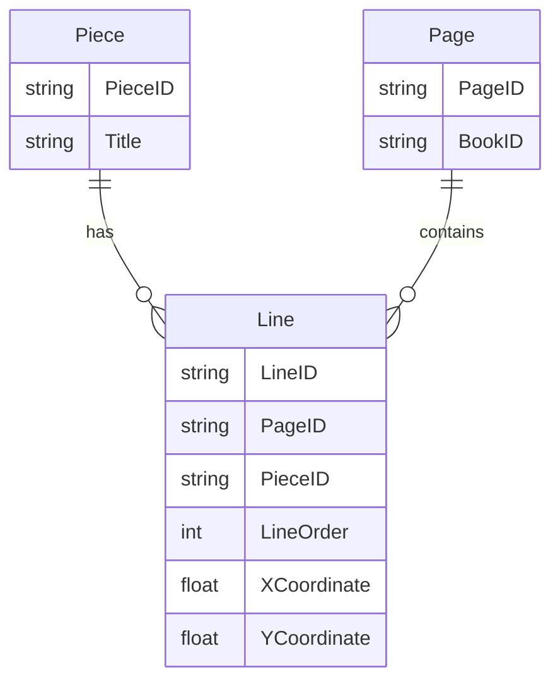
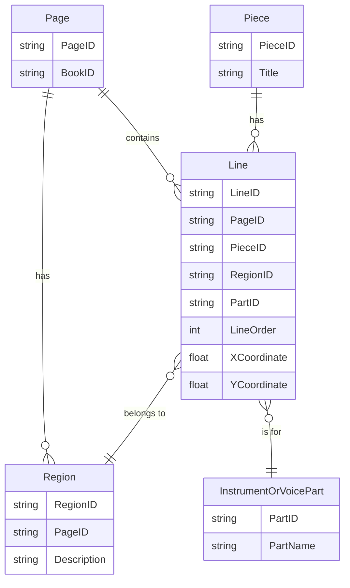

---

### **Question 2: Analyzing OpenDocument Format (ODF) and RelaxNG Schema**

---

**(a) What language is this encoded in?** [1]

- **Answer:** XML.

**Detailed Explanation:**

- **Understanding XML (Extensible Markup Language):** XML is a versatile language used for storing and transporting data. It is platform-independent and human-readable, which makes it widely applicable in areas such as document formats, configuration files, and web services.

- **Real-World Applications of XML:** XML is commonly used in applications like Microsoft Office (e.g., Word documents saved as .docx files) and web service responses (e.g., SOAP). Understanding how XML structures information helps in scenarios like document management or software configuration.

- **Recognizing XML Syntax:** The structure in the question includes elements (e.g., `<text:p>`), attributes (e.g., `text:name="Illustration"`), and a hierarchical format, all of which are typical features of XML.

**Common Pitfalls and Mistakes:**
- **Syntax Errors:** Ensure that all XML elements are properly nested and that every opening tag has a corresponding closing tag. Forgetting these basics can lead to parsing errors.
- **Incorrect Attribute Formatting:** Attributes in XML should always be within the opening tag and enclosed in quotation marks. Mistakes here are common, especially when manually editing XML files.

**Important Points to Remember:**
- XML’s versatility lies in its structured yet flexible format, making it suitable for both documents and data interchange.
- Always ensure XML documents are both well-formed (correct syntax) and valid (conform to a schema).

**Key Takeaways:**
- XML’s hierarchical structure and platform independence make it ideal for storing structured data, especially in scenarios where data must be exchanged between different systems.

---

**(b) What data structure does it use?** [1]

- **Answer:** Tree structure.

**Detailed Explanation:**

- **Tree Structure in XML:** XML documents are inherently hierarchical, with elements nested inside one another to form a tree. This structure starts with a single root element and branches into child elements, making XML ideal for representing nested and ordered data.

- **Real-World Example:** In a word processing document, the XML tree structure might represent chapters, paragraphs, and sentences as nested elements. The root element could be `<document>`, with child elements for each section and paragraph.

- **XPath Navigation:** Understanding the tree structure is crucial when querying XML documents using XPath. XPath expressions navigate the tree to select elements based on their hierarchy.

**Common Pitfalls and Mistakes:**
- **Misunderstanding Parent-Child Relationships:** Confusing which elements are parents and which are children can lead to incorrect queries or data extraction.
- **Improper Nesting:** Incorrect nesting of elements can cause logical errors or validation failures.

**Important Points to Remember:**
- Tree structures in XML allow for the natural representation of hierarchical data, making it easy to model complex relationships like those found in documents or organizational charts.
- XPath is an essential tool for querying XML, relying heavily on understanding the tree structure.

**Key Takeaways:**
- The tree structure is the foundation of XML’s hierarchical organization, enabling the flexible representation of nested data.

---

**(c) List the two namespaces that this document uses.** [2]

- **Answer:** 
  1. `urn:oasis:names:tc:opendocument:xmlns:text:1.0`
  2. `urn:oasis:names:tc:opendocument:xmlns:office:1.0`

**Detailed Explanation:**

- **Namespaces in XML:** Namespaces prevent naming conflicts by providing context. They allow different XML vocabularies to coexist without clashes. A namespace is defined using a URI, which uniquely identifies the context for elements and attributes.

- **Real-World Example:** When combining XML data from multiple sources, namespaces are crucial. For instance, integrating an XML file from a billing system with another XML file from an HR system requires unique namespaces to avoid conflicts between similar element names.

- **Namespace Usage in Documents:** In the given document, the prefixes `text` and `office` are associated with the specified namespaces. Elements like `<text:p>` use these prefixes to indicate which vocabulary they belong to.

**Common Pitfalls and Mistakes:**
- **Incorrect Namespace Declarations:** Forgetting to declare or incorrectly specifying a namespace can lead to errors when parsing XML.
- **Ambiguous Element References:** Without namespaces, similarly named elements from different vocabularies can cause confusion.

**Important Points to Remember:**
- Namespaces are essential in XML for avoiding naming conflicts and ensuring that elements are interpreted in the correct context.
- Use unique URIs to define namespaces, but remember that these URIs are identifiers and don’t have to resolve to an actual web address.

**Key Takeaways:**
- Namespaces are vital for integrating XML data from different sources while avoiding conflicts between elements with similar names.

---

**(d) What would the XPath expression `//text:list-item/text:p` return? Would it be different from `//text:list//text:p`?** [4]

- **Answer:** Both expressions return paragraphs (`<text:p>`) within list items (`<text:list-item>`), but they differ in scope:
  - `//text:list-item/text:p`: Returns `<text:p>` elements that are direct children of `<text:list-item>` elements.
  - `//text:list//text:p`: Returns all `<text:p>` elements within any descendant of `<text:list>`, including nested or deeply embedded paragraphs.

**Detailed Explanation:**

- **XPath Overview:** XPath is a powerful language for navigating XML trees. It allows you to specify paths to elements based on their position in the hierarchy.

- **Understanding the Expressions:**
  - `//text:list-item/text:p` targets only the direct child `<text:p>` elements of `<text:list-item>`, providing a more focused result.
  - `//text:list//text:p` is broader, capturing all descendant `<text:p>` elements within any `<text:list>`, regardless of nesting depth. This flexibility is useful in complex XML documents where elements might be deeply embedded.

- **Real-World Example:** Consider a document where `<text:list>` represents a list with multiple levels of nesting (like sub-lists). The first query only returns top-level items, while the second captures all items, even those within nested lists.

**Common Pitfalls and Mistakes:**
- **Confusing `/` and `//`:** Using the wrong path expression can lead to either too narrow or too broad a selection of nodes.
- **Overlooking Nesting:** Not accounting for nested elements can cause important data to be missed.

**Important Points to Remember:**
- Understanding the difference between direct children (`/`) and all descendants (`//`) is crucial for crafting precise XPath queries.
- XPath’s flexibility makes it powerful for querying both simple and complex XML structures.

**Key Takeaways:**
- The choice between `/` and `//` in XPath significantly impacts which elements are selected, making it essential to understand the document’s structure.

---

**(e) How does this code help us assess if the document above is valid?** [2]

- **Answer:** The RelaxNG schema code defines the structure, element names, and attributes that the XML document must follow. It specifies which elements are required, optional, or repeatable, allowing for validation against these rules.

**Detailed Explanation:**

- **Understanding RelaxNG Schemas:** RelaxNG is a schema language used to define the structure and rules for XML documents. It specifies the allowed elements, their order, and attributes, ensuring that an XML document adheres to a predefined structure.

- **Real-World Example:** When building web services that exchange XML data, validating against a schema ensures that incoming data is correctly structured. For instance, an XML document describing an order must have certain mandatory fields (like customer ID and product details) in the correct format.

- **Schema Definitions in the Code:** The provided code defines the structure of `<text:list>`, ensuring that it contains valid headers (`<text:list-header>`) and multiple list items (`<text:list-item>`). The schema enforces these rules during validation, helping maintain consistency and avoid errors.

**Common Pitfalls and Mistakes:**
- **Overlooking Required Elements:** Failing to include all mandatory elements specified by the schema leads to validation errors.
- **Ignoring Schema Validation:** Not validating XML documents against the schema can result in incorrect or incomplete data being processed.

**Important Points to Remember:**
- Validation ensures that an XML document is not only well-formed but also follows a specific structure.
- RelaxNG schemas are an alternative to DTDs (Document Type Definitions) and XSDs (XML Schema Definitions) for XML validation.

**Key Takeaways:**
- Schemas act as blueprints that enforce structure, ensuring XML documents conform to expected patterns and avoid errors.

---

**(f) Which part or parts of the document is this relevant to?** [2]

- **Answer:** The RelaxNG code is relevant to validating the `<text:list>` element, including its attributes and child elements like `<text:list-item>` and `<text:list-header>`.

**Detailed Explanation:**

- **Scope of the Schema:** The schema focuses on ensuring that `<text:list>` structures are consistent throughout the document, validating the format and content of headers and list items.

- **Real-World Application:** In scenarios like word processing, where lists and headers must be consistent, a schema helps ensure the document follows the expected format.

**Common Pitfalls and Mistakes:**
- **Validating Only Part of the

 Document:** If the schema covers only certain elements, unvalidated parts can still cause issues. Ensure that all relevant document sections are included in the schema.

**Important Points to Remember:**
- Schemas enforce consistency in the specific parts of the document they target, making them critical for maintaining data integrity in XML.

**Key Takeaways:**
- The scope of schema validation determines which parts of a document are checked for consistency, making it crucial to cover all important elements.

---

**(g) How does this code help us assess if the document above is well-formed?** [2]

- **Answer:** The RelaxNG schema focuses on validating the structure, but well-formedness is determined by whether the XML document follows basic syntax rules, such as correct nesting and proper closing of tags.

**Detailed Explanation:**

- **Well-formedness in XML:** A well-formed XML document adheres to fundamental rules, including:
  - Proper nesting of elements.
  - Correct closing of tags.
  - Attribute values enclosed in quotes.
  - A single root element.

- **Real-World Example:** When sending XML-based data (e.g., configuration files) across different systems, well-formedness ensures the document can be parsed correctly without errors.

- **Schema vs. Well-formedness:** While the schema validates the document’s structure, well-formedness is a prerequisite. Even a document that passes schema validation must first be well-formed to be readable by XML parsers.

**Common Pitfalls and Mistakes:**
- **Ignoring Basic Syntax Rules:** Even if a schema is correctly defined, the XML must still adhere to fundamental syntax rules. Simple mistakes, like unclosed tags, can cause the entire document to be unreadable.

**Important Points to Remember:**
- Well-formedness is a basic requirement for an XML document to be parsed and processed.
- A document can be well-formed but still not valid if it does not adhere to the schema’s rules.

**Key Takeaways:**
- Ensuring well-formedness is the first step in working with XML documents, as it enables basic parsing and processing.

---

**(h) Give an example of an element that would not be valid given this schema code (assume that `text-list-attr` only defines attributes).** [3]

- **Answer:** An invalid example would be:

```xml
<text:list>
  <text:list-header>Header Content</text:list-header>
  <text:list-item>Item Content</text:list-item>
  <text:invalid-element>Invalid Content</text:invalid-element>
</text:list>
```

- The `<text:invalid-element>` is not defined in the schema and would be considered invalid.

**Detailed Explanation:**

- **Invalid Elements in XML Documents:** The schema specifies which elements are allowed within a `<text:list>`. Any element not defined in the schema, like `<text:invalid-element>`, will trigger a validation error.

- **Real-World Example:** In software that processes XML configuration files, introducing an unsupported element could lead to errors or unexpected behavior.

**Common Pitfalls and Mistakes:**
- **Introducing Undefined Elements:** Adding elements that are not in the schema results in validation failures. Always cross-check schema definitions before extending XML documents.

**Important Points to Remember:**
- Always ensure that all elements used in your XML document are defined in the schema.
- Use validation tools to check for any elements or attributes that do not conform to the schema.

**Key Takeaways:**
- Adhering strictly to schema definitions ensures that your XML documents remain valid and compatible with the intended processing systems.

---

**(i) Assess the suitability of this data structure for encoding word processing documents. What advantages or disadvantages would a relational model bring?** [13]

**Answer:**

**Suitability of XML for Word Processing Documents:**
- **Advantages:**
  - **Hierarchical Structure:** XML’s tree structure is perfectly aligned with the hierarchical nature of word processing documents. Elements like paragraphs, sections, and lists naturally fit into a nested structure, making XML ideal for encoding document formats.
  - **Standardization and Extensibility:** XML is widely used and standardized across many industries. Formats like OpenDocument rely on XML because of its flexibility and ability to incorporate various namespaces and metadata.
  - **Interoperability:** Many word processing tools support XML-based formats, ensuring compatibility and easy data exchange between different applications.

- **Disadvantages:**
  - **Complexity in Querying:** XML can become challenging to query and manipulate, especially as documents grow in complexity. Although XPath and XQuery provide powerful querying capabilities, they require expertise and can be difficult to optimize.
  - **Verbosity and Redundancy:** XML tends to be verbose, leading to larger file sizes. For documents with a lot of nested elements, the repeated tags can lead to inefficiency in both storage and processing.

**Comparing with a Relational Model:**
- **Advantages of a Relational Model:**
  - **Efficiency in Querying:** Relational databases use SQL, which is optimized for structured queries, making it faster and more efficient to retrieve specific information.
  - **Data Normalization:** A relational model can eliminate redundancy through normalization, leading to more efficient data storage and consistent updates.

- **Disadvantages of a Relational Model:**
  - **Poor Fit for Hierarchical Data:** Word processing documents involve a lot of nested structures (e.g., paragraphs within sections), which do not translate well into flat relational tables. Representing such data in a relational model would require complex joins and additional tables, leading to inefficiency.
  - **Difficulty in Handling Unstructured Data:** Relational models are better suited for structured data with well-defined relationships, whereas documents often contain a mix of structured and unstructured content.

**Conclusion:** While XML is highly suitable for representing hierarchical word processing documents, a relational model may be more efficient for certain structured queries. However, the complexity and rigidity of relational databases make them less suitable for encoding document formats, where flexibility and extensibility are key.

**Detailed Explanation:**

- **Practical Scenarios:** In applications like Google Docs or Microsoft Word, XML-based formats provide the flexibility to represent various elements like text, images, and metadata. Relational models, on the other hand, are better suited for structured data like customer records or sales transactions.

- **Why XML Fits Document Encoding:** The nested and hierarchical nature of word processing documents maps naturally onto XML’s tree structure. For instance, an XML document representing a contract might have nested elements for clauses, sub-clauses, and bullet points.

**Common Pitfalls and Mistakes:**
- **Overusing Relational Models:** Attempting to model inherently hierarchical or flexible data, like documents, in a relational model leads to inefficiency and complexity.
- **Ignoring the Need for Flexibility:** Document formats require a level of flexibility that rigid relational schemas can’t easily accommodate.

**Important Points to Remember:**
- XML is ideal for document formats due to its ability to represent nested and hierarchical data.
- Relational databases excel at structured queries and data integrity but struggle with representing complex nested relationships.

**Key Takeaways:**
- Always choose the data model that best fits the nature of your data—hierarchical for XML, tabular for relational databases.

---

**(j) Suggest a MySQL query to check whether any band member in the database is recorded as joining before the founding date of their band.**

- **Answer:**

```sql
SELECT bm.PersonName, bm.BandName, bm.StartDate, b.FoundingDate
FROM BandMembership bm
JOIN Band b ON bm.BandName = b.Name
WHERE bm.StartDate < b.FoundingDate;
```

**Detailed Explanation:**

- **Purpose of the Query:** The query is designed to check for inconsistencies where a member is recorded as joining a band before the band’s official founding date. Such inconsistencies can indicate errors in data entry or incorrect historical information.

- **Query Logic:** 
  - The `JOIN` operation links the `BandMembership` and `Band` tables on the `BandName` field, allowing the query to compare the `StartDate` (when the person joined) with the `FoundingDate` (when the band was formed).
  - The `WHERE` clause filters for cases where the `StartDate` is earlier than the `FoundingDate`, which would be logically incorrect.

- **Real-World Applications:** This kind of query is useful in data validation scenarios, such as checking membership records in organizations, verifying event timelines, or ensuring consistency in historical databases.

**Common Pitfalls and Mistakes:**
- **Incorrect Join Conditions:** Using the wrong field in the `JOIN` condition can lead to incorrect results or errors. Always ensure that the fields used in the join accurately represent the relationship between the tables.
- **Overlooking Data Types:** Ensure that the `StartDate` and `FoundingDate` fields are stored as date types to avoid issues with date comparisons.

**Important Points to Remember:**
- `JOIN` operations allow you to combine data from multiple related tables, making them a powerful tool for validating relationships and data integrity.
- Conditional logic in SQL queries (e.g., using `WHERE`) is essential for filtering and identifying specific records based on business rules.

**Key Takeaways:**
- This query demonstrates how to use `JOIN`, `WHERE`, and date comparisons to detect logical inconsistencies in relational databases, a critical skill in data validation and quality assurance.

---

**(k) MusicBrainz makes their data available as both a downloadable database dump and as Linked Data of the sort quoted above. What are the benefits and disadvantages of each approach?** [5]

**Answer:**

**Benefits of a Database Dump:**
- **Complete Dataset Access:** Database dumps provide access to the entire dataset, making them ideal for tasks like offline analysis, large-scale data processing, or backups.
- **Performance and Efficiency:** Since the data is stored locally, queries can be run more efficiently without network latency or dependency on external servers.

**Disadvantages of a Database Dump:**
- **Data Staleness:** Database dumps are static snapshots, meaning they can quickly become outdated. Regular updates are needed to keep the dataset current.
- **Large Storage Requirements:** Storing the full dataset requires significant disk space, which can be a concern for large datasets like MusicBrainz.

**Benefits of Linked Data:**
- **Real-Time Access to Up-to-Date Information:** Linked Data provides access to the latest data, as queries fetch live information from the source. This is essential for applications that require current data.
- **Interoperability and Integration:** Linked Data is designed for integration with other datasets, enabling richer queries and cross-referencing across different knowledge graphs. It’s particularly beneficial in scenarios where data from multiple sources needs to be combined.

**Disadvantages of Linked Data:**
- **Performance Issues:** Querying Linked Data can be slower due to network dependencies, the complexity of the RDF data model, and the need to resolve URIs in real-time.
- **Limited Control Over Data:** With Linked Data, users depend on the availability and quality of the remote data source. If the source changes, becomes unavailable, or is updated in a way that breaks compatibility, it can cause issues for dependent applications.

**Detailed Explanation:**

- **Use Cases for Each Approach:** 
  - A database dump is suitable for applications where the entire dataset is needed for intensive analysis, such as data mining or batch processing. Examples include building data warehouses or running complex analytics locally.
  - Linked Data is ideal for real-time applications where data needs to be continuously updated and integrated from multiple sources, such as knowledge graphs or semantic web applications.

**Common Pitfalls and Mistakes:**
- **Misusing Linked Data for Performance-Critical Applications:** Linked Data’s real-time nature makes it less suitable for performance-critical tasks where speed and efficiency are paramount.
- **Neglecting to Regularly Update Database Dumps:** Relying on outdated dumps can lead to incorrect conclusions and stale information in applications.

**Important Points to Remember:**
- Choose database dumps for scenarios requiring complete dataset control, offline processing, or intensive analysis.
- Use Linked Data when real-time updates and cross-dataset integration are more important than performance.

**Key Takeaways:**
- Database dumps are best for scenarios requiring full dataset access, while Linked Data excels in dynamic, real-time contexts where interoperability is key.

---

### **Question 4: Enhancing an ER Model for 16th-Century European Music Records**

---

**(a) This model doesn't allow storing the order or coordinates for lines of music on a page, meaning that retrieving all the lines for a given piece will jumble them up. How could this be fixed?** [3]

**Answer:** To store the order and coordinates of lines of music on a page, you can introduce attributes in the **Line** entity to capture these details:
1. **LineOrder**: An integer that stores the order in which lines appear on the page.
2. **XCoordinate** and **YCoordinate**: Integers or floats that store the position of the line on the page for precise placement.

**Revised ER Model:**



**Detailed Explanation:**

- **LineOrder and Spatial Coordinates:** Adding a `LineOrder` attribute ensures that lines are retrieved in the correct sequence. Coordinates allow for precise positioning, which is essential in documents like music sheets where visual arrangement matters.

- **Real-World Applications:** These concepts are applicable in digital publishing and document management systems where layout and sequence are critical, such as digitizing ancient manuscripts or organizing page layouts in desktop publishing software.

**Common Pitfalls and Mistakes:**
- **Neglecting to Capture Sequence Information:** Without storing order information, retrieval can lead to jumbled content, especially when reconstructing documents like music scores or scripts.
- **Inaccurate Coordinate Handling:** Incorrectly storing or interpreting coordinates can result in misaligned elements when rendering or printing the document.

**Important Points to Remember:**
- Capturing both sequence (`LineOrder`) and spatial placement (`XCoordinate`, `YCoordinate`) is crucial for accurately representing complex documents.
- ER models can be adapted to handle both logical order and physical layout, offering flexibility for various use cases.

**Key Takeaways:**
- Sequence and spatial attributes allow for the correct representation and retrieval of ordered content, particularly in scenarios where visual layout is important.

---

**(b) Some books are published in tablebook format. These are designed to be placed on a flat table, with multiple performers standing around the book. An example is given below. To add this to our model, we need to resolve two concerns. Firstly, there are multiple instrument or voice parts to a piece. Secondly, the page has regions, each with lines going in different directions. Add these aspects to the model.** [8]

**Answer:** To address these concerns, we need to enhance the model with:
1. An **InstrumentOrVoicePart** entity linked to the **Line** entity.
2. A **Region** entity that represents different areas of the page where lines can be placed, linked to the **Line** entity.

**Revised ER Model:**



**Detailed Explanation:**

- **InstrumentOrVoicePart Entity:** This entity captures the different parts of a musical piece, such as “Soprano,” “Bass,” or specific instruments. Each line can be linked to a particular part, ensuring that performers can easily identify their own lines.
- **Region Entity:** Pages are divided into multiple regions, each with lines arranged differently. The `Region` entity allows you to define areas on the page where lines are placed, capturing the unique layout of tablebook format.

**Real-World Applications:** In publishing and digitization projects, accurately representing regions and parts is essential. For instance, in interactive sheet music apps, different parts are highlighted based on the performer’s role, while regions help maintain the visual layout.

**Common Pitfalls and Mistakes:**
- **Overlooking the Relationship Between Parts and Regions:** Failing to model these relationships accurately can lead to confusion when reconstructing multi-part scores or layouts.
- **Inadequate Handling of Spatial Layout:** Neglecting the spatial aspect of page regions can lead to incorrect or inconsistent renderings.

**Important Points to Remember:**
- Complex document models often require specialized entities to

 capture specific details, like parts and regions, to maintain accuracy.
- Linking lines to parts and regions ensures performers or users can easily navigate content based on their roles or layout.

**Key Takeaways:**
- Accurate modeling of regions and parts allows for detailed representation of documents like tablebook music, where spatial and role-based relationships are critical.

---

**(c) List the tables, primary keys, and foreign keys for a relational implementation of your modified model.** [7]

**Answer:**

**Table Definitions:**

1. **Piece**
   - **Primary Key:** `PieceID`
   - **Attributes:** `Title`

2. **Page**
   - **Primary Key:** `PageID`
   - **Attributes:** `BookID`
   - **Foreign Key:** `BookID` references `Book(BookID)`

3. **Line**
   - **Primary Key:** `LineID`
   - **Attributes:** `PageID`, `PieceID`, `RegionID`, `PartID`, `LineOrder`, `XCoordinate`, `YCoordinate`
   - **Foreign Keys:** 
     - `PageID` references `Page(PageID)`
     - `PieceID` references `Piece(PieceID)`
     - `RegionID` references `Region(RegionID)`
     - `PartID` references `InstrumentOrVoicePart(PartID)`

4. **Region**
   - **Primary Key:** `RegionID`
   - **Attributes:** `PageID`, `Description`
   - **Foreign Key:** `PageID` references `Page(PageID)`

5. **InstrumentOrVoicePart**
   - **Primary Key:** `PartID`
   - **Attributes:** `PartName`

**Detailed Explanation:**

- **Primary Keys and Foreign Keys:** Each table has a primary key to uniquely identify its records. Foreign keys are used to link related entities, ensuring data integrity and consistency across tables.
- **Why This Design Works:** This relational model accommodates the complex relationships required for 16th-century music records, including multiple parts for pieces and different regions on pages.

**Real-World Applications:** In relational databases for content management systems, defining primary and foreign keys ensures the correct linkage of articles, sections, or multimedia files to their respective layouts.

**Common Pitfalls and Mistakes:**
- **Inconsistent Foreign Key Relationships:** Ensure that all foreign keys correctly link related entities to maintain referential integrity.
- **Overcomplicating the Model:** Keep the model as simple as possible while still capturing the necessary relationships. Adding unnecessary complexity can make queries and updates more difficult.

**Important Points to Remember:**
- Defining clear primary and foreign keys is essential for maintaining data integrity in relational databases.
- Always ensure that foreign keys correctly link related entities to enforce consistency and prevent orphaned records.

**Key Takeaways:**
- Relational models thrive on well-defined relationships, making primary and foreign keys foundational for data integrity and accuracy.

---

**(d) Give a query to list pieces with the total number of lines of music that they occupy.** [5]

**Answer:**

```sql
SELECT p.Title, COUNT(l.LineID) AS TotalLines
FROM Piece p
JOIN Line l ON p.PieceID = l.PieceID
GROUP BY p.Title;
```

**Detailed Explanation:**

- **SQL Query Breakdown:**
  - The query joins the `Piece` and `Line` tables on `PieceID`.
  - It groups the results by piece title (`p.Title`) and counts the total number of lines associated with each piece using `COUNT(l.LineID)`.

- **Expected Output Example:**

| Title                | TotalLines |
|----------------------|------------|
| Madrigal in F Major  | 24         |
| Renaissance Anthem   | 30         |

**Real-World Applications:** Aggregation queries like this are common in reporting systems, where summary data (e.g., total sales per product or total views per page) is often needed. Similar logic applies in content management, where you might count the number of articles, images, or sections associated with a given publication.

**Common Pitfalls and Mistakes:**
- **Forgetting the `GROUP BY` Clause:** Omitting the `GROUP BY` clause when aggregating data can lead to incorrect results or errors.
- **Misaligning Joins:** Using the wrong field in the join condition can cause unrelated records to be linked, leading to incorrect counts.

**Important Points to Remember:**
- Understanding `JOIN`, `GROUP BY`, and `COUNT` operations is key to writing queries that aggregate and summarize data effectively.
- SQL’s aggregation functions are powerful tools for analyzing data across multiple records while maintaining a structured output.

**Key Takeaways:**
- SQL provides robust capabilities for summarizing and aggregating data, making it essential for generating reports and analyzing trends in relational databases.

---

**(e) Assess the suitability of this data structure for a relational model, and compare it with ONE other database model from the course (XML-based tree database, document database, or Linked Data graph database).** [7]

**Answer:**

**Suitability of the Relational Model:**
- **Advantages:**
  - **Well-Defined Structure:** Relational databases are ideal for structured data with clear relationships. The model easily handles entities like pieces, pages, and lines with well-defined relationships.
  - **Efficient Querying:** SQL is optimized for querying structured data. Complex joins and aggregations, like counting lines of music for a piece, are straightforward in a relational database.
  - **Data Integrity and Consistency:** Relational models enforce data integrity through foreign keys, ensuring that relationships between tables remain consistent.

- **Disadvantages:**
  - **Poor Fit for Hierarchical or Nested Data:** If the data requires representing nested or hierarchical structures (e.g., complex multi-level regions or parts), relational models can become cumbersome, requiring multiple joins and additional tables.
  - **Flexibility Issues:** Relational models are less flexible when it comes to accommodating unstructured or semi-structured data, making it difficult to handle documents with varying structures.

**Comparison with XML-Based Tree Database:**
- **XML-Based Tree Database:**
  - **Advantages:** XML excels at representing hierarchical and nested data. In cases where the document structure is tree-like (e.g., nested parts or regions within a piece), XML is a natural fit. Queries can be performed using XPath or XQuery, which are well-suited for navigating hierarchical data.
  - **Disadvantages:** XML databases are less efficient for querying large datasets with complex relationships across multiple entities. They are also more verbose and require careful management of namespaces and document structures.

**Conclusion:** While the relational model is suitable for structured data with clearly defined relationships, it struggles with hierarchical or nested data. In scenarios where the data is inherently hierarchical, such as complex documents with nested regions and parts, an XML-based database may offer more natural and flexible modeling options. However, for this specific use case, where the focus is on structured relationships between pieces, lines, and pages, the relational model remains the better choice.

**Detailed Explanation:**

- **Practical Scenarios:** In applications like managing digital archives or databases for historical documents, relational models offer efficiency for structured queries. However, when representing deeply nested or hierarchical information (e.g., multi-level catalogs or document sections), XML’s tree structure may be more intuitive.

**Common Pitfalls and Mistakes:**
- **Overlooking Hierarchical Complexity:** Relational databases can become overly complex when trying to represent nested structures that are more naturally modeled in tree-like or document-based databases.
- **Ignoring the Nature of the Data:** The choice of database model should always be aligned with the structure and use case of the data—structured and relational for tabular data, hierarchical for tree-based data.

**Important Points to Remember:**
- Relational models are best suited for structured data with well-defined relationships, but they struggle with hierarchical or unstructured data.
- Consider the nature of your data (structured vs. hierarchical) when choosing between relational databases and alternatives like XML or graph databases.

**Key Takeaways:**
- Always match your database model to the structure and requirements of the data. Relational databases excel in structured, tabular contexts, while XML or graph databases are better for hierarchical and interconnected data.

---
