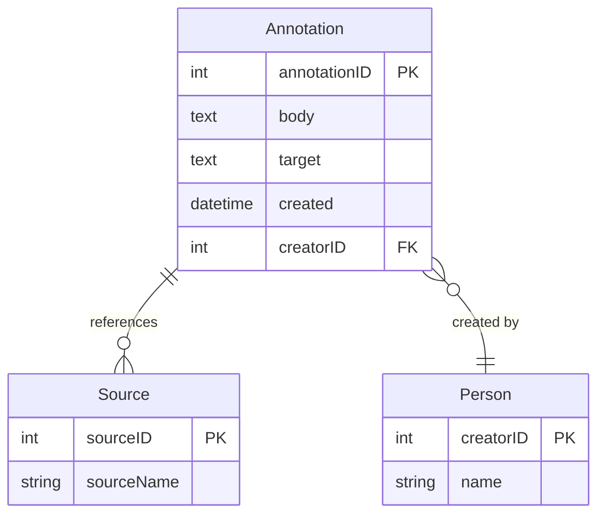

---

### **Question 2: Database Design and Querying**

---

**(a) Which aggregate function is used here?** [1]

**Answer:**

The aggregate function used is `AVG()`.

**Detailed Explanation:**

- **Understanding the Function:** The `AVG()` function calculates the average of values in a specified column. In this case, it is used to determine the average score of students in the test results.
- **Real-World Scenario Connection:** Average calculations are commonly used in student performance monitoring systems, financial data analysis, and other scenarios where mean values are important.

**Common Pitfalls and Mistakes:**

- Confusing `AVG()` with `SUM()`, which adds values instead of averaging them.
- Forgetting to group data when using `AVG()` in conjunction with the `GROUP BY` clause.

**Important Points to Remember:**

- The `AVG()` function is one of the basic SQL aggregate functions that should be mastered.
- Grouping is essential when calculating averages for subsets of data (e.g., per year, per category).

**Key Takeaways:**

- Aggregate functions like `AVG()` are fundamental tools for summarizing data in SQL queries.

---

**(b) There is a problem with the database design that risks making the aggregation incorrect. What is it, and how could it be resolved?** [6]

**Answer:**

The problem arises due to potential data redundancy or incorrect grouping in the aggregation query. If attributes like age or gender are calculated rather than stored as static values, inconsistencies may result in skewed averages.

**Solution:** Normalize the database and ensure that age is consistently calculated from `BirthDate` rather than stored directly. Grouping should be based on consistent and static attributes.

**Detailed Explanation:**

- **Normalization Issues:** Storing age directly rather than calculating it from `BirthDate` can lead to incorrect aggregations, especially as students get older.
- **Improving Aggregation Accuracy:** By calculating age dynamically using `TIMESTAMPDIFF`, the risk of outdated or inconsistent age data is minimized.
  
**Real-World Scenario Connection:**

In real-world educational systems, aggregations based on dynamic attributes like age or calculated scores need to be accurate. Proper normalization and grouping practices ensure the reliability of such aggregated data.

**Common Pitfalls and Mistakes:**

- Storing dynamic data like age in the database rather than calculating it when needed.
- Inconsistent grouping criteria leading to skewed or incorrect results.

**Important Points to Remember:**

- Normalize databases to avoid storing dynamic data like age.
- Always ensure that grouping is based on consistent and stable attributes.

**Key Takeaways:**

- Proper database design and consistent data handling are key to accurate aggregation in SQL queries.

---

**(c) For security reasons, the researcher should be given minimal, read-only access to the database. Give a suitable command that the database administrator should run to provide this.** [4]

**Answer:**

```sql
GRANT SELECT ON database_name.* TO 'researcher'@'localhost' IDENTIFIED BY 'password';
```

**Detailed Explanation:**

- **Granting Read-Only Access:** The `GRANT SELECT` command allows the researcher to view the data but not modify it. This ensures data integrity while still providing the needed access for analysis.
- **User Role and Security:** By specifying `SELECT`, the researcher is given the least privilege necessary to complete their tasks.

**Real-World Scenario Connection:**

In many organizations, role-based access control (RBAC) is used to limit data access according to job responsibilities. For instance, analysts or external researchers are often granted read-only access to prevent accidental or malicious modifications.

**Common Pitfalls and Mistakes:**

- Forgetting to use the correct database name or table when assigning permissions.
- Providing excessive permissions that go beyond what is necessary.

**Important Points to Remember:**

- Always follow the principle of least privilege when granting database access.
- Use specific commands like `GRANT SELECT` for read-only access.

**Key Takeaways:**

- Understanding how to grant precise permissions in SQL is essential for managing secure and efficient databases.

---

**(d) From the point of view of handling confidential information about minors, it would be better to give access only to aggregated data. How would you achieve that?** [4]

**Answer:**

Create a view that provides only aggregated data, such as average scores, without exposing individual records:

```sql
CREATE VIEW AggregatedData AS
SELECT Gender, City, AVG(Score) AS AverageScore
FROM Test
GROUP BY Gender, City;
```

**Detailed Explanation:**

- **Using Views for Aggregation:** The view restricts access to individual records by presenting only aggregated summaries, reducing the risk of exposing confidential information.
- **Limiting Data Exposure:** Aggregated views are a common way to comply with data privacy laws while still providing valuable insights.

**Real-World Scenario Connection:**

In sensitive areas like healthcare and education, aggregated data is often shared instead of raw data to comply with privacy regulations such as GDPR or HIPAA.

**Common Pitfalls and Mistakes:**

- Exposing too much detail in the aggregation, compromising confidentiality.
- Forgetting to consider edge cases like small sample sizes that might still reveal identifiable information.

**Important Points to Remember:**

- Use views to aggregate data when dealing with sensitive information.
- Always assess whether aggregation methods sufficiently protect individual identities.

**Key Takeaways:**

- Aggregating data is a fundamental method for balancing privacy and the need for insights in sensitive applications.

---

**(e) What limitation would that create for the researcher?** [1]

**Answer:**

The limitation is that the researcher cannot access individual records or perform more granular analysis, potentially missing out on important insights that require detailed data.

**Detailed Explanation:**

- **Impact on Research Flexibility:** By only having access to aggregated data, the researcher loses the ability to explore patterns, outliers, or correlations that may be present at the individual level.
  
**Real-World Scenario Connection:**

In educational research, aggregated data can hide significant details, such as the performance of subgroups or individuals who deviate from the norm, which may be critical for targeted interventions.

**Common Pitfalls and Mistakes:**

- Relying too heavily on aggregated data when more detailed analysis is needed.
- Overlooking important trends hidden within individual-level data.

**Important Points to Remember:**

- Aggregation improves privacy but can limit the depth of analysis.
- Researchers often need a balance between privacy and data access to draw meaningful conclusions.

**Key Takeaways:**

- While aggregated data protects privacy, it can limit the effectiveness and granularity of research analysis.

---

**(f) Database users have found several issues that come from the structure of the data model. These focus on the Student table. This table is defined by the following MySQL command:**

```sql
CREATE TABLE Student (
  ID VARCHAR(25) PRIMARY KEY,
  GivenName VARCHAR(80) NOT NULL,
  FamilyName VARCHAR(80) NOT NULL,
  Gender ENUM('M', 'F') NOT NULL,
  BirthDate DATE NOT NULL,
  School VARCHAR(130),
  City VARCHAR(130)
);
```

**What problems can you see with this table, and how would you resolve them? Be as specific as you can be.** [8]

**Answer:**

**Problems:**

1. **ID as VARCHAR:** Using a `VARCHAR(25)` for the primary key may lead to inconsistencies and inefficiency in indexing.
2. **Limited Gender Enum:** The gender field only allows binary values ('M', 'F'), which may be considered restrictive in certain contexts.
3. **Lack of Referential Integrity:** The `School` and `City` fields are free-text fields that could lead to inconsistent data entries.
4. **Potential Redundancy:** The table design could lead to data redundancy and update anomalies due to repeated entries for `School` and `City`.

**Solutions:**

1. **Use an Integer ID:** Replace `ID VARCHAR(25)` with `INT AUTO_INCREMENT PRIMARY KEY` to improve indexing and consistency.
2. **Broaden Gender Options:** Expand the gender options or allow for a more flexible approach using another table or accepting nulls.
3. **Normalize the Table:** Create separate tables for `School` and `City` with proper foreign keys to enforce data integrity.
4. **Improve Data Integrity:** Introduce referential integrity by linking the `School` and `City` fields to normalized tables.

**Detailed Explanation:**

- **Normalization:** The existing table structure violates normalization principles, leading to data redundancy and potential integrity issues. Splitting `School` and `City` into separate tables would follow normalization best practices.
- **Primary Key Considerations:** Using a numerical ID improves efficiency, especially when handling large datasets or joins.

**Real-World Scenario Connection:**

Normalization is essential in any system dealing with repeated entities (e.g., schools or cities). For instance, a university database with multiple students from the same city benefits from a normalized structure to avoid redundant data.

**Common Pitfalls and Mistakes:**

- Using free-text fields for entities that should be normalized.
- Overlooking the impact of primary key data types on performance.

**Important Points to Remember:**

- Normalization prevents redundancy and ensures consistent data.
- Proper primary key selection improves indexing and performance.

**Key Takeaways:**

- Database design must balance normalization, data integrity, and performance for robust and scalable systems.

---

**(g) How well would this data work in an object database like MongoDB? What would be the advantages or disadvantages?** [6]

**Answer:**

**Advantages:**

1. **Flexibility:** MongoDB’s schema-less nature

 allows easy storage of complex and varied student data.
2. **Document-Oriented Storage:** Data can be stored as JSON-like documents, making it easier to represent hierarchical structures like schools and cities.
3. **Scalability:** MongoDB offers horizontal scaling, which can be beneficial if handling large amounts of student data.

**Disadvantages:**

1. **Lack of Joins:** MongoDB does not support joins as relational databases do, making complex queries involving multiple entities more challenging.
2. **Consistency Issues:** In cases where relationships need to be enforced (e.g., linking students to specific schools), MongoDB’s flexibility could lead to inconsistent data without proper checks.
3. **Redundancy Risk:** Data redundancy can be a concern in a document database where the same information (e.g., school names) is embedded within multiple documents.

**Detailed Explanation:**

- **Document-Oriented Design:** MongoDB excels in storing data as documents, where related data is stored together. This can reduce the need for complex joins but might introduce redundancy.
- **Flexibility vs. Structure:** While flexible schemas are advantageous for evolving applications, they can lead to challenges in maintaining data consistency and integrity.

**Real-World Scenario Connection:**

Applications with variable or unstructured data, such as student profiles with diverse attributes (e.g., extracurricular activities, achievements), benefit from document-oriented databases like MongoDB.

**Common Pitfalls and Mistakes:**

- Failing to address redundancy issues in a document-oriented model.
- Ignoring the lack of native join operations when designing queries.

**Important Points to Remember:**

- MongoDB provides flexibility but requires careful design to avoid redundancy and maintain consistency.
- Consider the trade-offs between relational structure and document-oriented flexibility based on the application’s requirements.

**Key Takeaways:**

- MongoDB’s flexible document model is powerful for varied and evolving data but requires thoughtful design to avoid common pitfalls like redundancy and inconsistency.

---

### **Question 3: XML, XPath, and Relational Models**

---

**(a) What markup language is being used? And what is the root node?** [2]

**Answer:**

- **Markup Language:** XML (Extensible Markup Language).
- **Root Node:** `<TEI>`.

**Detailed Explanation:**

- **XML:** Extensible Markup Language (XML) is used for representing structured data, commonly used in document storage and data interchange.
- **Root Node Concept:** The root node is the top-most element in an XML document, containing all other elements within it.

**Real-World Scenario Connection:**

XML is used in scenarios like configuration files, web services (SOAP), and data interchange between systems (e.g., book catalogs).

**Common Pitfalls and Mistakes:**

- Misidentifying the root node due to nested structures.
- Confusing XML with other markup languages like HTML.

**Important Points to Remember:**

- XML documents always have a single root node.
- XML is widely used for data exchange in enterprise systems.

**Key Takeaways:**

- Understanding XML structure and the concept of the root node is foundational for working with document-based data.

---

**(b) Is this fragment well-formed? Justify your answer.** [3]

**Answer:**

Yes, the fragment is well-formed. 

**Justification:**

- All elements are correctly nested and closed.
- The XML declaration (`<?xml version="1.0" encoding="UTF-8" ?>`) is present.
- Attribute values are enclosed in quotes.

**Detailed Explanation:**

- **Well-Formed XML:** An XML document is considered well-formed when it adheres to syntax rules like proper nesting, closing tags, and case sensitivity.
- **Attributes and Elements:** The fragment follows all standard rules, making it a valid XML structure.

**Real-World Scenario Connection:**

Ensuring XML is well-formed is crucial for its proper parsing in applications like configuration management, data exchange, and API integrations.

**Common Pitfalls and Mistakes:**

- Forgetting to close tags.
- Failing to enclose attribute values in quotes.

**Important Points to Remember:**

- Well-formed XML is a prerequisite for further processing (e.g., validation, parsing).
- Always ensure tags are properly nested and closed.

**Key Takeaways:**

- Mastering XML syntax is essential for working with structured data formats in many enterprise environments.

---

**(c) What would be selected by evaluating the XPath expression `//fileDesc//title/@type`?** [2]

**Answer:**

The XPath expression would select the value of the `type` attribute for the `title` element inside `fileDesc`.

**Detailed Explanation:**

- **XPath Syntax:** The double slashes (`//`) indicate searching for any matching elements in the document structure.
- **Attribute Selection:** The `@type` syntax selects the attribute value for the specified element.

**Real-World Scenario Connection:**

XPath is used extensively in web scraping, document querying, and XML processing to extract specific information from structured documents.

**Common Pitfalls and Mistakes:**

- Misusing double slashes, leading to unintended selections.
- Confusing element selection with attribute selection.

**Important Points to Remember:**

- XPath provides powerful querying capabilities for structured data formats like XML.
- Attribute selection is performed using the `@` symbol in XPath.

**Key Takeaways:**

- XPath is a versatile tool for querying XML documents, especially when precise selections are needed.

---

**(d) What would be selected by evaluating `//resp[text()= 'Cataloguer']/../persName`?** [2]

**Answer:**

The expression would select the `persName` element that is a sibling to the `resp` element with the text 'Cataloguer'.

**Detailed Explanation:**

- **XPath Sibling Navigation:** The `../` syntax moves up to the parent element, and then the `persName` sibling element is selected.
- **Text Matching:** The `[text()= 'Cataloguer']` condition ensures only `resp` elements with the specified text are considered.

**Real-World Scenario Connection:**

XPath queries like this are common when processing document-based data where relationships between elements need to be navigated and filtered based on specific criteria.

**Common Pitfalls and Mistakes:**

- Misunderstanding the `../` syntax for navigating up the document tree.
- Incorrectly placing conditions, leading to unintended results.

**Important Points to Remember:**

- Understanding XPath’s navigation and conditional filtering is key to precise querying.
- The `../` syntax is essential for moving between related elements in XML structures.

**Key Takeaways:**

- XPath’s ability to navigate and filter based on content is invaluable for extracting relevant data from complex XML documents.

---

**(e) Why might you choose the expression given in part (c) rather than the simpler `persName`? Give two situations where it would be preferable.** [4]

**Answer:**

The expression is preferable in cases where:

1. **Disambiguation:** When there are multiple `persName` elements, and only the one associated with a specific role (e.g., Cataloguer) is needed.
2. **Context-Specific Data:** When retrieving `persName` elements only when they are connected to specific roles or responsibilities, ensuring contextually accurate results.

**Detailed Explanation:**

- **Precision in Queries:** Simple queries may return unintended results if there are multiple similar elements. The more specific XPath expression narrows down results based on context.
- **Role-Based Selection:** This expression ensures that only `persName` elements tied to the 'Cataloguer' role are returned.

**Real-World Scenario Connection:**

In applications like metadata cataloging or digital archives, ensuring the correct person is associated with a specific role (e.g., cataloger, author) is crucial for accurate record-keeping.

**Common Pitfalls and Mistakes:**

- Relying on overly broad expressions that return multiple, irrelevant results.
- Failing to consider the context when querying XML data.

**Important Points to Remember:**

- Specific XPath expressions are necessary when precision is required in document queries.
- Consider the document structure and context when crafting XPath queries.

**Key Takeaways:**

- Precision and context are key factors in choosing the right XPath expressions for querying structured data.

---

**(f) This element refers to the second textual item (such as a story or sermon) that the manuscript contains – hence `n=2`. How well would this way of listing contents work in a relational model? How would you approach the problem?** [8]

**Answer:**

Listing contents using positional indicators like `n=2` is not ideal for relational models. A better approach would be to introduce a separate table linking items with a sequential index.

**Solution:** Create a junction table with fields like `ManuscriptID`, `ItemNumber`, and `ItemContent`. This approach separates the content from its sequence, allowing for flexible indexing and easy reordering.

**Detailed Explanation:**

- **Positional Data in Relational Models:** Positional references (like `n=2`) are not well-suited to relational models since they rely on implicit ordering, which relational databases do not inherently maintain.
- **Normalizing the Data:** By separating content from its sequence in a junction table, reordering, querying, and maintaining the data become simpler and more efficient.

**Real-World Scenario Connection:**

In content management systems, managing sequential content (e.g., chapters in a book) is common. Using normalized tables allows flexibility in managing the sequence without hardcoding positions.

**Common Pitfalls and Mistakes:**

- Hardcoding positions directly in the data model, leading to rigid and error-prone systems.
- Ignoring the need for flexibility in ordering content.

**Important Points to Remember:**

- Use separate tables and explicit indexing for managing ordered data in relational databases.
- Avoid relying on implicit order, which can lead to maintenance challenges.

**Key Takeaways:**


- Relational models handle sequence best when using explicit indexes or junction tables rather than positional indicators.

---

**(g) Here is an extract of the file `msdesc.rng`:**

```xml
<define name= "titleStmt">
  <element name= "titleStmt">
    <a:documentation xmlns:a="http://relaxng.org/ns/compatibility/annotations/1.0 ">
      (title statement) groups information about the title of a work and those responsible for its content. [2.2.1. The Title Statement 2.2. The File Description]
    </a:documentation>
    <group>
      <oneOrMore>
        <ref name= "title" />
      </oneOrMore>
      <zeroOrMore>
        <ref name= "model.respLike" />
      </zeroOrMore>
    </group>
    <ref name= att.global.attributes />
  </element>
</define>
```

**What is this file, and why is it referenced in the catalogue entry?** [3]

**Answer:**

This is a Relax NG schema file used to define the structure and rules of the XML document. It is referenced in the catalogue entry to ensure the document adheres to the specified schema for validation and consistency.

**Detailed Explanation:**

- **Relax NG Schema:** A Relax NG schema defines the elements, attributes, and structure allowed in an XML document. It ensures that the document follows the required format and data constraints.
- **Schema Validation:** The schema is used for validating the XML document during its creation or processing, ensuring it meets predefined standards.

**Real-World Scenario Connection:**

Schemas are vital in data exchange systems where consistency and adherence to standards are critical, such as in bibliographic records, financial data interchange, or electronic health records.

**Common Pitfalls and Mistakes:**

- Confusing Relax NG with other schema languages like XSD.
- Failing to validate XML documents against their schemas.

**Important Points to Remember:**

- Schema definitions are essential for ensuring structured data consistency.
- Relax NG is one of several schema languages used for XML validation.

**Key Takeaways:**

- Understanding schema validation is crucial when working with structured data formats like XML.

---

**(h) What is the difference between valid and well-formed XML?** [2]

**Answer:**

- **Well-Formed XML:** XML that follows the correct syntax rules, such as proper tag nesting and case sensitivity.
- **Valid XML:** XML that is both well-formed and conforms to a defined schema (e.g., DTD, XSD, Relax NG).

**Detailed Explanation:**

- **Syntax vs. Structure:** Well-formedness is concerned with basic syntax, while validity ensures that the content adheres to a specific structure defined by a schema.
  
**Real-World Scenario Connection:**

In data interchange, an XML document must first be well-formed to be processed, and then validated against a schema to ensure it meets the expected format, such as in financial transactions or API responses.

**Common Pitfalls and Mistakes:**

- Confusing well-formedness with validity.
- Assuming that well-formed XML is sufficient when schema validation is required.

**Important Points to Remember:**

- Well-formed XML is a basic requirement, but validation ensures the document meets specific content rules.
- Validity is essential for ensuring consistency across data exchanges.

**Key Takeaways:**

- Mastering both well-formedness and validation is key to ensuring reliable and standards-compliant XML processing.

---

**(i) If the first extract in this question had omitted the `respStmt` element, would the XML have been legal?** [1]

**Answer:**

No, the XML would not be legal according to the specified schema, as `respStmt` is a required element in this context.

**Detailed Explanation:**

- **Schema Enforcement:** The schema likely specifies `respStmt` as a mandatory element, and omitting it would lead to validation errors.

**Real-World Scenario Connection:**

In systems where specific metadata is mandatory (e.g., author information in bibliographic records), schema enforcement ensures that all required data is present.

**Common Pitfalls and Mistakes:**

- Omitting required elements when creating XML documents.

**Important Points to Remember:**

- Ensure that all schema-mandated elements are included in XML documents.

**Key Takeaways:**

- Schema validation is key to maintaining data completeness and integrity.

---

**(j) If the first extract in this question had omitted the `title` elements, would the XML have been legal?** [1]

**Answer:**

No, omitting the `title` elements would also make the XML illegal according to the schema, as these are core elements for the document’s structure.

**Detailed Explanation:**

- **Core Elements:** In bibliographic XML, titles are typically fundamental, and the schema will enforce their presence.

**Real-World Scenario Connection:**

In publishing systems, titles are mandatory, and schema validation ensures they are always included.

**Common Pitfalls and Mistakes:**

- Overlooking core elements when defining or validating XML documents.

**Important Points to Remember:**

- Core content elements like titles are usually required by schemas in structured data formats.

**Key Takeaways:**

- Always ensure that mandatory content elements specified by the schema are present.

---

**(k) This catalogue entry is converted automatically to HTML for the Oxford website whenever it changes. What two technologies would be most likely to be considered for the conversion?** [2]

**Answer:**

The two most likely technologies are:

1. **XSLT (Extensible Stylesheet Language Transformations):** For transforming XML into HTML.
2. **Saxon Processor:** A commonly used XSLT processor for XML transformations.

**Detailed Explanation:**

- **XSLT for Transformation:** XSLT is specifically designed to transform XML into other formats, including HTML.
- **Saxon for Processing:** Saxon is a popular tool that processes XSLT stylesheets to produce the desired output, such as converting XML to HTML.

**Real-World Scenario Connection:**

Many content management systems use XSLT and tools like Saxon for dynamic content transformation, such as converting XML-based articles into web pages.

**Common Pitfalls and Mistakes:**

- Confusing XSLT with CSS, which is used for styling but not transformation.
- Overlooking the need for a dedicated processor like Saxon.

**Important Points to Remember:**

- XSLT is the go-to technology for XML to HTML conversion.
- Proper tooling like Saxon ensures efficient and accurate transformation.

**Key Takeaways:**

- Mastering XSLT and knowing about processors like Saxon are important for XML-based content management.

---

### **Question 4: RDF, Ontologies, and Linked Data**

---

**(a) i. What is the model?** [1]

**Answer:**

The model is RDF (Resource Description Framework).

**(a) ii. What is the serialization format?** [1]

**Answer:**

The serialization format is Turtle.

**Detailed Explanation:**

- **RDF:** RDF is a framework for representing structured information about resources on the web.
- **Turtle:** Turtle is a serialization format for RDF that is more human-readable compared to other formats like RDF/XML.

**Real-World Scenario Connection:**

RDF and Turtle are used extensively in linked data and semantic web projects, such as knowledge graphs or metadata repositories.

**Common Pitfalls and Mistakes:**

- Confusing RDF with OWL (Web Ontology Language).
- Misidentifying Turtle serialization as plain text.

**Important Points to Remember:**

- RDF is the core model for linked data, while Turtle is a user-friendly format for expressing RDF triples.

**Key Takeaways:**

- Understanding both RDF and its serialization formats is essential for working with linked data and the semantic web.

---

**(b) Name two ontologies used in this document.** [3]

**Answer:**

1. **Dublin Core (dcterms):** For metadata elements like `creator` and `date`.
2. **FOAF (Friend of a Friend):** For describing people and their relationships.

**Detailed Explanation:**

- **Dublin Core:** Widely used for document metadata, covering elements like title, creator, and date.
- **FOAF:** Commonly used for representing social networks and connections.

**Real-World Scenario Connection:**

Ontologies like Dublin Core and FOAF are fundamental in projects involving digital libraries, social networks, and linked data repositories.

**Common Pitfalls and Mistakes:**

- Overlooking commonly used ontologies in linked data projects.
- Confusing different namespaces when working with RDF.

**Important Points to Remember:**

- Different ontologies provide standardized vocabularies for specific domains.
- Knowing the most common ontologies is crucial for working in semantic web environments.

**Key Takeaways:**

- Ontologies bring consistency and interoperability to linked data by providing standardized vocabularies.

---

**(c) For each ontology named in your previous answer, name all the properties from the ontology that are used in this document.** [5]

**Answer:**

1. **Dublin Core (dcterms):**
   - `dcterms:created`
   - `dcterms:creator`

2. **FOAF:**
   - `foaf:name`

**Detailed Explanation:**

- **Property Naming:** RDF properties follow the `namespace:property` pattern, ensuring that terms are unambiguously identified.
- **Interoperability:** Using standardized properties allows data from different sources to be combined and understood consistently.

**Real-World Scenario Connection:**

Digital libraries and linked data projects rely on well-defined properties from ontologies like Dublin Core and FOAF to describe resources and relationships consistently.

**Common Pitfalls and Mistakes:**

- Misusing properties from the wrong ontology.
- Overlooking the need for

 consistent naming across datasets.

**Important Points to Remember:**

- Properties in RDF must follow the correct ontology and namespace conventions.
- Using recognized ontologies facilitates data integration across different systems.

**Key Takeaways:**

- Understanding how to use properties from standard ontologies is vital for creating interoperable and semantically rich data.

---

**(d) This structure is a Web Annotation previously called Open Annotation. The BODY of the annotation contains a comment on the TARGET, which is often a part of a SOURCE. In this case, an online chapter of a book is the source, some part of which is being selected as a target.**

**Write a correct SPARQL query that will do what they ask.** [7]

**Answer:**

```sparql
SELECT ?body ?creator
WHERE {
  ?annotation a oa:Annotation .
  ?annotation oa:hasBody ?body ;
             oa:hasTarget ?target ;
             dcterms:creator ?creator .
  ?target oa:hasSource armadale:Chapter3 .
}
```

**Detailed Explanation:**

- **SPARQL Query Structure:** The query uses triple patterns to match annotations, retrieving both the body (comment) and creator, filtered by the chapter source.
- **Pattern Matching:** The `oa:hasSource` property is used to ensure only annotations related to the specified chapter are returned.

**Real-World Scenario Connection:**

SPARQL is used extensively in querying RDF data in knowledge graphs, linked data platforms, and semantic web applications.

**Common Pitfalls and Mistakes:**

- Misplacing filters or conditions, leading to incorrect query results.
- Using the wrong property names or prefixes.

**Important Points to Remember:**

- SPARQL’s triple-based querying aligns closely with the structure of RDF data.
- Understanding namespaces and prefixes is crucial for writing correct SPARQL queries.

**Key Takeaways:**

- SPARQL is the go-to query language for RDF and linked data, enabling precise data extraction from structured resources.

---

**(e) Some Linked Data systems use a backend database to store the data and for quick retrieval, exporting it as needed. Draw an ER diagram for web annotations like this.** [5]

**Answer:**



**Detailed Explanation:**

- **Entity Relationships:** The ER diagram captures the relationships between annotations, creators (persons), and sources.
- **Normalization:** By separating entities into tables, the diagram avoids redundancy and ensures flexibility in managing data.

**Real-World Scenario Connection:**

Relational models are commonly used as backends for linked data platforms, where the need for structured data storage and quick querying is critical.

**Common Pitfalls and Mistakes:**

- Over-complicating the model with unnecessary entities.
- Neglecting normalization principles, leading to data redundancy.

**Important Points to Remember:**

- ER diagrams should capture the core entities and relationships without introducing unnecessary complexity.
- Normalization ensures that relational models are flexible and maintainable.

**Key Takeaways:**

- Relational models are versatile and widely used for storing structured data, even when the data originates from linked data or RDF sources.

---

**(f) Identify the tables that you would need for a relational implementation and list the keys for each.** [5]

**Answer:**

1. **Annotations Table:**
   - **Primary Key:** `annotationID`
   - **Foreign Keys:** `creatorID`, `sourceID`

2. **Persons Table:**
   - **Primary Key:** `creatorID`

3. **Sources Table:**
   - **Primary Key:** `sourceID`

**Detailed Explanation:**

- **Relational Design:** Each table is designed to represent distinct entities while maintaining relationships through foreign keys.
- **Efficient Data Management:** This structure ensures easy data querying and reduces redundancy.

**Real-World Scenario Connection:**

Relational databases are often used as backend stores for linked data, where the need for structured queries and referential integrity is paramount.

**Common Pitfalls and Mistakes:**

- Mismanaging foreign keys, leading to orphaned records.
- Failing to normalize data, resulting in redundant storage.

**Important Points to Remember:**

- Relational tables should be designed with clear primary and foreign key relationships.
- Ensuring referential integrity is key to maintaining consistent data.

**Key Takeaways:**

- A well-designed relational schema is critical for maintaining data integrity and supporting complex queries in linked data systems.

---

**(g) Give a MySQL query equivalent for the scholar’s query you corrected in question 3(d).** [3]

**Answer:**

```sql
SELECT body, creator
FROM Annotations
JOIN Persons ON Annotations.creatorID = Persons.creatorID
JOIN Sources ON Annotations.sourceID = Sources.sourceID
WHERE Sources.sourceName = 'Chapter3';
```

**Detailed Explanation:**

- **SQL Joins:** The query uses joins to connect the annotations with their creators and sources, filtering by the chapter name.
- **Relational Equivalence:** The structure mirrors the SPARQL query by matching relationships in a relational model.

**Real-World Scenario Connection:**

Translating between SPARQL and SQL is common when dealing with hybrid systems that integrate RDF data with relational backends.

**Common Pitfalls and Mistakes:**

- Mismanaging joins, leading to incorrect or incomplete results.
- Failing to apply the correct filters when translating from one query language to another.

**Important Points to Remember:**

- SQL provides powerful querying capabilities, but understanding how to translate from other languages like SPARQL is key in mixed environments.
- Always ensure that joins and filters are correctly applied.

**Key Takeaways:**

- Mastering SQL joins and filters is essential for querying complex relational data that models linked data structures.

---
