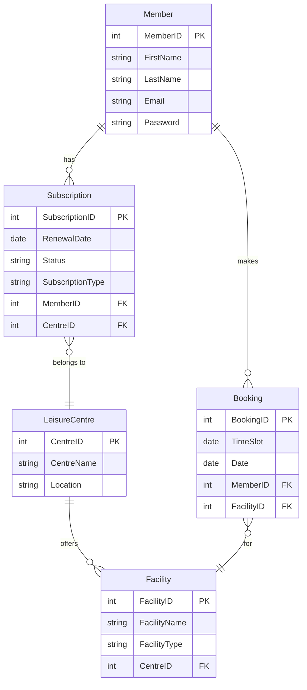

---

### **Question 2: Designing and Querying a Database for keepfitgyms.com**

---

**(a) For the keepfitgyms.com database, create an Entity Relationship Diagram using crow’s foot notation (as covered in this module). Entities, relationships between entities, and appropriate association types should all be included in your diagram.** [10]

**Answer:**



**Detailed Explanation:**

- **Entities and Relationships:** The entities `Member`, `LeisureCentre`, `Subscription`, `Facility`, and `Booking` are modeled with their attributes and relationships. Each relationship has been defined based on real-world interactions found in gym management systems.
- **Crow’s Foot Notation:** The diagram uses Crow’s Foot notation to clearly show the cardinality and relationships between entities.

**Real-World Scenario:** This model is applicable in a typical gym management system where members manage subscriptions, book facilities, and track services. For example, many fitness centers, such as YMCA or Anytime Fitness, have similar structures where members subscribe to specific gyms and make bookings for different classes or facilities.

**Common Pitfalls and Mistakes:**
- **Incorrect Cardinality Representation:** It's crucial to represent relationships accurately, such as ensuring one-to-many (1:M) and many-to-many (M:M) relationships are shown correctly.
- **Missing Key Attributes:** Be sure to include critical fields like email and password in the Member entity, as these are essential for user management in any web application.

**Key Takeaways:**
- An ER diagram helps provide a clear overview of database structures and the relationships between entities, which is essential for building a scalable and maintainable system.
- Crow’s Foot notation is particularly effective in visualizing database relationships, especially in complex systems like gym management.

---

**(b) For each table of the database you designed in part (a), list the primary and foreign keys.** [4]

**Answer:**

1. **Member Table:**
    - **Primary Key:** `MemberID`
    - **Foreign Key:** None

2. **LeisureCentre Table:**
    - **Primary Key:** `CentreID`
    - **Foreign Key:** None

3. **Subscription Table:**
    - **Primary Key:** `SubscriptionID`
    - **Foreign Keys:** `MemberID`, `CentreID`

4. **Facility Table:**
    - **Primary Key:** `FacilityID`
    - **Foreign Key:** `CentreID`

5. **Booking Table:**
    - **Primary Key:** `BookingID`
    - **Foreign Keys:** `MemberID`, `FacilityID`

**Detailed Explanation:**

- **Primary Keys:** These are unique identifiers for records in each table, such as `MemberID` in the `Member` table. Primary keys ensure data integrity by preventing duplicate entries.
- **Foreign Keys:** These establish relationships between tables, linking related entities like Members and Subscriptions. This structure enforces referential integrity, ensuring that data remains consistent across related tables.

**Common Pitfalls and Mistakes:**
- **Inconsistent Foreign Key Naming:** It’s important to maintain consistent naming conventions for foreign keys to avoid confusion when building complex queries or troubleshooting.

**Key Takeaways:**
- Defining primary and foreign keys is fundamental for ensuring data integrity and enabling efficient database querying in relational databases.

---

**(c) Using the appropriate SQL code, write commands to create two of the tables you mentioned in your answer to part (a). To gain maximum points, include all of the relevant fields and specify each as accurately as possible.** [12]

**Answer:**

```sql
CREATE TABLE Member (
  MemberID INT PRIMARY KEY AUTO_INCREMENT,
  FirstName VARCHAR(50),
  LastName VARCHAR(50),
  Email VARCHAR(100) UNIQUE,
  Password VARCHAR(255)
);

CREATE TABLE Subscription (
  SubscriptionID INT PRIMARY KEY AUTO_INCREMENT,
  MemberID INT,
  CentreID INT,
  RenewalDate DATE,
  Status VARCHAR(20),
  SubscriptionType VARCHAR(50),
  FOREIGN KEY (MemberID) REFERENCES Member(MemberID),
  FOREIGN KEY (CentreID) REFERENCES LeisureCentre(CentreID)
);
```

**Detailed Explanation:**

- **Auto-Incrementing IDs:** The use of `AUTO_INCREMENT` ensures that each record has a unique identifier, which simplifies management and querying.
- **Foreign Keys:** The foreign key constraints are included to maintain the relationships between members and subscriptions. This setup mirrors how a real gym system would track who holds which subscription and at which location.

**Real-World Scenario:** In a live gym management system, similar SQL code would be used to create tables that handle member registrations, subscriptions, and their corresponding relationships with different gym facilities.

**Common Pitfalls and Mistakes:**
- **Incorrect Data Types:** Always use appropriate data types, such as `VARCHAR` for text and `DATE` for dates, to avoid runtime errors and ensure the data is stored correctly.

**Key Takeaways:**
- Using primary and foreign keys correctly in SQL ensures that relational integrity is maintained and queries remain efficient.
- Auto-incrementing IDs are a common practice for simplifying database management.

---

**(d) How could you design your database schema to ensure that each member only holds a single subscription?** [4]

**Answer:** Implement a unique constraint on the `MemberID` column in the `Subscription` table:

```sql
CREATE TABLE Subscription (
  SubscriptionID INT PRIMARY KEY AUTO_INCREMENT,
  MemberID INT UNIQUE,
  CentreID INT,
  RenewalDate DATE,
  Status VARCHAR(20),
  SubscriptionType VARCHAR(50),
  FOREIGN KEY (MemberID) REFERENCES Member(MemberID),
  FOREIGN KEY (CentreID) REFERENCES LeisureCentre(CentreID)
);
```

**Detailed Explanation:**

- **Unique Constraint:** The `UNIQUE` constraint on `MemberID` ensures that each member can only have one active subscription. This design is particularly important for systems where duplicate or multiple subscriptions are not allowed.

**Real-World Scenario:** This approach is used in many subscription-based services, such as streaming platforms or fitness centers, where each user is allowed only one active subscription at a time.

**Common Pitfalls and Mistakes:**
- **Overcomplicating Schema Design:** Avoid introducing unnecessary complexity when a simple constraint like `UNIQUE` suffices for enforcing the business rule.

**Key Takeaways:**
- Using the `UNIQUE` constraint is an effective method for enforcing one-to-one relationships in database design.
- Database schema should always align with real-world business rules to prevent logical errors and maintain system consistency.

---

### **Question 3: SQL Queries and Explanation for Mostlyreliable.com Insurance Database**

---

**(a) Write an SQL query to find all claims of type "accidental loss" and display the claim IDs and policy IDs along with associated customer IDs.** [4]

**Answer:**

```sql
SELECT c.claim_id, c.policy_id, p.customer_id
FROM Claims c
JOIN Policies p ON c.policy_id = p.policy_id
WHERE c.type = 'accidental loss';
```

**Detailed Explanation:**

- **Inner Join:** The query uses an inner join to link the `Claims` and `Policies` tables on the `policy_id` column, filtering for claims of type "accidental loss". The result is a list of claims that match the specified criteria.
- **Selecting Specific Columns:** The query is optimized to retrieve only the columns that are needed (`claim_id`, `policy_id`, and `customer_id`), which is important for performance when dealing with large datasets.

**Real-World Scenario:** Insurance companies often need to query claim databases to identify and analyze specific types of claims, such as accidental losses, for fraud detection, risk assessment, and customer service.

**Common Pitfalls and Mistakes:**
- **Incorrect Join Condition:** Ensure that the `policy_id` is correctly referenced in both tables to avoid errors or incorrect results.

**Key Takeaways:**
- Understanding how to use SQL joins and filtering criteria is essential for querying related data across multiple tables and obtaining meaningful results.
- Always retrieve only the necessary columns to optimize query performance.

---

**(b) Write an SQL query to find the number of rejected claims for customer ‘Jamilla Jessop’.** [6]

**Answer:**

```sql
SELECT COUNT(*) AS RejectedClaims
FROM Claims c
JOIN Policies p ON c.policy_id = p.policy_id
JOIN Customers cu ON p.customer_id = cu.customer_id
WHERE cu.name = 'Jamilla Jessop' AND c.status = 'rejected';
```

**Detailed Explanation:**

- **Joins Across Multiple Tables:** The query joins the `Claims`, `Policies`, and `Customers` tables to trace the relationship from the customer to the claims, filtering specifically for rejected claims.
- **Counting Results:** The `COUNT(*)` function is used to calculate the total number of rejected claims, which

 can be useful for reporting or analysis.

**Real-World Scenario:** An insurance claims department might use this type of query to monitor and track claim rejections by individual customers, allowing them to assess customer behavior or refine claims processing strategies.

**Common Pitfalls and Mistakes:**
- **Misunderstanding Join Order:** Ensure that the joins logically link the correct tables. For instance, make sure the customer, policy, and claim are connected correctly to avoid inaccurate results.

**Key Takeaways:**
- Understanding how to use SQL joins and aggregate functions like `COUNT()` is crucial for extracting insights from large relational databases.
- Properly filtering and counting data allows for effective tracking and reporting.

---

### **Question 4: Developing an MVP Fitness Tracker with ExpressJS and MySQL**

---

**(a) Write an EJS template file for creating a user account named `create-user.ejs`. This should include an HTML form with username, email, and password. On submission, the form should post the form data to a route called "create-user." (NB. as this is an MVP, there is no need for styling or extra features; you will be marked on the core functionality only.)** [7]

**Answer:**

```html
<!DOCTYPE html>
<html lang="en">
<head>
    <meta charset="UTF-8">
    <meta name="viewport" content="width=device-width, initial-scale=1.0">
    <title>Create User</title>
</head>
<body>
    <h1>Create New User</h1>
    <form action="/create-user" method="POST">
        <div>
            <label for="username">Username:</label>
            <input type="text" id="username" name="username" required>
        </div>
        <div>
            <label for="email">Email:</label>
            <input type="email" id="email" name="email" required>
        </div>
        <div>
            <label for="password">Password:</label>
            <input type="password" id="password" name="password" required>
        </div>
        <button type="submit">Create Account</button>
    </form>
</body>
</html>
```

**Detailed Explanation:**

- **Core HTML Structure:** The template provides the essential structure for capturing user details—username, email, and password. Each input field is clearly labeled, and the form uses the `POST` method for secure data submission.
- **Form Submission:** The form sends data to the `/create-user` route, ensuring that the back-end can handle the submission appropriately.
- **Input Fields and Validation:** The `required` attribute ensures that all fields must be filled out before the form is submitted, improving data quality and user experience.

**Real-World Scenario:** EJS templates are commonly used in ExpressJS applications to dynamically render content. This is especially useful in MVPs where the focus is on core functionality rather than styling or advanced features.

**Common Pitfalls and Mistakes:**
- **Neglecting the `method="POST"` Attribute:** Using the correct method is essential for handling sensitive data such as passwords.
- **Inadequate Validation:** Even in an MVP, basic validation (e.g., `required` fields) should be implemented to avoid user errors.

**Key Takeaways:**
- Simple, well-structured HTML forms are key to capturing user input effectively in web applications.
- Always use `POST` for forms that handle sensitive data to maintain security.

---

**(b) Write some code for the route named ‘create-user’ that has the following functionality:**
- **Retrieves username, email, and password from the request.**
- **Stores the above data as a record in the SQL database (assume that there is a global variable for the MySQL database connection).**
- **Your code should handle an error condition where the database query fails and display a success message once the new user is successfully created.**

**Include full explanatory comments for each part of your code. You must explain each part of the code adequately to score points.** [10]

**Answer:**

```javascript
const express = require('express');
const router = express.Router();

// Route for creating a new user
router.post('/create-user', (req, res) => {
    const { username, email, password } = req.body; // Extract data from the request body

    // SQL query to insert a new user into the database
    const query = 'INSERT INTO users (username, email, password) VALUES (?, ?, ?)';

    // Execute the query using the MySQL connection
    db.query(query, [username, email, password], (error, results) => {
        if (error) {
            console.error('Error inserting user:', error); // Log the error for debugging
            return res.status(500).send('Failed to create user'); // Send an error response if the query fails
        }

        // Send a success message if the user is created successfully
        res.send('User created successfully!');
    });
});

module.exports = router;
```

**Detailed Explanation:**

- **Extracting Data from the Request:** The `req.body` object is used to retrieve the data submitted by the user (username, email, and password). This data is then used to create a new user record.
- **Prepared SQL Statement:** The query uses parameterized inputs (`?`) to protect against SQL injection attacks, ensuring the data is securely inserted into the database.
- **Error Handling:** Proper error handling is included, logging errors and sending a clear response to the client if something goes wrong.
- **Success Response:** On successful user creation, a success message is displayed. This basic feedback is crucial for user experience, even in an MVP.

**Real-World Scenario:** This is a common pattern in ExpressJS applications where user input is captured through a form and stored in a database. Handling errors and providing feedback are essential steps in ensuring a smooth user experience.

**Common Pitfalls and Mistakes:**
- **Failing to Handle Errors:** Robust error handling is crucial for preventing unexpected crashes and providing informative feedback to users.
- **Using Unprepared Statements:** Always use prepared statements (parameterized queries) to prevent SQL injection vulnerabilities.

**Key Takeaways:**
- Properly handling data input, executing database queries, and managing errors in ExpressJS are fundamental for building secure and reliable web applications.
- Parameterized queries are essential for protecting against SQL injection, which is a common security threat in web development.

---

**(c) Write a ‘workouts’ route that will query the database to retrieve all workout routines for a given user and then render them in an EJS template file called ‘workouts.ejs.’ NB. You don’t need to write the template file, but make sure that you provide all the data that it needs. Include full explanatory comments for each part of your code. You must explain each part of the code adequately to score points.** [5]

**Answer:**

```javascript
router.get('/workouts', (req, res) => {
    const { userId } = req.query; // Extract the user ID from the query parameters

    // SQL query to get all workout routines for the given user
    const query = 'SELECT workoutName, duration, intensity FROM workouts WHERE userId = ?';

    // Execute the query using the MySQL connection
    db.query(query, [userId], (error, results) => {
        if (error) {
            console.error('Error fetching workouts:', error); // Log the error for debugging
            return res.status(500).send('Failed to retrieve workouts'); // Send an error response if the query fails
        }

        // Render the 'workouts.ejs' template with the retrieved workout data
        res.render('workouts', { workouts: results });
    });
});

module.exports = router;
```

**Detailed Explanation:**

- **Querying the Database:** The route queries the database for workout routines associated with the given user ID. The relevant details (workout name, duration, and intensity) are selected, which can then be displayed in the EJS template.
- **Passing Data to the Template:** The retrieved workout data is passed to the `workouts.ejs` template for rendering. This structure allows for easy customization and display of dynamic content based on the user’s data.
- **Error Handling:** As with previous routes, error handling is implemented to log issues and return an appropriate response in case of failure.

**Real-World Scenario:** Dynamic rendering based on database queries is common in fitness applications where users track their workout progress, and personalized data is displayed.

**Common Pitfalls and Mistakes:**
- **Missing Query Parameters:** Ensure that required query parameters like `userId` are present and validated before executing the query.
- **Inadequate Error Handling:** Consider scenarios where no workouts are found—either show a default message or handle the empty results appropriately.

**Key Takeaways:**
- ExpressJS routes provide a flexible way to query databases and render dynamic content with EJS, offering a personalized user experience.
- Handling query parameters correctly and passing data to templates are key skills in building web applications.

---

**(d) Whilst recognising that this version of the app is an MVP, the CEO wants to understand the work required to bring it up to Beta. They have asked for an audit of your code so far. Write a bulleted list of four weaknesses / vulnerabilities in terms of security, robustness, accessibility, and usability, with a proposed solution for each.** [8]

**Answer:**

1. **Security: Weak Password Storage**
   - **Issue:** Passwords are stored as plain text in the database, making them vulnerable if the database is compromised.
   - **Solution:** Implement hashing (e.g., bcrypt) for password storage to ensure that even if the database is breached, passwords remain secure.

2. **Robustness: Lack of Input

 Validation and Sanitization**
   - **Issue:** The application currently accepts user input without validation or sanitization, leaving it vulnerable to SQL injection and other attacks.
   - **Solution:** Implement input validation and sanitization on both client-side and server-side to ensure only valid and safe data is processed.

3. **Accessibility: Inadequate Form Accessibility Features**
   - **Issue:** The forms lack accessibility features like ARIA labels, which are essential for users relying on screen readers.
   - **Solution:** Add ARIA labels and ensure all form elements are accessible and navigable via keyboard and screen readers.

4. **Usability: Limited Feedback on Form Submission**
   - **Issue:** The current form submission provides no visual feedback to users during the process, potentially leading to confusion.
   - **Solution:** Implement loading indicators and success/error messages to keep users informed of the submission status.

**Detailed Explanation:**

- **Security Concerns:** Handling user credentials and inputs securely is critical in any application. Implementing proper security practices (like password hashing and input sanitization) is essential from the MVP stage onward.
- **Robustness and Resilience:** Ensuring the application handles different scenarios (e.g., invalid inputs, empty responses) gracefully is key to a good user experience.
- **Accessibility and Usability:** As the app evolves from MVP to Beta, it should cater to a wider audience, including those with disabilities, and provide intuitive, user-friendly feedback.

**Common Pitfalls and Mistakes:**
- **Overlooking Security in MVPs:** Even in the early stages, neglecting security can lead to major issues down the line.
- **Ignoring Accessibility Needs:** Failing to account for accessibility can alienate a portion of the user base.

**Important Points to Remember:**
- Balancing security, robustness, and usability is essential in web application development.
- Accessibility should be considered early in the development process, not just as a final step.

**Key Takeaways:**
- Addressing common security and usability issues during the MVP stage ensures a smoother transition to a more robust and feature-complete Beta version.

---
