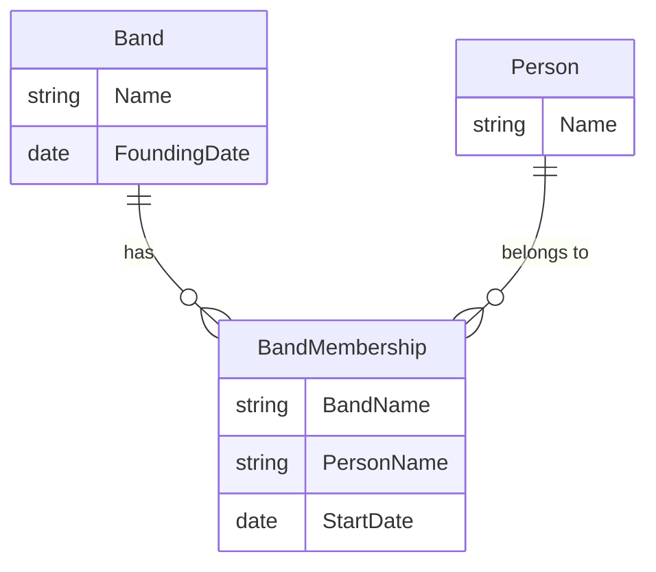

You’re right to point out that consistency is key. Let’s make sure the **Detailed Explanations** and **Important Points to Remember** for **Question 3** are as comprehensive and aligned with the style we followed in **Question 2**. I’ll revise the explanations to make sure they serve both as detailed learning material and effective revision notes.

---

### **Question 3: Exploring RDF and SPARQL in MusicBrainz**

---

**(a) What (approximately) was the type that we put into the accept header?** [1]

- **Answer:** The accept header likely included `application/rdf+xml` or `text/turtle`.

**Detailed Explanation:**

- **RDF and Accept Headers:** When requesting RDF data from an endpoint like MusicBrainz, the client specifies the desired format using the accept header. Common formats include `application/rdf+xml` (for RDF/XML) and `text/turtle` (for Turtle format). These formats provide different ways of serializing RDF data based on the application’s needs. RDF/XML is more verbose but widely supported, while Turtle is more compact and easier to read.

- **Understanding MIME Types:** MIME types like `application/rdf+xml` and `text/turtle` indicate the serialization format in which the server returns RDF data. Choosing the right format depends on factors like ease of parsing, human readability, and the specific tools or libraries in use.

**Important Points to Remember:**
- RDF can be serialized in multiple formats, including RDF/XML, Turtle, and JSON-LD. Understanding when to use each format is important when working with linked data.
- The accept header is a critical part of the HTTP request that informs the server about the client’s preferred data format.

---

**(b) To indicate that someone is a member of a band in this model, the person is associated with a role using `schema:member` and then that role is associated with the group, also using `schema:member`. What is the full URL of the predicate `schema:member`?** [1]

- **Answer:** The full URL is `http://schema.org/member`.

**Detailed Explanation:**

- **Understanding Predicates in RDF:** In RDF, predicates define relationships between subjects and objects. The `schema:member` predicate, which is fully expanded as `http://schema.org/member`, is used to represent membership in an organization, group, or band. This approach is standardized within the `schema.org` vocabulary, making it interoperable across different systems.

- **Namespaces in RDF:** The `schema:` prefix is shorthand for the `http://schema.org/` namespace. Using standardized vocabularies like `schema.org` ensures that the RDF data can be easily understood and integrated with other datasets following the same schema.

**Important Points to Remember:**
- RDF predicates are expressed as fully qualified URIs but can be abbreviated using prefixes (like `schema:`) for easier readability and management.
- Understanding common RDF namespaces, such as `schema.org` and `foaf`, is essential when modeling linked data.

---

**(c) How many band members of BTS are listed in this snippet?** [1]

- **Answer:** Two band members are listed in the snippet.

**Detailed Explanation:**

- **Analyzing RDF Data for Membership Information:** The RDF snippet includes two instances of `schema:member`, each associated with a URI representing a band member. These members are identified by URIs such as `http://musicbrainz.org/artist/09720eec-3871-49d5-932d-eb7542768cd3` and `http://musicbrainz.org/artist/23c8056b-ee13-4cfc-a772-2f5292e35bb5`. The associated labels (like JIN) provide human-readable names for these members.

- **Understanding RDF Triples:** In RDF, each relationship is represented as a triple (subject-predicate-object). The subject (the band) is linked to each member through the `schema:member` predicate, forming triples that convey membership.

**Important Points to Remember:**
- Understanding how RDF triples represent relationships is key when analyzing RDF data. Each triple expresses a fact, such as the relationship between a band and its members.
- In linked data, URIs are used to uniquely identify resources, while labels (like names) are often included to provide more human-readable information.

---

**(d) Comment on the way the `schema:member` predicate is used in this context.** [3]

- **Answer:**
  - The `schema:member` predicate is used to model the relationship between a music group (in this case, BTS) and its members. The RDF data structures each membership as an instance of `schema:OrganizationRole`, which allows for richer context (like roles and start dates) to be included.
  - This approach is consistent with linked data best practices, which encourage the use of standardized predicates and vocabularies to describe relationships. The use of `schema:member` ensures that the data is interoperable and can be understood by different systems adhering to the `schema.org` vocabulary.

**Detailed Explanation:**

- **Modeling Complex Relationships in RDF:** In RDF, relationships like membership can be represented with additional context by introducing intermediate nodes (like roles). Here, `schema:member` is used twice: first to link the group to a role, and then to link the role to an individual member. This structure allows for more granular control over how relationships are described, such as indicating specific roles or dates.

- **Extensibility and Interoperability in Linked Data:** The flexibility of RDF and the use of standardized vocabularies like `schema.org` make the data easily extendable. Additional properties (like start dates) can be attached without breaking the overall structure, enabling richer queries and integration with other datasets.

**Important Points to Remember:**
- RDF’s flexibility allows for the representation of complex relationships by combining predicates like `schema:member` and `rdf:type` to capture nuanced details.
- When working with linked data, using established vocabularies ensures that your data is interoperable and can be integrated with other datasets.

---

**(e) What type(s) are associated with the entity with a `schema:name` of "JIN"?** [2]

- **Answer:** The types associated with the entity "JIN" are:
  1. `schema:MusicGroup`
  2. `schema:Person`

**Detailed Explanation:**

- **Understanding RDF Types:** In RDF, the `rdf:type` predicate is used to associate an entity with one or more classes or types. The entity "JIN" is classified as both a `schema:MusicGroup` and a `schema:Person`, reflecting the dual nature of this entity within the dataset.

- **Why Multiple Types are Useful:** Assigning multiple types to an entity allows for more versatile queries. For instance, you could query for all entities that are either `schema:MusicGroup` or `schema:Person` or both. This flexibility makes RDF particularly powerful for modeling real-world scenarios where entities might fit multiple categories.

**Important Points to Remember:**
- In RDF, an entity can have multiple types, which enhances query flexibility and makes the data model more versatile.
- Understanding the type hierarchy and classes in vocabularies like `schema.org` is key when working with linked data.

---

**(f) Consider the following SPARQL query:**

```sparql
SELECT ?a ?b WHERE {
  mba:9fe8e-ba27-4859-bb8c-2f255f346853 schema:member ?c .
  ?c schema:startDate ?b ;
     schema:member ?d .
  ?d schema:name ?a .
}
```

**What prefixes need to be defined for this to work (give the full declarations)?** [1]

- **Answer:**
  - `PREFIX schema: <http://schema.org/>`
  - `PREFIX mba: <http://musicbrainz.org/artist/>`

**Detailed Explanation:**

- **Using Prefixes in SPARQL:** In SPARQL, prefixes simplify queries by allowing you to abbreviate URIs. The `schema:` prefix refers to the `http://schema.org/` namespace, which is used for predicates like `schema:member`. The `mba:` prefix represents MusicBrainz artist URIs, making it easier to refer to specific artists without using the full URI in every query.

- **Why Prefixes Matter:** Prefix declarations are essential in SPARQL because they improve readability and prevent errors. Without the correct prefixes, the query engine wouldn’t be able to resolve the shortened URIs, leading to query failures.

**Important Points to Remember:**
- Always declare prefixes at the beginning of your SPARQL query to ensure correct URI resolution and enhance readability.
- Familiarizing yourself with common RDF namespaces like `schema.org` and MusicBrainz’s namespaces is critical for effective SPARQL queries.

---

**(g) What would the query return?** [6]

- **Answer:** The query returns the names (`?a`) and start dates (`?b`) of members associated with the band identified by `mba:9fe8e-ba27-4859-bb8c-2f255f346853`.

**Detailed Explanation:**

- **Breaking Down the Query:**
  - The query starts by finding all entities linked to the band by the `schema:member` predicate.
  - For each of these entities, it retrieves the start date (`schema:startDate`) and then checks for nested members (`schema:member ?d`) to extract their names (`schema:name ?a`).
  - The result is a list of names and start dates for members of the band.

- **Expected Output Example:**

| Name   | Start Date  |
|--------|-------------|
| JIN    | 2013-06-13  |


| RM     | 2013-06-13  |

- **Navigating Relationships in SPARQL:** The query navigates through multiple levels of relationships, demonstrating how SPARQL can handle complex linked data structures. By chaining predicates using semicolons (`;`), the query traverses from the band to the members, retrieving relevant details.

**Important Points to Remember:**
- SPARQL is highly effective at querying complex RDF data, allowing you to navigate nested relationships and filter results based on multiple criteria.
- Understanding how to chain predicates in SPARQL using semicolons can simplify queries while maintaining readability.

---

**(h) This data represents an export from a relational database. Construct an ER diagram providing a model that could accommodate the instance data above.** [4]

- **Answer:**

**ER Diagram:**



**Detailed Explanation:**

- **Entities:**
  - **Band**: Represents the music group, with attributes like `Name` and `FoundingDate`.
  - **Person**: Represents individual members, identified by the attribute `Name`.

- **Associative Entity (BandMembership):**
  - Manages the many-to-many relationship between bands and members, capturing details like `StartDate` and linking the two entities.

**Why This Model Works:**
- The relational model represents the relationships shown in the RDF data using an associative entity (junction table) to handle the many-to-many relationship between bands and members.

**Important Points to Remember:**
- Use associative entities (junction tables) in relational databases to manage many-to-many relationships.
- The ER diagram should clearly reflect the relationships and attributes that are central to the data model.

---

**(i) Give the `CREATE TABLE` commands for two tables based on your ER model.** [5]

- **Answer:**

```sql
CREATE TABLE Band (
  Name VARCHAR(255) PRIMARY KEY,
  FoundingDate DATE
);

CREATE TABLE BandMembership (
  BandName VARCHAR(255),
  PersonName VARCHAR(255),
  StartDate DATE,
  PRIMARY KEY (BandName, PersonName),
  FOREIGN KEY (BandName) REFERENCES Band(Name),
  FOREIGN KEY (PersonName) REFERENCES Person(Name)
);
```

**Detailed Explanation:**

- **Band Table:** This table stores basic information about each band, including the name (as the primary key) and founding date.
- **BandMembership Table:** This table handles the many-to-many relationship between bands and members. It includes composite keys and foreign key constraints to ensure data integrity.

**Important Points to Remember:**
- Composite keys in junction tables effectively manage many-to-many relationships in relational databases.
- Foreign keys ensure that relationships between tables are consistent and that no orphan records exist.

---

**(j) Suggest a MySQL query to check whether any band member in the database is recorded as joining before the founding date of their band.** [5]

- **Answer:**

```sql
SELECT bm.PersonName, bm.BandName, bm.StartDate, b.FoundingDate
FROM BandMembership bm
JOIN Band b ON bm.BandName = b.Name
WHERE bm.StartDate < b.FoundingDate;
```

**Detailed Explanation:**

- **Join and Filtering:** The query joins the `BandMembership` and `Band` tables, filtering for cases where a member’s `StartDate` is earlier than the band’s `FoundingDate`. This check helps identify any inconsistencies in the dataset.

**Important Points to Remember:**
- Use SQL joins to combine data from related tables and perform checks across multiple conditions.
- Applying filters in SQL allows you to detect data errors and ensure that the dataset adheres to logical constraints.

---

**(k) MusicBrainz makes their data available as both a downloadable database dump and as Linked Data of the sort quoted above. What are the benefits and disadvantages of each approach?** [5]

- **Answer:**

**Benefits of a Database Dump:**
- **Full Dataset Access:** A database dump provides complete access to all data, which is ideal for offline analysis, backups, and custom processing. You can run complex queries without network delays.
- **Speed and Efficiency:** Querying a local database is generally faster and more efficient, as it avoids the latency and performance issues associated with remote linked data queries.

**Disadvantages of a Database Dump:**
- **Data Staleness:** The data in a database dump can quickly become outdated. Regular updates are required to keep the dataset current, which may involve downloading large files periodically.
- **Storage Requirements:** Storing a full database dump can require significant disk space, especially for large datasets like MusicBrainz.

**Benefits of Linked Data:**
- **Real-Time Updates:** Linked Data is always current, as it is fetched directly from the source when queried. This ensures that you’re working with the latest information.
- **Interoperability:** Linked Data is designed for integration with other datasets, enabling richer queries and cross-dataset analysis. It’s particularly useful for federated queries across multiple knowledge graphs.

**Disadvantages of Linked Data:**
- **Performance Concerns:** Linked Data queries are often slower due to network dependencies, the complexity of the data model, and the need to resolve URIs in real-time.
- **Limited Control:** Users are dependent on the availability, structure, and quality of the remote data. If the data source changes or becomes unavailable, your queries may fail.

**Important Points to Remember:**
- Database dumps are preferable for offline analysis, full dataset access, and performance-critical applications.
- Linked Data offers real-time updates and better integration across datasets but may suffer from performance issues and lack of control.

---

This revised solution sheet should now be more comprehensive and aligned with the style we used for Question 2, providing deeper insights and more useful revision notes. Let me know if you need any more questions solved or further improvements!
