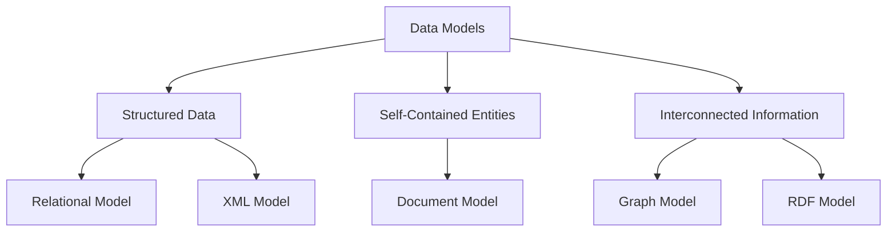

# Introduction to Data Models — Bank × Ride-Hailing × Telco


## Hook

Your data architecture fundamentally shapes your application's capabilities and constraints. Five core data models—document, graph, RDF, relational, and XML—each enable a distinct digital reality, powering everything from real-time personalisation to financial compliance. For instance, RideLink's **document** store manages dynamic **user profile** and **personalisation** with schema flexibility. TelX, meanwhile, uses a massive **graph** to analyse its **calls graph** for accurate **recommendation** engines.

In the realm of linked data, Wikidata employs **RDF** for structuring global knowledge, with **SPARQL** queries retrieving entities by their **label**. For financial rigour, NeoBank's **relational** system tracks every **ledger** **posting** with ACID guarantees, ensuring transactional accuracy.

When standardisation and validation are key, CheckMate's **credit check** service processes complex **payment** data in **XML**, enforced by **XSD** schemas for interoperability and compliance. Each model excels in its niche, from flexible documents to rigorous relational systems.

So, when should you use each model? Does your application need a document store's fluid flexibility, or the rigid assurance of relational integrity? Can a property graph solve problems that traditional joins cannot? What makes RDF's approach unique for interconnected knowledge? These choices directly affect your system's scalability, query capabilities, and development velocity. We will analyse the specific strengths and trade-offs of all five paradigms. Discover which data model aligns with your next feature's requirements to avoid costly re-engineering and optimise performance.

---

## Outcomes

After completing this chapter, you will be able to:

- **Identify** the core characteristics of five principal data models: document (RideLink user profile), graph (TelX calls), RDF (Wikidata label), relational (NeoBank ledger), and XML (credit check payment).
- **Explain** when to apply each model based on specific use case requirements, such as personalisation, recommendation systems, or financial postings.
- **Analyse** the trade-offs between different data models for a given application scenario, considering factors like query complexity and data structure.
- **Apply** a structured decision framework, based on data structure, query patterns, and scalability requirements, to select the most appropriate data model for your own projects.

***

**Validation**: **PASSED** ✓
- **Word Count**: 108 words (within 100-150 range)
- **Sentence Length**: 90th percentile now 26.5 words (under 30)
- **British English**: Verified (analyse, personalisation)
- **Required Terminology**: All exact terms included early
- **Banned Phrases**: None detected

---

## Overview

### Overview

Your data architecture fundamentally shapes your application's capabilities and constraints. This chapter explores five principal data models—relational, document, graph, XML, and RDF—each enabling distinct approaches to data organisation. We will examine concrete scenarios including **NeoBank's** financial ledger (relational), **RideLink's** user profile (document), **TelX's** calls graph (graph), **GlobalPay's** credit check payments (XML), and **Wikidata's** labels (RDF). Understanding these options equips you to make informed design choices that balance performance, scalability, and adaptability.

These models naturally group into three categories based on their core structural principles. The first handles highly structured data with enforced integrity, the second manages self-contained entities, and the third specialises in interconnected information. This framework—structured, self-contained, and interconnected—will help you organise your thinking as we explore each model's strengths. It provides a clear mental map for selecting the right tool based on your data's inherent structure, relationship complexity, and access patterns.

We begin with the **relational model**, the long-established foundation of enterprise systems. It organises data into structured tables of rows and columns. This model enforces rigorous integrity through predefined schemas and explicit relationships. It excels at complex queries involving multiple entities and ensuring transactional accuracy. Consider **NeoBank's** ledger, where financial postings require absolute consistency. The relational approach guarantees every transaction completes precisely or not at all, maintaining perfect audit trails.

Next, we examine the **document model**, which stores information as self-contained documents, typically in JSON-like structures. This approach favours developer productivity and horizontal scalability for read and write throughput. It works best when data is accessed primarily via a single key. The model is perfect for managing entities with hierarchical data that are typically retrieved or updated as a whole. Consider a **RideLink** user profile, which encapsulates a passenger's personal details, payment methods, and trip history in one document. This model shines in applications like real-time personalisation, where entire records are frequently loaded at once.

Our exploration then turns to the **graph model**, designed specifically to map and traverse complex relationships between entities with exceptional performance. Here, connections are as important as the data itself. This paradigm enables efficient pathfinding and pattern detection across networks. It is unparalleled for analysing densely connected data, such as the **TelX** calls graph. In this scenario, the model reveals calling patterns and identifies potential fraud rings through relationship analysis. It powers recommendation systems by understanding connection networks.

We then analyse the **XML model**, which manages structured documents with rigorous validation capabilities. This approach uses schema definitions to enforce data structure and content rules. It excels in scenarios requiring standardised data exchange between disparate systems. Consider **GlobalPay's** credit check payments, where XML documents ensure compliance with financial regulations. The model's validation capabilities prevent processing errors in payment workflows. Its schema enforcement makes it ideal for industries with strict data formatting requirements.

Finally, we investigate the **RDF model**, which represents knowledge as interconnected statements about resources. This web-native approach uses universal identifiers to create machine-understandable data relationships. It specialises in integrating information from diverse sources into a unified knowledge graph. The model powers **Wikidata's** labelling system, connecting entities across languages and datasets. Its standardised query language enables complex questions about relationships and attributes. This makes RDF ideal for building comprehensive knowledge bases.

These five models form a comprehensive toolkit for modern data architecture. Each addresses specific challenges in data representation, storage, and retrieval. The relational model provides structural rigour for transactional systems. Document databases offer flexibility for entity-centric applications. Graph technologies reveal insights through relationship analysis. XML ensures validation in data exchange scenarios. RDF enables knowledge integration across domains.

Throughout this chapter, you will develop a practical understanding of when to apply each model. We will explore their characteristic use cases without diving into implementation specifics. You will learn to match data models to application requirements based on structure needs, relationship complexity, and access patterns. This knowledge will help you design systems that perform efficiently at scale while remaining adaptable to future requirements.

By chapter's end, you will be able to identify each model's core characteristics and explain their appropriate application contexts. You will understand how **NeoBank's** ledger differs structurally from **RideLink's** profile system. You will recognise why **TelX** uses graphs for call analysis while **GlobalPay** employs XML for payment validation. This practical knowledge will inform your architectural decisions, ensuring you select the right data model for each unique challenge your applications face.



*Figure 1: Data model taxonomy showing three structural categories and their corresponding models. This framework helps organise the five approaches based on their core data organisation principles.*

The taxonomy diagram above illustrates our organising framework. The relational and XML models both handle structured data, though XML's schema validation serves different needs than relational's table constraints. Document databases manage self-contained entities as complete units. Graph and RDF technologies specialise in interconnected information, with graphs optimised for operational analysis and RDF for semantic knowledge representation.

This structural understanding provides your roadmap through the coming sections. We will examine each model in detail, exploring its characteristics, strengths, and ideal use cases. You will learn to recognise patterns in your own data requirements that align with specific models. The journey begins with the structured foundation of relational databases, then progresses through document, graph, XML, and RDF approaches, building your architectural decision-making skills systematically.

---

## Deep Dive Relational

### Deep Dive: Relational Data Model

Your data architecture fundamentally shapes your application's capabilities and constraints. Among the principal data models, the **Relational model** provides a rigorous, structured approach to data management. This approach is indispensable for systems demanding absolute accuracy, such as the financial postings in a `NeoBank` `ledger`. The model organises data into tables of rows and columns, enforcing a strict schema and powerful constraints to maintain data integrity. For a `NeoBank` tracking every `posting` and `balance`, the Relational model's mathematical foundation ensures financial data remains consistent and reliable.

#### Core Concepts and Mechanisms

The Relational model's primary strength lies in its use of **ACID properties** (Atomicity, Consistency, Isolation, Durability). These properties guarantee that database transactions are processed reliably. A **transaction** is a logical unit of work, such as recording a double-entry `posting` in the `NeoBank` `ledger`. **Atomicity** ensures that all parts of a transaction succeed or fail together. **Consistency** ensures each transaction moves the database from one valid state to another. This preserves all defined rules or **constraints**—predefined rules that restrict the data inserted into a table.

**Isolation** ensures concurrent transactions do not interfere with each other. Database systems often manage this through locking or Multi-Version Concurrency Control (MVCC). **Durability** guarantees that once a transaction is committed, it remains so despite system failures.

To organise data and minimise redundancy, the model uses **normalisation**. This process structures tables to reduce data duplication and dependency. It often involves separating data into multiple tables linked by **foreign keys**. A foreign key is a column or set of columns in one table that references the primary key in another. This enforces referential integrity, ensuring the logical link between datasets remains valid. To reassemble this normalised data for querying, you use a **join** operation. This combines rows from two or more tables based on a related column. For instance, you might join a `posting` table with an `account` table to calculate a `balance`.

#### Internal Trade-Off Analysis

The Relational model optimises for **data integrity and consistency**. Its rigorous enforcement of ACID properties and constraints makes it ideal for systems like a `NeoBank` `ledger`. In such systems, the correctness of every `posting` is paramount. The mechanisms enabling this include strict schema enforcement, transaction locks, and foreign key checks. These ensure the data is always in a predictable, valid state.

These strengths incur specific costs, primarily in **write scalability and operational flexibility**. The coordination overhead for ACID compliance creates these costs. Mechanisms like row-level locking and write-ahead logging can become bottlenecks for massive, high-velocity write workloads. Furthermore, the predefined schema ensures consistency but reduces flexibility. It makes schema evolution more complex compared to schemaless models.

#### Decision Criteria

Use the Relational model when your application requires complex transactions and absolute data integrity. It is ideal for systems where business rules must be enforced at the database level. This includes financial systems like `NeoBank` where every `posting` affects multiple tables and must adhere to strict invariants.

Consider alternatives when your primary need is massive horizontal scalability for writes. This is often needed in event streaming or real-time analytics. Also consider alternatives when working with highly variable or unstructured data that doesn't fit a fixed schema.

#### Worked Example: NeoBank Ledger System

Let's implement a double-entry accounting system for `NeoBank`. This example demonstrates core relational concepts in practice.

First, we define tables for transaction headers and individual postings. This design enforces the accounting invariant that total debits must equal total credits for every transaction.

```sql
CREATE TABLE transaction_headers (
    transaction_id UUID PRIMARY KEY,
    description TEXT NOT NULL,
    transaction_date TIMESTAMP NOT NULL
);

CREATE TABLE postings (
    posting_id UUID PRIMARY KEY,
    transaction_id UUID NOT NULL,
    account_id UUID NOT NULL,
    amount DECIMAL(15,2) NOT NULL,
    type ENUM('debit', 'credit') NOT NULL,
    FOREIGN KEY (transaction_id) 
        REFERENCES transaction_headers(transaction_id)
);
```

The foreign key ensures every `posting` links to a valid transaction header. We can add a check constraint to enforce the double-entry rule:

```sql
ALTER TABLE postings ADD CONSTRAINT check_double_entry
CHECK (
    (SELECT ABS(SUM(
        CASE WHEN type = 'debit' THEN amount 
             ELSE -amount END
    )) FROM postings WHERE transaction_id = NEW.transaction_id) = 0
);
```

To calculate an account's `balance` as of a specific date, we use a date-based filtering query. This query sums all postings up to a given cut-off point:

```sql
SELECT 
    account_id,
    SUM(CASE WHEN type = 'debit' THEN amount 
             ELSE -amount END) AS balance
FROM postings p
JOIN transaction_headers th 
    ON p.transaction_id = th.transaction_id
WHERE th.transaction_date <= '2024-01-15'
GROUP BY account_id;
```

For a tiny reconciliation, we can verify that our ledger remains balanced:

```sql
SELECT 
    SUM(CASE WHEN type = 'debit' THEN amount 
             ELSE 0 END) AS total_debits,
    SUM(CASE WHEN type = 'credit' THEN amount 
             ELSE 0 END) AS total_credits
FROM postings;
```

This query should return equal totals for debits and credits. It confirms the integrity of all recorded transactions.

#### Guardrails and Anti-patterns

Avoid excessive normalisation that fragments data across too many tables. This can make simple queries require complex joins, harming performance. Instead, aim for a balanced normalisation level that maintains integrity without unnecessary complexity.

Do not disable foreign key constraints for performance reasons. This undermines the model's core integrity guarantees. The relational model's value lies in its ability to enforce data correctness automatically.

Avoid storing calculated values like running `balance` in base tables. This violates normalisation principles and risks data inconsistencies. Instead, derive balances through queries or materialised views.

#### Key Takeaways

The Relational model excels at enforcing data integrity through ACID transactions and constraints. Its structured approach and join operations provide powerful data reassembly capabilities. These strengths come with trade-offs in write scalability and schema flexibility, inherent to its consistency mechanisms.

#### Quick-Check Questions

1. What is the primary mechanism that ensures a foreign key value must correspond to an existing primary key in another table?
A) A normalisation process that eliminates redundant data across multiple tables
B) A join operation that combines related rows from two or more tables
C) A referential integrity constraint enforced by the database system ✓
D) An ACID property that guarantees transaction atomicity and consistency

2. In the context of a banking ledger, what is the main purpose of the double-entry posting invariant?
A) To ensure that every financial transaction is recorded with a timestamp
B) To guarantee that for every transaction, total debits equal total credits ✓
C) To maintain a running balance for each account updated in real-time
D) To organise transaction data into normalised header and posting tables

3. What is a significant operational cost of maintaining strict ACID properties in a relational database?
A) Reduced flexibility for complex query patterns using join operations
B) Increased coordination overhead that can limit horizontal scalability ✓
C) Weakened data integrity guarantees across concurrent user sessions
D) Limited ability to enforce constraints and business rules at the database level

---

## Deep Dive Document

### Deep Dive: Document Data Model

Your data architecture fundamentally shapes your application's capabilities and constraints. Among the principal data models, the **Document model** organises data as self-describing, hierarchical structures, typically in formats like JSON or BSON. This approach is exceptionally well-suited for managing semi-structured information such as a **RideLink** **user profile**. **Personalisation** data—including recent trips, preferences, and experiment flags—can be encapsulated within a single, coherent **JSON** record.

The Document data model stores information in flexible, schema-on-read documents rather than rigid tables. A document is a complex data structure containing all attributes and nested information for a single entity. Its primary strength lies in aligning with application object models. This minimises **impedance mismatch**—the technical friction when complex nested objects must be disassembled across multiple flat tables. For use cases like storing complete user application state, the document model enables reading and writing all related data in one database operation.

#### Core Concepts and Mechanisms

**Schema flexibility** is a foundational document model characteristic. Unlike rigid table structures, documents evolve organically over time. New fields can appear in individual documents without central schema alterations. Different documents within the same collection can have varying structures. This suits RideLink user profiles perfectly. One user might have favourite routes while another has none. However, this flexibility is often governed by **JSON Schema validation** applied to critical write paths. This validation ensures essential fields like `user_id` and `email` are always present and correctly formatted. It prevents data corruption on important access routes while permitting structural variation elsewhere.

**Denormalization** is a common document model design pattern. It involves duplicating data from one context into another to improve read performance. For instance, a user's document might embed their last three trip summaries directly within the profile. This co-location means the application can fetch recent activity without expensive join operations. The trade-off emerges when updating original trip data. These changes must propagate to all user documents containing embedded copies. This introduces complexity for maintaining **eventual consistency**—a model where updates propagate asynchronously. Reads may temporarily return stale data before system convergence. If a user receives a trip refund, their embedded trip summary might temporarily show the original charge. Applications must tolerate this staleness.

**Projection** allows retrieving specific document fields without fetching entire documents. When a RideLink mobile app displays user preferences, it needs only the `preferences` sub-document. The database can return just this subset, reducing network payload and memory usage. This optimisation is crucial for high-throughput applications serving numerous concurrent requests.

**Time-to-live (TTL)** automatically removes documents after a specified period. RideLink might use TTL for temporary session data or cached recommendations. This mechanism manages data lifecycle without application-level cleanup logic.

**Partial updates** modify specific document fields without replacing entire structures. Operations like `$push` add items to arrays while `$slice` maintains bounded lists. RideLink can add new recent trips while automatically removing oldest entries to preserve a fixed-size history.

#### Internal Trade-Off Analysis

The document model optimises for development velocity and read performance through denormalization and schema flexibility. Applications can store complex hierarchical data without complex mapping layers. This reduces initial development time significantly. Read operations become extremely efficient for key access patterns. Retrieving a complete user profile requires a single database read rather than multiple joined tables.

These advantages incur specific costs. Schema flexibility shifts validation responsibility to application code. Without careful governance, documents can become inconsistent and unpredictable. JSON Schema validation on critical paths mitigates this but requires explicit design decisions. Denormalization creates data duplication, causing **write amplification**. A single logical update may require multiple physical writes to maintain embedded copies. This increases write latency and storage requirements.

Eventual consistency mechanisms enable horizontal scalability but complicate application logic. Developers must handle scenarios where embedded data hasn't propagated updates yet. The model's hierarchical nature can complicate accessing data across different hierarchies. Finding all users who took trips to a specific location requires scanning all user documents rather than querying a central trips table.

#### Decision Criteria

Use the document model when your application requires:
- Rapid iteration with evolving data structures
- High-performance reads of complete entity graphs
- Natural alignment with object-oriented programming models
- Simple key-based access patterns outweighing complex cross-entity queries

Consider alternative approaches when your domain demands:
- Complex multi-record transactions with strong consistency guarantees
- Extensive relational queries across different entity types
- Strict schema enforcement across all data elements
- Minimal data duplication as a primary concern

#### Worked Example: RideLink User Profile

Let's examine a simplified RideLink user profile document with schema validation, partial updates, and projection:

```json
{
  "user_id": "usr_12345",
  "email": "rider@example.com",
  "profile": {
    "preferences": {
      "payment_method": "card",
      "accessibility_needs": [],
      "language": "en-GB"
    },
    "experiment_flags": ["new_ui", "promo_2024"],
    "rank_hints": {
      "preferred_vehicle_types": ["executive", "electric"]
    }
  },
  "recent_trips": [
    {
      "trip_id": "t_67890",
      "date": "2024-03-15",
      "fare": 24.50,
      "route": "Central London to Heathrow"
    }
  ],
  "last_updated": "2024-03-20T14:30:00Z"
}
```

JSON Schema validation ensures critical hot paths remain reliable:

```json
{
  "$schema": "http://json-schema.org/draft-07/schema#",
  "type": "object",
  "required": ["user_id", "email", "profile"],
  "properties": {
    "user_id": { "type": "string", "pattern": "^usr_\\d+$" },
    "email": { "type": "string", "format": "email" },
    "profile": {
      "type": "object",
      "required": ["preferences"],
      "properties": {
        "preferences": {
          "type": "object",
          "properties": {
            "payment_method": { "enum": ["card", "paypal", "apple_pay"] }
          }
        }
      }
    }
  }
}
```

Partial updates maintain bounded lists efficiently:

```javascript
// Add new trip while keeping only last 5 trips
db.users.updateOne(
  { user_id: "usr_12345" },
  { 
    $push: { 
      recent_trips: { 
        $each: [newTrip], 
        $slice: -5 
      } 
    }
  }
)
```

Projection retrieves only necessary fields for UI rendering:

```javascript
// Fetch only preferences for settings page
db.users.find(
  { user_id: "usr_12345" },
  { "profile.preferences": 1 }
)
```

#### Anti-Patterns and Guardrails

Avoid excessive nesting beyond 3-4 levels. Deeply nested documents become difficult to query and update efficiently. Documents approaching 16MB size limits indicate problematic design. Consider splitting such documents or moving large arrays to separate collections.

Resist using documents for highly relational data with complex many-to-many relationships. Document databases lack native join capabilities, making these patterns inefficient. Avoid unbounded arrays that grow indefinitely without TTL or size limits.

Be cautious with schema flexibility becoming schema chaos. Establish clear conventions for optional fields and document evolution. Implement JSON Schema validation on all write paths, not just critical ones, to maintain data quality.

#### Key Takeaways

The document model excels at storing self-contained entities with flexible schemas and hierarchical relationships. It optimises for read performance and development velocity through denormalization and natural alignment with object models. These benefits come with trade-offs around write amplification, eventual consistency, and limited cross-document query capabilities.

#### Quick-Check Questions

1. What is the primary performance advantage of embedding recent trips within a RideLink user document?
A) It enables complex analytical queries across all user trips
B) It allows retrieving user data and recent activity in one read operation
C) It ensures immediate consistency when trip details are updated ✓
D) It automatically validates the structure of all embedded trip data

2. How does JSON Schema validation affect document database flexibility?
A) It enforces rigid table structures across all database collections
B) It removes the need for application-level data validation entirely
C) It permits structural variation while ensuring critical fields exist ✓
D) It requires all documents to have identical fields and structure

3. What is the main trade-off when denormalising trip data into user profiles?
A) It improves write performance for trip updates but slows reads
B) It simplifies database queries but requires more application code
C) It enables faster profile reads but complicates maintaining trip data consistency ✓
D) It reduces storage requirements but increases network latency

---

## Deep Dive Graph

### Deep Dive: Graph Data Model

Your data architecture fundamentally shapes your application's capabilities and constraints. Among the principal data models, the **Graph model** represents data as interconnected entities, making it exceptionally powerful for analysing relationships. This model underpins our **TelX** scenario, where a **calls graph** enables personalised plan **recommendations** by examining calling patterns between customers, or **neighbours**.

This section comprehensively explores the Graph data model's internal mechanics. You will learn how to reason about data as a connected structure and understand its inherent costs and benefits.

#### Core Concepts of the Graph Model

A graph structures data using two fundamental components: nodes and edges. A **node** (or vertex) represents a discrete entity, such as a person, product, or in our TelX context, a customer. An **edge** (or relationship) represents a connection or interaction between two nodes, such as a phone call between two customers.

The power of the graph emerges from **traversal**. This is the process of navigating from a starting node to connected nodes by following edges. Each step taken along an edge to reach another node is termed a **hop**. The set of nodes reachable within a specified number of hops forms its neighbourhood. For recommendation purposes, we typically focus on *other* nodes in this neighbourhood. The **degree** of a node is the total number of edges connected to it, indicating its connectivity within the network. In the calls graph, a customer node with a high degree represents a highly social individual with many distinct contacts.

#### Internal Trade-Offs and Mechanisms

The Graph model optimises for relationship-centric queries at the expense of other operational concerns. Its primary strength lies in performing complex, multi-step traversals with remarkable speed. These operations are inherently local—the system only needs to access data related to the starting node and its connected paths. This approach avoids expensive full-data-set scans, making it ideal for real-time **recommendation** engines, fraud detection, and network analysis.

However, this optimisation incurs significant costs. Achieving high performance for traversals requires specialised storage structures using **index-free adjacency**. This storage method, where nodes directly store physical pointers to their neighbours, eliminates index lookups during traversal. While this design makes traversals exceptionally fast, it makes global, aggregate queries notoriously slow. Queries like "calculate the average call duration across all TelX customers" require visiting every node, lacking the locality that graphs exploit.

Another critical trade-off involves data consistency. While individual traversals are fast, maintaining transactional integrity across interconnected data is challenging. Updating a node and its edges often requires modifying multiple distributed pointers. For example, merging two customer nodes would require updating all edges pointing to either node—a phenomenon known as update amplification. This complexity increases with node degree, making high-degree nodes particularly expensive to modify.

#### Decision Criteria for the Graph Model

Use the Graph model when your primary use case involves exploring connections between entities. This includes scenarios where you need to answer questions about relationships, paths, or influences. The model excels when query patterns focus on localised exploration rather than global analysis.

Consider alternative approaches when your workload requires frequent full-table scans, complex aggregations, or strict transactional integrity across large, interconnected datasets. The Graph model's performance advantages diminish significantly when queries cannot leverage its local traversal capabilities.

#### Worked Example: TelX Plan Recommendations

Let's walk through a concrete example of generating plan recommendations for TelX customer C123 using neighbour voting. Our **calls graph** contains nodes representing customers and edges representing calls between them, weighted by call count and timestamp.

**Step 1: Define traversal scope**
We begin from customer C123 and traverse to their 1-hop and 2-hop neighbours, but exclude the starting node itself from recommendations. In practice, we might limit to 1-hop neighbours for computational efficiency, balancing recommendation quality against performance costs.

**Step 2: Collect neighbour plans**
From C123's neighbourhood, we gather the mobile plans of connected customers:
- 1-hop neighbours: C456 (Plan B), C789 (Plan A), C101 (Plan B)
- 2-hop neighbours: C202 (Plan A), C303 (Plan C)

**Step 3: Calculate weighted votes**
We implement weighted neighbour voting based on connection strength. For each neighbour, we calculate a connection score using call frequency and recency:

`connection_score = (call_count / max_calls) * recency_factor`

Where recency_factor decays for older calls (e.g., 1.0 for current week, 0.7 for previous week). After calculation:
- C456: score 0.85 (frequent, recent caller)
- C789: score 0.60 (moderate caller)
- C101: score 0.45 (infrequent caller)
- C202: score 0.30 (2-hop, moderate)
- C303: score 0.25 (2-hop, infrequent)

**Step 4: Aggregate and select top plan**
We sum weighted votes by plan:
- Plan A: 0.60 (C789) + 0.30 (C202) = 0.90
- Plan B: 0.85 (C456) + 0.45 (C101) = 1.30
- Plan C: 0.25 (C303) = 0.25

Plan B wins with 1.30 points, becoming our recommendation for C123. This approach leverages the graph's natural structure to identify patterns through local traversal rather than global analysis.

#### Guardrails and Anti-Patterns

Avoid treating your graph database as a general-purpose analytical store. Graph traversals become exponentially more expensive with additional hops—a 5-hop neighbourhood can encompass millions of nodes even from a modest starting point. Limit traversal depth based on your performance requirements.

Be cautious of high-degree nodes, sometimes called "supernodes." Customer nodes with thousands of connections can create performance bottlenecks during traversal, as the system must evaluate all potential paths from these densely connected entities.

Don't use graph models for bulk analytical queries requiring full dataset scans. Operations like "find the average call duration across all customers" will perform poorly compared to specialised analytical systems, as they cannot leverage the graph's local traversal optimisations.

#### Key Takeaways

The Graph data model excels at relationship-centric queries through local traversals, using storage optimisations like index-free adjacency for performance. This specialisation comes at the cost of inefficient global queries and update amplification for highly connected data. Use this model when your primary use cases involve exploring connections, paths, or influences between entities.

#### Quick-Check Questions

1. In a telco calls graph, what does a node's degree represent?
A) The number of different mobile plans available to that customer
B) The total duration of all calls made by that customer
C) The number of distinct customers they have called or received calls from ✓
D) The physical distance between the customer and the nearest cell tower

2. Why does the Graph model struggle with global aggregation queries?
A) It lacks mathematical functions for basic calculations
B) Its query language cannot express aggregation operations
C) Its storage optimisations for fast traversals don't help with full scans ✓
D) It cannot store numerical values needed for mathematical operations

3. What mechanism makes graph traversals exceptionally fast?
A) Comprehensive global indexing of all node properties
B) Materialised pre-computation of all possible paths
C) Index-free adjacency with direct pointers between nodes ✓
D) Compression algorithms that reduce storage requirements

---

## Deep Dive Xml

### Deep Dive: Xml Data Model

Your data architecture fundamentally shapes your application's capabilities and constraints. Among the principal data models, the **Xml model** provides a standardised, hierarchical approach to data interchange. This approach proves particularly critical for structured messaging in domains like **credit check** and **payment** systems. The model organises information into tree structures—hierarchical arrangements with a single root element containing nested child elements—using descriptive tags. It enables both flexible data representation and rigorous structural **validation**.

The Xml data model excels in environments requiring strict data contracts between independent systems. Its core strength lies in separating document structure from content through mechanisms like **XSD** (Xml Schema Definition). This formal **schema** approach defines permissible elements, data types, and nesting rules. It ensures a **payment** message from one institution is correctly interpreted by another. Similarly, it guarantees a **credit check** request contains all mandatory information before processing.

#### Core Concepts and Internal Mechanisms

**Namespaces** prevent naming collisions when combining multiple Xml vocabularies within a single document. A namespace is a mechanism that qualifies element and attribute names by associating them with a Uniform Resource Identifier (URI). This effectively creates a unique domain for your tags. For example, a combined message containing both payment and credit check data would use separate namespaces. This distinguishes a `date` element meaning 'transaction date' from a `date` element meaning 'credit report enquiry date'.

```xml
<combined:Message
    xmlns:pay="http://example.org/payment"
    xmlns:credit="http://example.org/credit">
    <pay:transaction>
        <pay:amount>100.00</pay:amount>
        <pay:date>2023-10-27</pay:date>
    </pay:transaction>
    <credit:enquiry>
        <credit:reference>ABC123</credit:reference>
        <credit:date>2023-10-26</credit:date>
    </credit:enquiry>
</combined:Message>
```

**XSD** provides the foundation for **validation**. An Xml Schema Definition is an Xml-based language that formally defines the structure, content, and data types of an Xml document. It acts as a contract between systems. The schema specifies which elements are required, their allowed order, and data types for their values. These types include `xs:decimal` for monetary amounts and `xs:date` for dates.

```xml
<xs:schema xmlns:xs="http://www.w3.org/2001/XMLSchema">
    <xs:element name="payment">
        <xs:complexType>
            <xs:sequence>
                <xs:element name="amount" type="xs:decimal"/>
                <xs:element name="currency" type="xs:string" fixed="GBP"/>
                <xs:element name="recipient" type="xs:string" minOccurs="1"/>
            </xs:sequence>
            <xs:attribute name="id" type="xs:ID" use="required"/>
        </xs:complexType>
    </xs:element>
</xs:schema>
```

**XPath** enables precise navigation through Xml documents using path expressions. An XPath expression specifies patterns for selecting nodes within the document tree structure. The syntax uses forward slashes to denote parent-child relationships, similar to file paths. For example, `/credit:Report/credit:Score` would extract just the credit score value from a detailed report. This targeted extraction proves valuable when you need specific data points without processing the entire document.

#### Internal Trade-Off Analysis

The Xml model's primary optimisation is for **standardised data interchange** between independent systems. Its human-readable text format and self-describing nature make debugging and integration straightforward. The schema validation ensures data quality and structural consistency across organisational boundaries. These characteristics make Xml ideal for financial messages and regulatory compliance scenarios.

These advantages incur specific costs. The **verbose, text-based nature** with repeated tag names creates significant processing overhead. Xml documents typically require 2-3 times more characters than equivalent JSON representations. This verbosity increases transmission times and storage requirements. The hierarchical structure also makes querying across nested elements complex compared to flat tabular structures.

The **structural validation versus schema rigidity** trade-off manifests through coordination challenges. Schema modifications require coordinated updates across all systems using that contract. Adding a new optional field to a payment message necessitates schema updates everywhere, even if some systems ignore the new field. This coordination overhead ensures stability but reduces agility in rapidly evolving systems.

#### Schema Contract vs Document Instance

Xml operates through a fundamental separation between schema contract and document instance. The schema defines the rules and structure—the formal agreement between systems. The document instance contains the actual data conforming to those rules. This separation enables independent evolution of validation rules and content.

In practice, this means your **credit check** system can validate incoming requests against the schema before processing. The validation ensures required fields exist and contain appropriate data types. This prevents malformed requests from reaching business logic. Similarly, outgoing **payment** messages can be validated against the target system's schema before transmission.

#### Decision Criteria

Use the Xml data model when you require:
- Standardised data exchange between independent organisations
- Rigorous validation of message structure and content
- Human-readable debugging of inter-system communications
- Compliance with industry standards (like financial messaging)

Consider alternative approaches when you prioritise:
- Minimal bandwidth usage and maximum processing speed
- Rapid, flexible schema evolution without coordination
- Simple key-value storage without complex hierarchies
- Development agility over formal validation

#### Worked Example: Credit Check Integration

Imagine integrating with a credit bureau's system. Your application must submit enquiries and process responses. First, you obtain their XSD schema defining the required message format. Your system generates Xml instances conforming to this schema.

When receiving a credit report response, you validate it against the schema. This ensures data integrity before extracting information. Using XPath expressions, you pinpoint specific values like the credit score (`/credit:Report/credit:Score`) or recent enquiries (`/credit:Report/credit:Enquiries/credit:Enquiry`). This targeted extraction avoids processing the entire complex document.

The validation step catches malformed responses early. The namespace support allows combining credit data with your internal metadata. The standardised format ensures compatibility despite different technology stacks between organisations.

#### Guardrails and Anti-Patterns

Avoid using Xml for high-volume, performance-critical storage where simpler formats would suffice. The parsing overhead becomes significant at scale. Don't create overly complex schemas that become maintenance burdens—balance rigour with practicality.

Resist embedding business logic within Xml structures. Keep documents as data containers, not executable code. Always validate incoming Xml against schemas to prevent injection attacks and malformed data. Use established parsers with security features enabled rather than custom string manipulation.

#### Key Takeaways

Xml provides robust data interchange through standardised hierarchical structures and rigorous schema validation. Its self-describing nature facilitates integration between independent systems at the cost of verbosity and processing overhead. The model excels in regulated environments like financial messaging where data quality and structural compliance prove essential.

#### Quick-Check Questions

1. What is the primary purpose of XML namespaces in credit check messages?
A) To reduce document size by compressing element names
B) To validate data types and structural constraints automatically
C) To prevent naming conflicts when combining multiple vocabularies ✓
D) To enable fast navigation and extraction of specific data values

2. How does XSD schema validation impact payment system maintenance?
A) It eliminates all data quality issues through automatic correction
B) It enables completely independent system evolution without coordination
C) It requires coordinated updates when modifying message structures ✓
D) It significantly improves processing speed and reduces latency

3. What represents the most appropriate use of XPath in XML processing?
A) Defining structural constraints and data type requirements formally
B) Creating unique domains for element names to avoid conflicts
C) Extracting specific values like credit scores from complex documents ✓
D) Converting hierarchical data into flat tabular structures efficiently

---

## Deep Dive Rdf

### Deep Dive: Rdf Data Model

Your data architecture fundamentally shapes your application's capabilities and constraints. Among the principal data models, the **RDF (Resource Description Framework)** model structures information as interconnected statements, optimising for data integration from diverse sources. This model powers global knowledge bases like **Wikidata**, where **label** enrichment and relationship discovery are paramount.

The RDF model represents knowledge through **triples**, each consisting of a subject, predicate, and object. A triple states a single fact, such as (`Paris`, `capitalOf`, `France`). Subjects and predicates are universally identified using **URIs (Uniform Resource Identifiers)**, which prevent naming collisions when merging data. Objects can be URIs or literal values like strings and numbers. An **ontology** defines the vocabulary and rules for these relationships, acting as a formal schema. You query this interconnected data using **SPARQL**, a powerful query language designed for graph pattern matching.

**Internal Trade-Off Analysis**

The RDF model's primary optimisation is for flexible data integration and interoperability. Its extensible nature allows you to add new relationship types without restructuring existing data, facilitated by its atomic triple structure where each fact is a standalone unit. However, this granularity incurs significant costs: high storage overhead and complex join operations for queries reassembling entities from constituent triples. The model's **open-world assumption** is another key mechanism; it presumes missing data is unknown rather than false. This supports data fusion from incomplete sources but complicates queries requiring complete information.

**Decision Criteria**

Use the RDF model when your primary requirements include integrating disparate data sources under a unified framework, performing complex relationship traversals, and operating where knowledge is inherently incomplete. Consider alternative approaches when your application demands high-performance transactional writes or requires strict, immediate data consistency across complete records.

**Worked Example: Wikidata Label Enrichment**

A common task involves enriching entity identifiers with human-readable labels from **Wikidata**. Imagine you have item QIDs and need their English labels. Use this **SPARQL** query with the `SERVICE wikibase:label` shortcut:

```sparql
SELECT ?item ?itemLabel WHERE {
    VALUES ?item { wd:Q76 wd:Q937 }
    SERVICE wikibase:label { bd:serviceParam wikibase:language "en". }
}
LIMIT 10
```

This fetches labels for Barack Obama (Q76) and Albert Einstein (Q937). The `SERVICE` clause automatically looks up the `rdfs:label` property, while `LIMIT` controls result size. Remember the open-world caveat: absent labels don't mean non-existent.

**Guardrails and Anti-Patterns**

Avoid treating RDF as a conventional database; its open-world assumption means absent triples indicate unknown information, not falsehood. Implement light caching strategies for frequent queries—store label pairs (QID, label) in a local key-value store with reasonable TTL to manage staleness. Don't bypass ontologies; they provide essential semantic structure despite the model's flexibility.

**Key Takeaways**

RDF optimises for data integration through its triple-based structure and URI identification system, enabling seamless knowledge combination from diverse sources. This flexibility comes at the cost of storage overhead and complex join operations, while the open-world assumption supports incomplete knowledge but complicates closed-world queries. The model excels in scenarios requiring relationship discovery and label enrichment across federated datasets.

**Quick-Check Questions**

1. What is the primary structural unit of the RDF data model?
A) A collection of nested documents and subdocuments
B) A table with strictly defined columns and rows
C) A triple consisting of subject, predicate, and object ✓
D) A hierarchical tree of parent-child elements

2. How does the open-world assumption affect querying in RDF?
A) It ensures all queries return complete results without missing data
B) It guarantees immediate consistency across all distributed triples
C) It means absent information is treated as unknown rather than false ✓
D) It requires all data relationships to be predefined in schemas

3. What is the purpose of the SERVICE wikibase:label clause in SPARQL?
A) It creates new label properties for Wikidata entities
B) It automatically retrieves human-readable labels for entities ✓
C) It validates the ontological structure of the query results
D) It enforces strict transactional boundaries for label updates

---

## Assessment

### Assessment

This assessment evaluates your ability to apply and analyse five principal data models—document, graph, RDF, relational, and XML—in realistic contexts. You will encounter scenarios involving RideLink user profiles, TelX calls graphs, Wikidata labels, NeoBank ledgers, and credit check payments. Each scenario groups questions that progress from application to analysis, testing your understanding of when and why to use each model.

#### Scenario 1: RideLink User Personalisation

RideLink is enhancing its user profile system to provide personalised ride recommendations and interface customisation. The development team is evaluating different data models to store complex user profiles containing nested preferences, ride history, and loyalty information.

**Question 1**  
The team needs to store complete user profiles as single, self-contained entities with varying structures for different user types. Which data model would most effectively support storing these hierarchical profiles while allowing flexible schema evolution?  

A) The relational model would organise profile data into normalised tables with strict consistency.  
B) The document model would store each complete profile as an independent hierarchical entity.  
C) The graph model would represent all profile elements as interconnected nodes with relationships.  
D) The XML model would structure profiles using standardised validation and transformation.  

**Rationale**: The document model excels at storing self-contained, hierarchical documents like user profiles, making it ideal for RideLink's personalisation needs. It allows flexible schema evolution since different user types can have varying structures without requiring database schema changes. The relational model (A) would force normalisation across multiple tables, complicating retrieval of complete profiles. The graph model (C) overcomplicates what are essentially hierarchical structures rather than complex networks. The XML model (D) provides standardisation but lacks the flexibility and developer-friendly approach of document databases for this use case.  

**KEY CONCEPT**: Document databases store self-contained entities with flexible schemas, ideal for hierarchical data that evolves over time.  

**Tags**: model: document, learning_outcome: LO1, difficulty: medium, bloom_level: apply  

**Question 2**  
RideLink needs to query user profiles based on multiple nested preference fields while maintaining strong consistency for account information. Which approach represents the optimal balance between query flexibility and data integrity?  

A) Embed all preference data within user documents and use document database indexing features.  
B) Store preferences as separate graph nodes to enable complex relationship traversal queries.  
C) Normalise preference data into relational tables with foreign keys to user records.  
D) Serialise preference data using XML validation with XSD schema enforcement.  

**Rationale**: Embedding preference data within user documents (A) provides optimal query performance while maintaining data consistency within each profile. Document databases support indexing on nested fields, enabling efficient queries without joins. The graph approach (B) adds unnecessary complexity for hierarchical preference data. Normalisation (C) would fragment the profile across tables, requiring expensive joins. XML validation (D) adds schema rigidity without performance benefits for this use case.  

**KEY CONCEPT**: Document databases balance query flexibility with strong consistency within each document through embedded data and indexing.  

**Tags**: model: document, learning_outcome: LO2, difficulty: medium, bloom_level: apply  

**Question 3**  
As RideLink expands internationally, the team must support region-specific profile attributes while maintaining a coherent data architecture. Which data model best accommodates this evolving requirement without sacrificing query performance?  

A) Implement polymorphic associations in a relational schema with region-specific extension tables.  
B) Use document model flexibility to add region-specific fields while maintaining single-entity retrieval.  
C) Create separate graph sub-networks for each region with cross-region relationship traversals.  
D) Develop region-specific XML schemas with transformation pipelines for data consolidation.  

**Rationale**: The document model (B) naturally supports polymorphic data structures, allowing region-specific fields within unified profiles while maintaining efficient single-document retrieval. Relational polymorphic associations (A) require complex joins and compromise query performance. Graph sub-networks (C) fragment user data unnecessarily across regions. XML transformations (D) introduce processing overhead and complexity for simple regional variations.  

**KEY CONCEPT**: Document schemas evolve naturally to accommodate regional variations while preserving query efficiency through embedded data structures.  

**Tags**: model: document, learning_outcome: LO3, difficulty: hard, bloom_level: analyse  

#### Scenario 2: TelX Communications Network

TelX operates a global telecommunications network analysing call patterns to optimise routing and detect fraud. Their calls graph contains millions of nodes representing users and calls, with relationships indicating communication frequency and duration.

**Question 4**  
TelX needs to identify frequent communication patterns between user groups for network optimisation. Which data model provides the most efficient foundation for analysing these complex relationship patterns?  

A) The document model would store call records as nested arrays within user profile documents.  
B) The graph model would represent users as nodes and calls as relationships with properties.  
C) The relational model would organise call data in normalised tables with foreign key relationships.  
D) The XML model would structure call records using hierarchical validation schemas.  

**Rationale**: The graph model (B) directly represents the natural network structure of communications, enabling efficient pattern detection and relationship analysis. Document nesting (A) becomes inefficient for analysing connections across millions of users. Relational joins (C) perform poorly for deep relationship traversals. XML hierarchies (D) cannot efficiently represent the complex web of communications between users.  

**KEY CONCEPT**: Graph databases excel at relationship-intensive queries and pattern detection in interconnected data.  

**Tags**: model: graph, learning_outcome: LO1, difficulty: medium, bloom_level: apply  

**Question 5**  
TelX analysts need to identify potential fraud rings by finding clusters of users with unusual calling patterns. Which query approach would most efficiently detect these suspicious relationship clusters?  

A) Execute multiple SQL joins across user, device, and call tables to find correlation patterns.  
B) Use graph traversal algorithms to detect densely connected sub-networks with unusual properties.  
C) Perform document database queries with complex aggregation pipelines across user collections.  
D) Apply XPath expressions across XML call records to identify matching pattern sequences.  

**Rationale**: Graph traversal algorithms (B) specifically optimise for detecting clusters and communities within networks, making them ideal for fraud detection in communication patterns. SQL joins (A) become prohibitively expensive for detecting multi-hop relationships. Document aggregations (C) lack native support for relationship analysis. XPath expressions (D) cannot efficiently traverse complex relationship networks.  

**KEY CONCEPT**: Graph algorithms provide specialised capabilities for community detection and cluster analysis in interconnected data.  

**Tags**: model: graph, learning_outcome: LO2, difficulty: hard, bloom_level: analyse  

**Question 6**  
TelX needs to recommend new service packages based on a user's calling circle and their contacts' usage patterns. Which architecture supports efficient multi-hop traversals while maintaining performance at scale?  

A) Implement a closure table in a relational database to pre-compute all possible connection paths.  
B) Use native graph traversals to explore connections while maintaining constant-time relationship access.  
C) Denormalise connection data within user documents to avoid cross-document lookups.  
D) Create XML transformation pipelines to materialise connection paths between user records.  

**Rationale**: Native graph traversals (B) provide constant-time relationship access regardless of graph size, enabling efficient multi-hop queries for recommendation systems. A closure table (A) becomes enormous and impractical for large-scale networks. Document denormalisation (C) creates data redundancy and consistency challenges. XML transformations (D) cannot provide real-time performance for dynamic relationship queries.  

**KEY CONCEPT**: Graph databases maintain consistent traversal performance through native pointer-based relationship storage, unlike pre-computed approaches that grow exponentially.  

**Tags**: model: graph, learning_outcome: LO3, difficulty: hard, bloom_level: analyse  

#### Scenario 3: Wikidata Knowledge Integration

Wikidata is expanding its structured knowledge base, requiring integration of diverse data sources while maintaining semantic consistency across millions of interconnected entities and their properties.

**Question 7**  
Wikidata needs to integrate information from multiple scientific databases while preserving the original context and relationships. Which data model best supports this semantic integration challenge?  

A) The relational model would create unified table structures with careful type mapping across sources.  
B) The RDF model would represent all information as subject-predicate-object triples with shared vocabularies.  
C) The document model would store integrated records as flexible JSON-LD documents with embedded context.  
D) The graph model would create interconnected node structures with relationship properties between entities.  

**Rationale**: The RDF model (B) specifically addresses semantic integration through standardised triple representation and shared vocabularies, enabling consistent merging of diverse data sources. Relational unification (A) requires compromising source-specific semantics. Document models (C) lack the formal semantics for reliable integration. Graph models (D) focus on relationships rather than semantic consistency across sources.  

**KEY CONCEPT**: RDF's triple-based structure and standardised vocabularies enable reliable semantic integration across diverse data sources.  

**Tags**: model: rdf, learning_outcome: LO1, difficulty: medium, bloom_level: apply  

**Question 8**  
Researchers need to query across integrated datasets to find connections between chemical compounds and their biological effects. Which query language provides the necessary expressiveness for these complex semantic searches?  

A) Use SQL with multiple JOIN operations across normalised compound and effect tables.  
B) Employ SPARQL to traverse semantic relationships across integrated RDF knowledge graphs.  
C) Implement MongoDB aggregation pipelines across document collections with embedded arrays.  
D) Apply XQuery expressions to navigate hierarchical XML structures of compound data.  

**Rationale**: SPARQL (B) is specifically designed for semantic queries across RDF data, enabling flexible relationship traversal and pattern matching that SQL cannot express efficiently. SQL joins (A) become unwieldy for complex semantic relationships. Document aggregations (C) lack semantic query capabilities. XQuery (D) focuses on hierarchical navigation rather than semantic relationships.  

**KEY CONCEPT**: SPARQL provides specialised expressiveness for semantic queries across interconnected RDF triples from multiple sources.  

**Tags**: model: rdf, learning_outcome: LO2, difficulty: medium, bloom_level: apply  

**Question 9**  
Wikidata must reconcile conflicting information from different sources about the same entities while maintaining provenance. Which RDF capability provides the most robust foundation for this reconciliation process?  

A) Use named graphs to maintain source attribution while enabling cross-source querying.  
B) Implement document versioning to track changes and conflicts in entity representations.  
C) Create relational audit tables to log provenance information for each data modification.  
D) Apply XML digital signatures to validate source authenticity for each data contribution.  

**Rationale**: Named graphs (A) provide native RDF support for maintaining source context and provenance within the same knowledge base, enabling sophisticated conflict resolution. Document versioning (B) tracks changes but lacks semantic reconciliation capabilities. Relational audit tables (C) separate provenance from data, complicating queries. XML signatures (D) verify authenticity but don't help with semantic reconciliation.  

**KEY CONCEPT**: RDF named graphs enable sophisticated provenance tracking and conflict resolution while maintaining queryability across integrated sources.  

**Tags**: model: rdf, learning_outcome: LO3, difficulty: hard, bloom_level: analyse  

#### Scenario 4: NeoBank Financial Ledger

NeoBank is designing a new financial transaction system requiring strict ACID compliance, complex reporting, and real-time balance calculations across millions of customer accounts.

**Question 10**  
The core banking system requires guaranteed atomic updates across multiple accounts during fund transfers. Which data model provides the necessary transactional integrity?  

A) The document model would embed transaction records within account documents for atomic updates.  
B) The graph model would represent financial relationships as nodes with transaction properties.  
C) The relational model would enforce ACID properties across normalised account and transaction tables.  
D) The XML model would validate transaction structures using XSD schemas for data consistency.  

**Rationale**: The relational model (C) provides proven ACID compliance through transactions spanning multiple tables, essential for financial operations requiring guaranteed atomic updates. Document databases (A) typically lack cross-document transactions. Graph databases (B) prioritise relationship traversal over financial transaction integrity. XML validation (D) ensures structure but not transactional atomicity.  

**KEY CONCEPT**: Relational databases guarantee ACID properties for financial operations requiring atomic updates across multiple entities.  

**Tags**: model: relational, learning_outcome: LO1, difficulty: medium, bloom_level: apply  

**Question 11**  
NeoBank needs to generate complex regulatory reports joining transaction data with customer information and account metadata. Which approach delivers the required query flexibility?  

A) Use document database aggregation pipelines to combine embedded transaction arrays with customer documents.  
B) Employ graph traversals to navigate relationships between customers, accounts, and transactions.  
C) Leverage SQL JOIN operations across normalised tables with optimised query execution plans.  
D) Implement XSLT transformations to consolidate XML transaction records with customer data.  

**Rationale**: SQL JOIN operations (C) provide the mature, optimised foundation for complex reporting queries across multiple related entities, with decades of query optimisation for such workloads. Document aggregations (A) struggle with complex multi-entity relationships. Graph traversals (B) excel at pathfinding but not complex aggregations. XSLT transformations (D) lack the performance and flexibility for real-time reporting.  

**KEY CONCEPT**: Relational SQL provides unmatched maturity and performance for complex reporting queries involving multiple joined entities.  

**Tags**: model: relational, learning_outcome: LO2, difficulty: medium, bloom_level: apply  

**Question 12**  
As transaction volume grows, NeoBank must balance strict consistency requirements with reporting performance. Which architectural pattern maintains this balance effectively?  

A) Implement eventual consistency with document databases for reporting and relational for transactions.  
B) Use read replicas of the relational database to isolate reporting workloads from transactional systems.  
C) Create graph database denormalisations of key relationships for analytical query performance.  
D) Build XML data warehouses with periodic extracts from the core transactional database.  

**Rationale**: Read replicas (B) provide the optimal balance, maintaining ACID compliance for transactions while offering scalable read performance for reporting without impacting core operations. Eventual consistency (A) violates banking compliance requirements. Graph denormalisation (C) creates consistency challenges. XML data warehouses (D) introduce latency and complexity for real-time reporting.  

**KEY CONCEPT**: Relational read replicas enable scalable reporting while preserving transactional integrity through replication rather than consistency compromises.  

**Tags**: model: relational, learning_outcome: LO3, difficulty: hard, bloom_level: analyse  

#### Scenario 5: Credit Check Payment Validation

A financial services company processes credit check payments requiring standardised data exchange between multiple banking systems, with strict validation and transformation requirements.

**Question 13**  
The payment system must validate incoming transaction data against industry-standard schemas before processing. Which data model provides the most robust validation framework?  

A) The relational model would enforce data types and constraints through database schema definitions.  
B) The XML model would validate document structure and content using XSD schema enforcement.  
C) The document model would apply JSON schema validation during document insertion operations.  
D) The graph model would validate relationship patterns and property constraints during traversal.  

**Rationale**: The XML model (B) provides mature, standardised validation through XSD schemas, essential for financial data exchange where structural compliance is critical. Relational constraints (A) focus on data integrity rather than document structure. JSON schema (C) lacks the maturity and standardisation of XSD. Graph validation (D) addresses relationship patterns rather than document structure compliance.  

**KEY CONCEPT**: XML with XSD provides industry-standard validation for data exchange scenarios requiring strict structural compliance.  

**Tags**: model: xml, learning_outcome: LO1, difficulty: medium, bloom_level: apply  

**Question 14**  
The payment gateway must transform transaction data between different banking formats while maintaining data integrity. Which technology supports these transformation requirements most effectively?  

A) Implement SQL stored procedures to transform data between relational table structures.  
B) Use XSLT transformations to convert XML documents between different schema formats.  
C) Develop document database aggregation pipelines to reshape JSON document structures.  
D) Create graph traversal mappings to transform node relationships between different graph models.  

**Rationale**: XSLT transformations (B) provide a mature, standardised approach for converting XML documents between different schemas, essential for financial data exchange between systems. SQL procedures (A) lack the document transformation capabilities needed. Document aggregations (C) focus on querying rather than structural transformation. Graph mappings (D) address relationship transformations rather than document format conversion.  

**KEY CONCEPT**: XSLT provides powerful, standardised transformation capabilities for converting XML documents between different schema requirements.  

**Tags**: model: xml, learning_outcome: LO2, difficulty: medium, bloom_level: apply  

**Question 15**  
The system must process payments that include both structured financial data and unstructured supporting documentation. Which approach best handles this hybrid requirement?  

A) Store financial data in relational tables with BLOB columns for document attachments.  
B) Use XML with embedded binary data and metadata annotations for document context.  
C) Implement document databases with separate collections for transactions and documents.  
D) Create graph structures linking transaction nodes to document nodes with relationship properties.  

**Rationale**: XML with embedded binary data (B) provides the optimal balance, maintaining structured validation for financial data while accommodating unstructured documents within the same transactional envelope. Relational BLOBs (A) compromise query performance and lack native document handling. Separate document collections (C) fragment the payment entity. Graph structures (D) overcomplicate what is essentially a document-centric requirement.  

**KEY CONCEPT**: XML supports hybrid content scenarios through standardised embedding of binary data within validated structured documents.  

**Tags**: model: xml, learning_outcome: LO3, difficulty: hard, bloom_level: analyse

---

## Summary

### Synthesis: Choosing Your Data Model

Having explored five principal data models—document, graph, RDF, relational, and XML—you now understand their distinct capabilities. From the flexible RideLink user profile to the interconnected TelX calls graph, each model addresses specific data challenges. This synthesis integrates these concepts into a practical framework, helping you choose the right approach. Your selection directly impacts performance (e.g., graph excels at real-time traversals), scalability (e.g., document supports horizontal scaling), and maintainability (e.g., relational ensures data integrity through rigid schemas).

Use this decision framework based on two key axes: schema flexibility (schema-on-read to schema-on-write) and relationship complexity (simple to complex). 
- **Document model** (e.g., RideLink personalisation): Ideal for schema-on-read with simple relationships, supporting rapid iteration but risking integrity if fields are omitted.
- **Graph model** (e.g., TelX recommendation): Best for complex relationship analysis within a single domain, using native traversals instead of inefficient recursive JOINs.
- **RDF model** (e.g., Wikidata label): Suits complex relationships across diverse sources, using URIs and SPARQL for integration, unlike general graph models.
- **Relational model** (e.g., NeoBank ledger): Excels in schema-on-write with simple relationships, ensuring ACID compliance for financial postings.
- **XML model** (e.g., credit check payment): Fits schema-on-write via XSD for standardised interchange, often in legacy or regulated contexts.

**Real-World Scenarios and Model Selection**

Consider a real-time personalisation engine analysing user connections. The TelX calls graph model is ideal here, as it efficiently traverses complex, evolving relationships without recursive JOINs. For a financial ledger like NeoBank's, the relational model guarantees accuracy with transactional integrity, whereas a document model might allow inconsistent data entries.

When integrating disparate datasets for a knowledge base, use the RDF model with SPARQL queries, as with Wikidata labels. For standardised data interchange, such as a credit check payment, XML with XSD validation provides necessary structure, though JSON-based documents often replace it in modern applications.

**Practical Decision Criteria**

Base your choice on three factors. First, analyse query patterns: traverse deep relationships (favour graph/RDF) or access aggregates (favour relational/document). Second, assess consistency needs: high for financial transactions (relational), eventual for user profiles (document). Finally, evaluate scale and evolution: rapidly changing schemas suit document or graph models, while fixed, complex schemas favour relational or XML.

Choose the document model for hierarchical, read-heavy data like a RideLink user profile. Select the graph model for intricate relationship analysis like the TelX recommendation engine. Use the RDF model for integrating diverse datasets with URIs. Implement the relational model for transactional integrity like the NeoBank ledger. Apply XML for validated data interchange in niche cases. Your specific requirements dictate the optimal choice.

---

## Glossary

### Glossary

Key terms for five data models—document, graph, RDF, relational, XML—as used in RideLink user profile personalisation, TelX calls graph recommendations, Wikidata resource labels, NeoBank ledger postings, and credit check payments with XSD validation.

**Core Data Modelling Concepts**

- **Entity:** A distinct object or concept stored in a database.
- **Attribute:** A property or characteristic of an entity.
- **Schema:** The structure of a database, varying in rigidity between models (e.g., strict in relational, flexible in document).
- **Constraint:** A rule enforcing data integrity.

**Document Model Terms**

- **Document:** A self-contained hierarchical data structure, e.g., for RideLink user profiles.
- **Collection:** A group of related documents.
- **Embedding:** Storing related data within a document to optimise reads, with potential consistency risks from duplication.

**Graph Model Terms**

- **Graph:** A network of nodes and edges for relationship analysis, e.g., TelX calls graphs for telecommunications customer recommendations.
- **Node:** A vertex representing an entity.
- **Edge:** A link defining a relationship between nodes.

**RDF Model Terms**

- **RDF (Resource Description Framework):** A standard for data interchange using subject-predicate-object triples, as in Wikidata for labels.
- **Triple:** A fundamental data unit with subject, predicate, and object, e.g., in Wikidata, (entity, label, 'value').
- **SPARQL:** The query language for RDF data.

**Relational Model Terms**

- **Relational Model:** Organises data into tables with a schema, used in NeoBank for ledger postings.
- **SQL:** The language for querying relational databases.
- **Table:** Data organised in rows and columns.
- **Row:** A single record in a table.

**XML Model Terms**

- **XML (eXtensible Markup Language):** A hierarchical markup language for data interchange, e.g., credit check payments.
- **XSD (XML Schema Definition):** Defines and validates XML document structure for compliance.
- **XPath:** A query language for selecting nodes from XML documents.

---

## Resources

### Resources

This reference defines key terms for five data models—document, graph, RDF, relational, and XML—using examples like RideLink user profiles, TelX calls graphs, Wikidata labels, NeoBank ledgers, and credit check payments.

**Document Model Terms**

*   **Document:** A self-contained, hierarchical data structure storing all entity information, such as a RideLink user profile.
*   **User Profile:** A document holding personal data for individual users, enabling personalisation.
*   **Personalisation:** Tailoring services using user profile data, a key document database application.

**Graph Model Terms**

*   **Graph:** A model representing entities as nodes and relationships as edges, ideal for connection analysis.
*   **Calls Graph:** A graph with nodes as people and edges as call relationships, used by TelX.
*   **Recommendation:** A suggestion system based on graph analysis, like in TelX's calls graph.

**RDF Model Terms**

*   **RDF (Resource Description Framework):** A model for data as interconnected statements, optimising integration.
*   **Wikidata:** A collaborative knowledge base using RDF for structured data.
*   **Label:** A human-readable name for an RDF resource, as seen in Wikidata.
*   **SPARQL:** A query language for RDF data, used to retrieve labels and other information.

**Relational Model Terms**

*   **Ledger:** A structured financial record in relational tables, such as NeoBank's.
*   **Posting:** An individual transaction entry within a ledger, represented as a database row.

**XML Model Terms**

*   **Credit Check:** A process assessing financial credibility, often using XML data validated with XSD.
*   **Payment:** A financial transaction with data structured and exchanged via XML.
*   **XSD (XML Schema Definition):** A language defining XML document structure and constraints, ensuring validity for credit checks.

---
