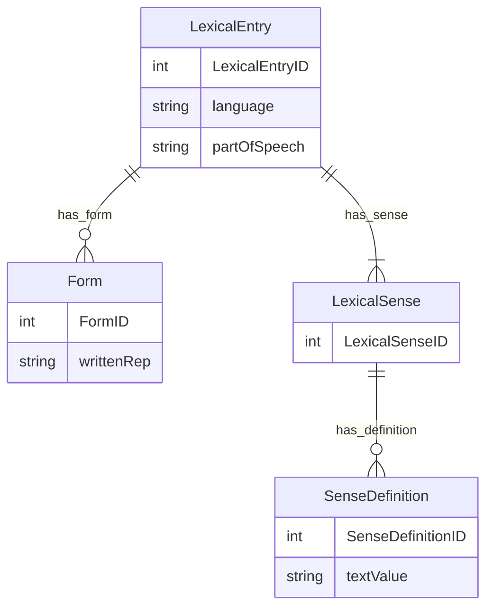

# **Question 1: Linked Data Question**

### (a)  

```turtle
@prefix bn: <http://babelnet.org/rdf/> .
@prefix lemon: <http://www.lemon-model.net/lemon#> .
@prefix lexinfo: <http://www.lexinfo.net/ontology/2.0/lexinfo#> .

bn:post_n_EN a lemon:LexicalEntry ;
    lemon:canonicalForm <http://babelnet.org/rdf/post_n_EN/canonicalForm> ;
    lemon:language "EN" ;
    lexinfo:partOfSpeech lexinfo:noun .
```

**(i) What is the generic data model?**  
**Answer (1 mark):**  
This is **RDF** (Resource Description Framework).

**(ii) What is the serialization format?**  
**Answer (1 mark):**  
It’s in **Turtle** format (Terse RDF Triple Language), evidenced by the `@prefix` notation and the `;`/`.` structure.

---

### (b)  

> *Friend 1 claims it’s impossible to know the actual word or part of speech without more triples; Friend 2 claims it’s obviously the English noun “post.”*

**Answer (4 marks):**

1. **Why it might be “impossible to know”**  
   - The snippet alone only shows `bn:post_n_EN` is a `lemon:LexicalEntry` with language `"EN"` and part‐of‐speech `noun`. The **actual written representation** (“post”) is hidden behind `<…/canonicalForm>` and not yet shown directly.

2. **Why it “might be the English word ‘post’”**  
   - If you follow the linked resource `<.../canonicalForm>` and see `lemon:writtenRep "post"`, you confirm the word is “post.” So if Friend 2 has that extra triple, they’re correct.

3. **Conclusion and further info**  
   - Both friends have a point. By RDF alone, you need to dereference the `canonicalForm` node to see `writtenRep "post"`. Additional data clarifies that this is indeed the English noun “post.”

---

### (c)  

When you request `<http://babelnet.org/rdf/post_n_EN/canonicalForm>`, it returns `lemon:writtenRep "post"`.  

**(i)** **SPARQL**: *Find the written representation and language for all nouns.*  
**Answer (6 marks):**

```sparql
PREFIX lemon:   <http://www.lemon-model.net/lemon#>
PREFIX lexinfo: <http://www.lexinfo.net/ontology/2.0/lexinfo#>

SELECT ?writtenRep ?lang
WHERE {
  ?lexEntry a lemon:LexicalEntry ;
            lemon:canonicalForm ?form ;
            lemon:language ?lang ;
            lexinfo:partOfSpeech lexinfo:noun .

  ?form lemon:writtenRep ?writtenRep .
}
```

**(ii)** **SPARQL**: *Find the language and part of speech for words whose canonical form is “post.”*  
**Answer (4 marks):**

```sparql
PREFIX lemon:   <http://www.lemon-model.net/lemon#>
PREFIX lexinfo: <http://www.lexinfo.net/ontology/2.0/lexinfo#>

SELECT ?language ?pos
WHERE {
  ?lexEntry a lemon:LexicalEntry ;
            lemon:canonicalForm ?form ;
            lemon:language ?language ;
            lexinfo:partOfSpeech ?pos .

  ?form lemon:writtenRep "post" .
}
```

---

### (d)  

We have an excerpt from [lemon‐model.net/lemon\#](http://www.lemon-model.net/lemon#) describing classes like `:LexicalSense`, `:SenseDefinition`, and properties like `:definition`, `:value`.

**(i) What is the role of this document?**  
**Answer (1 mark):**  
It’s an **ontology (schema) definition** for the Lemon lexical model, specifying classes and properties for lexical/semantic descriptions.

**(ii) What format is it in?**  
**Answer (1 mark):**  
Likely **RDF** (e.g., Turtle or RDF/XML).

**(iii) To what does the ‘owl’ prefix refer?**  
**Answer (1 mark):**  
The **OWL** (Web Ontology Language) namespace (`http://www.w3.org/2002/07/owl#`) for more expressive ontology constructs.

**(iv)** *Provide one definition for the English noun “post” in RDF.*  
**Answer (4 marks):**  
Example in Turtle:

```turtle
@prefix : <http://example.org/lemonDefs#> .
@prefix lemon: <http://www.lemon-model.net/lemon#> .
@prefix rdf: <http://www.w3.org/1999/02/22-rdf-syntax-ns#> .

:post_n_EN_sense a :LexicalSense ;
    :definition :post_n_EN_def .

:post_n_EN_def a :SenseDefinition ;
    :value "A piece of wood or metal set upright to support something."@en .
```

---

### (e)  

> *Sketch an ER diagram for a relational implementation of this model (Lemon style). Include cardinalities.*

Below is a **Mermaid ER diagram** in code.  It shows how you might map *LexicalEntry*, *Form*, *LexicalSense*, and *SenseDefinition* into a relational schema:



**Explanations**:  
- One **LexicalEntry** can have multiple **Forms** (1:M).  
- One **LexicalEntry** can have multiple **LexicalSenses** (1:M).  
- One **LexicalSense** can have multiple **SenseDefinitions** (1:M).  

---

# **Question 2: ER Question (Real‐Estate Agency)**

An estate agency selling residential houses and flats is building a database to track its business. The ER diagram shows the main elements:

1. **Seller** (Name, Address, Phone Number)  
2. **Estate Agent** (Name)  
3. **Property** (Address, #bedrooms, Type, Asking price)  
4. **Buyer** (Name, Address, Phone number)  
5. **Offers** (Offer date, Offer status, Offer value)  
6. **Views** (Date)

The relationships in the diagram:
- A Seller **owns** Property.
- An Estate Agent **sells** Property.
- A Property **has** Offers and is also **viewed** by Buyers.
- An Offer has (Offer date, status, value) and is associated with one Buyer and one Property.
- A View has (Date) and associates a Buyer with a Property.

### (a) Add cardinality indications for this diagram  
**(3 marks)**

From the attached ER diagram, we can interpret the following cardinalities:

1. **Seller–Property**: One seller can own **many** properties, but each property is owned by **exactly one** seller.  
   - **(1 : M)**
2. **Estate Agent–Property**: One estate agent is responsible for **many** properties, but each property is handled by **exactly one** agent.  
   - **(1 : M)**
3. **Property–Offers**: One property can receive **many** offers, but each offer refers to exactly one property.  
   - **(1 : M)**
4. **Property–Views**: One property can have **many** viewings, and a viewing is for exactly one property (in the diagram, the “Views” diamond connects property and buyer).  
   - **(1 : M)**
5. **Buyer–Offers**: One buyer can make **many** offers, and each offer is from exactly one buyer.  
   - **(1 : M)**
6. **Buyer–Views**: One buyer can have **many** viewings, and each viewing is for exactly one buyer.  
   - **(1 : M)**  

*(If the diagram allowed multiple buyers to attend one viewing, that would be a many‐to‐many. But as drawn—one “Views” diamond connecting one buyer and one property—this is effectively 1 : M from each side. In practice, you might interpret it differently, but we will stick to the diagram.)*

---

### (b) How would you adapt this to a relational model?  
**(5 marks)**

Following the diagram **as is**, **without extra ID attributes**, we can use the attributes from the boxes and ovals as columns. Below is one possible mapping:

1. **Seller**  
   - **Primary key (PK)**: SellerName *(since the diagram does not show a separate ID)*  
   - Other columns: Address, PhoneNumber

2. **EstateAgent**  
   - **PK**: AgentName  
   - *(No other attributes shown except “Name” in the diagram.)*

3. **Property**  
   - **PK**: Address *(the diagram shows an Address for the property; we assume it uniquely identifies it)*  
   - #bedrooms, Type, AskingPrice  
   - **Foreign Keys**:
     - SellerName → references **Seller**(Name)  
     - AgentName → references **EstateAgent**(Name)

4. **Buyer**  
   - **PK**: BuyerName  
   - Other columns: Address, PhoneNumber

5. **Offers**  
   - The diagram shows OfferDate, OfferStatus, OfferValue  
   - **Composite PK**: (PropertyAddress, BuyerName, OfferDate) or a suitable combination  
   - **FK**: PropertyAddress → references **Property**(Address)  
   - **FK**: BuyerName → references **Buyer**(Name)

6. **Views**  
   - The diagram shows a date for the viewing  
   - **Composite PK**: (PropertyAddress, BuyerName, ViewDate) or similarly chosen  
   - **FK**: PropertyAddress → references **Property**(Address)  
   - **FK**: BuyerName → references **Buyer**(Name)

In **real‐world** practice, we often introduce synthetic `PropertyID`, `SellerID`, etc. to avoid using addresses or names as PKs. But since your diagram has no explicit ID attributes, we stay as close as possible to it.

---

### (c) List the tables, primary keys, and foreign keys  
**(6 marks)**

Below is a concise list reflecting the diagram’s attributes:

1. **Seller**  
   - **Columns**: Name *(PK)*, Address, PhoneNumber  

2. **EstateAgent**  
   - **Columns**: Name *(PK)*  

3. **Property**  
   - **Columns**: Address *(PK)*, Type, Bedrooms, AskingPrice  
   - **Foreign Keys**:
     - SellerName → **Seller**(Name)  
     - AgentName → **EstateAgent**(Name)

4. **Buyer**  
   - **Columns**: Name *(PK)*, Address, PhoneNumber

5. **Offers**  
   - **Columns**: OfferDate, OfferStatus, OfferValue, PropertyAddress, BuyerName  
   - **Composite PK**: (PropertyAddress, BuyerName, OfferDate) (or similar)  
   - **FKs**:
     - PropertyAddress → **Property**(Address)  
     - BuyerName → **Buyer**(Name)

6. **Views**  
   - **Columns**: ViewDate, PropertyAddress, BuyerName  
   - **Composite PK**: (PropertyAddress, BuyerName, ViewDate)  
   - **FKs**:
     - PropertyAddress → **Property**(Address)  
     - BuyerName → **Buyer**(Name)

---

### (d) Give the MySQL command for creating one of those tables  
**(3 marks)**

As an example, let’s create the **`Property`** table using the columns from the diagram (and references to Seller and Agent):

```sql
CREATE TABLE Property (
  Address       VARCHAR(100) NOT NULL,
  Type          VARCHAR(50),
  Bedrooms      INT,
  AskingPrice   DECIMAL(12, 2),
  SellerName    VARCHAR(100) NOT NULL,
  AgentName     VARCHAR(100) NOT NULL,
  PRIMARY KEY (Address),

  FOREIGN KEY (SellerName)
      REFERENCES Seller(Name),

  FOREIGN KEY (AgentName)
      REFERENCES EstateAgent(Name)
);
```

*(We assume 100 characters is enough for an address or name. Adjust as needed.)*

---

### (e) Agents are paid a commission on property where the offer gets to ‘sale completed.’ The commission is 1% of **the sale price**.

#### (i) Write a MySQL query to calculate and list the commission earned **since 1 January 2023** for each Estate Agent.  
**(6 marks)**

We assume the final accepted offer is indicated by `OfferStatus = 'sale completed'` and that the actual final sale price is in `OfferValue`.  Also assume `OfferDate` is the date the sale completed:

```sql
SELECT 
    p.AgentName AS EstateAgent,
    SUM(o.OfferValue * 0.01) AS TotalCommission
FROM Property p
JOIN Offers o
    ON p.Address = o.PropertyAddress
WHERE o.OfferStatus = 'sale completed'
  AND o.OfferDate >= '2023-01-01'
GROUP BY p.AgentName;
```

- Multiplies each completed offer’s `OfferValue` by 0.01 (1%)  
- Sums them per agent.

#### (ii) Modify your query to list **just the top‐earning agent**  
**(2 marks)**

```sql
SELECT 
    p.AgentName AS EstateAgent,
    SUM(o.OfferValue * 0.01) AS TotalCommission
FROM Property p
JOIN Offers o
    ON p.Address = o.PropertyAddress
WHERE o.OfferStatus = 'sale completed'
  AND o.OfferDate >= '2023-01-01'
GROUP BY p.AgentName
ORDER BY TotalCommission DESC
LIMIT 1;
```

---

### (f) The IT specialist is considering a document database  
**(5 marks)**

We focus on **real‐estate–specific** reasons:

- **Potential advantages** of a document DB (e.g., MongoDB):
  1. Storing variable or unstructured property details (photos, custom fields, long textual descriptions) is more flexible.  
  2. If there is heavy reading of large unstructured property listings, a NoSQL solution can scale horizontally.

- **Potential disadvantages**:
  1. The data is actually quite relational (Seller, Agent, Buyer, Offers).  SQL queries for commissions or statuses are simpler in a relational schema.  
  2. Ensuring transaction consistency (e.g., an offer changes from “made” to “sale completed”) is more straightforward in a relational DB.  
  3. You might end up duplicating structured data across documents, raising consistency issues.

Thus, for **highly relational** scenarios—offers, statuses, commission calculations—a relational DB is typically more suitable. Document DBs might be beneficial if you have highly variable or semi‐structured listing data.

---

# **Question 3: IR/doc db Question**

### (a) If 2,200,000 books are labeled German at 80% precision, how many are truly German?  
**Answer (2 marks):**  
True positives = 2,200,000 × 0.80 = **1,760,000**.

---

### (b) How many German books in total (including those missed) if recall is 88%?  
**Answer (3 marks):**

\[
\text{All German} = \frac{\text{True Positives}}{\text{Recall}}
                  = \frac{1,760,000}{0.88}
                  \approx 2,000,000.
\]

---

### (c) Danish classifier: 100% precision, 76% recall. Why more useful for ML training than German’s 80% precision?  
**Answer (5 marks):**  
- **Training sets** value extremely high precision, because you don’t want noisy examples (false positives).  
- 76% recall means some Danish books are missed, but *every* labeled Danish book is *actually* Danish. That yields a **pure** dataset for ML training, often better than a bigger but contaminated set.

---

### (d) F1 measure (German & Danish). What is F1?  
**Answer (2 marks):**  
F1 = Harmonic mean of precision and recall:
\[
F1 = 2 \times \frac{\text{Precision} \times \text{Recall}}{\text{Precision} + \text{Recall}}.
\]

---

### (e) `db.books.find({ lang: "German" })`  
**(1 mark)**  
This **queries all documents** in the `books` collection with `lang` = `"German"`.

---

### (f) Rewrite to get only 19th‐century volumes  
**Answer (5 marks):**

```js
db.books.find({
  lang: "German",
  year: { $gte: 1800, $lt: 1900 }
})
```
- Finds volumes from 1800 to 1899.

---

### (g) Single textual field called “text”; filter for “Strudel”  
**(2 marks)**

```js
db.books.find({
  lang: "German",
  year: { $gte: 1800, $lt: 1900 },
  text: /Strudel/
})
```
- Uses a regex to match documents whose `text` field contains “Strudel.”

---

### (h) TEI/XML vs. enriching a document DB  
**Answer (10 marks):**  
1. **Structured encoding:** TEI is superb for detailed textual markup (chapters, footnotes, critical apparatus). A JSON store is more flexible but less specialized for hierarchical text.  
2. **Query complexity:** XML DB + XQuery can handle fine‐grained queries by XML elements. MongoDB supports simpler doc queries, possibly less powerful for nested text structures.  
3. **Standards & Interoperability:** TEI is widely used in digital humanities, enabling data sharing with other TEI projects.  
4. **Performance & scale:** Large TEI corpora can be stored in specialized XML databases, but a NoSQL doc DB might scale horizontally.  
5. **Long‐term preservation:** TEI is a recognized standard for scholarly text encoding, often important for academic or library contexts.

The choice depends on how much *structural*, *semantic*, and *scholarly* detail you want to preserve vs. the need for flexible indexing or large‐scale doc management.

