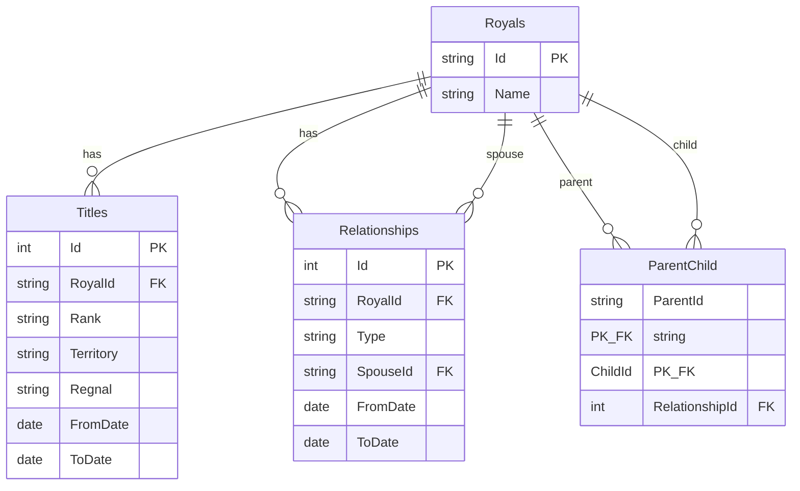
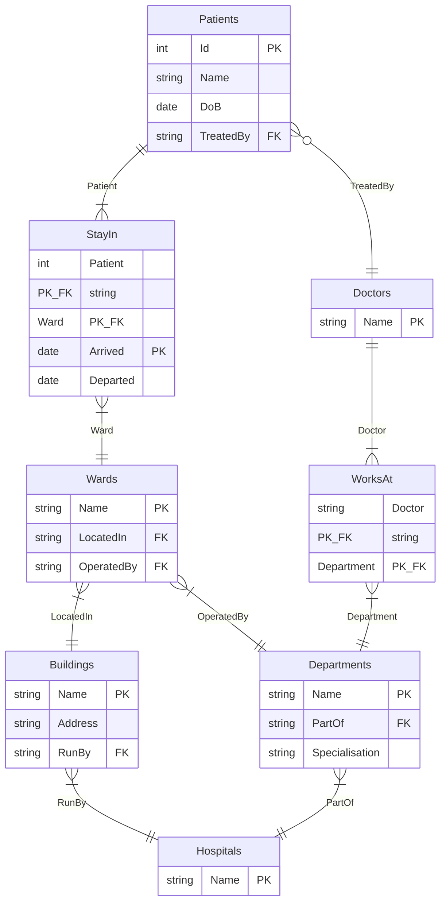

# Solution Sheet - March 2022 (Updated)

## Exam Overview

| Section | Questions | Marks |
|---------|-----------|-------|
| Section A | 10 MCQs (on VLE) | 40 |
| Section B | Answer 2 of 3 | 60 |
| **Total** | | **100** |

**Note:** Section A MCQs are completed separately on the VLE. This solution sheet covers Section B questions.

---

# Section A: Multiple Choice Questions [40 marks]

Section A consists of 10 MCQs taken separately on the VLE. See the VLE for MCQ questions and answers.

---

# Section B

---

# Question 2: XML Family Tree (English Monarchy) [30 marks]

## Sample XML Data

```xml
<royal name="Henry" xml:id="HenryVII">
  <title rank="king" territory="England" regnal="VII"
         from="1485-08-22" to="1509-04-21" />
  <relationship type="marriage" spouse="#ElizabethOfYork">
    <children>
      <royal name="Arthur" xml:id="ArthurTudor"/>
      <royal name="Henry" xml:id="HenryVIII">
        <title rank="king" territory="England" regnal="VIII"
               from="1509-04-22" to="1547-01-28" />
        <relationship type="marriage" spouse="#CatherineOfAragon"
                      from="1509-06-11" to="1533-05-23">
          <children>
            <royal name="Mary">
              <title rank="queen" territory="England" regnal="I"
                     from="1553-07-19" to="1558-11-17" />
              <relationship type="marriage" spouse="#PhilipOfSpain"
                            from="1554-07-25"/>
            </royal>
          </children>
        </relationship>
        <!-- More relationships... -->
      </royal>
    </children>
  </relationship>
</royal>
```

---

## Question 2(a) [2 marks]

**Question:** Give two examples of element names and two examples of attribute names from this code.

---

### Answer

**Element Names:**
1. `<royal>`
2. `<title>`

**Attribute Names:**
1. `rank`
2. `territory`

---

### Revision Notes

**Core Concept:** Understanding the difference between XML elements and attributes.

| Component | Definition | Example |
|-----------|------------|---------|
| **Element** | Container defined by opening/closing tags | `<royal>...</royal>`, `<title/>` |
| **Attribute** | Name-value pair inside an element's start tag | `rank="king"`, `name="Henry"` |

**All Elements in the Sample:**
- `royal`, `title`, `relationship`, `children`

**All Attributes in the Sample:**
- `name`, `xml:id`, `rank`, `territory`, `regnal`, `from`, `to`, `type`, `spouse`

**Key Points:**
- Elements represent **data nodes** in the XML hierarchy
- Attributes store **metadata** or properties about elements
- Self-closing tags like `<title ... />` are still elements

**Common Mistakes:**
- Confusing elements with attributes: `rank` is an attribute (inside a tag), `<title>` is an element
- Including the angle brackets as part of the element name: the element is `royal`, not `<royal>`
- Forgetting that `xml:id` is an attribute despite having a colon (it's in the xml namespace)

---

## Question 2(b) [3 marks]

**Question:** What will be the result of the following XPath query?
```xpath
//title[@rank="king" and @regnal="VIII"]/../royal[@name="Henry"]
```

---

### Answer

**This query returns NOTHING (empty result).**

The query attempts to find a `<royal>` element with `name="Henry"` that is a direct child of the parent of Henry VIII's `<title>` element, but no such element exists.

---

### Revision Notes

**Core Concept:** XPath navigation using parent axis (`..`) and attribute predicates.

**Query Breakdown:**

| Part | Meaning |
|------|---------|
| `//title` | Find any `<title>` element anywhere in the document |
| `[@rank="king" and @regnal="VIII"]` | Filter: must have both attributes with these values |
| `/..` | Navigate UP to the parent element |
| `/royal[@name="Henry"]` | Find **direct child** `<royal>` with `name="Henry"` |

**Step-by-Step Evaluation:**
1. Find `<title rank="king" ... regnal="VIII">` → This is Henry VIII's title
2. Go to parent (`/..`) → `<royal name="Henry" xml:id="HenryVIII">`
3. From that parent, find a direct child `<royal>` with `name="Henry"`
4. **Result: Empty** — Henry VIII's `<royal>` element has NO direct child `<royal name="Henry">`

**Why It Returns Nothing:**

The parent of the `<title>` IS `<royal name="Henry" xml:id="HenryVIII">` itself. We're then looking for a **child** element `<royal name="Henry">` inside it. Henry VIII's children (Mary, Elizabeth, Edward) are nested inside `<relationship><children>` elements, and none are named "Henry":

```
<royal name="Henry" xml:id="HenryVIII">    ← parent of title
  <title rank="king" regnal="VIII"/>       ← the title we found
  <relationship>
    <children>
      <royal name="Mary">...</royal>       ← NOT name="Henry"
      <royal name="Elizabeth">...</royal>  ← NOT name="Henry"
      <royal name="Edward">...</royal>     ← NOT name="Henry"
    </children>
  </relationship>
</royal>
```

**Common Mistake:** Confusing `/royal` (direct child) with `//royal` (any descendant). If the query used `//royal[@name="Henry"]` instead, it would return all descendant `<royal>` elements named Henry.

**XPath Axes Reference:**

| Axis | Meaning |
|------|---------|
| `/` | Child |
| `//` | Descendant (any depth) |
| `..` | Parent |
| `.` | Current node |
| `@` | Attribute |

---

## Question 2(c) [3 marks]

**Question:** What (in general terms) will be returned by the following XPath query?
```xpath
//title[@rank="king" or @rank="queen"]/../relationship/children/royal/relationship/children/royal/
```

---

### Answer

This query returns all `<royal>` elements that are **grandchildren** (through relationships) of any king or queen. It navigates two relationship levels deep from monarchs (children's children = grandchildren).

---

### Revision Notes

**Core Concept:** Deep XPath navigation through multiple hierarchical levels.

**Query Breakdown:**

| Part | What it selects |
|------|-----------------|
| `//title[@rank="king" or @rank="queen"]` | Titles of any monarch (king OR queen) |
| `/..` | Parent `<royal>` (the monarch themselves) |
| `/relationship/children/royal` | Monarch's children (first generation) |
| `/relationship/children/royal` | Children's children = grandchildren (second generation) |

**Logical OR in XPath:**
- `[@rank="king" or @rank="queen"]` matches EITHER condition
- Equivalent to: "any title where rank is king or queen"

**Real-World Meaning:**
- Starting from any king/queen
- Navigate to their children via `relationship/children/royal`
- Then to their grandchildren via another `relationship/children/royal`
- Returns those grandchildren `<royal>` elements

**Common Mistakes:**
- Forgetting `/..` returns the parent, not the element itself
- Confusing "grandchildren" vs "great-grandchildren" (count the relationship levels!)
- Not realizing `[@rank="king" or @rank="queen"]` applies to `<title>`, not to `<royal>`
- Using `//` when you mean `/` — `//` skips intermediate levels

---

## Question 2(d) [4 marks]

**Question:** Mary I of England was also queen consort of Spain from 16 January 1556 until her death. Give an XML fragment that would record this information and say where you would add it.

---

### Answer

**XML Fragment:**
```xml
<title rank="queen" territory="Spain" regnal="consort"
       from="1556-01-16" to="1558-11-17"/>
```

**Location:** Add this inside Mary's existing `<relationship type="marriage" spouse="#PhilipOfSpain">` element, or directly inside the `<royal name="Mary">` element as an additional title.

**Complete Context:**
```xml
<royal name="Mary">
  <title rank="queen" territory="England" regnal="I"
         from="1553-07-19" to="1558-11-17" />
  <title rank="queen" territory="Spain" regnal="consort"
         from="1556-01-16" to="1558-11-17"/>
  <relationship type="marriage" spouse="#PhilipOfSpain"
                from="1554-07-25"/>
</royal>
```

---

### Revision Notes

**Core Concept:** Extending XML data while maintaining structural consistency.

**Design Decisions:**

| Aspect | Reasoning |
|--------|-----------|
| `rank="queen"` | She was a queen (consort) |
| `territory="Spain"` | Distinguishes from her English title |
| `regnal="consort"` | She was queen by marriage, not ruling |
| `from/to` dates | Standard pattern used elsewhere in document |

**Key Points:**
- Follow existing patterns in the document
- Place new data in the **logical** location in the hierarchy
- Mary's death date (1558-11-17) serves as the `to` date

**Common Mistakes:**
- Not following existing attribute patterns (e.g., using `queen-consort` instead of `regnal="consort"`)
- Using a different date format than what's in the document (`ISO 8601: YYYY-MM-DD`)
- Placing the element in the wrong location in the hierarchy
- Forgetting required attributes that appear on other `<title>` elements

---

## Question 2(e) [7 marks]

**Question:** The historian argues with colleagues about the strengths and weaknesses of this approach, using XML, and this model in particular. What are the strengths and weaknesses?

---

### Answer

**Strengths:**

| Strength | Explanation |
|----------|-------------|
| **Natural hierarchy** | XML's tree structure mirrors family tree relationships |
| **Self-describing** | Tags like `<royal>`, `<relationship>`, `<children>` are intuitive |
| **Flexibility** | Easy to add new attributes or elements for additional information |
| **Human readable** | Can be read and edited without special tools |
| **Standard format** | Wide tool support for parsing, validation, transformation |

**Weaknesses:**

| Weakness | Explanation |
|----------|-------------|
| **Verbosity** | Repeated tags and attributes create large files |
| **Complex queries** | Deep nesting makes XPath queries cumbersome |
| **Redundancy** | Same person may appear multiple times (as child and parent) |
| **Limited cross-references** | Hard to link across different branches (graph-like relationships) |
| **Scalability** | Large genealogies become unwieldy |

---

### Revision Notes

**Core Concept:** Evaluating data models requires understanding the trade-offs.

**The Fundamental Issue:**
Genealogical data is inherently **graph-like**, not tree-like:
- A person has TWO parents (from different branches)
- Marriages connect different family trees
- The same person appears in multiple contexts

**XML's Tree Model Limitation:**
```
         Henry VII
            |
    +-------+-------+
    |               |
 Arthur         Henry VIII
                    |
            +-------+-------+
            |       |       |
          Mary  Elizabeth  Edward
```
But: Mary's marriage to Philip connects to the SPANISH royal tree!

**ID/IDREF Solution:**
XML provides `xml:id` and references (`#HenryVIII`) to create cross-links, but:
- Not enforced by basic XML parsers
- Harder to query than true graph relationships

---

## Question 2(f) [1 mark]

**Question:** One colleague suggests that the data is really a graph not a tree, so should be represented as Linked Data using RDF. The other thinks it can be modelled as a set of relations and so should be transformed into a relational database. Who is correct?

---

### Answer

**Both are correct** - the choice depends on requirements:

- **RDF/Linked Data** is ideal for graph-like data with many-to-many relationships typical in genealogies
- **Relational database** works if data can be structured into tables with well-defined relationships

---

### Revision Notes

**Core Concept:** Different data models suit different use cases.

| Approach | Best For |
|----------|----------|
| **RDF** | Flexible cross-references, linking to external data (Wikidata), semantic reasoning |
| **Relational** | Structured queries, ACID transactions, well-defined schema, reporting |

**The Real Answer:**
Genealogical data IS graph-like, so RDF captures this naturally. But relational databases can also model graphs using:
- Junction tables for many-to-many
- Self-referential foreign keys
- Recursive queries (CTEs)

---

## Question 2(g) [10 marks]

**Question:** Choosing one of the two suggested approaches (relational database or RDF), explain (with examples) how it might solve the strengths and weaknesses you listed in (e) above.

---

### Answer (Relational Database Approach)

**How Relational Addresses XML Weaknesses:**

| XML Weakness | Relational Solution |
|--------------|---------------------|
| **Verbosity** | Normalized tables eliminate redundancy |
| **Complex queries** | SQL JOINs are often simpler than deep XPath |
| **Redundancy** | Each person stored once, referenced by ID |
| **Cross-references** | Foreign keys naturally link entities |
| **Scalability** | Databases optimized for large datasets |

**Example Schema:**

```sql
CREATE TABLE Royals (
    Id VARCHAR(50) PRIMARY KEY,
    Name VARCHAR(100) NOT NULL
);

CREATE TABLE Titles (
    Id INT AUTO_INCREMENT PRIMARY KEY,
    RoyalId VARCHAR(50) NOT NULL,
    Rank VARCHAR(20),
    Territory VARCHAR(50),
    Regnal VARCHAR(10),
    FromDate DATE,
    ToDate DATE,
    FOREIGN KEY (RoyalId) REFERENCES Royals(Id)
);

CREATE TABLE Relationships (
    Id INT AUTO_INCREMENT PRIMARY KEY,
    RoyalId VARCHAR(50) NOT NULL,
    Type VARCHAR(20),
    SpouseId VARCHAR(50),
    FromDate DATE,
    ToDate DATE,
    FOREIGN KEY (RoyalId) REFERENCES Royals(Id),
    FOREIGN KEY (SpouseId) REFERENCES Royals(Id)
);

CREATE TABLE ParentChild (
    ParentId VARCHAR(50),
    ChildId VARCHAR(50),
    RelationshipId INT,
    PRIMARY KEY (ParentId, ChildId),
    FOREIGN KEY (ParentId) REFERENCES Royals(Id),
    FOREIGN KEY (ChildId) REFERENCES Royals(Id)
);
```

**E/R Diagram:**



**Example Query - Find all monarchs:**
```sql
SELECT R.Name, T.Rank, T.Territory, T.Regnal
FROM Royals R
INNER JOIN Titles T ON R.Id = T.RoyalId
WHERE T.Rank IN ('king', 'queen');
```

---

### Alternative Answer (RDF/Linked Data Approach)

**How RDF Addresses XML Weaknesses:**

| XML Weakness | RDF Solution |
|--------------|--------------|
| **Verbosity** | Triples are concise; prefixes reduce repetition |
| **Complex queries** | SPARQL handles graph traversal naturally |
| **Redundancy** | Each entity has one URI, referenced everywhere |
| **Cross-references** | URIs link across datasets (to Wikidata, etc.) |
| **Scalability** | Triple stores optimized for graph queries |

**Example RDF (Turtle):**

```turtle
@prefix royal: <http://example.org/royals#> .
@prefix schema: <http://schema.org/> .
@prefix xsd: <http://www.w3.org/2001/XMLSchema#> .

royal:HenryVIII a royal:Royal ;
    schema:name "Henry" ;
    royal:hasTitle royal:HenryVIII_Title ;
    royal:hasChild royal:Mary, royal:Elizabeth, royal:Edward .

royal:HenryVIII_Title a royal:Title ;
    royal:rank "king" ;
    royal:territory "England" ;
    royal:regnal "VIII" ;
    royal:from "1509-04-22"^^xsd:date ;
    royal:to "1547-01-28"^^xsd:date .

royal:Mary a royal:Royal ;
    schema:name "Mary" ;
    royal:hasParent royal:HenryVIII ;
    royal:spouse royal:PhilipOfSpain .
```

**Example SPARQL Query:**
```sparql
SELECT ?name ?territory
WHERE {
  ?person a royal:Royal ;
          schema:name ?name ;
          royal:hasTitle ?title .
  ?title royal:rank "king" ;
         royal:territory ?territory .
}
```

---

# Question 3: Wikidata SPARQL [30 marks]

## Reference: Wikidata URIs

| URI | Meaning |
|-----|---------|
| `wdt:P19` | place of birth |
| `wdt:P31` | instance of (like rdf:type) |
| `wdt:P131` | located in administrative territorial entity |
| `wdt:P734` | family name |
| `wdt:P735` | given name |
| `wd:Q5` | human |
| `wd:Q60` | New York City |

---

## Question 3(a) [2 marks]

**Question:** What will the following query return?
```sparql
SELECT DISTINCT ?person
WHERE {
  ?person wdt:P31 wd:Q5;
          wdt:P19 wd:Q60.
}
```

---

### Answer

This query returns all distinct entities (`?person`) that are:
1. **Instance of human** (`wdt:P31 wd:Q5`)
2. **Born in New York City** (`wdt:P19 wd:Q60`)

In other words: **all humans born in New York City**.

---

### Revision Notes

**Core Concept:** SPARQL pattern matching with Wikidata properties.

**Query Breakdown:**

| Pattern | Meaning |
|---------|---------|
| `?person wdt:P31 wd:Q5` | ?person is instance of human |
| `?person wdt:P19 wd:Q60` | ?person's place of birth is NYC |
| `;` | Same subject, different predicate |
| `DISTINCT` | No duplicate results |

**Turtle Syntax Refresher:**
- `;` continues with same subject
- `,` continues with same subject AND predicate
- `.` ends the statement

**Common Mistakes:**
- Confusing `;` with `.` — semicolon continues with same subject, period ends the statement
- Forgetting `DISTINCT` when duplicates are possible
- Misreading Wikidata property codes (P19 = birthplace, P31 = instance of)
- Using SQL syntax in SPARQL (`SELECT * FROM` instead of `SELECT ?var WHERE`)

---

## Question 3(b) [2 marks]

**Question:** What assumptions does this query make? What data must be present for it to work?

---

### Answer

**Assumptions:**

1. Each person has `wdt:P31 wd:Q5` explicitly stating they are human
2. Each person has `wdt:P19` (place of birth) defined
3. The place of birth is **exactly** `wd:Q60` (New York City), not a sub-location

**Data Requirements:**

- The `P31` (instance of) property must be set to `Q5` (human)
- The `P19` (place of birth) must be set to exactly `Q60`
- People born in boroughs like "Queens" or "Manhattan" won't match if those aren't identified as Q60

---

### Revision Notes

**Core Concept:** SPARQL queries only find explicitly stated facts.

**The Open World Assumption:**
- Just because something isn't in the data doesn't mean it's false
- Missing data = unknown, not "no"

**Coverage Issues:**

| Scenario | Will It Match? |
|----------|----------------|
| Person with `P19 = Q60` | ✓ Yes |
| Person with `P19 = "Queens"` (Q18424) | ✗ No (Queens ≠ NYC exactly) |
| Person with no `P19` at all | ✗ No |
| Person without `P31 Q5` | ✗ No |

---

## Question 3(c) [4 marks]

**Question:** How does the following query differ? Does it resolve any of the assumptions you listed in (b) above?
```sparql
SELECT DISTINCT ?person
WHERE {
  ?person wdt:P31 wd:Q5;
          wdt:P19/wdt:P131* wd:Q60.
}
```

---

### Answer

**Difference:** Uses a **property path** `wdt:P19/wdt:P131*` instead of just `wdt:P19`.

**What it means:**
- `wdt:P19` = place of birth
- `/wdt:P131*` = zero or more steps up the administrative hierarchy

**Resolution:**
- ✓ **Resolves** the assumption that birthplace must be exactly NYC
- ✗ **Does not resolve** the assumption about P31 or P19 being present

**Example:** A person born in "Queens" (Q18424) would now match because:
```
Queens (Q18424) --P131--> New York City (Q60)
```

---

### Revision Notes

**Core Concept:** SPARQL property paths enable graph traversal.

**Property Path Syntax:**

| Syntax | Meaning |
|--------|---------|
| `p1/p2` | p1 followed by p2 |
| `p*` | Zero or more of p |
| `p+` | One or more of p |
| `p?` | Zero or one of p |
| `p1\|p2` | p1 or p2 |

**Why P131*?**
- `P131` = "located in administrative territorial entity"
- Queens → New York City → New York State → USA
- `P131*` follows this chain any number of steps

**Visual Example:**
```
Person --P19--> Manhattan --P131--> NYC --P131--> NY State
                           ↑
                      Query finds this!
```

**Common Mistakes:**
- Confusing `*` (zero or more) with `+` (one or more) — `P131*` includes the start node, `P131+` doesn't
- Forgetting `/` between properties: `wdt:P19/wdt:P131*` not `wdt:P19 wdt:P131*`
- Not understanding that `*` allows zero steps (birthplace = NYC directly matches)
- Thinking property paths work backwards — they always follow the direction of the predicate

---

## Question 3(d) [1 mark]

**Question:** The results of these queries are not particularly human readable. Why not?

---

### Answer

The results return **entity URIs** (like `http://www.wikidata.org/entity/Q12345`) rather than human-readable **labels** (like "John Smith").

Without explicitly requesting labels, SPARQL returns only the identifiers.

---

### Revision Notes

**Core Concept:** RDF stores identifiers; labels must be explicitly fetched.

**What You Get vs What You Want:**

| Query Returns | You Want |
|---------------|----------|
| `wd:Q76` | Barack Obama |
| `wd:Q36970` | Taylor Swift |
| `wd:Q5582` | Vincent van Gogh |

**Why URIs?**
- URIs are unique identifiers
- Labels can be ambiguous ("John Smith" could be many people)
- Labels exist in multiple languages

---

## Question 3(e) [5 marks]

**Question:** How would you rewrite the query given in (c) to return something more readable?

---

### Answer

**Method 1: Using rdfs:label with FILTER**
```sparql
SELECT DISTINCT ?person ?personLabel
WHERE {
  ?person wdt:P31 wd:Q5;
          wdt:P19/wdt:P131* wd:Q60.
  ?person rdfs:label ?personLabel .
  FILTER (lang(?personLabel) = "en")
}
```

**Method 2: Using Wikidata's Label Service**
```sparql
SELECT DISTINCT ?person ?personLabel
WHERE {
  ?person wdt:P31 wd:Q5;
          wdt:P19/wdt:P131* wd:Q60.
  SERVICE wikibase:label { bd:serviceParam wikibase:language "en". }
}
```

---

### Revision Notes

**Core Concept:** Retrieving human-readable labels in SPARQL.

**Comparison:**

| Method | Pros | Cons |
|--------|------|------|
| `rdfs:label` + FILTER | Standard SPARQL | Verbose, may miss some labels |
| `SERVICE wikibase:label` | Automatic, handles fallbacks | Wikidata-specific |

**How the Label Service Works:**
- Any variable `?foo` automatically gets `?fooLabel`
- Falls back through language preferences
- Handles entities without labels gracefully

**Language Filtering:**
```sparql
SERVICE wikibase:label { bd:serviceParam wikibase:language "en,fr,de". }
```
This tries English first, then French, then German.

**Common Mistakes:**
- Forgetting to add `?personLabel` to the SELECT clause
- With Method 1: forgetting the `lang()` FILTER (returns labels in all languages)
- With Method 2: forgetting the period `.` after the SERVICE block
- Expecting labels to appear automatically without either method

---

## Question 3(f) [6 marks]

**Question:** Compare the IMDB approach and the Wikidata approach for searching actors by place of birth.

---

### Answer

| Aspect | IMDB | Wikidata |
|--------|------|----------|
| **Access** | Web interface only; search not in API | Open SPARQL endpoint |
| **Flexibility** | Fixed search parameters | Arbitrary complex queries |
| **Data scope** | Movies/TV only | All knowledge domains |
| **Data depth** | Detailed film credits, ratings | Basic biographical facts |
| **Programmatic access** | Limited/restricted | Fully open |
| **Data quality** | Curated, professional | Community-contributed, variable |

**Key Differences:**

1. **Openness:** Wikidata provides a free, open SPARQL endpoint. IMDB's search is not exposed in their API.

2. **Query Power:** Wikidata allows complex queries (birth place hierarchies, combinations of criteria). IMDB offers fixed search forms.

3. **Integration:** Wikidata links to other datasets. IMDB is a closed silo.

4. **Specialization:** IMDB has richer movie-specific data. Wikidata is broader but shallower.

---

### Revision Notes

**Core Concept:** Trade-offs between specialized databases and general knowledge graphs.

**IMDB Strengths:**
- Complete filmographies
- Box office data
- User ratings and reviews
- Professional curation

**Wikidata Strengths:**
- Open data (CC0 license)
- Linked to other knowledge bases
- SPARQL for arbitrary queries
- Community-maintained

---

## Question 3(g) [4 marks]

**Question:** IMDB has a lot of specialised information about movies that may not be available in Wikidata. How might you combine the strengths of Wikidata and IMDB?

---

### Answer

**Integration Strategies:**

1. **Use IMDB IDs stored in Wikidata:**
   - Wikidata stores IMDB IDs as property `P345`
   - Query Wikidata for people, get their IMDB ID, then fetch details from IMDB

2. **Federated approach:**
   - Use Wikidata for biographical queries (birthplace, family)
   - Use IMDB for filmography and ratings
   - Link results by shared identifiers

3. **Data enrichment:**
   - Export Wikidata results
   - Programmatically look up IMDB details
   - Combine into unified dataset

**Example Workflow:**
```sparql
# Get IMDB IDs for actors born in NYC
SELECT ?person ?personLabel ?imdbId
WHERE {
  ?person wdt:P31 wd:Q5;
          wdt:P106 wd:Q33999;  # occupation: actor
          wdt:P19/wdt:P131* wd:Q60;
          wdt:P345 ?imdbId.   # IMDB ID
  SERVICE wikibase:label { bd:serviceParam wikibase:language "en". }
}
```

Then use the IMDB ID to fetch filmography from IMDB.

---

## Question 3(h) [2 marks]

**Question:** How would you represent the information queried in (b) using the relational model? Illustrate your model with a comparable query in SQL.

---

### Answer

**Relational Model (Triple Table Approach):**

```sql
CREATE TABLE Triples (
    Subject VARCHAR(100),
    Predicate VARCHAR(50),
    Object VARCHAR(100),
    PRIMARY KEY (Subject, Predicate, Object)
);
```

**Sample Data:**
| Subject | Predicate | Object |
|---------|-----------|--------|
| Person123 | InstanceOf | Human |
| Person123 | BirthPlace | New_York_City |
| Person456 | InstanceOf | Human |
| Person456 | BirthPlace | Boston |

**Equivalent SQL Query:**
```sql
SELECT DISTINCT T1.Subject AS Person
FROM Triples T1
INNER JOIN Triples T2 ON T1.Subject = T2.Subject
WHERE T1.Predicate = 'InstanceOf'
  AND T1.Object = 'Human'
  AND T2.Predicate = 'BirthPlace'
  AND T2.Object = 'New_York_City';
```

---

### Revision Notes

**Core Concept:** RDF triples can be stored in a relational table.

**The Triple Table Pattern:**
- Subject, Predicate, Object columns (PascalCase)
- Each RDF triple = one row
- Self-joins to combine conditions

**Trade-offs:**

| Aspect | Triple Table | Traditional Tables |
|--------|--------------|-------------------|
| Flexibility | High - any data | Fixed schema |
| Query complexity | Many self-joins | Simpler JOINs |
| Performance | Can be slow | Better with indexes |
| Schema changes | None needed | ALTER TABLE |

**Common Mistakes:**
- Forgetting you need self-joins for multiple conditions on the same subject
- Using a single WHERE clause instead of joining the table to itself
- Not using DISTINCT when the same subject could match multiple ways
- Missing the equivalence mapping (P31 → `instance_of`, P19 → `birth_place`)

---

## Question 3(i) [4 marks]

**Question:** How would you approach the version in (c) in SQL?

---

### Answer

To handle the hierarchical location path (`P131*`), we can use self-joins for a fixed depth, or recursive CTEs for arbitrary depth.

**Option 1: Multiple Self-Joins (Pragmatic Exam Approach)**

This approach works when you know the maximum hierarchy depth (e.g., 2 levels):

```sql
SELECT DISTINCT T1.Subject AS Person
FROM Triples T1
INNER JOIN Triples T2 ON T1.Subject = T2.Subject
LEFT JOIN Triples T3 ON T2.Object = T3.Subject AND T3.Predicate = 'LocatedIn'
LEFT JOIN Triples T4 ON T3.Object = T4.Subject AND T4.Predicate = 'LocatedIn'
WHERE T1.Predicate = 'InstanceOf'
  AND T1.Object = 'Human'
  AND T2.Predicate = 'BirthPlace'
  AND (T2.Object = 'New_York_City'
       OR T3.Object = 'New_York_City'
       OR T4.Object = 'New_York_City');
```

**Option 2: Recursive CTE (Advanced)**

For arbitrary depth hierarchies, use a recursive Common Table Expression:

```sql
WITH RECURSIVE LocationChain AS (
    -- Base case: direct birth place
    SELECT Subject, Object AS Location
    FROM Triples
    WHERE Predicate = 'BirthPlace'

    UNION

    -- Recursive case: follow LocatedIn chain
    SELECT LC.Subject, T.Object
    FROM LocationChain LC
    INNER JOIN Triples T ON LC.Location = T.Subject
    WHERE T.Predicate = 'LocatedIn'
)
SELECT DISTINCT T.Subject AS Person
FROM Triples T
INNER JOIN LocationChain LC ON T.Subject = LC.Subject
WHERE T.Predicate = 'InstanceOf'
  AND T.Object = 'Human'
  AND LC.Location = 'New_York_City';
```

---

### Revision Notes

**Core Concept:** Hierarchical queries require multiple joins or recursion.

**Option 1 (Self-Joins) - Use in Exams:**
- Simple to understand and write
- Works when hierarchy depth is known
- Each additional level = one more LEFT JOIN
- Suitable for exam context where pragmatism matters

**Option 2 (Recursive CTE) - Advanced:**
- Handles arbitrary depth automatically
- More elegant for deep/variable hierarchies
- Not all SQL implementations support it
- More complex syntax

**Recursive CTE Explained:**
1. **Base case:** Start with birth_place values
2. **Recursive case:** Follow `located_in` relationships
3. **Termination:** Stops when no more matches

**Why SPARQL is Better Here:**
- `P131*` handles arbitrary depth automatically
- No need to write complex recursive queries
- Graph databases optimize path traversal

---

# Question 4: Hospital Database [30 marks]

## E/R Diagram from Exam

```
Doctor ──worksAt(m:n)── Department ──partOf(m:1)── Hospital
                                                      │
                                                   runBy(1:m)
                                                      │
Patient ──stayIn(m:1)── Ward ──locatedIn(m:1)── Building
   │         │
  ID      arrived
  DoB     departed
  Name
```

---

## Question 4(a) [3 marks]

**Question:** Which of the following questions could be answered by an implementation of this model?

i. Which building did the patient named Neha Ahuja stay in?
ii. Which hospital was responsible for Neha Ahuja's stay?
iii. In which wards are Orthopedics patients housed?
iv. Which hospitals does the doctor Song Ci work in?
v. What departments does the hospital have that contains a building called 'The Alexander Fleming Building'?
vi. Which doctor treated Neha Ahuja?

---

### Answer

| Question | Answerable? | Reasoning |
|----------|-------------|-----------|
| **(i)** | ✓ Yes | Patient → Ward → Building path exists |
| **(ii)** | ✓ Yes | Patient → Ward → Building → Hospital |
| **(iii)** | △ Partial | Need to link Wards to Departments (add relationship) |
| **(iv)** | ✓ Yes | Doctor → Department → Hospital |
| **(v)** | ✓ Yes | Building → Hospital → Departments |
| **(vi)** | ✗ No | No direct link between Patient and Doctor |

**Summary:** Questions i, ii, iv, v are answerable. Questions iii and vi require model modifications.

---

## Question 4(b) [3 marks]

**Question:** Part of this model cannot be implemented using the relational model. Which part, and how would you resolve it?

---

### Answer

**Two Issues:**

1. **Attributes on Relationship (stayIn):**
   - `arrived` and `departed` are attributes of the relationship, not the entities
   - **Solution:** Create a junction table `stay_in` with these attributes

2. **Many-to-Many Relationship (worksAt):**
   - Doctor to Department is M:N
   - **Solution:** Create a junction table `works_at`

**No new attributes needed** - just restructure into proper junction tables.

---

### Revision Notes

**Core Concept:** E/R to Relational mapping rules.

**Relationship Attribute Problem:**
```
Patient ---stayIn---> Ward
            |
      arrived, departed
```
In E/R, relationships can have attributes. In relational model, this requires a separate table.

**Junction Table Pattern:**
```sql
CREATE TABLE StayIn (
    PatientId INT,
    WardName VARCHAR(100),
    Arrived DATE,
    Departed DATE,
    PRIMARY KEY (PatientId, WardName, Arrived),
    FOREIGN KEY (PatientId) REFERENCES Patients(Id),
    FOREIGN KEY (WardName) REFERENCES Wards(Name)
);
```

**Common Mistakes:**
- Trying to put M:N relationship as a foreign key in one of the entities (impossible!)
- Forgetting relationship attributes — `Arrived`/`Departed` must go somewhere
- Not including all parts of the composite primary key (Patient + Ward + Arrived)
- Confusing 1:M (can use FK) with M:N (requires junction table)

---

## Question 4(c) [10 marks]

**Question:** Adapt the model so that all questions in part (a) and the issue you identified in (b) are resolved. Include cardinality in your diagram.

---

### Answer

**Adapted E/R Diagram (Mermaid):**



**Key Additions:**
1. `StayIn` junction table with `Arrived`, `Departed` attributes
2. `WorksAt` junction table for Doctor-Department M:N
3. `TreatedBy` FK in Patients → Doctors (answers question vi)
4. `OperatedBy` FK in Wards → Departments (answers question iii)

---

## Question 4(d) [5 marks]

**Question:** List the tables and keys for an SQL implementation of your model.

---

### Answer

| Table | Primary Key | Foreign Keys |
|-------|-------------|--------------|
| **Hospitals** | Name | - |
| **Buildings** | Name | RunBy → Hospitals(Name) |
| **Departments** | Name | PartOf → Hospitals(Name) |
| **Wards** | Name | LocatedIn → Buildings(Name), OperatedBy → Departments(Name) |
| **Doctors** | Name | - |
| **Patients** | Id | TreatedBy → Doctors(Name) |
| **StayIn** | (Patient, Ward, Arrived) | Patient → Patients(Id), Ward → Wards(Name) |
| **WorksAt** | (Doctor, Department) | Doctor → Doctors(Name), Department → Departments(Name) |

---

## Question 4(e) [6 marks]

**Question:** For each of the questions in (a), provide an appropriate MySQL query.

---

### Answer

**(i) Which building did patient Neha Ahuja stay in?**
```sql
SELECT DISTINCT W.LocatedIn AS BuildingName
FROM Patients P
INNER JOIN StayIn S ON P.Id = S.Patient
INNER JOIN Wards W ON S.Ward = W.Name
WHERE P.Name = 'Neha Ahuja';
```

**(ii) Which hospital was responsible for Neha Ahuja's stay?**
```sql
SELECT DISTINCT B.RunBy AS HospitalName
FROM Patients P
INNER JOIN StayIn S ON P.Id = S.Patient
INNER JOIN Wards W ON S.Ward = W.Name
INNER JOIN Buildings B ON W.LocatedIn = B.Name
WHERE P.Name = 'Neha Ahuja';
```

**(iii) In which wards are Orthopedics patients housed?**
```sql
SELECT DISTINCT W.Name AS WardName
FROM Wards W
INNER JOIN Departments D ON W.OperatedBy = D.Name
WHERE D.Name = 'Orthopedics';
```

**(iv) Which hospitals does doctor Song Ci work in?**
```sql
SELECT DISTINCT D.PartOf AS HospitalName
FROM Doctors Doc
INNER JOIN WorksAt WA ON Doc.Name = WA.Doctor
INNER JOIN Departments D ON WA.Department = D.Name
WHERE Doc.Name = 'Song Ci';
```

**(v) What departments does the hospital have that contains 'The Alexander Fleming Building'?**
```sql
SELECT D.Name AS DepartmentName
FROM Departments D
INNER JOIN Hospitals H ON D.PartOf = H.Name
INNER JOIN Buildings B ON B.RunBy = H.Name
WHERE B.Name = 'The Alexander Fleming Building';
```

**(vi) Which doctor treated Neha Ahuja?**
```sql
SELECT P.TreatedBy AS DoctorName
FROM Patients P
WHERE P.Name = 'Neha Ahuja';
```

**Common Mistakes:**
- Using implicit joins (comma-separated tables) instead of explicit `INNER JOIN`
- Forgetting `DISTINCT` when a patient might have multiple stays
- Wrong join order — always start from the entity you're filtering on
- Using `=` for string matching when `LIKE` is needed for partial matches
- Missing table aliases when same table appears multiple times

---

## Question 4(f) [3 marks]

**Question:** Would this data structure work better using a tree-based model such as XML? Give reasons for your answer.

---

### Answer

**No**, a tree-based model like XML would NOT work better for this data.

**Reasons:**

| Aspect | Why Relational is Better |
|--------|-------------------------|
| **Many-to-many relationships** | Doctor-Department is M:N; XML trees can't naturally represent this |
| **Cross-references** | Patients link to doctors, wards link to departments - multiple connection points |
| **Query efficiency** | SQL JOINs are more efficient than XPath for these queries |
| **Data integrity** | Foreign keys enforce referential integrity; XML has no native constraint mechanism |
| **Updates** | Updating one doctor's name in SQL is one statement; in XML you'd update multiple locations |

**When XML Might Be Better:**
- Document-centric data (medical records as documents)
- Hierarchical data with single parent-child relationships
- Data interchange formats

**This Hospital Data:**
- Has multiple interlinked entities
- Requires referential integrity
- Needs efficient joins across relationships
- Relational model is clearly the better fit

---

# Quick Reference Summary

## XPath Essentials

```xpath
//element              -- Find anywhere
//element[@attr="val"] -- Filter by attribute
[@attr1 and @attr2]    -- Multiple conditions (AND)
[@attr1 or @attr2]     -- Multiple conditions (OR)
/..                    -- Parent element
```

## SPARQL Essentials

```sparql
SELECT ?var WHERE { ?s ?p ?o }           -- Basic query
?s wdt:P31 wd:Q5 .                       -- Instance of human
wdt:P19/wdt:P131* wd:Q60                 -- Property path with closure
SERVICE wikibase:label { ... }           -- Get human-readable labels
```

## SQL Junction Tables

```sql
-- For M:N relationships
CREATE TABLE Junction (
    Entity1Id INT,
    Entity2Id INT,
    PRIMARY KEY (Entity1Id, Entity2Id),
    FOREIGN KEY (Entity1Id) REFERENCES Entity1(Id),
    FOREIGN KEY (Entity2Id) REFERENCES Entity2(Id)
);

-- For relationships with attributes
CREATE TABLE Relationship (
    Entity1Id INT,
    Entity2Id INT,
    Attribute1 DATE,
    Attribute2 VARCHAR(100),
    PRIMARY KEY (Entity1Id, Entity2Id, Attribute1),
    ...
);
```

---

*End of Solution Sheet - March 2022*
