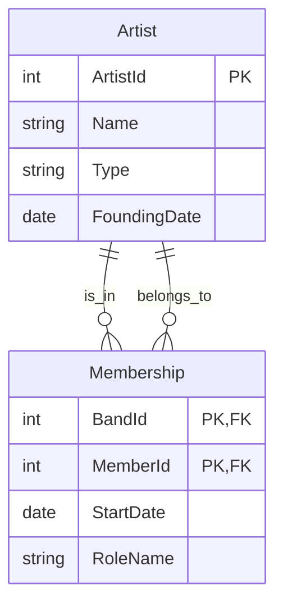
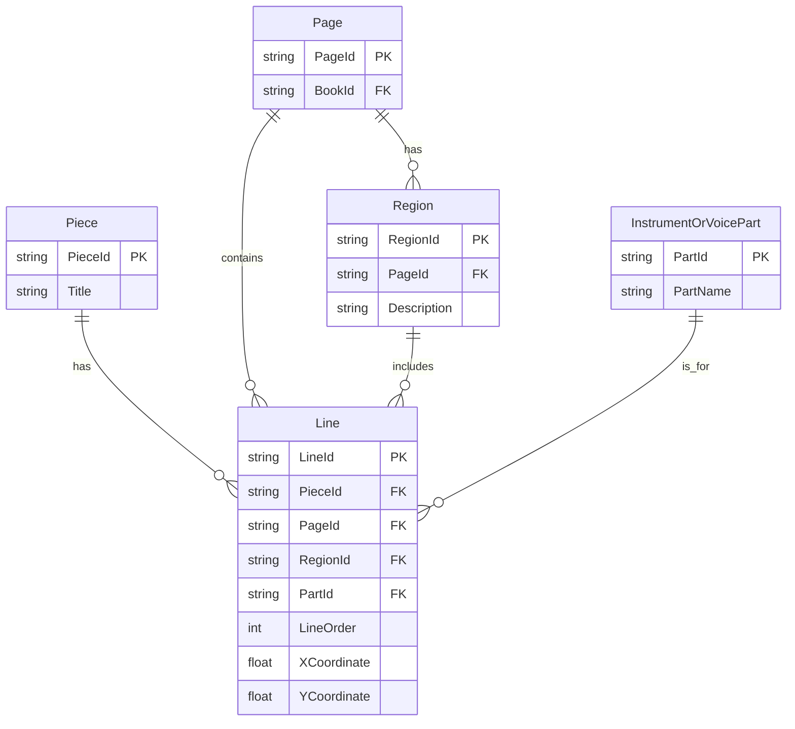

# Solution Sheet - March 2023

## Exam Overview

| Section | Questions | Marks |
|---------|-----------|-------|
| Section A | MCQs (taken separately on VLE) | N/A |
| Section B | Answer 2 of 3 (Q2, Q3, Q4) | 60 |
| **Total** | | **60** |

---

# Section B

---

# Question 2: Analyzing OpenDocument Format (ODF) and RelaxNG Schema [30 marks]

## Context

An extract from an ODF word processing document is shown, along with a RelaxNG schema snippet.

---

## Question 2(a) [1 mark]

**Question:** What language is this encoded in?

---

### Answer

**XML (Extensible Markup Language)**

---

### Revision Notes

**Core Concept:** ODF files are XML-based.

- ODF files (e.g., `.odt` documents) are ZIP containers that include XML files plus any images, styles, metadata, etc.
- The snippet shows tags like `<office:text>` and `<text:p>`, which are clearly XML elements.

---

## Question 2(b) [1 mark]

**Question:** What data structure does it use?

---

### Answer

**Tree (hierarchical) structure**

---

### Revision Notes

**Core Concept:** XML inherently uses a tree structure.

- A single root element with nested children
- Elements appear inside one another, forming a hierarchy
- Parent-child relationships define the structure

---

## Question 2(c) [2 marks]

**Question:** List the two namespaces that this document uses.

---

### Answer

1. `urn:oasis:names:tc:opendocument:xmlns:office:1.0`
2. `urn:oasis:names:tc:opendocument:xmlns:text:1.0`

---

### Revision Notes

**Core Concept:** XML namespaces prevent element name collisions.

| Prefix | Namespace URI |
|--------|---------------|
| `office:` | `urn:oasis:names:tc:opendocument:xmlns:office:1.0` |
| `text:` | `urn:oasis:names:tc:opendocument:xmlns:text:1.0` |

- Namespaces are declared in the root element using `xmlns:prefix="URI"`
- They allow documents to combine elements from different vocabularies

---

## Question 2(d) [4 marks]

**Question:** What would the XPath expression `//text:list-item/text:p` return? Would it be different from `//text:list//text:p`?

---

### Answer

**`//text:list-item/text:p`:**
- Selects `<text:p>` elements that are **direct children** of `<text:list-item>`

**`//text:list//text:p`:**
- Selects **all** `<text:p>` elements that are **descendants** of `<text:list>` (at any depth)

**In this example:** Both expressions return the same three items (`Trees`, `Graphs`, `Relations`) because each `<text:p>` is already a direct child of `<text:list-item>`. In a more complex or nested structure, these expressions could yield different results.

---

### Revision Notes

**Core Concept:** XPath `/` vs `//` operators.

| Operator | Meaning | Example |
|----------|---------|---------|
| `/` | Direct child only | `/parent/child` - immediate children |
| `//` | Any descendant | `//parent//child` - children at any depth |

**When results differ:**
- If `<text:p>` elements were nested inside other elements within `<text:list-item>`, `//text:p` would find them but `/text:p` would not.

---

## Question 2(e) [2 marks]

**Question:** How does this code help us assess if the document above is **well-formed**?

---

### Answer

It **does not** directly assess well-formedness.

A RelaxNG schema only checks structure and allowed elements/attributes **after** the document is confirmed well-formed by an XML parser.

---

### Revision Notes

**Core Concept:** Well-formedness vs validation are separate concepts.

**Well-formedness requirements (checked by XML parser):**
- Correct tag nesting
- Matching start/end tags
- A single root element
- Properly quoted attributes
- Valid characters in element/attribute names

**Schema validation:**
- Only happens after well-formedness is established
- Cannot fix or detect basic syntax errors

---

## Question 2(f) [2 marks]

**Question:** How does this code help us assess if the document above is **valid**?

---

### Answer

The RelaxNG schema checks if the document follows the structural rules it defines:
- Required elements and their sequences
- Allowed attributes and their values
- Cardinality (how many of each element)

If the document meets these requirements, it is **valid**; otherwise, it is invalid.

---

### Revision Notes

**Core Concept:** Schema validation verifies structural correctness.

| Check | Purpose |
|-------|---------|
| Element names | Only allowed elements present |
| Element order | Elements appear in correct sequence |
| Cardinality | Correct number of elements (0, 1, many) |
| Attributes | Required attributes present, values valid |

---

## Question 2(g) [2 marks]

**Question:** Which part or parts of the document is this relevant to?

---

### Answer

The RelaxNG snippet is relevant to `<text:list>` elements and their child elements:
- `<text:list-header>`
- `<text:list-item>`

The schema defines how these list structures must be formed.

---

## Question 2(h) [3 marks]

**Question:** Give an example of an element that would not be valid given this schema code (assume `text-list-attr` only defines attributes).

---

### Answer

```xml
<text:list>
  <text:list-item>Item Content</text:list-item>
  <text:invalid-element>Invalid Content</text:invalid-element>
</text:list>
```

`<text:invalid-element>` is **not** defined in the schema, so the document fails validation.

---

### Revision Notes

**Core Concept:** Schema defines allowed elements.

**Invalid scenarios:**
1. Unknown elements (not in schema)
2. Elements in wrong order
3. Missing required elements
4. Wrong number of elements (exceeding `oneOrMore`, etc.)

---

## Question 2(i) [13 marks]

**Question:** Assess the suitability of this data structure for encoding word processing documents. What advantages or disadvantages would a relational model bring?

---

### Answer

### XML / Tree Structures for Word Processing

**Advantages:**

| Advantage | Explanation |
|-----------|-------------|
| Natural hierarchy | Documents have nested structures (sections, paragraphs, runs) |
| Standards | ODF and OOXML are XML-based, widely supported |
| Flexibility | Easy to embed metadata or styles within structure |
| Mixed content | Text and markup can be interleaved naturally |
| Schema validation | Ensures document integrity |

**Disadvantages:**

| Disadvantage | Explanation |
|--------------|-------------|
| Verbosity | XML can be large and repetitive |
| Complex queries | XPath/XQuery less intuitive for tabular operations |
| Processing overhead | Parsing large XML documents can be slow |

### Relational Model

**Advantages:**

| Advantage | Explanation |
|-----------|-------------|
| Strong integrity | Primary/foreign keys, constraints, transactions |
| Efficient SQL | Well-suited for structured queries and aggregations |
| Mature tools | Extensive ecosystem for backup, replication, analytics |
| ACID compliance | Reliable for concurrent operations |

**Disadvantages:**

| Disadvantage | Explanation |
|--------------|-------------|
| Poor fit for nesting | Many join tables needed for complex markup |
| Rigid schema | Word processing has variable structures |
| No mixed content | Cannot easily interleave text and elements |
| Object-relational mismatch | Documents don't map naturally to tables |

### Conclusion

**XML is well-suited** to hierarchical, text-heavy documents where:
- Structure varies between documents
- Mixed content (text + markup) is common
- Standards compliance matters

**Relational model is better** for:
- Strongly structured, tabular data
- Extensive analytical queries
- Data integrity and ACID requirements

---

# Question 3: MusicBrainz / Linked Data [30 marks]

## Context

RDF/Turtle data describing a music group (e.g., BTS) with properties like `foundingDate`, `schema:member`, etc.

---

## Question 3(a) [1 mark]

**Question:** What (approximately) was the type that we put into the `Accept` header?

---

### Answer

**`text/turtle`** (or `application/turtle`)

---

### Revision Notes

**Core Concept:** Content negotiation in HTTP.

| Accept Header | Returns |
|--------------|---------|
| `text/turtle` | Turtle format RDF |
| `application/rdf+xml` | RDF/XML format |
| `application/ld+json` | JSON-LD format |
| `text/html` | Human-readable HTML |

---

## Question 3(b) [1 mark]

**Question:** What is the full URL of the predicate `schema:member` in this context?

---

### Answer

```
http://schema.org/member
```

---

### Revision Notes

**Core Concept:** Prefix expansion in Turtle.

- `schema:` is a prefix for `http://schema.org/`
- `schema:member` expands to `http://schema.org/member`

---

## Question 3(c) [1 mark]

**Question:** How many band members of BTS are listed in this snippet?

---

### Answer

**2** members (based on the blank nodes referencing separate individuals).

---

## Question 3(d) [3 marks]

**Question:** Comment on the way the `schema:member` predicate is used in this snippet.

---

### Answer

A **role-based** approach is used:

1. The band node has `schema:member` → blank node of type `schema:OrganizationRole`
2. That blank node itself has `schema:member` → the person's URI

**Benefits:**
- Allows adding membership attributes like `schema:startDate` to the role object
- Models the relationship (membership) as an entity with its own properties
- Common pattern in RDF for n-ary relationships

---

### Revision Notes

**Core Concept:** Reification and role-based modeling in RDF.

```turtle
# Direct approach (limited)
:BTS schema:member :Jin .

# Role-based approach (flexible)
:BTS schema:member [
    a schema:OrganizationRole ;
    schema:member :Jin ;
    schema:startDate "2013-06-12"
] .
```

---

## Question 3(e) [1 mark]

**Question:** What type(s) are associated with the entity having `schema:name` of "JIN"?

---

### Answer

He is typed as both:
- **`schema:MusicGroup`**
- **`schema:Person`**

(This is due to how MusicBrainz RDF is auto-generated)

---

## Question 3(f) [1 mark]

**Question:** What prefixes need to be defined for this SPARQL query to work?

```sparql
SELECT ?a ?b WHERE {
  mba:9fe8e-ba27-4859-bb8c-2f255f346853 schema:member ?c .
  ?c schema:startDate ?b ;
     schema:member ?d .
  ?d schema:name ?a .
}
```

---

### Answer

```sparql
PREFIX mba: <http://musicbrainz.org/artist/>
PREFIX schema: <http://schema.org/>
```

(And possibly `rdf:` if using `rdf:type`.)

---

## Question 3(g) [2 marks]

**Question:** What would the query return?

---

### Answer

It returns pairs of `(?a, ?b)` where:
- `?a` = **member name**
- `?b` = **startDate** from the membership role

Essentially, each band member's name plus when they joined.

---

## Question 3(h) [6 marks]

**Question:** This data represents an export from a relational database. Construct an ER diagram that could accommodate the instance data above.

---

### Answer



**Explanation:**
- **Artist**: Holds both bands and individuals (differentiated by `Type`)
- **Membership**: Composite primary key of (BandId, MemberId)
  - `BandId` references an Artist row with `Type='MusicGroup'`
  - `MemberId` references an Artist row with `Type='Person'`
  - Additional fields like `StartDate` and `RoleName` capture membership details

---

## Question 3(i) [4 marks]

**Question:** Give the CREATE TABLE commands for two tables based on your ER diagram.

---

### Answer

```sql
CREATE TABLE Artist (
  ArtistId     INT PRIMARY KEY,
  Name         VARCHAR(100) NOT NULL,
  Type         VARCHAR(20)  NOT NULL,  -- 'Person' or 'MusicGroup'
  FoundingDate DATE
);

CREATE TABLE Membership (
  BandId    INT NOT NULL,
  MemberId  INT NOT NULL,
  StartDate DATE,
  RoleName  VARCHAR(100),
  PRIMARY KEY (BandId, MemberId),
  FOREIGN KEY (BandId)   REFERENCES Artist(ArtistId),
  FOREIGN KEY (MemberId) REFERENCES Artist(ArtistId)
);
```

---

### Revision Notes

**Key Points:**
- `PRIMARY KEY (BandId, MemberId)` enforces one membership record per (band, person) pair
- If multiple memberships needed (e.g., someone rejoins), add another field to the PK

---

## Question 3(j) [5 marks]

**Question:** Suggest a MySQL query to check whether any band member in the database is recorded as joining before the founding date of their band.

---

### Answer

```sql
SELECT aMember.Name AS MemberName,
       aBand.Name   AS BandName,
       m.StartDate,
       aBand.FoundingDate
FROM Membership m
INNER JOIN Artist aBand   ON m.BandId   = aBand.ArtistId
INNER JOIN Artist aMember ON m.MemberId = aMember.ArtistId
WHERE m.StartDate < aBand.FoundingDate;
```

---

### Revision Notes

**Core Concept:** Self-referencing table with multiple joins.

- `Artist` table holds both bands and members
- Join `Membership` to `Artist` twice: once for band info, once for member info
- Compare dates to find anomalies

---

## Question 3(k) [5 marks]

**Question:** MusicBrainz makes their data available as both a downloadable database dump and as Linked Data. What are the benefits and disadvantages of each approach?

---

### Answer

### Database Dump

| Aspect | Description |
|--------|-------------|
| **Pros** | Complete offline snapshot for large queries/analytics |
| | Independent of network availability |
| | Full control over query performance |
| | Can create custom indexes |
| **Cons** | Becomes outdated quickly |
| | Large storage overhead |
| | Requires database setup and maintenance |

### Linked Data

| Aspect | Description |
|--------|-------------|
| **Pros** | Always up-to-date data |
| | Easy to interlink with other semantic sources |
| | No local storage required |
| | Standard SPARQL queries |
| **Cons** | Dependent on network availability |
| | Can be slower for bulk operations |
| | Rate limits may apply |
| | Endpoint downtime affects applications |

---

# Question 4: Enhancing an ER Model for 16th-Century European Music Records [30 marks]

## Context

An existing ER model for a database of 16th-century European music books needs enhancement.

---

## Question 4(a) [3 marks]

**Question:** This model doesn't allow storing the order or coordinates for lines of music on a page. How could this be fixed?

---

### Answer

Add attributes to the **Line** entity:

| Attribute | Type | Purpose |
|-----------|------|---------|
| `LineOrder` | INT | Track visual/logical order on page |
| `XCoordinate` | FLOAT | Horizontal position |
| `YCoordinate` | FLOAT | Vertical position |

---

## Question 4(b) [8 marks]

**Question:** Some books are published in tablebook format, with multiple parts/voices to a piece and page regions with lines in different directions. How to add these aspects?

---

### Answer

**New Entities:**

1. **InstrumentOrVoicePart** - e.g., "Soprano," "Alto," "Violin Part"
2. **Region** - defines different areas on a page, potentially oriented differently

**Relationships:**

- **Line** references:
  - A **Piece** (the composition)
  - A **Page** (the physical page it's on)
  - A **Region** (sub-area of that page)
  - A **Part** (e.g., soprano or instrumental line)



---

## Question 4(c) [7 marks]

**Question:** List the tables, primary keys, and foreign keys for a relational implementation of your modified model.

---

### Answer

| Table | Primary Key | Foreign Keys | Attributes |
|-------|-------------|--------------|------------|
| **Piece** | PieceId | - | Title, Composer, etc. |
| **Page** | PageId | BookId → Book(BookId) | PageNumber, etc. |
| **Region** | RegionId | PageId → Page(PageId) | Description, Orientation |
| **InstrumentOrVoicePart** | PartId | - | PartName |
| **Line** | LineId | PieceId → Piece(PieceId), PageId → Page(PageId), RegionId → Region(RegionId), PartId → InstrumentOrVoicePart(PartId) | LineOrder, XCoordinate, YCoordinate |

---

## Question 4(d) [5 marks]

**Question:** Give a query to list pieces with the total number of lines of music that they occupy.

---

### Answer

```sql
SELECT p.Title, COUNT(*) AS TotalLines
FROM Piece p
INNER JOIN Line l ON p.PieceId = l.PieceId
GROUP BY p.PieceId, p.Title;
```

---

### Revision Notes

**Core Concept:** Aggregation with GROUP BY.

- `COUNT(*)` counts rows per group
- `GROUP BY` ensures aggregation per piece
- Include `PieceId` in GROUP BY to handle pieces with same title

---

## Question 4(e) [7 marks]

**Question:** Assess the suitability of this data structure for a relational model, and compare it with ONE other database model (XML-based, document-based, or Linked Data graph).

---

### Answer

### Relational Model Assessment

**Advantages:**

| Advantage | Explanation |
|-----------|-------------|
| Structured queries | Easy to count, filter, aggregate data |
| Clear relationships | FK constraints enforce integrity |
| SQL familiarity | Well-known query language |
| Efficient joins | Good for normalized data |

**Disadvantages:**

| Disadvantage | Explanation |
|--------------|-------------|
| Complex hierarchy | Many join tables for nested structures |
| Layout data | Coordinates may not fit well in rows/columns |
| Flexibility | Schema changes require ALTER TABLE |

### XML/Document Database Comparison

**Advantages:**

| Advantage | Explanation |
|-----------|-------------|
| Natural hierarchy | Nested elements mirror page/region/line structure |
| Mixed content | Can embed text and markup |
| Flexible schema | Easy to add new elements |
| Standard formats | MEI, TEI designed for music/manuscripts |

**Disadvantages:**

| Disadvantage | Explanation |
|--------------|-------------|
| Harder aggregation | Counting/grouping less straightforward |
| Query complexity | XPath/XQuery learning curve |
| Performance | Large XML can be slow to parse |

### Conclusion

**Relational** is ideal for:
- Structured queries (counting lines, grouping data)
- Well-defined relationships
- Analytical operations

**XML/Document** is better for:
- Deeply nested layout data
- Preserving document structure
- Integration with music encoding standards (MEI)

---

# Quick Reference Summary

## XML/XPath Essentials

```xpath
//element[@attr="value"]     -- Find by attribute
//parent/child               -- Direct children
//parent//child              -- All descendants
//elem[text()='value']       -- Match by text content
```

## Turtle/RDF Essentials

```turtle
@prefix schema: <http://schema.org/> .

subject a schema:Type ;
        schema:property "value" ;
        schema:relation <http://other/resource> .
```

## SPARQL Essentials

```sparql
PREFIX schema: <http://schema.org/>

SELECT ?name ?date
WHERE {
  ?entity a schema:MusicGroup ;
          schema:member ?membership .
  ?membership schema:member ?person ;
              schema:startDate ?date .
  ?person schema:name ?name .
}
```

## SQL Essentials

```sql
-- Composite primary key
PRIMARY KEY (Field1, Field2)

-- Self-referencing joins
SELECT a1.Name, a2.Name
FROM Table t
INNER JOIN Entity a1 ON t.FK1 = a1.PK
INNER JOIN Entity a2 ON t.FK2 = a2.PK;

-- Aggregation
SELECT Field, COUNT(*) AS Total
FROM Table
GROUP BY Field;
```

---

*End of Solution Sheet - March 2023*
