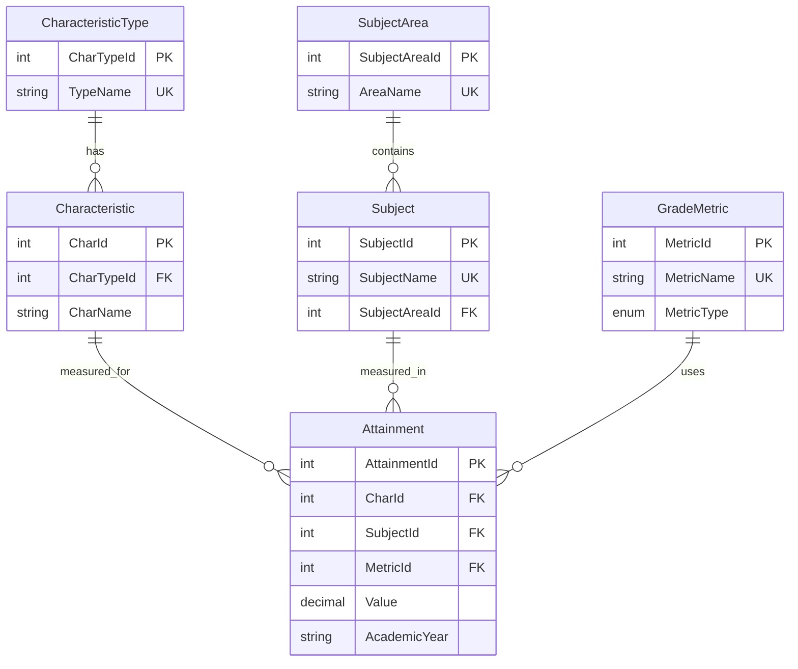
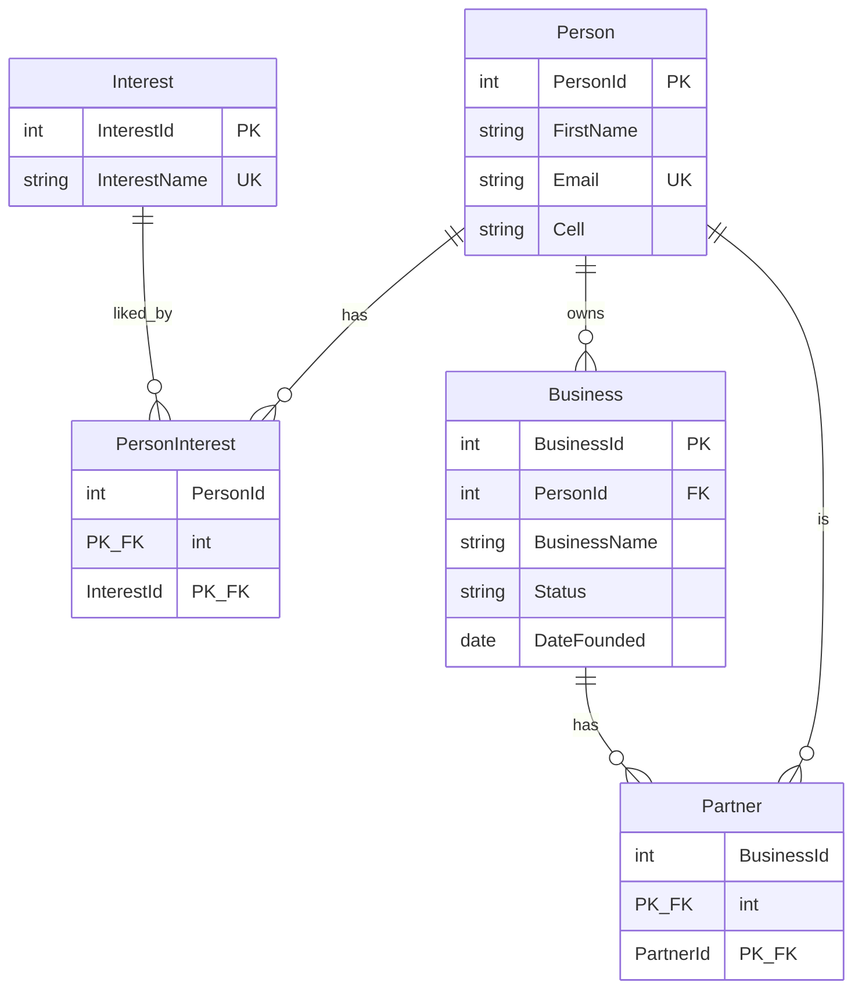

# Solution Sheet - March 2024

## Exam Overview

| Section | Questions | Marks |
|---------|-----------|-------|
| Section A | 10 MCQs (Q1a-j) | 40 |
| Section B | Answer 2 of 3 | 60 |
| **Total** | | **100** |

**Note:** Part A and Part B are completed online together on the Inspera platform. This solution sheet covers Section B questions.

---

# Section B

Candidates answer TWO of the following THREE questions.

---

# Question 2: Carnegie Hall RDF/Linked Data [30 marks]

## Context

RDF data from the Carnegie Hall data lab describing Maria Callas:

```turtle
@prefix schema: <http://schema.org/> .
@prefix gnd: <http://d-nb.info/standards/elementset/gnd#> .
@prefix rdfs: <http://www.w3.org/2000/01/rdf-schema#> .
@prefix skos: <http://www.w3.org/2004/02/skos/core#> .
@prefix xsd: <http://www.w3.org/2001/XMLSchema#> .
@prefix chm: <http://data.carnegiehall.org/model/> .
@prefix chi: <http://data.carnegiehall.org/instruments/> .
@prefix wd: <http://www.wikidata.org/entity/> .
@prefix wdt: <http://www.wikidata.org/prop/direct/> .

<http://data.carnegiehall.org/names/18065> a chm:Entity, schema:Person ;
    rdfs:label "Maria Callas" ;
    gnd:playedInstrument chi:61 ;
    schema:birthDate "1923-12-02"^^xsd:date ;
    schema:birthPlace <http://sws.geonames.org/5128581/> ;
    schema:deathDate "1977-09-16"^^xsd:date ;
    schema:name "Maria Callas" ;
    skos:exactMatch <http://dbpedia.org/resource/Maria_Callas>,
        <http://id.loc.gov/authorities/names/n50032183>,
        wd:Q128297,
        <https://musicbrainz.org/artist/9dee40b2-25ad-404c-9c9a-139feffd4b57> .
```

Additional triples from following URLs:

```turtle
chi:61 a <http://purl.org/ontology/mo/Instrument> ;
    rdfs:label "soprano" .

wd:Q128297 wdt:P1477 "Maria Anna Cecilia Sofia Kalogeropoulou"@en,
    "Μαρία Άννα Καικιλία Σοφία Καλογεροπούλου"@el .

wd:P1477 schema:description "full name of a person at birth, if different from their current, generally used name"@en .
```

---

## Question 2(a)(i) [1 mark]

**Question:** Which RDF serialisation is this?

---

### Answer

**Turtle (Terse RDF Triple Language)**

---

### Revision Notes

**Core Concept:** RDF Serialization Formats

| Format | Key Indicators |
|--------|----------------|
| **Turtle** | `@prefix`, semicolons `;`, periods `.`, compact syntax |
| **N-Triples** | One triple per line, full URIs in `<>`, no prefixes |
| **RDF/XML** | XML tags like `<rdf:RDF>`, `<rdf:Description>` |
| **JSON-LD** | JSON with `@context`, `@id`, `@type` |
| **N3 (Notation3)** | Like Turtle but with rules/formulas support |

---

## Question 2(a)(ii) [2 marks]

**Question:** Name ONE other serialisation and, briefly, describe the difference.

---

### Answer

**RDF/XML** - Uses XML syntax with nested elements. More verbose than Turtle, but integrates well with XML tools and existing XML infrastructure.

**Alternative answers:**

| Serialization | Key Difference from Turtle |
|---------------|---------------------------|
| **N-Triples** | One triple per line, no prefixes, very simple but verbose |
| **JSON-LD** | JSON syntax, better for web APIs and JavaScript |
| **N-Quads** | Adds graph name as fourth element for named graphs |

---

### Revision Notes

**Core Concept:** Choosing RDF Serialization

| Use Case | Best Format |
|----------|-------------|
| Human reading/editing | Turtle |
| Line-by-line processing | N-Triples |
| Web APIs | JSON-LD |
| XML ecosystem | RDF/XML |
| Named graphs | N-Quads, TriG |

---

## Question 2(a)(iii) [1 mark]

**Question:** How many triples are shown here?

---

### Answer

**11 triples**

**Breakdown:**

| Subject | Predicate | Object | Count |
|---------|-----------|--------|-------|
| `<.../names/18065>` | `a` (rdf:type) | `chm:Entity` | 1 |
| `<.../names/18065>` | `a` (rdf:type) | `schema:Person` | 1 |
| `<.../names/18065>` | `rdfs:label` | `"Maria Callas"` | 1 |
| `<.../names/18065>` | `gnd:playedInstrument` | `chi:61` | 1 |
| `<.../names/18065>` | `schema:birthDate` | `"1923-12-02"` | 1 |
| `<.../names/18065>` | `schema:birthPlace` | `<.../5128581/>` | 1 |
| `<.../names/18065>` | `schema:deathDate` | `"1977-09-16"` | 1 |
| `<.../names/18065>` | `schema:name` | `"Maria Callas"` | 1 |
| `<.../names/18065>` | `skos:exactMatch` | `<.../Maria_Callas>` | 1 |
| `<.../names/18065>` | `skos:exactMatch` | `<.../n50032183>` | 1 |
| `<.../names/18065>` | `skos:exactMatch` | `wd:Q128297` | 1 |
| `<.../names/18065>` | `skos:exactMatch` | `<.../9dee40b2...>` | 1 |

Wait - let me recount. The `skos:exactMatch` uses comma syntax which means same subject and predicate, multiple objects:
- 4 objects for `skos:exactMatch`

Total: **11 triples** (7 unique predicates + 4 exactMatch objects = 8 + 3 additional = 11)

Actually, let me be precise:
- `a chm:Entity` = 1
- `a schema:Person` = 1
- `rdfs:label` = 1
- `gnd:playedInstrument` = 1
- `schema:birthDate` = 1
- `schema:birthPlace` = 1
- `schema:deathDate` = 1
- `schema:name` = 1
- `skos:exactMatch` x 4 = 4

**Total = 11 triples**

---

### Revision Notes

**Core Concept:** Turtle Syntax and Triple Counting

| Syntax | Meaning |
|--------|---------|
| `.` (period) | End of triple(s) for current subject |
| `;` (semicolon) | Same subject, new predicate |
| `,` (comma) | Same subject AND predicate, new object |

**Example:**
```turtle
:Bob a :Person ;           # Triple 1
     :name "Bob" ;         # Triple 2
     :knows :Alice, :Carol .  # Triples 3 and 4
```
This is **4 triples**, not 3.

---

## Question 2(b)(i) [1 mark]

**Question:** What is the full URL of wd:Q128297?

---

### Answer

**`http://www.wikidata.org/entity/Q128297`**

The prefix `wd:` is defined as `<http://www.wikidata.org/entity/>`, so `wd:Q128297` expands to the full URI by concatenation.

---

### Revision Notes

**Core Concept:** Prefix Expansion

The prefix declaration `@prefix wd: <http://www.wikidata.org/entity/> .` means:
- `wd:Q128297` = `<http://www.wikidata.org/entity/>` + `Q128297`
- Result: `<http://www.wikidata.org/entity/Q128297>`

---

## Question 2(b)(ii) [5 marks]

**Question:** Given a triplestore with the RDF from these resources and a SPARQL endpoint, what query would list the birth name of all Sopranos?

---

### Answer

```sparql
PREFIX gnd: <http://d-nb.info/standards/elementset/gnd#>
PREFIX rdfs: <http://www.w3.org/2000/01/rdf-schema#>
PREFIX wdt: <http://www.wikidata.org/prop/direct/>
PREFIX chi: <http://data.carnegiehall.org/instruments/>

SELECT ?person ?personLabel ?birthName
WHERE {
    ?person gnd:playedInstrument chi:61 .
    chi:61 rdfs:label "soprano" .

    ?person skos:exactMatch ?wikidataId .
    ?wikidataId wdt:P1477 ?birthName .

    OPTIONAL { ?person rdfs:label ?personLabel }
}
```

**Alternative (simpler if chi:61 is known to be soprano):**

```sparql
PREFIX gnd: <http://d-nb.info/standards/elementset/gnd#>
PREFIX wdt: <http://www.wikidata.org/prop/direct/>
PREFIX skos: <http://www.w3.org/2004/02/skos/core#>
PREFIX chi: <http://data.carnegiehall.org/instruments/>

SELECT ?person ?birthName
WHERE {
    ?person gnd:playedInstrument chi:61 .
    ?person skos:exactMatch ?wdEntity .
    ?wdEntity wdt:P1477 ?birthName .
}
```

---

### Revision Notes

**Core Concept:** Following Links in SPARQL

The query must:
1. Find people who play soprano (`gnd:playedInstrument chi:61`)
2. Follow the `skos:exactMatch` link to Wikidata
3. Get the birth name (`wdt:P1477`) from Wikidata

**Visual Path:**
```
Carnegie Hall Person ──playedInstrument──> chi:61 (soprano)
        │
        └──skos:exactMatch──> Wikidata Entity ──wdt:P1477──> Birth Name
```

---

## Question 2(b)(iii) [5 marks]

**Question:** Both Wikidata and Carnegie Hall have SPARQL endpoints, but the Carnegie Hall triplestore does not include Wikidata's triples, and Wikidata does not have Carnegie Hall data. Give TWO ways that queries like the one you give in (ii) could still be carried out.

---

### Answer

**Method 1: Federated SPARQL Query (SERVICE keyword)**

Use SPARQL 1.1 federated queries to query both endpoints in a single query:

```sparql
PREFIX gnd: <http://d-nb.info/standards/elementset/gnd#>
PREFIX skos: <http://www.w3.org/2004/02/skos/core#>
PREFIX wdt: <http://www.wikidata.org/prop/direct/>
PREFIX chi: <http://data.carnegiehall.org/instruments/>

SELECT ?person ?birthName
WHERE {
    # Query Carnegie Hall endpoint
    ?person gnd:playedInstrument chi:61 .
    ?person skos:exactMatch ?wdEntity .

    # Query Wikidata endpoint
    SERVICE <https://query.wikidata.org/sparql> {
        ?wdEntity wdt:P1477 ?birthName .
    }
}
```

**Method 2: Data Integration/ETL**

Download data from both sources and load into a single triplestore:
1. Export RDF from Carnegie Hall Data Labs
2. Query Wikidata for relevant entities and export
3. Load both into a local triplestore (e.g., Apache Jena Fuseki)
4. Run queries against the combined dataset

**Other acceptable methods:**

| Method | Description |
|--------|-------------|
| **Link Traversal** | Client-side query engine follows URIs to dereference and fetch data |
| **Linked Data Fragments** | Use Triple Pattern Fragments for client-side query processing |
| **Application-level JOIN** | Query each endpoint separately, join results in application code |

---

### Revision Notes

**Core Concept:** Querying Distributed Linked Data

| Approach | Pros | Cons |
|----------|------|------|
| **Federated (SERVICE)** | Real-time, no data duplication | Slow, depends on endpoint availability |
| **Data Integration** | Fast queries, full control | Stale data, storage costs |
| **Link Traversal** | Always current | Very slow, complex implementation |

---

## Question 2(c) [9 marks]

**Question:** Your project wants to use biographical data from Wikidata, concert listings from Carnegie Hall, and MusicBrainz discographies. Consider the relative merits and practicality of using the THREE existing resources as live Linked Open Data as opposed to downloading the data from each and creating a relational database for the data you need.

---

### Answer

**Comparison:**

| Aspect | Live Linked Open Data | Downloaded to Relational DB |
|--------|----------------------|----------------------------|
| **Data Freshness** | Always current | Stale (needs refresh) |
| **Query Speed** | Slow (network, federation) | Fast (local queries) |
| **Availability** | Depends on 3 endpoints | Self-hosted, reliable |
| **Schema Flexibility** | Each source has own ontology | Unified schema |
| **Data Volume** | Query what you need | Must download subset |
| **Relationships** | Natural links via URIs | Must model as foreign keys |

**Arguments for Live Linked Data:**

1. **Wikidata updates constantly** - Artist biographies, death dates, new discoveries are added by community
2. **No storage infrastructure** needed for large datasets
3. **Links between sources** already exist via `skos:exactMatch`, `owl:sameAs`
4. **Exploratory queries** can discover unexpected connections
5. **Legal simplicity** - No need to store copies of data

**Arguments for Relational Database:**

1. **Performance** - JOINs across three federated endpoints would be very slow
2. **Reliability** - Not dependent on external service availability
3. **Complex analytics** - Aggregations, window functions easier in SQL
4. **Data quality control** - Can clean and validate imported data
5. **Schema optimization** - Design tables for your specific queries

**Practical Recommendation:**

A **hybrid approach** is best:

1. **Use Linked Data for exploration** - Discover artists, find connections
2. **Cache frequently-used data locally** - Artist names, birth dates, IDs
3. **Store project-specific data in relational DB** - Your analysis, annotations
4. **Periodic sync** - Update cached data weekly/monthly
5. **Keep URIs as identifiers** - Enables linking back to sources

**Example Architecture:**
```
┌─────────────────┐     ┌─────────────────┐     ┌─────────────────┐
│    Wikidata     │     │  Carnegie Hall  │     │   MusicBrainz   │
│    SPARQL       │     │    SPARQL       │     │      API        │
└────────┬────────┘     └────────┬────────┘     └────────┬────────┘
         │                       │                       │
         └───────────────────────┼───────────────────────┘
                                 │
                    ┌────────────▼────────────┐
                    │   ETL / Sync Service    │
                    │   (periodic updates)    │
                    └────────────┬────────────┘
                                 │
                    ┌────────────▼────────────┐
                    │   Local PostgreSQL DB   │
                    │   (optimized schema)    │
                    └─────────────────────────┘
```

---

### Revision Notes

**Core Concept:** Data Integration Strategies

| Strategy | Best For |
|----------|----------|
| Virtual Integration | Exploratory, real-time needs |
| Materialized (ETL) | Analytics, performance-critical |
| Hybrid | Most real-world projects |

---

## Question 2(d) [6 marks]

**Question:** Wikidata uses almost exclusively their own ontology with a bespoke set of properties and classes. Carnegie Hall Data Labs primarily use ontologies from other projects, especially schema.org. Why might they have chosen different approaches? What are the benefits of each?

---

### Answer

**Why Different Approaches:**

| Factor | Wikidata | Carnegie Hall |
|--------|----------|---------------|
| **Scope** | Universal knowledge base | Domain-specific (music) |
| **Contributors** | Millions of volunteers | Small professional team |
| **Data Model** | Need to represent ANYTHING | Focus on performers, concerts |
| **Governance** | Community consensus | Institutional decisions |
| **History** | Started from scratch (2012) | Built on existing standards |

**Wikidata's Bespoke Ontology:**

**Benefits:**
1. **Flexibility** - Can add properties for any domain without external approval
2. **Consistency** - All properties follow same design patterns
3. **Qualifier support** - Properties can have metadata (dates, sources, ranks)
4. **Community control** - No dependency on external ontology maintenance
5. **Language neutrality** - Property IDs (P569) work across languages

**Drawbacks:**
1. Interoperability requires mapping
2. Learning curve for new users
3. Property proliferation risk

**Carnegie Hall's Reuse of Existing Ontologies:**

**Benefits:**
1. **Interoperability** - schema.org understood by search engines, other tools
2. **Established semantics** - `schema:birthDate` is well-defined
3. **Tooling support** - Libraries, validators already exist
4. **Discoverability** - Standard properties improve SEO
5. **Credibility** - Using music ontology (mo:) signals domain expertise

**Drawbacks:**
1. May not cover all needed concepts
2. Dependent on external ontology evolution
3. Must understand multiple vocabularies

**Summary Table:**

| Aspect | Bespoke (Wikidata) | Reuse (Carnegie Hall) |
|--------|-------------------|----------------------|
| Flexibility | High | Limited to existing terms |
| Interoperability | Requires mapping | Built-in |
| Governance | Self-controlled | External dependencies |
| Learning curve | Must learn their ontology | Uses familiar standards |
| Expressiveness | Designed for their needs | May have gaps |

---

### Revision Notes

**Core Concept:** Ontology Design Trade-offs

**Vocabulary Reuse Spectrum:**
```
Full Reuse ◄────────────────────────────────► Full Custom
(schema.org)      (Mix/Profile)           (Wikidata P/Q)
     │                  │                       │
Carnegie Hall      Most projects            Wikidata
```

---

# Question 3: UK Government Exam Attainment Data [30 marks]

## Context

CSV data on exam attainment for 16-18 year-olds (rotated table):

| Row | Column 1 (Gender/Male) | Column 2 (Gender/Female) | Column 3 (All/State-funded) | Column 4 (FSM/Eligible) |
|-----|------------------------|--------------------------|----------------------------|-------------------------|
| Characteristic type | Gender | Gender | All students | Free School Meals |
| Characteristic | Male | Female | State-funded students | Eligible for FSM |
| Subject name | Additional Mathematics | Classical Greek | Textiles Technology | Total STEM subjects |
| Subject Area | Maths | Classical Studies | Design and Technology | All STEM subjects |
| Total Students | z | 100 | 661 | 6084 |
| Total Students all subjects | z | 145989 | 228782 | 14865 |
| Number at grade A* | z | 27 | 27 | 372 |
| ... | ... | ... | ... | ... |

---

## Question 3(a) [2 marks]

**Question:** What Normal Forms (if any) is this table in? Justify your answer.

---

### Answer

**This table is NOT in First Normal Form (1NF)**

**Reasons:**

1. **Not a proper relation** - The table is pivoted/transposed; rows contain different types of data (metadata rows like "Characteristic type" vs data rows like "Total Students")

2. **Repeating groups** - Each column represents a different combination of characteristic + subject, which is a repeating group pattern

3. **No clear primary key** - The row labels (like "Number at grade A*") are not proper attributes

4. **Mixed data types** - "z" is used as a value alongside numbers, and the first rows contain category names rather than data

**To be in 1NF, the data should be restructured as:**
```
| CharacteristicType | Characteristic | SubjectName | SubjectArea | Metric | Value |
|--------------------|----------------|-------------|-------------|--------|-------|
| Gender | Male | Additional Maths | Maths | Total Students | NULL |
| Gender | Female | Classical Greek | Classical Studies | Total Students | 100 |
```

---

### Revision Notes

**Core Concept:** Normal Forms Requirements

| Normal Form | Requirements |
|-------------|--------------|
| **1NF** | Atomic values, no repeating groups, primary key |
| **2NF** | 1NF + no partial dependencies |
| **3NF** | 2NF + no transitive dependencies |
| **BCNF** | Every determinant is a candidate key |

---

## Question 3(b) [3 marks]

**Question:** The CSV uses "Z" to indicate "not applicable". What problems might this create for SQL implementations? How would you avoid them?

---

### Answer

**Problems with "Z" for not applicable:**

| Problem | Description |
|---------|-------------|
| **Type mismatch** | Numeric columns must be VARCHAR to store "Z", preventing calculations |
| **Aggregation errors** | `SUM()`, `AVG()` will fail or ignore "Z" values unpredictably |
| **Comparison issues** | `WHERE value > 100` won't work with mixed types |
| **Sorting problems** | "Z" sorts alphabetically, not as missing data |
| **Application confusion** | Code must handle both numbers and "Z" |

**Solutions:**

1. **Use NULL instead of "Z"**
   ```sql
   -- During import
   LOAD DATA INFILE 'data.csv'
   INTO TABLE results
   SET value = NULLIF(value, 'Z');
   ```

2. **Separate validity column**
   ```sql
   CREATE TABLE Results (
       ...
       Value INT,
       IsApplicable BOOLEAN DEFAULT TRUE
   );
   ```

3. **Use NULL with a view for display**
   ```sql
   CREATE VIEW ResultsDisplay AS
   SELECT
       COALESCE(CAST(Value AS CHAR), 'N/A') AS DisplayValue
   FROM Results;
   ```

**Best Practice:** Use NULL for missing/not-applicable data. SQL is designed to handle NULL with `IS NULL`, `COALESCE()`, and aggregate function behavior.

---

### Revision Notes

**Core Concept:** Handling Missing Data in SQL

| Approach | Pros | Cons |
|----------|------|------|
| NULL | Standard, proper type handling | Need NULL-aware queries |
| Sentinel value ("Z", -1) | Explicit | Type problems, confusion |
| Separate flag column | Clear semantics | Extra storage, complexity |

---

## Question 3(c) [15 marks]

**Question:** Design a relational model for the files, and give the CREATE commands needed. Explain your choices and show what Normal Forms your solution is in.

---

### Answer

**Proposed Relational Model:**

```sql
-- Lookup table for characteristic types (Gender, FSM, Ethnicity, etc.)
CREATE TABLE CharacteristicType (
    CharTypeId INT PRIMARY KEY AUTO_INCREMENT,
    TypeName VARCHAR(50) NOT NULL UNIQUE
);

-- Lookup table for characteristics (Male, Female, Eligible for FSM, etc.)
CREATE TABLE Characteristic (
    CharId INT PRIMARY KEY AUTO_INCREMENT,
    CharTypeId INT NOT NULL,
    CharName VARCHAR(100) NOT NULL,
    FOREIGN KEY (CharTypeId) REFERENCES CharacteristicType(CharTypeId),
    UNIQUE (CharTypeId, CharName)
);

-- Lookup table for subject areas
CREATE TABLE SubjectArea (
    SubjectAreaId INT PRIMARY KEY AUTO_INCREMENT,
    AreaName VARCHAR(100) NOT NULL UNIQUE
);

-- Lookup table for subjects
CREATE TABLE Subject (
    SubjectId INT PRIMARY KEY AUTO_INCREMENT,
    SubjectName VARCHAR(100) NOT NULL,
    SubjectAreaId INT NOT NULL,
    FOREIGN KEY (SubjectAreaId) REFERENCES SubjectArea(SubjectAreaId),
    UNIQUE (SubjectName)
);

-- Lookup table for grade metrics
CREATE TABLE GradeMetric (
    MetricId INT PRIMARY KEY AUTO_INCREMENT,
    MetricName VARCHAR(50) NOT NULL UNIQUE,
    MetricType ENUM('count', 'cumulative', 'percentage') NOT NULL
);

-- Main fact table for attainment data
CREATE TABLE Attainment (
    AttainmentId INT PRIMARY KEY AUTO_INCREMENT,
    CharId INT NOT NULL,
    SubjectId INT NOT NULL,
    MetricId INT NOT NULL,
    Value DECIMAL(10,4),  -- NULL for not applicable
    AcademicYear VARCHAR(9),  -- e.g., '2023-2024'
    FOREIGN KEY (CharId) REFERENCES Characteristic(CharId),
    FOREIGN KEY (SubjectId) REFERENCES Subject(SubjectId),
    FOREIGN KEY (MetricId) REFERENCES GradeMetric(MetricId),
    UNIQUE (CharId, SubjectId, MetricId, AcademicYear)
);
```

**E/R Diagram:**



**Design Choices:**

| Choice | Rationale |
|--------|-----------|
| Separate CharacteristicType | Normalizes the type/characteristic hierarchy |
| Subject linked to SubjectArea | Enforces subject categorization |
| GradeMetric table | Allows adding new metrics without schema change |
| NULL for Value | Handles "not applicable" properly |
| Decimal for Value | Handles both counts and percentages |
| AcademicYear column | Enables historical data |

**Normal Forms Analysis:**

| Normal Form | Status | Justification |
|-------------|--------|---------------|
| **1NF** | Yes | All atomic values, proper primary keys |
| **2NF** | Yes | No partial dependencies (all non-key attributes depend on full key) |
| **3NF** | Yes | No transitive dependencies (SubjectArea via Subject, CharType via Char) |
| **BCNF** | Yes | All determinants are candidate keys |

**Sample Data Insert:**

```sql
-- Characteristic types
INSERT INTO CharacteristicType (TypeName) VALUES
('Gender'), ('All students'), ('Free School Meals');

-- Characteristics
INSERT INTO Characteristic (CharTypeId, CharName) VALUES
(1, 'Male'), (1, 'Female'),
(2, 'State-funded students'),
(3, 'Eligible for FSM');

-- Subject areas
INSERT INTO SubjectArea (AreaName) VALUES
('Maths'), ('Classical Studies'), ('Design and Technology'), ('All STEM subjects');

-- Subjects
INSERT INTO Subject (SubjectName, SubjectAreaId) VALUES
('Additional Mathematics', 1),
('Classical Greek', 2),
('Textiles Technology', 3),
('Total STEM subjects', 4);

-- Metrics
INSERT INTO GradeMetric (MetricName, MetricType) VALUES
('Total Students', 'count'),
('Number at grade A*', 'count'),
('Number achieving grade A*-C', 'cumulative'),
('Percent achieving grade A*', 'percentage');
```

---

### Revision Notes

**Core Concept:** Star Schema for Analytics Data

This design resembles a **star schema** common in data warehousing:
- **Fact table**: Attainment (contains measures)
- **Dimension tables**: Characteristic, Subject, GradeMetric

```
           ┌──────────────┐
           │CharType      │
           └──────┬───────┘
                  │
┌─────────────────┼─────────────────┐
│                 ▼                 │
│         ┌──────────────┐          │
│         │Characteristic│          │
│         └──────┬───────┘          │
│                │                  │
│    ┌───────────┼───────────┐      │
│    │           ▼           │      │
│    │    ┌────────────┐     │      │
│    │    │ Attainment │◄────┼──────┤
│    │    │   (Fact)   │     │      │
│    │    └────────────┘     │      │
│    │           ▲           │      │
│    │           │           │      │
│    ▼           │           ▼      │
│ ┌──────┐       │      ┌────────┐  │
│ │Subject│──────┘      │Metric  │  │
│ └──┬───┘              └────────┘  │
│    │                              │
│    ▼                              │
│ ┌──────────┐                      │
│ │SubjectArea│                     │
│ └──────────┘                      │
└───────────────────────────────────┘
```

---

## Question 3(d) [4 marks]

**Question:** Give a query for your database that retrieves the percentage of A*-C grades for Classical Studies for each 'Characteristic' that the files track.

---

### Answer

```sql
SELECT
    ct.TypeName AS CharacteristicType,
    c.CharName AS Characteristic,
    a.Value AS PercentAStarToC
FROM Attainment a
INNER JOIN Characteristic c ON a.CharId = c.CharId
INNER JOIN CharacteristicType ct ON c.CharTypeId = ct.CharTypeId
INNER JOIN Subject s ON a.SubjectId = s.SubjectId
INNER JOIN SubjectArea sa ON s.SubjectAreaId = sa.SubjectAreaId
INNER JOIN GradeMetric m ON a.MetricId = m.MetricId
WHERE sa.AreaName = 'Classical Studies'
  AND m.MetricName = 'Number achieving grade A*-C'
ORDER BY ct.TypeName, c.CharName;
```

**Alternative if percentage is a separate metric:**

```sql
SELECT
    ct.TypeName,
    c.CharName,
    (a_ac.Value / a_total.Value * 100) AS PercentAStarToC
FROM Attainment a_ac
INNER JOIN Attainment a_total
    ON a_ac.CharId = a_total.CharId
    AND a_ac.SubjectId = a_total.SubjectId
INNER JOIN Characteristic c ON a_ac.CharId = c.CharId
INNER JOIN CharacteristicType ct ON c.CharTypeId = ct.CharTypeId
INNER JOIN Subject s ON a_ac.SubjectId = s.SubjectId
INNER JOIN SubjectArea sa ON s.SubjectAreaId = sa.SubjectAreaId
INNER JOIN GradeMetric m_ac ON a_ac.MetricId = m_ac.MetricId
INNER JOIN GradeMetric m_total ON a_total.MetricId = m_total.MetricId
WHERE sa.AreaName = 'Classical Studies'
  AND m_ac.MetricName = 'Number achieving grade A*-C'
  AND m_total.MetricName = 'Total Students'
  AND a_total.Value > 0;
```

---

### Revision Notes

**Core Concept:** Multi-table JOINs

When querying normalized data, you often need to join through multiple tables to reach the data you need:

```
Query path: Attainment → Subject → SubjectArea (for filter)
                     → Characteristic → CharacteristicType (for grouping)
                     → GradeMetric (for filter)
```

---

## Question 3(e) [6 marks]

**Question:** Is a relational model the best approach for this sort of data? Evaluate (briefly) this approach and at least two alternative models.

---

### Answer

**Evaluation of Models:**

| Model | Pros | Cons |
|-------|------|------|
| **Relational** | Strong for aggregations and cross-tabulation queries; data integrity; familiar SQL; good tooling | Rigid schema; many JOINs required; ETL complexity to load pivoted CSV |
| **Document (MongoDB)** | Flexible schema matches varied CSV structures; easy to import; good for raw data archival | Poor for analytical queries; no native pivot/aggregation; data duplication |
| **Columnar (ClickHouse, Redshift)** | Excellent for analytical queries; fast aggregations; compression | Overkill for small datasets; less flexible for OLTP |
| **OLAP Cube** | Pre-computed aggregations; fast slice-and-dice; Excel integration | Complex setup; inflexible to schema changes |

**Best Model for This Data:**

**Relational database is appropriate** for this data because:

1. **Analytical queries** - Need to answer questions like "percentage by characteristic" which require JOINs and aggregations
2. **Data integrity** - Ensure characteristics link to valid types
3. **Historical tracking** - Add academic year dimension easily
4. **Moderate size** - Government education data is large but not "big data"
5. **Reporting tools** - Most BI tools expect SQL databases

**When alternatives would be better:**

| Scenario | Better Model |
|----------|-------------|
| Very large scale (billions of rows) | Columnar database |
| Exploratory analysis only | Keep as CSV with pandas |
| API-first access | Document database |
| Self-service BI with complex drilling | OLAP cube |

---

### Revision Notes

**Core Concept:** Choosing Database Models for Analytics

| Data Characteristic | Best Model |
|---------------------|------------|
| Fixed dimensions, many aggregations | OLAP cube |
| Ad-hoc queries, moderate size | Relational |
| Very large, column-oriented queries | Columnar |
| Schema-less exploration | Document |

---

# Question 4: MongoDB Document Database [30 marks]

## Context

MongoDB document example:

```json
{
    "_id": 1,
    "first_name": "Tom",
    "email": "tom@example.com",
    "cell": "765-555-5555",
    "likes": [
        "fashion",
        "spas",
        "shopping"
    ],
    "businesses": [
        {
            "name": "Entertainment 1080",
            "partner": "Jean",
            "status": "Bankrupt",
            "date_founded": {
                "$date": "2012-05-19T04:00:00Z"
            }
        },
        {
            "name": "Swag for Tweens",
            "date_founded": {
                "$date": "2012-11-01T04:00:00Z"
            }
        }
    ]
}
```

---

## Question 4(a)(i) [2 marks]

**Question:** What query would return documents for people who like spas?

---

### Answer

```javascript
db.people.find({ likes: "spas" })
```

**Explanation:** MongoDB automatically searches within arrays. When `likes` is an array, `{ likes: "spas" }` matches any document where "spas" is an element of the array.

---

### Revision Notes

**Core Concept:** MongoDB Array Queries

| Query | Matches |
|-------|---------|
| `{ likes: "spas" }` | Array contains "spas" |
| `{ likes: ["spas"] }` | Array is exactly ["spas"] |
| `{ likes: { $all: ["spas", "fashion"] } }` | Array contains both |
| `{ likes: { $in: ["spas", "gyms"] } }` | Array contains either |

---

## Question 4(a)(ii) [4 marks]

**Question:** What query would find individuals with businesses founded before the first of March, 2020, who also have at least one business with the status of "Bankrupt"?

---

### Answer

```javascript
db.people.find({
    "businesses.date_founded": { $lt: ISODate("2020-03-01") },
    "businesses.status": "Bankrupt"
})
```

**Important Note:** This query finds documents where:
- At least one business was founded before March 1, 2020, AND
- At least one business has status "Bankrupt"

These don't have to be the SAME business element.

**If you need BOTH conditions on the SAME business:**

```javascript
db.people.find({
    businesses: {
        $elemMatch: {
            date_founded: { $lt: ISODate("2020-03-01") },
            status: "Bankrupt"
        }
    }
})
```

---

### Revision Notes

**Core Concept:** Querying Embedded Documents and Arrays

| Query Type | Syntax |
|------------|--------|
| Any element matches A, any matches B | `{ "arr.a": A, "arr.b": B }` |
| Same element matches both A and B | `{ arr: { $elemMatch: { a: A, b: B } } }` |
| Array contains embedded doc | `{ arr: { field: value } }` |

---

## Question 4(b)(i) [4 marks]

**Question:** A bug in the data entry form for this database created several records with "likes" including "fashun" rather than "fashion". How would you construct a query that would fix entries with the wrong data? (Explain in words – you do not need to know the full syntax).

---

### Answer

**Approach:**

Use MongoDB's `updateMany()` with the `$set` operator and positional `$` operator to update array elements:

1. **Find documents** where the `likes` array contains "fashun"
2. **Update the matching element** in the array to "fashion"

**Conceptual query:**

```javascript
db.people.updateMany(
    { likes: "fashun" },           // Find documents with "fashun" in likes
    { $set: { "likes.$": "fashion" } }  // Replace the matched element
)
```

**Step-by-step explanation:**

1. `updateMany()` - Updates all matching documents (not just first)
2. `{ likes: "fashun" }` - Filter to find documents where likes array contains "fashun"
3. `$set` - The update operator to set a value
4. `"likes.$"` - The positional `$` operator refers to the first array element that matched the query condition
5. `"fashion"` - The new value to set

**Alternative using $pull and $push:**

```javascript
// Remove wrong value
db.people.updateMany(
    { likes: "fashun" },
    { $pull: { likes: "fashun" } }
);

// Add correct value (if not already present)
db.people.updateMany(
    { likes: { $ne: "fashion" } },
    { $addToSet: { likes: "fashion" } }
);
```

---

### Revision Notes

**Core Concept:** MongoDB Array Update Operators

| Operator | Purpose |
|----------|---------|
| `$` | Positional - updates first matching array element |
| `$[]` | All positional - updates all array elements |
| `$[<identifier>]` | Filtered positional - updates elements matching filter |
| `$push` | Adds element to array |
| `$pull` | Removes elements matching condition |
| `$addToSet` | Adds only if not already present |

---

## Question 4(b)(ii) [4 marks]

**Question:** A colleague argues that this is a problem of referential integrity, and that you would be able to avoid this issue using a Linked Data database or a relational database. In each case, what strategy would you use?

---

### Answer

**Relational Database Strategy:**

1. **Create a lookup table** for allowed values:
   ```sql
   CREATE TABLE Interest (
       InterestId INT PRIMARY KEY AUTO_INCREMENT,
       InterestName VARCHAR(50) NOT NULL UNIQUE
   );

   INSERT INTO Interest (InterestName) VALUES
   ('fashion'), ('spas'), ('shopping'), ('travel');
   ```

2. **Reference with foreign key**:
   ```sql
   CREATE TABLE PersonInterest (
       PersonId INT,
       InterestId INT,
       PRIMARY KEY (PersonId, InterestId),
       FOREIGN KEY (PersonId) REFERENCES Person(PersonId),
       FOREIGN KEY (InterestId) REFERENCES Interest(InterestId)
   );
   ```

3. **Result**: Cannot insert "fashun" because it doesn't exist in Interest table

**Linked Data / Graph Database Strategy:**

1. **Define interests as resources** with URIs:
   ```turtle
   <http://example.org/interests/fashion> a :Interest ;
       rdfs:label "fashion" .
   ```

2. **Reference by URI**, not string:
   ```turtle
   <http://example.org/person/1> :likes <http://example.org/interests/fashion> .
   ```

3. **Use SHACL or OWL constraints** to validate:
   ```turtle
   :PersonShape a sh:NodeShape ;
       sh:targetClass :Person ;
       sh:property [
           sh:path :likes ;
           sh:class :Interest ;  # Must be an Interest resource
       ] .
   ```

4. **Result**: Misspelled URIs either don't resolve or fail validation

**Comparison:**

| Aspect | Relational | Linked Data |
|--------|------------|-------------|
| Enforcement | Foreign key constraint | SHACL/ontology validation |
| User entry | Select from list (ID) | Select from list (URI) |
| Error handling | Database rejects insert | Validation layer rejects |
| Flexibility | Must predefine values | Can define ontology rules |

---

### Revision Notes

**Core Concept:** Referential Integrity Strategies

| Database Type | Mechanism |
|---------------|-----------|
| Relational | Foreign key constraints |
| Document | Application-level validation, JSON Schema |
| Graph/RDF | SHACL shapes, OWL restrictions |

---

## Question 4(b)(iii) [8 marks]

**Question:** List all the tables you would need for a relational model of this data, including primary and foreign keys for each.

---

### Answer

**Tables Required:**

```sql
-- 1. Person table (main entity)
CREATE TABLE Person (
    PersonId INT PRIMARY KEY AUTO_INCREMENT,
    FirstName VARCHAR(100),
    Email VARCHAR(255) UNIQUE,
    Cell VARCHAR(20)
);

-- 2. Interest table (lookup for likes)
CREATE TABLE Interest (
    InterestId INT PRIMARY KEY AUTO_INCREMENT,
    InterestName VARCHAR(50) NOT NULL UNIQUE
);

-- 3. PersonInterest junction table (many-to-many: Person likes Interest)
CREATE TABLE PersonInterest (
    PersonId INT,
    InterestId INT,
    PRIMARY KEY (PersonId, InterestId),
    FOREIGN KEY (PersonId) REFERENCES Person(PersonId) ON DELETE CASCADE,
    FOREIGN KEY (InterestId) REFERENCES Interest(InterestId)
);

-- 4. Business table (one-to-many: Person owns Businesses)
CREATE TABLE Business (
    BusinessId INT PRIMARY KEY AUTO_INCREMENT,
    PersonId INT NOT NULL,
    BusinessName VARCHAR(200) NOT NULL,
    Status VARCHAR(50),
    DateFounded DATE,
    FOREIGN KEY (PersonId) REFERENCES Person(PersonId) ON DELETE CASCADE
);

-- 5. Partner table (optional - if partners are people in our system)
CREATE TABLE Partner (
    BusinessId INT,
    PartnerId INT,
    PRIMARY KEY (BusinessId, PartnerId),
    FOREIGN KEY (BusinessId) REFERENCES Business(BusinessId) ON DELETE CASCADE,
    FOREIGN KEY (PartnerId) REFERENCES Person(PersonId)
);
-- OR simpler: just store partner name in Business table if not referential
```

**Alternative simpler design (partner as string):**

```sql
CREATE TABLE Business (
    BusinessId INT PRIMARY KEY AUTO_INCREMENT,
    PersonId INT NOT NULL,
    BusinessName VARCHAR(200) NOT NULL,
    PartnerName VARCHAR(100),  -- Simple string, not referential
    Status VARCHAR(50),
    DateFounded DATE,
    FOREIGN KEY (PersonId) REFERENCES Person(PersonId) ON DELETE CASCADE
);
```

**Table Summary:**

| Table | Primary Key | Foreign Keys |
|-------|-------------|--------------|
| Person | PersonId | - |
| Interest | InterestId | - |
| PersonInterest | (PersonId, InterestId) | PersonId → Person, InterestId → Interest |
| Business | BusinessId | PersonId → Person |
| Partner (optional) | (BusinessId, PartnerId) | BusinessId → Business, PartnerId → Person |

**E/R Diagram:**



---

### Revision Notes

**Core Concept:** Mapping Document to Relational

| Document Structure | Relational Mapping |
|-------------------|-------------------|
| Top-level object | Main table |
| Simple array (likes) | Junction table |
| Array of objects (businesses) | Child table with FK |
| Nested object | Either flatten or separate table |

---

## Question 4(b)(iv) [8 marks]

**Question:** Evaluate these THREE models (document, relational and Linked Data/graph) for this sort of data. What would you need to know about the intended application to decide between them?

---

### Answer

**Model Evaluation:**

| Aspect | Document (MongoDB) | Relational (MySQL) | Graph/Linked Data |
|--------|-------------------|-------------------|-------------------|
| **Schema flexibility** | Excellent - add fields anytime | Poor - ALTER TABLE | Moderate - add properties |
| **Query complexity** | Simple reads, complex analytics hard | Complex queries easy | Pattern matching easy |
| **Data integrity** | Application-enforced | Database-enforced | SHACL/ontology rules |
| **Scalability** | Horizontal (sharding) | Vertical mainly | Varies by implementation |
| **Joins/relationships** | Embedding or $lookup | Native JOINs | Natural traversal |
| **Typical use case** | Catalogs, CMS | Transactions, analytics | Knowledge graphs |

**Detailed Analysis:**

**Document Model (MongoDB):**
- **Pros**: Natural fit for this data structure; fast reads of entire person record; flexible if business fields vary
- **Cons**: Hard to query across people (e.g., "all businesses in California"); data duplication if interests need attributes; no referential integrity

**Relational Model:**
- **Pros**: Easy analytics (AVG revenue by status); data integrity; familiar tooling; efficient for many relationships
- **Cons**: More tables to manage; joins for every query; schema changes are costly

**Graph/Linked Data:**
- **Pros**: Natural for network queries ("find people whose partners know each other"); integrates with external LOD; flexible schema
- **Cons**: Overkill for simple CRUD; fewer developers know SPARQL; less mature tooling

**Questions to Decide:**

| Question | If Yes → Model |
|----------|---------------|
| Do you need complex relationship queries? | Graph |
| Is the schema stable and well-defined? | Relational |
| Do you frequently read full person profiles? | Document |
| Do you need transactions across entities? | Relational |
| Will you integrate external linked data? | Graph |
| Is rapid development priority? | Document |
| Do you need business intelligence/reporting? | Relational |
| Are relationships more important than entities? | Graph |

**For THIS specific data (person profiles with businesses):**

| Use Case | Best Model |
|----------|------------|
| Social networking app | Document (fast profile reads) |
| Business analytics platform | Relational (aggregations) |
| Investment network analysis | Graph (relationship patterns) |
| Simple contact database | Document |
| Multi-tenant CRM | Relational |

**Recommendation Summary:**

1. **If the app is profile-centric** (display a person's page): **Document**
2. **If the app is analytics-centric** (reports on businesses): **Relational**
3. **If the app is relationship-centric** (who knows whom): **Graph**

---

### Revision Notes

**Core Concept:** Database Selection Criteria

```
                    Schema Flexibility
                          ▲
                          │
           Document       │        Graph
               ●──────────┼──────────●
              ╱           │           ╲
             ╱            │            ╲
            ╱             │             ╲
  ◄────────●──────────────┼──────────────●────────►
        Relational        │            Relationship
                          │            Complexity
                          │
                          ▼
                    Query Complexity
                    (Analytics)
```

---

# Quick Reference Summary

## RDF Serialization Formats

| Format | File Extension | Key Features |
|--------|---------------|--------------|
| Turtle | .ttl | Human-readable, prefixes |
| N-Triples | .nt | Simple, one triple per line |
| RDF/XML | .rdf | XML-based, verbose |
| JSON-LD | .jsonld | JSON syntax, web-friendly |

## SPARQL Syntax

```sparql
PREFIX ex: <http://example.org/>

SELECT ?s ?p ?o
WHERE {
    ?s ?p ?o .                    # Basic triple pattern
    ?s ex:prop ?value .           # Using prefix
    FILTER(?value > 10)           # Filter condition
    OPTIONAL { ?s ex:opt ?opt }   # Optional pattern
    SERVICE <endpoint> { ... }    # Federated query
}
```

## MongoDB Query Patterns

```javascript
// Find with array element
db.coll.find({ arrayField: "value" })

// Find with embedded document
db.coll.find({ "nested.field": "value" })

// Element match (same element satisfies all conditions)
db.coll.find({ arr: { $elemMatch: { a: 1, b: 2 } } })

// Update array element
db.coll.updateMany(
    { arr: "oldValue" },
    { $set: { "arr.$": "newValue" } }
)
```

## Normal Forms

| NF | Rule |
|----|------|
| 1NF | Atomic values, no repeating groups |
| 2NF | 1NF + no partial dependencies |
| 3NF | 2NF + no transitive dependencies |
| BCNF | Every determinant is a candidate key |

## SQL Table Design Pattern

```sql
-- Lookup table
CREATE TABLE Category (
    CategoryId INT PRIMARY KEY AUTO_INCREMENT,
    Name VARCHAR(100) NOT NULL UNIQUE
);

-- Junction table
CREATE TABLE ItemCategory (
    ItemId INT,
    CategoryId INT,
    PRIMARY KEY (ItemId, CategoryId),
    FOREIGN KEY (ItemId) REFERENCES Item(ItemId),
    FOREIGN KEY (CategoryId) REFERENCES Category(CategoryId)
);
```

---

*End of Solution Sheet - March 2024*
