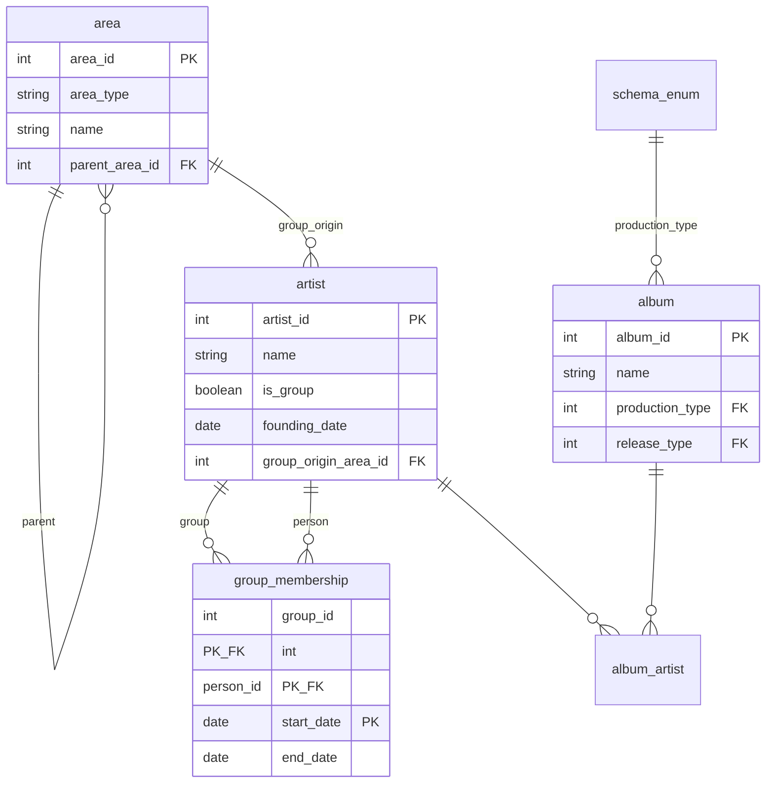

# Solution Sheet - March 2025 (Updated)

## Exam Overview

| Section | Questions | Marks |
|---------|-----------|-------|
| Section A | 10 MCQs (taken separately on VLE) | 40 |
| Section B | Answer 2 of 3 | 60 |
| **Total** | | **100** |

**Note:** Section A MCQs are completed separately on the VLE. This solution sheet covers Section B questions.

---

# Section A: Multiple Choice Questions [40 marks]

Section A consists of 10 MCQs taken separately on the VLE. See the VLE for MCQ questions and answers.

---

# Section B

Candidates answer TWO of the following THREE questions.

---

# Question 2: Mortality Bills Dataset [30 marks]

## Context

A historical dataset of London mortality bills (1644-1849) contains weekly death counts by parish, age group, and cause of death.

**Data files:**
- `ages.txt` - Weekly death counts by age group (1729-1849)
- `counts.txt` - Weekly parish-level plague death counts (1644-1849)
- `ParcodeDict.txt` - Parish code dictionary
- City-wide cause-of-death file: `codID|weekID|cod|codn`

---

## Question 2(a) [12 marks]

**Question:** Design a logical schema for MySQL. List tables, fields, keys, and state what normal forms they satisfy. What fields have you removed/added compared to the original files?

---

### Answer

**Design Goals:**
- Separate *dimensions* (week, parish, age group, cause) from *facts* (weekly counts)
- Enable integrity, reproducibility, and flexible aggregation
- Ensure stable keys (e.g., `week_id` is the canonical `YYYY/WW` string from the data)

**Tables:**

| Table | Primary Key | Foreign Keys | Key Fields |
|-------|-------------|--------------|------------|
| **week** | `week_id` CHAR(7) | - | `year`, `week_no`, `week_seq`, `calendar_note` |
| **parish** | `parcode` CHAR(4) | - | `parish_name`, `alias1`, `alias2`, `bills_group_before_1660`, `bills_group_after_1660` |
| **age_group** | `age_group_id` INT | - | `label`, `age_year_min`, `age_year_max` |
| **cause** | `cause_id` INT | - | `cause_name` |
| **parish_weekly_count** | `count_id` INT | `week_id` → week, `parcode` → parish | `count_type`, `count_n` |
| **age_weekly_count** | (`week_id`, `age_group_id`) | Both to respective tables | `count_n` |
| **city_weekly_cause_count** | (`week_id`, `cause_id`) | Both to respective tables | `count_n` |

**Normal Forms Analysis:**

| Table | Normal Form | Justification |
|-------|-------------|---------------|
| All dimension tables | **3NF/BCNF** | Every non-key attribute depends on the key, the whole key, and nothing but the key |
| Fact tables | **3NF** | Use composite keys; `count_n` depends only on the full key |

**Removed/Added Fields:**

| Action | Field | Reason |
|--------|-------|--------|
| Replaced | String `agegroup` → normalized `age_group` table | Prevents typos, supports ordering by range |
| Added | `week_seq` in `week` | Monotonic ordering for time-series analysis |
| Added | `calendar_note` in `week` | Documents 1752 anomaly |
| Kept | Parish alias fields | Historical names preserved but separated from facts |

---

### Revision Notes

**Core Concept:** Dimensional modeling separates slowly-changing descriptive data (dimensions) from transactional measurements (facts).

**Star Schema Pattern:**

```
     ┌──────────┐     ┌──────────┐
     │   week   │     │  parish  │
     └────┬─────┘     └────┬─────┘
          │                │
          ▼                ▼
     ┌────────────────────────────┐
     │   parish_weekly_count      │ ← Fact Table
     │   (measurements/counts)    │
     └────────────────────────────┘
```

**Why This Design?**

| Approach | Benefit |
|----------|---------|
| Dimension tables | Avoid storing "St Dunstan Stepney" repeatedly; update in one place |
| Composite keys for facts | Natural business key semantics (week + parish + type) |
| `week_id` as CHAR(7) | Preserves original format; avoids date ambiguity |

**Common Mistakes:**
- Using auto-increment IDs when natural keys exist (e.g., `parcode`)
- Not separating dimensions from facts (storing parish names in every row)
- Forgetting UNIQUE constraints on business keys
- Not handling the 1752 calendar anomaly

---

## Question 2(b) [3 marks]

**Question:** How would you represent the date in MySQL, and what issues are raised by the 1752 skip?

---

### Answer

**Representation Choice:** Use `week_id` (CHAR(7), e.g., `'1729/01'`) as the canonical week key and store `year`, `week_no` separately; optionally add `week_seq` for strictly increasing ordering.

**Issues Raised by 1752 Skip:**

| Issue | Explanation |
|-------|-------------|
| **Missing weeks** | Only 51 bills in 1752; one "week" covers fewer than 7 days |
| **Non-uniform boundaries** | Gregorian dates for week boundaries are non-uniform |
| **Rate calculations** | Logic assuming 52-53 weeks/year or 7 days/week will miscompute rates |
| **Comparability** | May need `week_length_days` metadata field to adjust rates |

---

### Revision Notes

**Core Concept:** The British Calendar Act of 1752 caused 11 days (September 3-13) to be skipped when switching from Julian to Gregorian calendar.

**Historical Context:**

```
September 1752:
Sun Mon Tue Wed Thu Fri Sat
          1   2  14  15  16   ← Jumped from 2nd to 14th!
17  18  19  20  21  22  23
24  25  26  27  28  29  30
```

**Design Options:**

| Approach | Pros | Cons |
|----------|------|------|
| Store as `YYYY/WW` string | Preserves original data | Can't use DATE functions |
| Convert to DATE with NULL for ambiguous | Can use date arithmetic | Loses information |
| Hybrid with `week_seq` | Best of both worlds | More complex |

**Common Mistakes:**
- Assuming DATE type can represent all historical dates correctly
- Using WEEK() function which assumes Gregorian calendar
- Not documenting the anomaly in schema or comments

---

## Question 2(c) [2 marks]

**Question:** Write a query to find plague deaths in St Dunstan, Stepney (parcode 'STEP') for week 2 of 1729.

---

### Answer

```sql
SELECT c.count_n
FROM parish_weekly_count AS c
JOIN week AS w ON w.week_id = c.week_id
WHERE c.parcode = 'STEP'
  AND w.year = 1729
  AND w.week_no = 2
  AND c.count_type = 'plague';
```

---

### Revision Notes

**Core Concept:** Joining dimension and fact tables to filter by human-readable criteria.

**Query Pattern:**
```
Fact Table (counts) ←JOIN→ Dimension Table (week)
                    ←JOIN→ Dimension Table (parish)
```

**Alternative Approach (if using `week_id` directly):**
```sql
SELECT count_n
FROM parish_weekly_count
WHERE parcode = 'STEP'
  AND week_id = '1729/02'
  AND count_type = 'plague';
```

**Common Mistakes:**
- Forgetting to filter by `count_type` (the table stores multiple count types)
- Using `w.week_id = '1729/2'` instead of `'1729/02'` (format matters)

---

## Question 2(d) [4 marks]

**Question:** Write a query to show annual deaths by age group for years 1760-1790.

---

### Answer

```sql
SELECT
  w.year,
  ag.label AS age_group,
  SUM(a.count_n) AS total_deaths
FROM age_weekly_count AS a
JOIN week      AS w  ON w.week_id = a.week_id
JOIN age_group AS ag ON ag.age_group_id = a.age_group_id
WHERE w.year BETWEEN 1760 AND 1790
GROUP BY w.year, ag.label;
```

---

### Revision Notes

**Core Concept:** Aggregating fact table data by multiple dimensions using GROUP BY.

**Query Structure:**
1. **FROM**: Start with fact table
2. **JOIN**: Connect to dimensions for labels and filtering
3. **WHERE**: Filter the date range
4. **GROUP BY**: Define aggregation granularity
5. **SELECT**: Choose output columns and aggregations

**Aggregation Functions:**

| Function | Use Case |
|----------|----------|
| `SUM()` | Total counts |
| `AVG()` | Average values |
| `COUNT()` | Number of records |
| `COUNT(DISTINCT)` | Unique values |

**Common Mistakes:**
- Forgetting to GROUP BY all non-aggregated columns
- Using `HAVING` instead of `WHERE` for row-level filters
- Not joining to `age_group` table (would only show IDs, not labels)

---

## Question 2(e) [5 marks]

**Question:** How would you add the city-wide cause-of-death data? How would you check if parish totals match city totals?

---

### Answer

**Add Tables:** Create `cause` and `city_weekly_cause_count` tables (see part (a)). Load `cod` values into `cause(cause_name)` and `codn` into `city_weekly_cause_count(count_n)` keyed by `week_id`.

**Parity Check Query:**

```sql
WITH parish_totals AS (
  SELECT w.year, SUM(c.count_n) AS total_parish
  FROM parish_weekly_count c
  INNER JOIN week w ON c.week_id = w.week_id
  WHERE c.count_type = 'total'
  GROUP BY w.year
),
city_totals AS (
  SELECT w.year, SUM(c.count_n) AS total_city
  FROM city_weekly_cause_count c
  INNER JOIN week w ON c.week_id = w.week_id
  GROUP BY w.year
)
SELECT
  p.year,
  p.total_parish,
  c.total_city,
  (p.total_parish = c.total_city) AS matches
FROM parish_totals p
LEFT JOIN city_totals c ON p.year = c.year;
```

*Note: If `counts.txt` lacks a "total" row, compare specific causes (e.g., `Plague`) that appear in both sources.*

---

### Revision Notes

**Core Concept:** Data validation through cross-source reconciliation using CTEs.

**CTE (Common Table Expression) Pattern:**
```sql
WITH aggregation1 AS (...),
     aggregation2 AS (...)
SELECT ... FROM aggregation1 JOIN aggregation2 ...
```

**Why Parity Checks Matter:**

| Issue | Detection |
|-------|-----------|
| Missing data | Totals don't match |
| Duplicate records | City total > parish total |
| Transcription errors | Inconsistent year-over-year patterns |

**Common Mistakes:**
- Comparing at wrong granularity (weekly vs yearly)
- Forgetting LEFT JOIN (would hide mismatches where one side is NULL)
- Not filtering by `count_type` appropriately

---

## Question 2(f) [4 marks]

**Question:** What issues would need to be addressed to use this data for population-health trends? What other data would help?

---

### Answer

**Issues:**

| Category | Issue |
|----------|-------|
| **Definition drift** | Cause names and diagnostic practices change over 205 years (e.g., "Consumption" vs tuberculosis) |
| **Coverage changes** | Parish borders, mergers/splits, and "within/without" groupings change |
| **Data quality** | Under-registration, wartime disruptions, epidemic spikes, missing/duplicated weeks |
| **Temporal irregularities** | The 1752 calendar anomaly; possible week-length variability |
| **Confounding** | Age structure changes over time; crude death counts are not comparable |

**Helpful External Data:**

| Data Source | Purpose |
|-------------|---------|
| Population denominators by parish/year | Compute death **rates** (not just counts) |
| Age-structure estimates | Produce **age-standardized** rates |
| Administrative boundary histories | GIS shapes for parish mapping |
| Tax/price indices, weather, epidemic timelines | Context for interpretation |
| Cause-name concordance | Map historical labels to modern categories |

---

### Revision Notes

**Core Concept:** Historical data analysis requires understanding context, limitations, and potential biases.

**Key Questions for Any Historical Dataset:**

| Question | Why It Matters |
|----------|---------------|
| Who collected it? | Motivation, potential bias |
| How complete is coverage? | Geographic, temporal, demographic gaps |
| Did definitions change? | Comparability over time |
| What external events affected collection? | Wars, epidemics, administrative changes |

**Common Mistakes:**
- Treating counts as rates (need denominator population)
- Ignoring definitional changes over time
- Not accounting for boundary changes
- Assuming modern data quality standards

---

# Question 3: BeerXML [30 marks]

## Context

A BeerXML file containing brewing recipe data with elements for recipes, hops, fermentables, yeasts, and styles.

---

## Question 3(a) [1 mark]

**Question:** What format is this?

---

### Answer

**XML** in the **BeerXML** vocabulary (the comment notes BeerXML; encoding ISO-8859-1).

---

### Revision Notes

**Core Concept:** Recognizing XML format indicators.

**Key Indicators:**

| Indicator | Meaning |
|-----------|---------|
| `<?xml version="1.0"?>` | XML declaration |
| `encoding="ISO-8859-1"` | Character encoding |
| `<!-- comment -->` | XML comment syntax |
| `<TAG>...</TAG>` | Element structure |

---

## Question 3(b) [1 mark]

**Question:** What is the root node?

---

### Answer

`<RECIPES>` is the document element (root), containing one or more `<RECIPE>` elements.

---

### Revision Notes

**Core Concept:** XML document structure.

**XML Tree Structure:**
```
Document
  └── Root Element (<RECIPES>)
        ├── Child Element (<RECIPE>)
        │     ├── <NAME>
        │     ├── <HOPS>
        │     │     └── <HOP>...
        │     └── ...
        └── Child Element (<RECIPE>)
              └── ...
```

**Common Mistakes:**
- Confusing `<?xml ?>` declaration with root element
- Thinking `<RECIPE>` is the root (it's a child of `<RECIPES>`)

---

## Question 3(c) [3 marks]

**Question:** Does this instance reference a schema? How could you validate it?

---

### Answer

The instance shows **no namespace or schema reference**. BeerXML defines an element vocabulary; validation can be done by:

| Method | Description |
|--------|-------------|
| **XSD** | Use a published XML Schema and validate with an XML Schema validator |
| **DTD** | Create a Document Type Definition |
| **RelaxNG** | Create a RelaxNG schema for structural rules |
| **Schematron** | Add semantic rules (e.g., units, value ranges) |

---

### Revision Notes

**Core Concept:** Schema validation vs well-formedness.

**Validation Levels:**

| Level | Checks | Tool |
|-------|--------|------|
| **Well-formed** | Tags balanced, proper nesting | Any XML parser |
| **Valid (DTD)** | Matches DTD rules | `xmllint --dtdvalid` |
| **Valid (XSD)** | Matches XML Schema | `xmllint --schema` |
| **Valid (RelaxNG)** | Matches RelaxNG | `jing` or `xmllint --relaxng` |

**Common Mistakes:**
- Assuming well-formed means valid
- Not checking for schema/namespace declarations

---

## Question 3(d) [4 marks]

**Question:** Write an XPath expression to return the names of all hops in recipe "Burton Ale".

---

### Answer

```xpath
//RECIPE[NAME='Burton Ale']/HOPS/HOP/NAME/text()
```

---

### Revision Notes

**Core Concept:** XPath navigation and filtering.

**XPath Breakdown:**

| Part | Meaning |
|------|---------|
| `//RECIPE` | Find any RECIPE element anywhere |
| `[NAME='Burton Ale']` | Filter: child NAME equals "Burton Ale" |
| `/HOPS` | Navigate to child HOPS |
| `/HOP` | Navigate to child HOP elements |
| `/NAME` | Navigate to child NAME |
| `/text()` | Extract text content |

**XPath Axes Reference:**

| Axis | Meaning | Example |
|------|---------|---------|
| `/` | Child | `/root/child` |
| `//` | Descendant (any depth) | `//element` |
| `..` | Parent | `../sibling` |
| `@` | Attribute | `@attr` |

**Common Mistakes:**
- Forgetting predicates are case-sensitive (`'Burton Ale'` ≠ `'burton ale'`)
- Using `//` when `/` is sufficient (less efficient)
- Forgetting `/text()` to get content vs element

---

## Question 3(e) [3 marks]

**Question:** What does 10-fold cross-validation mean?

---

### Answer

Split the dataset into **10 approximately equal folds**. Train on 9 folds, test on the held-out fold; **repeat 10 times** with different held-out folds; report the **average (and variance)** of the metrics across the 10 runs.

---

### Revision Notes

**Core Concept:** Cross-validation reduces variance in model evaluation.

**10-Fold Process:**

```
Data: [1][2][3][4][5][6][7][8][9][10]

Fold 1: Train=[2-10], Test=[1]  → Score₁
Fold 2: Train=[1,3-10], Test=[2] → Score₂
...
Fold 10: Train=[1-9], Test=[10] → Score₁₀

Final Score = Average(Score₁...Score₁₀)
```

**Why Cross-Validation?**

| Problem | Solution |
|---------|----------|
| Small dataset | Use all data for both training and testing |
| Variance in single split | Average over multiple splits |
| Overfitting detection | Test on truly unseen data |

**Common Mistakes:**
- Confusing k-fold with train/test split
- Forgetting to report variance/standard deviation
- Data leakage between folds

---

## Question 3(f) [6 marks]

**Question:** A classifier for beer styles (15 styles) achieves 50% accuracy. Is this good? What else would you want to know?

---

### Answer

**Is 50% Good?**

| Baseline | Accuracy |
|----------|----------|
| Random guessing | 1/15 ≈ **6.7%** |
| Majority class | Depends on class distribution |
| This classifier | **50%** |

**50% is significantly above random baseline** (7.5× better than random), but may not be sufficient depending on requirements.

**What Else to Know:**

| Factor | Why Important |
|--------|---------------|
| **Per-class precision/recall/F1** | 50% overall may hide poor performance on some styles |
| **Confusion matrix** | Which styles are confused with each other? |
| **Fold-to-fold variance** | Is 50% consistent or variable? |
| **Class imbalance** | Is one style dominant? |
| **Data size** | Enough samples per class? |
| **Top-k accuracy** | Does the correct style appear in top 3? |
| **External validation** | Performance on held-out test set? |

---

### Revision Notes

**Core Concept:** Evaluating classifier performance requires context.

**Classification Metrics:**

| Metric | Formula | Use When |
|--------|---------|----------|
| **Accuracy** | Correct / Total | Balanced classes |
| **Precision** | TP / (TP + FP) | Cost of false positives high |
| **Recall** | TP / (TP + FN) | Cost of false negatives high |
| **F1** | 2 × (P × R)/(P + R) | Balance precision and recall |

**Common Mistakes:**
- Comparing to random without calculating the baseline
- Ignoring class imbalance
- Not reporting confidence intervals

---

## Question 3(g) [3 marks]

**Question:** Is BeerXML primarily a document database format or a data interchange format?

---

### Answer

Primarily **data interchange**: BeerXML is a portable, structured format exchanged between brewing tools. The tree mirrors a single recipe, not an optimized query model across many documents; it lacks cross-document identifiers and indexing typical of a document database deployment.

---

### Revision Notes

**Core Concept:** Data interchange vs storage formats serve different purposes.

| Aspect | Interchange Format | Database Format |
|--------|-------------------|-----------------|
| **Purpose** | Move data between systems | Store and query data |
| **Optimization** | Human-readable, portable | Query performance, indexing |
| **Cross-references** | Self-contained documents | IDs linking across documents |
| **Examples** | BeerXML, CSV, JSON export | MongoDB, Cassandra |

---

## Question 3(h) [9 marks]

**Question:** Compare tree (XML/JSON), graph, and relational models for storing brewing recipe data.

---

### Answer

**Tree (XML/JSON):**

| Pros | Cons |
|------|------|
| Natural for single recipe (one-to-many subelements) | Hard to deduplicate ingredients across recipes |
| Self-contained, readable | Cross-recipe queries require scanning documents |
| Good for interchange and transport | No referential integrity |

**Relational:**

| Pros | Cons |
|------|------|
| Normalize Ingredient, Hop, Recipe, RecipeHop | More upfront modeling |
| Strong integrity, joins, aggregation | Schema migrations for optional fields |
| Powerful filtering and indexing | Object-relational mismatch |

**Graph (RDF/Property Graph):**

| Pros | Cons |
|------|------|
| Best for modeling relationships (substitutions, origins) | Additional infrastructure |
| Flexible schema evolution | Need careful ontology design |
| Path queries (e.g., "substitutes-of-substitutes") | Learning curve |

**Recommendation:** Depends on:
- Query workload (per-recipe vs cross-corpus analytics)
- Need for global identifiers
- Data integration with external knowledge
- Governance requirements (constraints vs flexibility)

---

### Revision Notes

**Core Concept:** Data model selection depends on query patterns and relationships.

**Decision Matrix:**

| If You Need... | Choose... |
|----------------|-----------|
| Store/retrieve single recipes | Tree (XML/JSON) |
| Query across all recipes | Relational |
| Model complex relationships | Graph |
| Interchange between systems | Tree (XML/JSON) |

**Common Mistakes:**
- Choosing based on familiarity rather than requirements
- Not considering query patterns
- Ignoring maintenance and evolution needs

---

# Question 4: MusicBrainz JSON-LD / RDF [30 marks]

## Context

JSON-LD data from MusicBrainz was converted to RDF/Turtle describing artists, albums, and their relationships using schema.org vocabulary.

---

## Question 4(a) [2 marks]

**Question:** What did it convert into? What is the relation to JSON-LD?

---

### Answer

It was converted to **RDF in Turtle** (Terse RDF Triple Language). **JSON-LD** and **Turtle** are just two serializations of the **same RDF graph**.

---

### Revision Notes

**Core Concept:** RDF is a data model; serializations are different ways to write it.

**RDF Serialization Formats:**

| Format | Extension | Key Features |
|--------|-----------|--------------|
| **Turtle** | .ttl | Human-readable, prefixes |
| **JSON-LD** | .jsonld | JSON syntax, web-friendly |
| **N-Triples** | .nt | One triple per line |
| **RDF/XML** | .rdf | XML-based, verbose |

**Common Mistakes:**
- Thinking Turtle and JSON-LD are different data models
- Not recognizing they represent the same triples

---

## Question 4(b) [1 mark]

**Question:** Which ontology is used? (ONE answer)

---

### Answer

**`schema.org`** (every class/property shown is `schema:*`).

---

### Revision Notes

**Core Concept:** Ontologies provide shared vocabularies.

**Common Ontologies:**

| Ontology | Domain | Example Properties |
|----------|--------|-------------------|
| **schema.org** | General web | `name`, `birthDate`, `member` |
| **FOAF** | Social | `knows`, `name`, `mbox` |
| **Dublin Core** | Metadata | `creator`, `title`, `date` |
| **SKOS** | Taxonomies | `broader`, `narrower`, `prefLabel` |

---

## Question 4(c) [1 mark]

**Question:** Give an example triple where the requested URL does not occur as subject or object.

---

### Answer

```turtle
mbarea:489ce91b-6658-3307-9877-795b68554c98 a schema:Country .
```

This triple has the area (United States) as subject and `schema:Country` as object—neither is the requested artist IRI.

---

### Revision Notes

**Core Concept:** RDF triples consist of subject, predicate, object.

**Triple Structure:**
```
Subject  ──predicate──>  Object
  │                        │
  └── Who/What ──────────── About What
```

**Common Mistakes:**
- Forgetting that `a` (rdf:type) is a predicate
- Not recognizing blank nodes as valid subjects/objects

---

## Question 4(d) [2 marks]

**Question:** What bug exists in the schema:MusicAlbum export? What causes it?

---

### Answer

**Two Issues:**

| Bug | Explanation |
|-----|-------------|
| **Undefined prefix** | `mbartist:` used but only `mbart:` declared—breaks link to artist |
| **Quoted IRIs** | Values like `"http://schema.org/StudioAlbum"` are string literals, not IRIs |

**Likely Cause:** Errors in JSON-LD→RDF conversion or mapping (treating `@id` values as strings; typo in prefix mapping).

---

### Revision Notes

**Core Concept:** RDF requires careful distinction between IRIs and literals.

**IRI vs Literal:**

| Format | Type | Example |
|--------|------|---------|
| `<http://...>` | IRI | Resource identifier |
| `"http://..."` | Literal | String value |
| `prefix:local` | Prefixed IRI | Expands to full IRI |

**Common Mistakes:**
- Using string literals where IRIs are needed
- Typos in prefix declarations
- Inconsistent prefix naming

---

## Question 4(e) [2 marks]

**Question:** One person says there are "two members", another says "impossible to know how many". Who is correct?

---

### Answer

**"Impossible to know"** is correct. The graph asserts **at least two** members via two `schema:member` organization roles, but under the **open-world assumption** absence of additional triples doesn't mean they don't exist.

---

### Revision Notes

**Core Concept:** Open-World Assumption (OWA) in RDF.

| Assumption | Meaning | Example |
|------------|---------|---------|
| **Closed World (CWA)** | What's not stated is false | SQL databases |
| **Open World (OWA)** | What's not stated is unknown | RDF/Linked Data |

**Implications:**
- Can't count members by counting triples
- Absence of data ≠ negation
- Need explicit closed-world statements if required

**Common Mistakes:**
- Applying closed-world reasoning to RDF
- Assuming complete data when it may be partial

---

## Question 4(f) [4 marks]

**Question:** Write a SPARQL query to find all groups founded in the United States.

---

### Answer

```sparql
PREFIX schema: <http://schema.org/>

SELECT DISTINCT ?group ?name
WHERE {
  ?group a schema:MusicGroup ;
         schema:name ?name ;
         schema:groupOrigin/schema:containedIn* ?country .
  ?country a schema:Country ;
           schema:name "United States" .
}
ORDER BY ?name
```

---

### Revision Notes

**Core Concept:** SPARQL property paths for hierarchical relationships.

**Property Path Operators:**

| Operator | Meaning | Example |
|----------|---------|---------|
| `/` | Sequence | `a/b` = a then b |
| `*` | Zero or more | `a*` = 0+ repetitions |
| `+` | One or more | `a+` = 1+ repetitions |
| `?` | Zero or one | `a?` = optional |
| `\|` | Alternative | `a\|b` = a or b |

**Query Pattern:**
```
MusicGroup ──groupOrigin──> Location ──containedIn*──> Country
```

**Common Mistakes:**
- Forgetting `*` allows zero hops (direct match)
- Not using DISTINCT when paths may converge
- Hardcoding country name without `schema:Country` type check

---

## Question 4(g) [2 marks]

**Question:** How would you ensure results are real groups, not persons?

---

### Answer

Filter out resources also typed as `schema:Person`, **or** require a group-specific property:

```sparql
# Option A: Exclude persons
FILTER NOT EXISTS { ?group a schema:Person }

# Option B: Require group-specific structure
?group schema:member ?role .
?role a schema:OrganizationRole .
```

---

### Revision Notes

**Core Concept:** Filtering by type or structural properties.

**FILTER Patterns:**

| Pattern | Use Case |
|---------|----------|
| `FILTER NOT EXISTS { ... }` | Exclude matches |
| `FILTER EXISTS { ... }` | Require matches |
| `FILTER (?var != value)` | Value exclusion |

**Common Mistakes:**
- Using `!= schema:Person` (wrong—checks for exact non-match)
- Not handling multiple types per resource

---

## Question 4(h) [4 marks]

**Question:** Write a SPARQL query to list all albums made by bands of which John Linnell has been a member.

---

### Answer

```sparql
PREFIX schema: <http://schema.org/>

SELECT DISTINCT ?album ?albumName ?bandName
WHERE {
  # Identify John Linnell node
  ?john a schema:Person ;
        schema:name "John Linnell" .

  # Find bands where John is/was a member (via OrganizationRole)
  ?band a schema:MusicGroup ;
        schema:name ?bandName ;
        schema:member [ a schema:OrganizationRole ;
                        schema:member ?john ] .

  # Albums associated with that band (either direction)
  {
    ?album a schema:MusicAlbum ;
           schema:byArtist ?band ;
           schema:name ?albumName .
  }
  UNION
  {
    ?band schema:album ?album .
    ?album a schema:MusicAlbum ;
           schema:name ?albumName .
  }
}
ORDER BY ?bandName ?albumName
```

---

### Revision Notes

**Core Concept:** Following complex relationship chains with UNION for alternative patterns.

**Query Structure:**
```
John Linnell ←member─ OrganizationRole ←member─ Band
                                                  │
                              ┌───────────────────┴────────────────────┐
                              │                                        │
                         byArtist                                  album
                              │                                        │
                              ▼                                        ▼
                           Album                                    Album
```

**Common Mistakes:**
- Forgetting the OrganizationRole intermediate node
- Not using UNION for bidirectional relationships
- Missing DISTINCT when UNION may duplicate

---

## Question 4(i) [2 marks]

**Question:** Why might MusicBrainz not offer a public SPARQL endpoint?

---

### Answer

| Reason | Explanation |
|--------|-------------|
| **Operational cost/abuse risk** | Arbitrary queries are expensive, hard to rate-limit; vulnerability to denial-of-service |
| **Stability/governance** | Evolving schema and data; hard to guarantee backward compatibility and predictable performance |

---

### Revision Notes

**Core Concept:** Public SPARQL endpoints have significant operational challenges.

**SPARQL Endpoint Risks:**

| Risk | Mitigation |
|------|------------|
| Expensive queries | Timeout limits, query complexity limits |
| DoS attacks | Rate limiting, authentication |
| Unpredictable load | Caching, query rewriting |
| Schema changes | Versioned endpoints |

---

## Question 4(j) [10 marks]

**Question:** Design a relational schema mirroring the RDF view.

---

### Answer

**Core Tables:**

| Table | Primary Key | Foreign Keys | Key Fields |
|-------|-------------|--------------|------------|
| **area** | `area_id` | `parent_area_id` → area | `area_type`, `name` |
| **artist** | `artist_id` | `group_origin_area_id` → area | `name`, `is_group`, `founding_date` |
| **group_membership** | (`group_id`, `person_id`, `start_date`) | Both → artist | `end_date` |
| **album** | `album_id` | `production_type` → schema_enum | `name`, `release_type` |
| **album_artist** | (`album_id`, `artist_id`) | Both to respective tables | `credited_to_text` |
| **schema_enum** | `enum_id` | - | `iri`, `label` |

**E/R Diagram:**



**Normal Forms:**
- All tables in **3NF/BCNF**: each non-key attribute depends only on its key
- Enumerations normalized (`schema_enum`) for referential integrity
- Areas form a self-referencing tree matching `containedIn`

---

### Revision Notes

**Core Concept:** Mapping RDF to relational requires identifying entities and relationship patterns.

**RDF to Relational Mapping:**

| RDF Pattern | Relational Equivalent |
|-------------|----------------------|
| Class (rdf:type) | Table |
| Property (literal) | Column |
| Property (object) | Foreign key |
| Blank node with properties | Junction table with attributes |
| Hierarchy (containedIn) | Self-referencing FK |

**Common Mistakes:**
- Forgetting junction tables for M:N relationships
- Not handling relationship attributes (start_date, end_date)
- Using strings instead of lookup tables for enumerations

---

# Quick Reference Summary

## SQL Essentials

```sql
-- Dimensional query pattern
SELECT d.label, SUM(f.count)
FROM fact_table f
JOIN dimension d ON f.dim_id = d.id
WHERE d.year BETWEEN 1760 AND 1790
GROUP BY d.label;

-- Parity check with CTEs
WITH source1 AS (...), source2 AS (...)
SELECT * FROM source1 LEFT JOIN source2 ON ...;
```

## XPath Essentials

```xpath
//RECIPE[NAME='Burton Ale']     -- Find recipe by name
/HOPS/HOP/NAME/text()           -- Navigate to hop names
//element[@attr='value']        -- Filter by attribute
```

## SPARQL Essentials

```sparql
PREFIX schema: <http://schema.org/>

SELECT ?s ?name
WHERE {
  ?s a schema:MusicGroup ;          # Type filter
     schema:name ?name ;            # Get property
     schema:groupOrigin/schema:containedIn* ?country .  # Property path
  FILTER NOT EXISTS { ?s a schema:Person }  # Exclusion
}
```

## Turtle Triple Counting

| Syntax | Effect |
|--------|--------|
| `.` | End statement |
| `;` | Same subject, new predicate |
| `,` | Same subject+predicate, new object |

```turtle
:Bob a :Person ;       # Triple 1
     :name "Bob" ;     # Triple 2
     :knows :A, :B .   # Triples 3 and 4
# Total: 4 triples
```

## Normal Forms

| Form | Rule |
|------|------|
| **1NF** | Atomic values, no repeating groups |
| **2NF** | 1NF + no partial dependencies |
| **3NF** | 2NF + no transitive dependencies |
| **BCNF** | Every determinant is a candidate key |

---

*End of Solution Sheet - March 2025*
