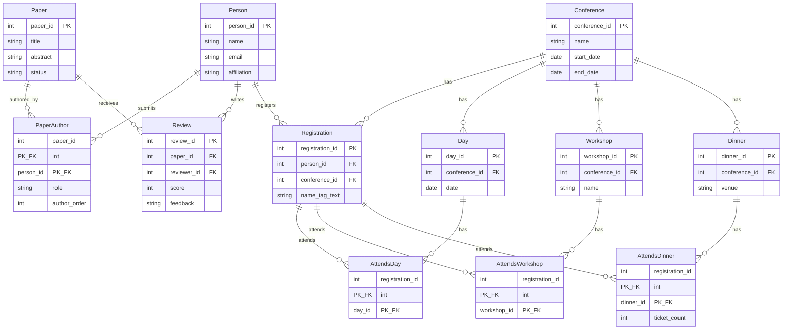

# Solution Sheet - Mock October 2025

## Exam Overview

| Part | Questions | Marks |
|------|-----------|-------|
| Part A | 10 MCQs (not included in mock) | 40 |
| Part B | Answer BOTH questions | 60 |
| **Total** | | **100** |

**Note:** This is a mock exam. Part A MCQs are not included. Part B requires answering BOTH questions.

---

# Part A: Multiple Choice Questions [40 marks]

Part A consists of 10 MCQs not included in the mock paper. See the VLE for MCQ practice.

---

# Part B

Candidates should answer **BOTH** questions from Part B.

**IMPORTANT:** Full marks will only be awarded for the correct answer with ALL steps shown.

---

# Question 2: MARC Library Catalogue [30 marks]

## Context

The Bodleian Library of Oxford University stores its main catalogue using a standard called MARC (MAchine-Readable Cataloging). The example shows a MARC record for "Pippi Longstocking" by Astrid Lindgren.

**Key MARC codes in the example:**
- `001-035`: Catalogue IDs
- `040`: Cataloguing agencies ($a=original, $c=transcriber, $d=modifiers)
- `041`: Language (1=translation, $a=language codes like "engswe")
- `100`: Main personal name (1=surname first, $a=name, $d=dates)
- `240`: Uniform title ($l=language)
- `245`: Title statement ($c=statement of responsibility)
- `260`: Publication info ($a=place, $b=publisher, $c=date)
- `300`: Physical description ($a=pages, $b=illustrations, $c=dimensions)
- `520`: Summary
- `700`: Added personal name entry

---

## Question 2(a) [8 marks]

**Question:** The MARC standard specifies a binary format for sharing data from this sort of catalogue, but what sort of database system would be best for storing and retrieving it? Justify your answer.

---

### Answer

**Recommended: Document Database (e.g., MongoDB) or Relational Database with careful design**

| Option | Suitability | Justification |
|--------|-------------|---------------|
| **Document DB** | **Good** | MARC records are self-contained units with variable fields; document model handles schema flexibility well |
| **Relational DB** | **Good** | Well-understood, strong query capabilities, but requires careful normalization for variable subfields |
| **Key-Value Store** | Moderate | Simple storage but limited query capability |
| **Graph DB** | Moderate | Useful for relationships between works, but overkill for single-record storage |

**Why Document Database is often preferred:**

1. **Schema flexibility**: MARC records have ~999 possible field codes, but any given record uses only a subset. Document DBs handle this naturally without NULL-heavy tables.

2. **Variable subfields**: Fields like 040 have multiple $a, $c, $d subfields. Document DBs store these as arrays easily.

3. **Self-contained records**: Each bibliographic record is a logical unit—fits the document model well.

4. **Query needs**: Libraries typically retrieve whole records by ID, search by specific fields (author, title), or perform full-text search—all well-supported by document DBs.

**Why Relational could also work:**

1. **Mature technology**: Libraries have decades of experience with relational systems.

2. **Strong consistency**: ACID transactions for cataloguing workflows.

3. **Cross-record queries**: Finding all books by an author, all translations of a work—joins are natural.

4. **Normalized author/subject authorities**: Separate tables for controlled vocabularies prevent duplication.

---

### Revision Notes

**Core Concept:** Database selection depends on data structure, query patterns, and operational requirements.

**Decision Factors:**

| Factor | Document DB | Relational DB |
|--------|-------------|---------------|
| Schema variability | Excellent | Requires EAV or many NULLs |
| Query flexibility | Good (with indexes) | Excellent (SQL) |
| Relationships | Limited | Excellent (joins) |
| Transactions | Varies | Excellent |
| Scalability | Horizontal | Vertical (typically) |

**MARC-specific Considerations:**

| Characteristic | Implication |
|----------------|-------------|
| ~999 field codes | Most records use <50 fields |
| Repeatable fields | 700 (added author) can appear multiple times |
| Subfield structure | $a, $b, $c within each field |
| Authority control | Authors/subjects link to authority records |

**Common Mistakes:**
- Claiming one database type is "always best" without justification
- Ignoring the variable-field nature of MARC
- Forgetting about cross-record queries (finding all books by author)
- Not considering existing library infrastructure

---

## Question 2(b) [6 marks]

**Question:** Code point 100 indicates the main personal name associated with the record. The leading 1 refers to the format of the name – it specifies that surname is given first. $a indicates the name string, while $d specifies the dates. How would you represent this information in your recommended database system? What problems might arise?

---

### Answer

**Document Database Representation:**

```json
{
  "field_100": {
    "ind1": "1",
    "ind2": " ",
    "subfields": {
      "a": "Lindgren, Astrid,",
      "d": "1907-2002."
    }
  }
}
```

**Or with separate Person collection (normalized approach):**

```json
// In Person collection
{
  "_id": "person_lindgren_astrid",
  "name_surname_first": "Lindgren, Astrid",
  "name_display": "Astrid Lindgren",
  "birth_year": 1907,
  "death_year": 2002,
  "authority_ids": ["LC:n50048009", "VIAF:32783289"]
}

// In Book collection
{
  "main_author_id": "person_lindgren_astrid",
  "main_author_name_format": "surname_first"
}
```

**Relational Database Representation:**

```sql
CREATE TABLE Person (
    person_id INT PRIMARY KEY AUTO_INCREMENT,
    name_string VARCHAR(200),
    name_format ENUM('surname_first', 'forename_first', 'single_name'),
    birth_year SMALLINT,
    death_year SMALLINT
);

CREATE TABLE BookAuthor (
    book_id INT,
    person_id INT,
    role ENUM('main', 'contributor', 'illustrator'),
    PRIMARY KEY (book_id, person_id, role),
    FOREIGN KEY (book_id) REFERENCES Book(book_id),
    FOREIGN KEY (person_id) REFERENCES Person(person_id)
);
```

**Problems That Might Arise:**

| Problem | Description |
|---------|-------------|
| **Name parsing** | "Lindgren, Astrid," includes trailing comma—inconsistent punctuation |
| **Date formats** | "1907-2002." has trailing period; some dates are approximate ("ca. 1900") or partial ("1907-") |
| **Name variants** | Same person may appear as "Lindgren, Astrid", "Astrid Lindgren", "A. Lindgren" |
| **Authority control** | Need to link to authority records (VIAF, LC) to identify same person across records |
| **Indicator interpretation** | ind1="1" means surname first, but application must know this mapping |
| **Multiple names** | Pseudonyms, married names, transliterated names (e.g., Cyrillic to Latin) |

---

### Revision Notes

**Core Concept:** Personal names in bibliographic data require careful handling due to cultural variations and historical inconsistencies.

**Name Format Indicators (MARC 100 ind1):**

| Value | Meaning | Example |
|-------|---------|---------|
| 0 | Forename | "Cher" |
| 1 | Surname first | "Lindgren, Astrid" |
| 3 | Family name | "Kennedy family" |

**Authority Control:**
- Link names to authority records (LC, VIAF) for disambiguation
- "John Smith" could be thousands of different people
- Authority records provide unique identifiers

**Common Mistakes:**
- Storing names as single unparsed strings (loses structure)
- Assuming all names follow Western "First Last" convention
- Not handling approximate or unknown dates
- Ignoring authority linking

---

## Question 2(c) [6 marks]

**Question:** Suggest Entities, Attributes and Relationships for an ER model that would represent bibliographic items such as this book. Try to include everything you can see in the record above, and any additional information you might think would be useful.

---

### Answer

**Entities and Attributes:**

| Entity | Attributes |
|--------|------------|
| **Work** | work_id (PK), uniform_title, original_language |
| **Expression** | expression_id (PK), work_id (FK), language, form (text/audio/etc) |
| **Manifestation** | manifestation_id (PK), expression_id (FK), publisher, place, date, pages, dimensions, isbn |
| **Item** | item_id (PK), manifestation_id (FK), library_id (FK), call_number, condition |
| **Person** | person_id (PK), name_display, name_inverted, birth_date, death_date |
| **CorporateBody** | corp_id (PK), name, location |
| **Subject** | subject_id (PK), term, scheme (LCSH/MeSH/etc) |
| **Language** | language_code (PK), language_name |
| **Library** | library_id (PK), name, location |
| **CatalogueAgency** | agency_code (PK), agency_name |

**Relationships:**

| Relationship | Entities | Cardinality | Attributes |
|--------------|----------|-------------|------------|
| **Created** | Person → Work | M:N | role (author/illustrator/translator) |
| **PublishedBy** | Manifestation → CorporateBody | M:1 | |
| **HasSubject** | Work → Subject | M:N | |
| **InLanguage** | Expression → Language | M:N | |
| **TranslationOf** | Expression → Expression | M:1 | |
| **CataloguedBy** | Manifestation → CatalogueAgency | M:N | role (original/transcriber/modifier), date |
| **HeldBy** | Item → Library | M:1 | |

**E/R Diagram (FRBR-inspired):**


---

### Revision Notes

**Core Concept:** FRBR (Functional Requirements for Bibliographic Records) provides a standard model for bibliographic data.

**FRBR Hierarchy:**

| Level | Definition | Example |
|-------|------------|---------|
| **Work** | Distinct intellectual creation | "Pippi Långstrump" (the story) |
| **Expression** | Realization of a work | English translation by Edna Hurup |
| **Manifestation** | Physical embodiment | 1954 Oxford University Press edition |
| **Item** | Single exemplar | Copy held by Bodleian Library |

**Why This Matters:**

| Query | Requires Understanding |
|-------|----------------------|
| "All editions of Pippi Longstocking" | Work → Manifestations |
| "All translations" | Work → Expressions |
| "Where can I borrow this?" | Manifestation → Items → Libraries |

**Common Mistakes:**
- Treating "book" as a single entity (ignores work/expression/manifestation distinction)
- Not separating Person from their contributions (same person can be author AND translator)
- Forgetting corporate bodies (publishers, cataloguing agencies)
- Not handling translations as related expressions

---

## Question 2(d)(i) [2 marks]

**Question:** Give an XPath expression for retrieving information on whether items are translations (see earlier for the relevant MARC code).

---

### Answer

```xpath
//datafield[@tag='041']/@ind1
```

Or to get the full language information:

```xpath
//datafield[@tag='041']
```

Or to check specifically for translations (ind1="1"):

```xpath
//datafield[@tag='041' and @ind1='1']
```

**Explanation:** MARC code 041 contains language information. The first indicator (ind1) being "1" means the item is a translation. The subfield $a contains the language codes.

---

### Revision Notes

**Core Concept:** XPath navigates XML using path expressions and predicates.

**MARC XML Structure:**
```xml
<datafield tag="041" ind1="1" ind2=" ">
  <subfield code="a">engswe</subfield>
</datafield>
```

**XPath Patterns for MARC XML:**

| Query | XPath |
|-------|-------|
| All datafields | `//datafield` |
| Specific tag | `//datafield[@tag='041']` |
| Check indicator | `//datafield[@tag='041']/@ind1` |
| Get subfield value | `//datafield[@tag='041']/subfield[@code='a']/text()` |

**Common Mistakes:**
- Forgetting `@` for attributes
- Using single quotes inconsistently
- Not handling namespaces if present

---

## Question 2(d)(ii) [4 marks]

**Question:** An alternative approach to encoding MARC data in XML could have produced code like `<mainPerson><name format="surnameFirst">...</name><dates>...</dates></mainPerson>`. What difference do you think this would make for the schema and the functionality of the system? Why might they have chosen not to do this?

---

### Answer

**Differences with Semantic Element Names:**

| Aspect | Generic (`datafield/subfield`) | Semantic (`mainPerson/name`) |
|--------|-------------------------------|------------------------------|
| **Schema complexity** | Simple, one schema for all MARC | Complex, hundreds of element definitions |
| **Readability** | Requires MARC knowledge | Self-documenting |
| **XPath queries** | `//datafield[@tag='100']` | `//mainPerson` |
| **Validation** | Validates structure only | Can validate content types |
| **Extensibility** | Easy to add new codes | Requires schema changes |
| **Tooling** | Generic MARC processors work | Need custom tools |

**Why Library of Congress Chose Generic Approach:**

1. **Backward compatibility**: Any valid MARC record can be converted without schema changes.

2. **Schema stability**: MARC has ~999 possible field codes; defining elements for each would create a massive, frequently-changing schema.

3. **Interoperability**: Libraries worldwide use different MARC variants (MARC21, UNIMARC); generic structure handles all.

4. **Existing tooling**: MARC processors already understand tag/subfield structure; semantic approach would break existing workflows.

5. **Separation of concerns**: Structure (XML) separate from semantics (MARC documentation).

**Trade-offs:**

| Semantic Approach Would Provide | But Would Lose |
|--------------------------------|----------------|
| Self-documenting XML | Backward compatibility |
| Type validation (dates as dates) | Universal applicability |
| Cleaner XPath | Stable schema |
| IDE autocompletion | Existing tool compatibility |

---

### Revision Notes

**Core Concept:** XML schema design involves trade-offs between generic flexibility and semantic expressiveness.

**Design Patterns:**

| Pattern | Example | Use When |
|---------|---------|----------|
| **Generic** | `<field name="author">` | Schema varies, many optional fields |
| **Semantic** | `<author>` | Fixed schema, readability important |
| **Hybrid** | `<person role="author">` | Balance flexibility and meaning |

**Common Mistakes:**
- Assuming semantic is always better (ignores maintenance burden)
- Forgetting about existing ecosystem and tooling
- Not considering schema evolution over time

---

## Question 2(e) [4 marks]

**Question:** The Library of Congress have moved towards developing a Linked Data standard called BIBFRAME to supersede MARC. What benefits and what risks might they expect from this move?

---

### Answer

**Benefits of BIBFRAME/Linked Data:**

| Benefit | Explanation |
|---------|-------------|
| **Web integration** | URIs for resources enable linking across the web |
| **Deduplication** | Shared authority URIs (VIAF, Wikidata) reduce redundancy |
| **Richer relationships** | RDF expresses complex relationships (translations, adaptations) |
| **Interoperability** | Standard vocabularies (schema.org) enable cross-domain queries |
| **Discovery** | Search engines can understand and index bibliographic data |
| **Flexibility** | Add new properties without breaking existing data |

**Risks of the Move:**

| Risk | Explanation |
|------|-------------|
| **Migration cost** | Billions of MARC records must be converted |
| **Training** | Librarians must learn RDF, SPARQL, new workflows |
| **Tool ecosystem** | Decades of MARC tools must be replaced |
| **Data loss** | Some MARC nuances may not map cleanly to BIBFRAME |
| **Complexity** | RDF/Linked Data has steeper learning curve |
| **Dependency** | Relying on external URIs (Wikidata) creates dependencies |
| **Performance** | SPARQL queries can be slower than optimized MARC searches |

---

### Revision Notes

**Core Concept:** BIBFRAME uses RDF to model bibliographic data as linked resources rather than flat records.

**BIBFRAME vs MARC:**

| Aspect | MARC | BIBFRAME |
|--------|------|----------|
| Model | Flat record | Graph (Work → Instance → Item) |
| Identifiers | Local IDs | Global URIs |
| Relationships | Implicit in codes | Explicit RDF predicates |
| Extensibility | New MARC codes | New RDF properties |
| Query | Specialized search | SPARQL |

**BIBFRAME Classes:**
- **bf:Work** - Conceptual essence
- **bf:Instance** - Publication
- **bf:Item** - Specific copy

**Common Mistakes:**
- Assuming Linked Data solves all problems (it introduces new ones)
- Ignoring the massive existing MARC infrastructure
- Not considering the learning curve for library staff

---

# Question 3: Conference Management System [30 marks]

## Context

An academic conference system covering:
1. **Review process**: Paper submissions, reviewer assignments, scores, accept/reject decisions
2. **Registration**: Attendee info, name tags, attendance days, extras (workshops, dinner)

---

## Question 3(a) [14 marks]

**Question:** Develop an ER model for a basic conference system. List entities, attributes and relationships for your model.

---

### Answer

**Entities and Attributes:**

| Entity | Attributes |
|--------|------------|
| **Conference** | conference_id (PK), name, start_date, end_date, location, registration_deadline, submission_deadline |
| **Person** | person_id (PK), name, email, affiliation, dietary_requirements |
| **Paper** | paper_id (PK), title, abstract, pdf_path, submission_date, status (submitted/under_review/accepted/rejected) |
| **Review** | review_id (PK), paper_id (FK), reviewer_id (FK), score, feedback, confidence, recommendation (accept/weak_accept/weak_reject/reject), submitted_date |
| **Registration** | registration_id (PK), person_id (FK), conference_id (FK), name_tag_text, registration_date, amount_paid |
| **Day** | day_id (PK), conference_id (FK), date, description |
| **Workshop** | workshop_id (PK), conference_id (FK), name, date, capacity, extra_cost |
| **Dinner** | dinner_id (PK), conference_id (FK), date, venue, price |

**Relationships:**

| Relationship | Entities | Cardinality | Attributes |
|--------------|----------|-------------|------------|
| **Submits** | Person → Paper | M:N | role (author/corresponding_author), author_order |
| **AssignedTo** | Paper → Person (Reviewer) | M:N | assignment_date |
| **Reviews** | Person → Paper → Review | via Review entity | |
| **RegistersFor** | Person → Conference → Registration | M:N via Registration | |
| **AttendsDay** | Registration → Day | M:N | |
| **AttendsWorkshop** | Registration → Workshop | M:N | |
| **AttendsDinner** | Registration → Dinner | M:N | ticket_count |
| **BelongsTo** | Day/Workshop/Dinner → Conference | M:1 | |
| **PCMember** | Person → Conference | M:N | role (chair/pc_member) |

**E/R Diagram:**



---

### Revision Notes

**Core Concept:** Conference systems involve multiple roles (author, reviewer, attendee) that may be the same person.

**Key Design Decisions:**

| Decision | Rationale |
|----------|-----------|
| Single Person entity | Same person can be author, reviewer, AND attendee |
| Paper-Author M:N | Papers have multiple authors |
| Review as entity | Stores score, feedback—not just a relationship |
| Registration separate | Tracks payment, name tag, even if Person exists |
| Day as entity | Multi-day conferences need attendance tracking |

**Double-Blind Considerations:**
- Reviewer shouldn't see Paper.authors
- Author shouldn't see Review.person_id
- These are access control issues, not schema issues

**Common Mistakes:**
- Separate Author/Reviewer/Attendee tables (same person!)
- Missing M:N for Paper-Author
- Forgetting Review needs to store feedback text
- Not handling multi-day attendance

---

## Question 3(b) [4 marks]

**Question:** Imagine you have converted your model to the relational model and implemented it as a MySQL database. Give a query that would return the number of dinner tickets ordered.

---

### Answer

```sql
SELECT SUM(ticket_count) AS total_dinner_tickets
FROM AttendsDinner;
```

Or if tracking individual registrations without ticket_count:

```sql
SELECT COUNT(*) AS total_dinner_tickets
FROM AttendsDinner;
```

Or for a specific dinner event:

```sql
SELECT d.date, d.venue, SUM(ad.ticket_count) AS tickets_ordered
FROM Dinner d
JOIN AttendsDinner ad ON d.dinner_id = ad.dinner_id
GROUP BY d.dinner_id, d.date, d.venue;
```

Or joining to show conference context:

```sql
SELECT
    c.name AS conference,
    d.date AS dinner_date,
    COUNT(*) AS registrations_with_dinner,
    SUM(ad.ticket_count) AS total_tickets
FROM Conference c
JOIN Dinner d ON c.conference_id = d.conference_id
JOIN AttendsDinner ad ON d.dinner_id = ad.dinner_id
GROUP BY c.conference_id, d.dinner_id;
```

---

### Revision Notes

**Core Concept:** Aggregation queries use COUNT, SUM with GROUP BY.

**Query Patterns:**

| Need | SQL Pattern |
|------|-------------|
| Count rows | `COUNT(*)` |
| Sum values | `SUM(column)` |
| Count per group | `COUNT(*) ... GROUP BY` |
| Filter groups | `HAVING COUNT(*) > n` |

**Common Mistakes:**
- Using COUNT when SUM is needed (if ticket_count > 1 possible)
- Forgetting GROUP BY when selecting non-aggregated columns
- Not joining to get context (conference name, dinner date)

---

## Question 3(c) [4 marks]

**Question:** Reviews are often 'double blind'. This means that a reviewer doesn't know who authored the paper they are reviewing, and the author doesn't know who reviewed their paper. Give any GRANT statements for your database (and list any changes you'd have to make to your model) that would help support that anonymity.

---

### Answer

**Model Changes:**

1. Create **views** that hide sensitive columns:

```sql
-- View for reviewers: shows papers without author info
CREATE VIEW ReviewerPaperView AS
SELECT paper_id, title, abstract, pdf_path, status
FROM Paper;

-- View for authors: shows reviews without reviewer info
CREATE VIEW AuthorReviewView AS
SELECT r.paper_id, r.score, r.feedback, r.recommendation
FROM Review r;
```

2. Add **anonymized_pdf_path** column to Paper (PDF with author names removed)

**GRANT Statements:**

```sql
-- Create roles
CREATE ROLE reviewer_role;
CREATE ROLE author_role;
CREATE ROLE pc_chair_role;

-- Reviewers: can see papers (without authors), can write reviews
GRANT SELECT ON ReviewerPaperView TO reviewer_role;
GRANT SELECT, INSERT, UPDATE ON Review TO reviewer_role;
-- DENY access to author info
REVOKE SELECT ON PaperAuthor FROM reviewer_role;

-- Authors: can see their papers and anonymized reviews
GRANT SELECT ON Paper TO author_role;
GRANT SELECT ON AuthorReviewView TO author_role;
-- DENY access to reviewer identity
REVOKE SELECT (reviewer_id) ON Review FROM author_role;

-- PC Chair: full access for decision making
GRANT ALL ON Paper, Review, PaperAuthor, Person TO pc_chair_role;

-- Assign roles to users
GRANT reviewer_role TO 'reviewer1'@'localhost';
GRANT author_role TO 'author1'@'localhost';
```

**Additional Considerations:**

| Aspect | Implementation |
|--------|----------------|
| COI handling | Reviewers shouldn't see papers from same institution |
| Bid/assignment | May need separate bidding view with partial info |
| Rebuttal phase | Authors see reviews but not reviewers |
| Discussion | Reviewers see each other's reviews (usually) |

---

### Revision Notes

**Core Concept:** Database security uses GRANT/REVOKE and views to control access.

**SQL Permission Model:**

| Statement | Purpose |
|-----------|---------|
| `GRANT SELECT ON table TO user` | Allow reading |
| `GRANT INSERT ON table TO user` | Allow adding rows |
| `REVOKE privilege ON table FROM user` | Remove permission |
| `CREATE VIEW` | Virtual table showing subset of data |

**View-Based Security:**
```sql
-- Instead of GRANT on base table with column restrictions
-- Create a view and GRANT on the view
CREATE VIEW SafeView AS SELECT col1, col2 FROM BaseTable;
GRANT SELECT ON SafeView TO limited_user;
```

**Common Mistakes:**
- Forgetting views can enforce column-level security
- Not handling all the phases (submission, review, rebuttal, notification)
- Overlooking conflict-of-interest checks

---

## Question 3(d) [4 marks]

**Question:** A colleague looks at your database and suggests that, because some conferences can be very large with a thousand or more attendees, you should consider denormalising some tables to improve performance. How would you respond? Justify your answer.

---

### Answer

**Response: Denormalization is likely unnecessary and potentially harmful for this scale.**

**Justification:**

| Factor | Analysis |
|--------|----------|
| **Scale** | 1,000 attendees is small for modern databases. MySQL handles millions of rows easily. |
| **Query patterns** | Conference queries are read-heavy but not high-frequency (not like social media). |
| **Write complexity** | Denormalization creates update anomalies—changing an attendee's email requires multiple updates. |
| **Indexing** | Proper indexes on foreign keys will make joins fast. |
| **Premature optimization** | "The root of all evil"—optimize when you have measured performance problems. |

**When Denormalization Might Help:**

| Scenario | Denormalization Approach |
|----------|--------------------------|
| Frequent name+email display | Store name in Registration (redundant) |
| Dashboard counts | Materialized view of statistics |
| Historical reporting | Snapshot tables for past conferences |

**Better Alternatives to Denormalization:**

1. **Indexing**: Add indexes on frequently queried columns
   ```sql
   CREATE INDEX idx_registration_conference ON Registration(conference_id);
   CREATE INDEX idx_paper_status ON Paper(status);
   ```

2. **Query optimization**: Use EXPLAIN to find slow queries

3. **Caching**: Cache computed values at application layer

4. **Read replicas**: For high read load, add replica databases

**Bottom Line:** At 1,000 attendees with normalized tables and proper indexes, query response times should be milliseconds. Denormalization adds complexity without measurable benefit at this scale.

---

### Revision Notes

**Core Concept:** Normalization prevents anomalies; denormalization trades integrity for read performance.

**Normalization vs Denormalization:**

| Aspect | Normalized | Denormalized |
|--------|-----------|--------------|
| Data integrity | High | Risk of inconsistency |
| Storage | Efficient | Redundant |
| Write performance | Good | Poor (multiple updates) |
| Read performance | Requires joins | Faster (pre-joined) |
| Query complexity | More joins | Simpler queries |

**When to Denormalize:**

| Condition | Example |
|-----------|---------|
| Read >> Write | Reporting database |
| Proven bottleneck | After profiling, not before |
| Specific queries | Materialized views for dashboards |
| Historical data | Archived snapshots |

**Common Mistakes:**
- Denormalizing without measuring actual performance
- Assuming joins are slow (they're not with indexes)
- Forgetting update anomaly risks
- Over-engineering for "future scale" that may never come

---

## Question 3(e) [4 marks]

**Question:** Another colleague suggests that you replace the relational database with an XML database. What advantages or disadvantages might this offer?

---

### Answer

**Comparison: Relational vs XML Database for Conference System**

| Aspect | Relational (MySQL) | XML Database |
|--------|-------------------|--------------|
| **Data structure** | Tabular, normalized | Hierarchical, document-oriented |
| **Query language** | SQL (mature, well-known) | XQuery/XPath (specialized) |
| **Joins** | Native, efficient | Possible but less natural |
| **Schema enforcement** | Strong (DDL) | Optional (XSD/DTD) |
| **Tooling** | Extensive ecosystem | Limited compared to RDBMS |
| **Transactions** | ACID standard | Varies by implementation |
| **Reporting** | Easy aggregation | More complex |

**Potential Advantages of XML:**

| Advantage | Explanation |
|-----------|-------------|
| **Document handling** | Paper submissions are documents—natural fit |
| **Flexible schema** | Easy to add optional fields (dietary needs, accessibility) |
| **Hierarchical data** | Paper → Authors → Affiliations nests naturally |
| **Integration** | If other systems use XML (submission portals) |

**Likely Disadvantages:**

| Disadvantage | Explanation |
|--------------|-------------|
| **Query complexity** | "Count dinner tickets by conference" is harder in XQuery than SQL |
| **Aggregation** | SQL GROUP BY is simpler than XQuery grouping |
| **Referential integrity** | Harder to enforce reviewer ≠ author constraints |
| **Performance** | Relational optimizers are more mature for this workload |
| **Skills** | Developers more familiar with SQL |
| **Tooling** | Fewer ORMs, admin tools, hosting options |

**Verdict:** For a conference management system with structured entities (Person, Paper, Review, Registration) and relational queries (join papers with reviews, count registrations), a **relational database is more appropriate**. XML databases excel for document-centric, hierarchical data—not transactional systems with many relationships.

---

### Revision Notes

**Core Concept:** Choose database type based on data structure and query patterns.

**When to Use XML Database:**

| Use Case | Why XML Works |
|----------|---------------|
| Content management | Documents with markup |
| Publishing | Books, articles with structure |
| Configuration storage | Hierarchical settings |
| Message queues | XML payloads |

**When to Use Relational:**

| Use Case | Why Relational Works |
|----------|---------------------|
| Business applications | Structured entities, relationships |
| Financial systems | ACID transactions |
| Reporting | Aggregation, GROUP BY |
| Multi-table joins | Many related entities |

**Common Mistakes:**
- Choosing XML just because some data is documents (papers)
- Forgetting the conference system is mostly structured/relational
- Underestimating the SQL ecosystem advantage
- Not considering developer familiarity

---

# Quick Reference Summary

## Database Selection

| Data Characteristic | Recommended DB |
|--------------------|----------------|
| Structured with relationships | Relational |
| Variable schema, document-oriented | Document DB |
| Hierarchical with markup | XML Database |
| Highly connected graph | Graph DB |
| Simple key-value access | Key-Value Store |

## SQL Aggregation

```sql
-- Count
SELECT COUNT(*) FROM Registration;

-- Sum
SELECT SUM(ticket_count) FROM AttendsDinner;

-- Group
SELECT conference_id, COUNT(*)
FROM Registration
GROUP BY conference_id;
```

## SQL Security

```sql
-- Create view for column filtering
CREATE VIEW SafeView AS
SELECT public_col FROM SensitiveTable;

-- Grant permissions
GRANT SELECT ON SafeView TO limited_role;
REVOKE ALL ON SensitiveTable FROM limited_role;
```

## XPath Basics

```xpath
//element                    -- Find any element
//element[@attr='value']     -- Filter by attribute
//element/child/text()       -- Get text content
//parent/*                   -- All children
```

## ER Design Checklist

- [ ] Identify all entities (nouns)
- [ ] Define attributes for each entity
- [ ] Determine primary keys
- [ ] Identify relationships (verbs)
- [ ] Specify cardinalities (1:1, 1:M, M:N)
- [ ] Add relationship attributes where needed
- [ ] Check for normalization (no redundancy)

## Normalization Quick Check

| Normal Form | Violation Example | Fix |
|-------------|-------------------|-----|
| 1NF | Multi-valued attributes | Separate table |
| 2NF | Partial key dependency | Split table |
| 3NF | Transitive dependency | Extract to new table |

---

*End of Solution Sheet - Mock October 2025*
