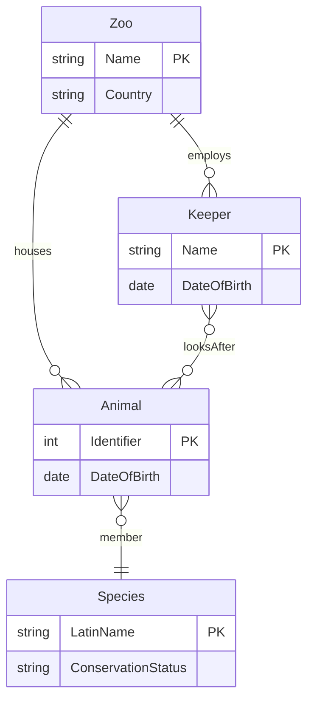
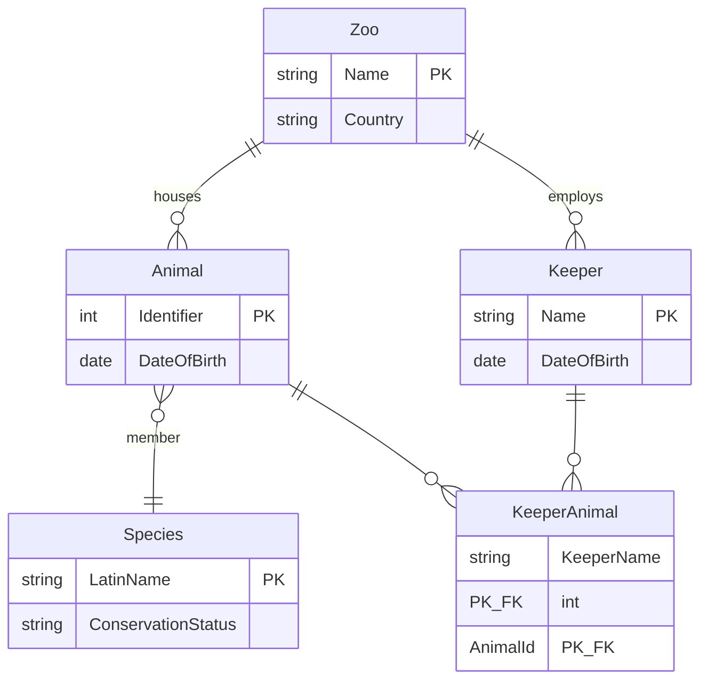
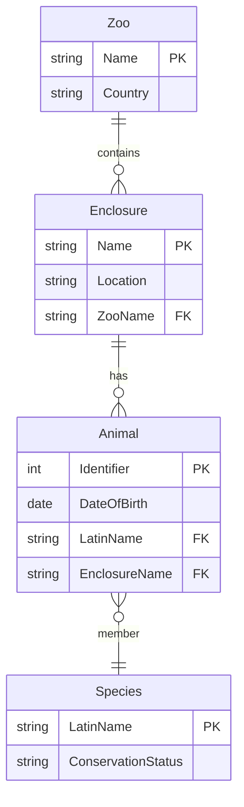

# Solution Sheet - September 2021 (Updated)

## Exam Overview

| Section | Questions | Marks |
|---------|-----------|-------|
| Section A | 10 MCQs | 40 |
| Section B | Answer 2 of 3 | 60 |
| **Total** | | **100** |

---

# Section A: Multiple Choice Questions [40 marks]

---

## Question 1(a) [4 marks]

**Question:** The E/R diagram shows Zoo, Keeper, Animal, and Species entities. If this Entity/Relationship model is going to be implemented as a relational model, what will need to change?

---

### Answer

**ii. The relationship between Keeper and Animal is many-to-many and will need to be rewritten with a new entity between them.**

---

### Revision Notes

**Core Concept:** Many-to-many (M:N) relationships cannot be directly implemented in relational databases.

**Original E/R Diagram (from exam):**



**Problem:** The `looksAfter` relationship between Keeper and Animal is **many-to-many (M:N)** - this cannot be directly implemented in a relational database.

**Resolved E/R Diagram (with Junction Table):**



**Why Option ii is Correct:**
- The `looksAfter` relationship between Keeper and Animal is M:N (many keepers can look after many animals)
- In relational model, M:N relationships require a **junction/bridge table**
- The junction table would have foreign keys to both Keeper and Animal

**Why Other Options are Wrong:**

| Option | Why Incorrect |
|--------|---------------|
| i. Rename attributes | Attribute names can be the same in different tables (they're scoped to their table) |
| iii. Remove circular relationships | Circular relationships are allowed and often necessary |
| iv. Spaces not permitted | Spaces are just conventionally avoided; they can be used with quotes |

**Junction Table Example:**
```sql
CREATE TABLE KeeperAnimal (
    KeeperName VARCHAR(100),
    AnimalId INT,
    PRIMARY KEY (KeeperName, AnimalId),
    FOREIGN KEY (KeeperName) REFERENCES Keeper(Name),
    FOREIGN KEY (AnimalId) REFERENCES Animal(Identifier)
);
```

---

## Question 1(b) [4 marks]

**Question:** Look at the Animal/Species/Feed table and assess its level of normalisation.

| Animal | Species | Feed |
|--------|---------|------|
| Simba | Lion | Meat |
| Hiss | Royal python | Meat |
| Eeyore | Donkey | Silage |
| Fozzy | Brown bear | Nuts |
| Fozzy | Brown bear | Berries |
| Baloo | Brown bear | Nuts |
| Baloo | Brown bear | Berries |

---

### Answer

**i. The table is in 1NF – all rows are a single data type**

(Only statement i is correct)

---

### Revision Notes

**Core Concept:** Analyzing normalization requires identifying functional dependencies and violations.

**Analysis:**

| Statement | Correct? | Reasoning |
|-----------|----------|-----------|
| **i. In 1NF** | ✓ Yes | All values are atomic (single values per cell) |
| **ii. In 2NF** | ✗ No | Has multi-valued dependency (Animal → multiple Feeds) |
| **iii. In 3NF** | ✗ No | Not in 2NF, so cannot be in 3NF |
| **iv. In 4NF** | ✗ No | Has multi-valued dependencies (violates 4NF) |

**The Problem - Multi-valued Dependency:**
- `Animal →→ Feed` (an animal can have multiple feeds, independent of species)
- Brown bears (Fozzy, Baloo) both eat Nuts AND Berries
- This creates redundancy: "Brown bear" appears 4 times

**To reach higher normal forms:**
```
Animals(AnimalName, Species)
AnimalFeeds(AnimalName, Feed)
```

---

## Question 1(c) [4 marks]

**Question:** A temporary administrator needs to add students to the school database. Which GRANT command is most appropriate?

---

### Answer

**iii. GRANT INSERT, UPDATE, SELECT, DELETE ON Students to 'temp';**

---

### Revision Notes

**Core Concept:** Principle of least privilege - grant only permissions necessary for the task.

**Analysis:**

| Option | Why Correct/Incorrect |
|--------|----------------------|
| i. `GRANT ALL ON * WITH GRANT OPTION` | ✗ Too permissive - access to ALL tables, can grant to others |
| ii. `GRANT SELECT ON Students` | ✗ Too restrictive - can only read, cannot add students |
| **iii. `GRANT INSERT, UPDATE, SELECT, DELETE ON Students`** | ✓ Appropriate - full CRUD on Students table only |
| iv. `GRANT ALL ON Students` | ✗ Slightly too permissive - includes ALTER, DROP, etc. |

**Key Points:**
- `WITH GRANT OPTION` allows user to grant permissions to others - dangerous for temp staff
- `ALL` includes administrative privileges like `ALTER TABLE`, `DROP TABLE`
- Specific permissions (INSERT, UPDATE, SELECT, DELETE) are safer

**GRANT Syntax:**
```sql
GRANT privilege_list ON table_name TO 'username'@'host';
REVOKE privilege_list ON table_name FROM 'username'@'host';
```

---

## Question 1(d) [4 marks]

**Question:** How many triples are there in the following RDF/Turtle?

```turtle
chEvents:22498 a event:Event, ecrm:E7_Activity, schema:Event ;
               dct:date "1952-11-30T17:30:00"^^xsd:dateTime ;
               rdfs:label "Cordelle Walcott"@en .
```

---

### Answer

**iii. 5**

---

### Revision Notes

**Core Concept:** Each subject-predicate-object combination is one triple. Turtle syntax allows shortcuts.

**Counting the Triples:**

| # | Subject | Predicate | Object |
|---|---------|-----------|--------|
| 1 | chEvents:22498 | rdf:type (a) | event:Event |
| 2 | chEvents:22498 | rdf:type (a) | ecrm:E7_Activity |
| 3 | chEvents:22498 | rdf:type (a) | schema:Event |
| 4 | chEvents:22498 | dct:date | "1952-11-30T17:30:00"^^xsd:dateTime |
| 5 | chEvents:22498 | rdfs:label | "Cordelle Walcott"@en |

**Turtle Shortcuts:**
- `a` = shorthand for `rdf:type`
- `;` = same subject, new predicate
- `,` = same subject AND predicate, new object
- `.` = end of statement

**Expanded N-Triples Form:**
```
<chEvents:22498> <rdf:type> <event:Event> .
<chEvents:22498> <rdf:type> <ecrm:E7_Activity> .
<chEvents:22498> <rdf:type> <schema:Event> .
<chEvents:22498> <dct:date> "1952-11-30T17:30:00"^^xsd:dateTime .
<chEvents:22498> <rdfs:label> "Cordelle Walcott"@en .
```

---

## Question 1(e) [4 marks]

**Question:** The XML below is not **well-formed**. Why not?

```xml
<movie>
  <title>Citizen Kane</title>
  <cast>
    <actor>Orson Welles</actor>
    <actor role="Jebediah Leland">Joseph Cotton</actor>
</movie>
```

---

### Answer

**ii. The cast element is not closed**

---

### Revision Notes

**Core Concept:** Well-formed XML must follow basic syntax rules, regardless of any schema.

**Well-formedness Rules:**
1. Single root element ✓
2. All elements must be closed ✗ (`<cast>` has no `</cast>`)
3. Proper nesting ✓
4. Attribute values in quotes ✓
5. Case-sensitive tags match ✓

**Why Other Options are Wrong (for well-formedness):**

| Option | Why Not a Well-formedness Issue |
|--------|--------------------------------|
| i. cast before title | Order is a **validation** issue, not well-formedness |
| iii. title needs lang | Missing attributes are **validation** issues |
| iv. actor needs role | Attributes being optional/required is **validation** |
| v. releaseYear missing | Missing elements are **validation** issues |

**Fixed Well-formed XML:**
```xml
<movie>
  <title>Citizen Kane</title>
  <cast>
    <actor>Orson Welles</actor>
    <actor role="Jebediah Leland">Joseph Cotton</actor>
  </cast>  <!-- Added closing tag -->
</movie>
```

---

## Question 1(f) [4 marks]

**Question:** The XML is not **valid**. Why not? (Exclude well-formedness issues)

---

### Answer

**iii. title should have a lang attribute**
**v. releaseYear is missing**

---

### Revision Notes

**Core Concept:** Validity means conforming to a schema (XSD/DTD). Requires well-formedness first.

**Schema Requirements vs XML:**

| Schema Requirement | XML Has | Valid? |
|-------------------|---------|--------|
| `<title>` with `lang` attribute (required) | `<title>` without `lang` | ✗ |
| `<releaseYear>` element | Missing | ✗ |
| `<cast>` element | Present | ✓ |
| `<actor>` with optional `role` | Present | ✓ |

**From the Schema:**
```xml
<xs:element name="title">
  <xs:complexType mixed="true">
    <xs:attribute name="lang" use="required"/>  <!-- REQUIRED! -->
  </xs:complexType>
</xs:element>
<xs:element name="releaseYear" type="xs:integer"/>  <!-- Must exist -->
```

**Why Other Options are Wrong:**

| Option | Why Not a Validation Issue Here |
|--------|--------------------------------|
| i. cast before title | `xs:all` allows any order |
| ii. cast not closed | This is a well-formedness issue (excluded) |
| iv. actor needs role | `role` attribute is optional (no `use="required"`) |

---

## Question 1(g) [4 marks]

**Question:** Which statements comparing MongoDB with SQL are true?

---

### Answer

**iii. A single MongoDB update would often map to more than one command in SQL.**
**iv. A MongoDB document can have a more complex structure than an SQL table.**

---

### Revision Notes

**Core Concept:** MongoDB (document store) vs SQL (relational) have fundamental structural differences.

**Analysis:**

| Statement | Correct? | Reasoning |
|-----------|----------|-----------|
| i. MongoDB has no explicit indexes | ✗ False | MongoDB supports indexes (`createIndex()`) |
| ii. SQL guarantees ACID in all transactions | ✗ False | MongoDB 4.0+ also supports ACID transactions |
| **iii. MongoDB update → multiple SQL** | ✓ True | Updating nested documents = updating multiple related tables in SQL |
| **iv. MongoDB more complex structure** | ✓ True | Documents can nest arrays/objects; SQL tables are flat |

**Example - Why iii is True:**
```javascript
// MongoDB: Single update
db.orders.updateOne(
  { _id: 1 },
  { $push: { items: { product: "Book", qty: 2 } } }
)

// SQL equivalent: Multiple statements
INSERT INTO OrderItems (order_id, product, qty) VALUES (1, 'Book', 2);
UPDATE Orders SET item_count = item_count + 1 WHERE id = 1;
```

**Example - Why iv is True:**
```javascript
// MongoDB document with nested structure
{
  name: "John",
  addresses: [
    { type: "home", city: "London" },
    { type: "work", city: "Manchester" }
  ]
}
// SQL would need: Person table + Address table + join
```

---

## Question 1(h) [4 marks]

**Question:** An international researcher wants ALL documents satisfying their research requirements. They will digitise during their visit and manually discard irrelevant ones later. How would you best evaluate the IR system?

---

### Answer

**ii. Evaluate the system's recall (precision is less important here).**

---

### Revision Notes

**Core Concept:** Precision vs Recall trade-off depends on the cost of false positives vs false negatives.

**Definitions:**

| Metric | Formula | Meaning |
|--------|---------|---------|
| **Precision** | TP / (TP + FP) | Of retrieved docs, how many are relevant? |
| **Recall** | TP / (TP + FN) | Of relevant docs, how many were retrieved? |
| **F-measure** | 2 × (P × R) / (P + R) | Harmonic mean of precision and recall |

**Why Recall Matters Here:**

| Scenario Factor | Implication |
|-----------------|-------------|
| Researcher wants ALL relevant docs | Missing a doc (false negative) is costly |
| Will manually filter later | Extra irrelevant docs (false positive) is acceptable |
| Digitisation is "quick and cost-free" | Low cost to process extra docs |
| One-time visit | Can't come back for missed documents |

**When to Prioritize:**

| Prioritize | When |
|------------|------|
| **Recall** | Missing relevant items is costly (medical diagnosis, legal discovery) |
| **Precision** | Processing irrelevant items is costly (web search, spam filtering) |
| **F-measure** | Both matter equally |

---

## Question 1(i) [4 marks]

**Question:** What distinguishes a graph from a tree?

---

### Answer

**i. A graph does not need a root node, a tree does.**
**iii. A node in a tree has exactly one parent node, a graph has no such constraint.**

---

### Revision Notes

**Core Concept:** Trees are a special case of graphs with specific structural constraints.

**Comparison:**

| Property | Tree | Graph |
|----------|------|-------|
| Root node | Required (one) | Not required |
| Parent per node | Exactly one (except root) | Any number (0 to many) |
| Cycles | Not allowed | Allowed |
| Path between nodes | Exactly one | Zero, one, or many |
| Direction | Usually directed (parent→child) | Can be directed or undirected |

**Analysis of Options:**

| Statement | Correct? | Reasoning |
|-----------|----------|-----------|
| **i. Graph no root, tree needs root** | ✓ True | Trees have a designated root; graphs don't |
| ii. Tree has text, graph cannot | ✗ False | Both can contain any data |
| **iii. Tree node has one parent** | ✓ True | Defining property of trees |
| iv. Tree no root, graph needs root | ✗ False | Opposite of reality |

**Visual Example:**
```
Tree:                    Graph:
    A (root)               A --- B
   / \                     |   / |
  B   C                    |  /  |
 / \                       | /   |
D   E                      C --- D
(Each node has one parent) (Nodes can have multiple connections)
```

---

## Question 1(j) [4 marks]

**Question:** Which statements about types of JOIN in SQL are correct?

---

### Answer

**i. A LEFT JOIN will produce at least as many rows as an INNER JOIN**
**iii. A CROSS JOIN will produce at least as many rows as a LEFT JOIN**
**v. No type of join can produce more rows than a CROSS JOIN**

---

### Revision Notes

**Core Concept:** Different JOIN types have different row-count guarantees.

**JOIN Types and Row Counts:**

| JOIN Type | Result Size | Description |
|-----------|-------------|-------------|
| **INNER JOIN** | ≤ min(A, B) × max(A, B) | Only matching rows |
| **LEFT JOIN** | ≥ INNER JOIN, ≤ CROSS JOIN | All left rows + matches |
| **RIGHT JOIN** | ≥ INNER JOIN, ≤ CROSS JOIN | All right rows + matches |
| **CROSS JOIN** | A × B (Cartesian product) | Every combination |

**Analysis:**

| Statement | Correct? | Reasoning |
|-----------|----------|-----------|
| **i. LEFT ≥ INNER** | ✓ True | LEFT includes all INNER results plus unmatched left rows |
| ii. INNER ≥ LEFT | ✗ False | INNER can only be ≤ LEFT |
| **iii. CROSS ≥ LEFT** | ✓ True | CROSS is maximum possible; LEFT is subset |
| iv. LEFT ≥ CROSS | ✗ False | CROSS is always the largest |
| **v. Nothing > CROSS** | ✓ True | CROSS is the Cartesian product (maximum) |

**Example with Tables A(3 rows) and B(4 rows):**
```
CROSS JOIN: 3 × 4 = 12 rows (always)
LEFT JOIN:  3 to 12 rows (depends on matches)
INNER JOIN: 0 to 12 rows (depends on matches)
```

---

# Section B

---

# Question 2: Bird Spotter's Database [30 marks]

## Question 2(a) [4 marks]

**Question:** The sightings table is in a MySQL database. Give a query to retrieve all bird types seen since the first of January 2021.

---

### Answer

```sql
SELECT DISTINCT Species
FROM Sightings
WHERE Date >= '2021-01-01';
```

---

### Revision Notes

**Core Concept:** Filtering rows with `WHERE` and eliminating duplicates with `DISTINCT`.

**Key Points:**
- `DISTINCT` ensures each species appears only once in results
- SQL standard date format: `'YYYY-MM-DD'`
- `>=` includes the boundary date (January 1st itself)
- The question asks for "bird types" (species), not all sighting records

**Alternative Approaches:**
```sql
-- Using BETWEEN for a date range
SELECT DISTINCT Species FROM sightings
WHERE Date BETWEEN '2021-01-01' AND '2021-12-31';

-- Using YEAR() function (MySQL specific)
SELECT DISTINCT Species FROM sightings
WHERE YEAR(Date) >= 2021;
```

**Common Mistakes:**
- Forgetting `DISTINCT` - returns duplicate species for multiple sightings
- Wrong date format like `'01-01-2021'` or `'January 1, 2021'`
- Using `>` instead of `>=` (excludes Jan 1st)

---

## Question 2(b) [3 marks]

**Question:** Is this table in 1NF? Explain your reasoning.

---

### Answer

**Yes**, the table is in 1NF because:
1. Each cell contains a single atomic value (no lists or arrays)
2. Each row is unique (can be identified by Species + Date combination)
3. All entries in a column are of the same data type

---

### Revision Notes

**Core Concept:** First Normal Form (1NF) - The foundation of database normalization.

**1NF Requirements:**

| Requirement | Meaning | This Table |
|-------------|---------|------------|
| Atomic values | Each cell has one indivisible value | ✓ Species is single value, not "crow, robin" |
| No repeating groups | No arrays or lists in cells | ✓ No multi-valued fields |
| Unique rows | Each row is distinguishable | ✓ Species + Date identifies each row |
| Consistent column types | All values in a column share same type | ✓ Date column has dates, Species has strings |

**What Would Violate 1NF:**
```
-- VIOLATION: Multiple values in one cell
| Species           | Date       |
|-------------------|------------|
| "crow, robin"     | 2021-04-21 |  ← NOT atomic

-- VIOLATION: Repeating groups
| Species | Date1      | Date2      | Date3      |
|---------|------------|------------|------------|
| crow    | 2021-04-21 | 2021-05-15 | NULL       |  ← Repeating columns
```

**Common Mistakes:**
- Confusing 1NF with higher normal forms
- Thinking a table must have a declared primary key to be in 1NF (it just needs unique rows)

---

## Question 2(c) [7 marks]

**Question:** Normalise this data, listing the tables that result and their primary and foreign keys.

---

### Answer

**Three tables after normalization:**

**1. Species**
| Column | Key |
|--------|-----|
| SpeciesName | PK |
| ConservationStatus | |

**2. NatureReserves**
| Column | Key |
|--------|-----|
| ReserveName | PK |
| Location | |

**3. Sightings**
| Column | Key |
|--------|-----|
| SpeciesName | PK, FK → Species |
| ReserveName | PK, FK → NatureReserves |
| Date | PK |
| NumberSighted | |

---

### Revision Notes

**Core Concept:** Normalization removes redundancy by separating data into related tables based on functional dependencies.

**Step-by-Step Normalization Process:**

**Step 1: Identify Functional Dependencies**

A functional dependency X → Y means "X determines Y" (if you know X, you know Y).

From the original table:
- `SpeciesName → ConservationStatus` (each species has one conservation status)
- `ReserveName → Location` (each reserve has one location)
- `(SpeciesName, ReserveName, Date) → NumberSighted` (the combination determines count)

**Step 2: Identify Redundancy**

In the original table:
| Problem | Example |
|---------|---------|
| Conservation status repeated | "Bar-tailed godwit" → "Least concern" appears multiple times |
| Location repeated | "Rainham Marshes" → "51.5N 0.2E" appears multiple times |

**Step 3: Decompose into Separate Tables**

Create a new table for each entity that has its own attributes:

```
Original: Sightings(SpeciesName, Date, NumberSighted, ConservationStatus,
                    ReserveName, Location)

Decomposed:
  Species(SpeciesName, ConservationStatus)
  NatureReserves(ReserveName, Location)
  Sightings(SpeciesName, ReserveName, Date, NumberSighted)
```

**Why This Design:**
- **No update anomaly**: Change conservation status once in `species` table
- **No insert anomaly**: Can add a new species without needing a sighting
- **No delete anomaly**: Deleting last sighting doesn't lose species info

**Visual Representation:**
```
┌───────────────────┐     ┌─────────────────┐     ┌─────────────────┐
│      Species      │     │    Sightings    │     │  NatureReserves │
├───────────────────┤     ├─────────────────┤     ├─────────────────┤
│ SpeciesName       │◄────│ SpeciesName     │     │ ReserveName     │
│ ConservationStatus│     │ ReserveName     │────►│ Location        │
└───────────────────┘     │ Date            │     └─────────────────┘
                          │ NumberSighted   │
                          └─────────────────┘
```

**Common Mistakes:**
- Not identifying all functional dependencies
- Forgetting to include foreign keys
- Creating too many or too few tables

---

## Question 2(d) [4 marks]

**Question:** What normal form have you reached? Explain your conclusion.

---

### Answer

**Third Normal Form (3NF)**.

The tables are in 3NF because:
1. **1NF**: All values are atomic ✓
2. **2NF**: No partial dependencies (non-key attributes depend on the entire primary key, not just part of it) ✓
3. **3NF**: No transitive dependencies (non-key attributes don't depend on other non-key attributes) ✓

---

### Revision Notes

**Core Concept:** Normal forms build on each other - each higher form eliminates a specific type of redundancy.

**Normal Forms Hierarchy:**

| Form | Requirement | Problem It Solves |
|------|-------------|-------------------|
| **1NF** | Atomic values, no repeating groups | Eliminates multi-valued cells |
| **2NF** | 1NF + No partial dependencies | Eliminates redundancy from composite keys |
| **3NF** | 2NF + No transitive dependencies | Eliminates redundancy from non-key dependencies |
| **BCNF** | Every determinant is a candidate key | Stricter version of 3NF |

**Understanding Dependencies:**

**Partial Dependency (violates 2NF):**
```
Table: OrderItems(OrderID, ProductID, ProductName, Quantity)
PK: (OrderID, ProductID)

ProductName depends only on ProductID, not the full key
→ This is a PARTIAL dependency → violates 2NF
```

**Transitive Dependency (violates 3NF):**
```
Table: Employees(EmpID, DeptID, DeptName)
PK: EmpID

EmpID → DeptID → DeptName
DeptName depends on DeptID, not directly on EmpID
→ This is a TRANSITIVE dependency → violates 3NF
```

**Checking Our Tables:**

| Table | Check | Result |
|-------|-------|--------|
| Species | PK: SpeciesName, ConservationStatus depends only on PK | ✓ 3NF |
| NatureReserves | PK: ReserveName, Location depends only on PK | ✓ 3NF |
| Sightings | PK: (SpeciesName, ReserveName, Date), NumberSighted depends on full PK | ✓ 3NF |

**Common Mistakes:**
- Confusing 2NF and 3NF
- Not clearly explaining what dependencies exist
- Forgetting that 2NF only applies when you have a composite primary key

---

## Question 2(e) [5 marks]

**Question:** Give a query for your new tables to retrieve bird types and their conservation status for birds seen since the first of January 2021.

---

### Answer

```sql
SELECT DISTINCT S.SpeciesName, SP.ConservationStatus
FROM Sightings S
INNER JOIN Species SP ON S.SpeciesName = SP.SpeciesName
WHERE S.Date >= '2021-01-01';
```

---

### Revision Notes

**Core Concept:** JOIN combines rows from multiple tables based on related columns.

**Query Breakdown:**

```sql
SELECT DISTINCT S.SpeciesName, SP.ConservationStatus   -- What we want
FROM Sightings S                                       -- Start with Sightings
INNER JOIN Species SP ON S.SpeciesName = SP.SpeciesName  -- Link to Species table
WHERE S.Date >= '2021-01-01';                          -- Filter by date
```

**Types of JOINs:**

| JOIN Type | Returns |
|-----------|---------|
| `INNER JOIN` | Only matching rows from both tables |
| `LEFT JOIN` | All rows from left table + matches from right |
| `RIGHT JOIN` | All rows from right table + matches from left |
| `FULL OUTER JOIN` | All rows from both tables |
| `CROSS JOIN` | Cartesian product (every combination) |

> **Note:** `JOIN` without a keyword defaults to `INNER JOIN`, but always write `INNER JOIN` explicitly for clarity.

**Why INNER JOIN Here:**
- We only want species that have been sighted
- If a species exists but has no sightings since 2021, we don't want it

**Table Aliases:**
- `s` for sightings, `sp` for species
- Makes query shorter and clearer
- Essential when same table appears multiple times

**Alternative Without Alias:**
```sql
SELECT DISTINCT Sightings.SpeciesName, Species.ConservationStatus
FROM Sightings
INNER JOIN Species ON Sightings.SpeciesName = Species.SpeciesName
WHERE Sightings.Date >= '2021-01-01';
```

**Common Mistakes:**
- Forgetting the JOIN condition (creates Cartesian product)
- Using wrong JOIN type
- Not using DISTINCT when duplicates are possible

---

## Question 2(f) [7 marks]

**Question:** The bird spotter wants to be sure that their next set of updates go in correctly. Would a transaction make a difference? Give example SQL operations to illustrate your argument.

---

### Answer

**Yes**, transactions would help ensure data integrity. They guarantee that multiple related operations either all succeed or all fail together (atomicity).

```sql
START TRANSACTION;

-- Insert new sighting
INSERT INTO Sightings (SpeciesName, ReserveName, Date, NumberSighted)
VALUES ('European turtle dove', 'Epping Forest', '2021-09-07', 3);

-- Update species if conservation status changed
UPDATE Species
SET ConservationStatus = 'Endangered'
WHERE SpeciesName = 'European turtle dove';

-- Insert new reserve if visiting new location
INSERT INTO NatureReserves (ReserveName, Location)
VALUES ('Hyde Park', '51.5N 0.2W');

COMMIT;
```

If any statement fails, use `ROLLBACK` to undo all changes:
```sql
ROLLBACK;  -- Undoes everything since START TRANSACTION
```

---

### Revision Notes

**Core Concept:** Transactions group multiple SQL statements into a single logical unit of work, governed by ACID properties.

**ACID Properties Explained:**

| Property | Definition | Example |
|----------|------------|---------|
| **Atomicity** | All operations complete or none do | If UPDATE fails, INSERT is also undone |
| **Consistency** | Database remains in valid state | Foreign keys, constraints still satisfied |
| **Isolation** | Concurrent transactions don't interfere | Other users don't see partial changes |
| **Durability** | Committed changes survive system failure | Data persists after crash/restart |

**Transaction Control Statements:**

| Statement | Purpose |
|-----------|---------|
| `START TRANSACTION` or `BEGIN` | Start a new transaction |
| `COMMIT` | Make all changes permanent |
| `ROLLBACK` | Undo all changes since transaction started |
| `SAVEPOINT name` | Create checkpoint within transaction |
| `ROLLBACK TO name` | Undo to specific savepoint |

**Real-World Scenario - Bank Transfer:**
```sql
START TRANSACTION;

-- Debit from Account A
UPDATE accounts SET balance = balance - 100 WHERE account_id = 'A';

-- Credit to Account B
UPDATE accounts SET balance = balance + 100 WHERE account_id = 'B';

-- Only if BOTH succeed
COMMIT;
```

Without a transaction: If the system crashes after the debit but before the credit, money disappears!

**Bird Spotter Scenario - Why Transactions Help:**

| Without Transaction | With Transaction |
|---------------------|------------------|
| Insert sighting ✓ | Insert sighting ✓ |
| Update species ✗ (fails) | Update species ✗ (fails) |
| **Result:** Sighting recorded but status wrong | **Result:** ROLLBACK - nothing changed |

**Using SAVEPOINT for Complex Operations:**
```sql
START TRANSACTION;

INSERT INTO Sightings VALUES (...);
SAVEPOINT after_sighting;

INSERT INTO NatureReserves VALUES (...);
-- If this fails but we want to keep the sighting:
ROLLBACK TO after_sighting;

COMMIT;  -- Commits only the sighting
```

**Isolation Levels (Advanced):**

| Level | Dirty Read | Non-Repeatable Read | Phantom Read |
|-------|------------|---------------------|--------------|
| READ UNCOMMITTED | Possible | Possible | Possible |
| READ COMMITTED | No | Possible | Possible |
| REPEATABLE READ | No | No | Possible |
| SERIALIZABLE | No | No | No |

**Common Mistakes:**
- Forgetting to COMMIT (changes may be lost)
- Very long transactions (blocks other users)
- Not handling errors with ROLLBACK
- Assuming auto-commit is always off (MySQL auto-commits by default)

**Related Topics:** Concurrency control, locking, deadlocks

---

# Question 3: MEI Music Encoding [30 marks]

## Question 3(a) [2 marks]

**Question:** List all the element types you can see in this code.

---

### Answer

1. `<measure>`
2. `<staff>`
3. `<layer>`
4. `<chord>`
5. `<note>`

---

### Revision Notes

**Core Concept:** XML elements are the building blocks of XML documents, defined by opening and closing tags.

**MEI Hierarchy in This Example:**
```
measure
├── staff (n="2")
│   └── layer (n="1")
│       └── chord
│           ├── note (pname="c", oct="5")
│           ├── note (pname="a", oct="4")
│           └── note (pname="c", oct="4")
└── staff (n="3")
    └── layer (n="1")
        └── chord
            ├── note (pname="f", oct="3")
            └── note (pname="f", oct="2")
```

**Elements vs Attributes:**

| Type | Example | Purpose |
|------|---------|---------|
| **Element** | `<chord>...</chord>` | Container for data/other elements |
| **Attribute** | `pname="c"` | Metadata about an element |

**MEI Element Meanings:**
- **measure**: A bar of music
- **staff**: A single staff line (e.g., treble clef, bass clef)
- **layer**: Voice or layer within a staff
- **chord**: Multiple notes played simultaneously
- **note**: Single pitch

---

## Question 3(b) [3 marks]

**Question:** The XPath `/staff[n="2"]/layer/chord[note/@pname="c"]` is incorrect. Give an XPath expression that would work.

---

### Answer

```xpath
//staff[@n="2"]/layer/chord[note/@pname="c"]
```

---

### Revision Notes

**Core Concept:** XPath navigates XML documents using path expressions. Attributes are accessed with `@`.

**Exam Question Note:** The question text says "pname of **f**" but the incorrect XPath shows `pname="c"`. This is an inconsistency in the exam. The answer above fixes the XPath syntax while keeping `pname="c"` (which matches staff n="2"). If looking for `pname="f"`, you'd need staff n="3":

```xpath
//staff[@n="3"]/layer/chord[note/@pname="f"]
```

**What Was Wrong in the Original XPath:**

| Original | Problem | Correct |
|----------|---------|---------|
| `/staff[n="2"]` | `n="2"` looks for child element `<n>` | `[@n="2"]` checks attribute |
| `/staff` | Starts from root, but `staff` isn't root | `//staff` searches anywhere |

**Data Reference:**
- Staff n="2" contains notes with pname: **c**, **a**, **c**
- Staff n="3" contains notes with pname: **f**, **f**

**XPath Syntax Reference:**

| Expression | Meaning |
|------------|---------|
| `/` | Root or separator |
| `//` | Descendant (any depth) |
| `.` | Current node |
| `..` | Parent node |
| `@` | Attribute |
| `[]` | Predicate (filter) |
| `*` | Any element |

**Common XPath Patterns:**

```xpath
//staff                      -- All staff elements anywhere
//staff[@n="2"]              -- Staff with attribute n="2"
//chord[note]                -- Chords that contain notes
//chord[note/@pname="f"]     -- Chords with a note where pname="f"
//note[@pname="c"]/@oct      -- Get oct attribute of notes with pname="c"
//staff[@n="2"]//note        -- All notes within staff n="2"
```

**Predicates with Multiple Conditions:**
```xpath
//note[@pname="c" and @oct="4"]     -- Notes that are C4
//note[@pname="c" or @pname="d"]    -- Notes that are C or D
//chord[note[@pname="c"]]           -- Chords containing a C note
```

**Common Mistakes:**
- Forgetting `@` for attributes: `[n="2"]` vs `[@n="2"]`
- Using `/` instead of `//` when element isn't at expected level
- Confusing `[1]` (position) with `[@n="1"]` (attribute value)

---

## Question 3(c)(i) [5 marks]

**Question:** Translate the first chord element in the XML into JSON as effectively as you can.

---

### Answer

```json
{
  "chord": {
    "xml_id": "d13e1",
    "dur": 8,
    "dur_ppq": 12,
    "stem_dir": "up",
    "notes": [
      { "xml_id": "d1e101", "pname": "c", "oct": 5 },
      { "xml_id": "d1e118", "pname": "a", "oct": 4 },
      { "xml_id": "d1e136", "pname": "c", "oct": 4 }
    ]
  }
}
```

---

### Revision Notes

**Core Concept:** JSON (JavaScript Object Notation) represents data as key-value pairs and arrays, making it ideal for nested structures.

**XML to JSON Mapping Strategies:**

| XML Feature | JSON Equivalent |
|-------------|-----------------|
| Element with children | Object `{}` |
| Repeated elements | Array `[]` |
| Attributes | Properties with `_` or renamed |
| Text content | String value |
| Numeric values | Numbers (no quotes) |

**Original XML:**
```xml
<chord xml:id="d13e1" dur="8" dur.ppq="12" stem.dir="up">
    <note xml:id="d1e101" pname="c" oct="5"/>
    <note xml:id="d1e118" pname="a" oct="4"/>
    <note xml:id="d1e136" pname="c" oct="4"/>
</chord>
```

**Conversion Decisions:**

| Decision | Reasoning |
|----------|-----------|
| `dur` as number | Duration is numeric, enables math operations |
| `oct` as number | Octave is numeric |
| `notes` as array | Multiple notes → array structure |
| `xml_id` not `xml:id` | Colons not allowed in JSON keys |
| `stem_dir` not `stem.dir` | Dots can cause issues in some languages |

**Alternative JSON Structures:**

```json
// Flatter structure (attributes at same level)
{
  "xml_id": "d13e1",
  "dur": 8,
  "notes": [...]
}

// More verbose (preserving XML structure)
{
  "chord": {
    "@xml:id": "d13e1",
    "@dur": "8",
    "note": [...]
  }
}
```

**Common Mistakes:**
- Keeping numeric values as strings (`"8"` instead of `8`)
- Not converting invalid characters in key names
- Forgetting that repeated XML elements should become arrays

---

## Question 3(c)(ii) [5 marks]

**Question:** Give a MongoDB find command that would return only chords with upward stems that have f in one of their notes.

---

### Answer

```javascript
db.chords.find({
  "stem_dir": "up",
  "notes.pname": "f"
})
```

Or using `$elemMatch`:
```javascript
db.chords.find({
  "stem_dir": "up",
  "notes": { "$elemMatch": { "pname": "f" } }
})
```

---

### Revision Notes

**Core Concept:** MongoDB queries use JSON-like syntax to filter documents. Dot notation accesses nested fields and array elements.

**Query Breakdown:**

```javascript
db.chords.find({           // Find in 'chords' collection
  "stem_dir": "up",        // Where stem_dir equals "up"
  "notes.pname": "f"       // AND any note has pname "f"
})
```

**Dot Notation vs $elemMatch:**

| Method | Use Case |
|--------|----------|
| `"notes.pname": "f"` | Single condition on array elements |
| `$elemMatch` | Multiple conditions on SAME array element |

**Example Where $elemMatch Matters:**

```javascript
// Data:
{ "notes": [{ "pname": "f", "oct": 3 }, { "pname": "c", "oct": 4 }] }

// This finds documents where ANY note has pname="f" AND ANY note has oct=4
// (could be different notes!)
db.chords.find({ "notes.pname": "f", "notes.oct": 4 })

// This finds documents where SAME note has pname="f" AND oct=4
db.chords.find({ "notes": { "$elemMatch": { "pname": "f", "oct": 4 } } })
```

**Common MongoDB Query Operators:**

| Operator | Meaning | Example |
|----------|---------|---------|
| `$eq` | Equals (default) | `{ "dur": { "$eq": 8 } }` |
| `$gt`, `$lt` | Greater/less than | `{ "oct": { "$gt": 3 } }` |
| `$in` | In array of values | `{ "pname": { "$in": ["c", "f"] } }` |
| `$and`, `$or` | Logical operators | `{ "$or": [{ "pname": "c" }, { "pname": "f" }] }` |
| `$elemMatch` | Match array element | See above |
| `$exists` | Field exists | `{ "notes": { "$exists": true } }` |

**Projection (Selecting Fields):**
```javascript
// Return only specific fields
db.chords.find(
  { "stem_dir": "up" },
  { "notes.pname": 1, "_id": 0 }  // Include pname, exclude _id
)
```

**Common Mistakes:**
- Using SQL syntax (`SELECT * FROM chords WHERE...`)
- Forgetting quotes around field names
- Not understanding when `$elemMatch` is needed

---

## Question 3(d)(i) [3 marks]

**Question:** Why use `rdfs:member` instead of a new `mei:hasNotes` property?

---

### Answer

Using `rdfs:member` leverages an **existing W3C standard** vocabulary, which:
1. **Maximizes interoperability** - other linked data tools understand it
2. **Avoids redundancy** - no need to define what already exists
3. **Follows best practices** - reuse before creating new terms

---

### Revision Notes

**Core Concept:** Linked Data best practice is to reuse existing vocabularies before creating new ones.

**Why Reuse Existing Vocabularies:**

| Benefit | Explanation |
|---------|-------------|
| **Interoperability** | Other systems already understand `rdfs:member` |
| **Discoverability** | Standard terms are documented and searchable |
| **Consistency** | Same semantics across different datasets |
| **Tool support** | Reasoners, validators know standard vocabularies |

**Common RDF Vocabularies:**

| Prefix | Namespace | Used For |
|--------|-----------|----------|
| `rdf:` | RDF core | `rdf:type`, `rdf:Property` |
| `rdfs:` | RDF Schema | `rdfs:label`, `rdfs:member`, `rdfs:subClassOf` |
| `owl:` | Web Ontology Language | `owl:sameAs`, `owl:Class` |
| `foaf:` | Friend of a Friend | `foaf:name`, `foaf:knows` |
| `schema:` | Schema.org | `schema:Person`, `schema:Event` |
| `dc:` | Dublin Core | `dc:title`, `dc:creator` |

**When to Create New Properties:**
- No existing property captures your meaning
- Domain-specific semantics required
- Standard property is too generic or too specific

**In This Case:**
- `rdfs:member` perfectly captures "chord contains notes"
- Creating `mei:hasNotes` would duplicate existing semantics
- Other music ontologies might use `rdfs:member` too → compatibility

---

## Question 3(d)(ii) [5 marks]

**Question:** Give some RDF (in whichever serialisation) for the first chord element.

---

### Answer

**Turtle Syntax:**

```turtle
@prefix mei: <http://example.org/mei#> .
@prefix rdfs: <http://www.w3.org/2000/01/rdf-schema#> .
@prefix xsd: <http://www.w3.org/2001/XMLSchema#> .

mei:chord_d13e1 a mei:Chord ;
    mei:duration "8"^^xsd:integer ;
    mei:durationPpq "12"^^xsd:integer ;
    mei:stemDirection "up" ;
    rdfs:member mei:note_d1e101 ,
                mei:note_d1e118 ,
                mei:note_d1e136 .

mei:note_d1e101 a mei:Note ;
    mei:pitchName "c" ;
    mei:octave "5"^^xsd:integer .

mei:note_d1e118 a mei:Note ;
    mei:pitchName "a" ;
    mei:octave "4"^^xsd:integer .

mei:note_d1e136 a mei:Note ;
    mei:pitchName "c" ;
    mei:octave "4"^^xsd:integer .
```

---

### Revision Notes

**Core Concept:** RDF represents data as triples (subject-predicate-object), forming a graph of interconnected resources.

**RDF Triple Structure:**
```
Subject  --Predicate-->  Object

mei:chord_d13e1  --mei:duration-->  "8"
mei:chord_d13e1  --rdfs:member-->   mei:note_d1e101
```

**Turtle Syntax Reference:**

| Syntax | Meaning | Example |
|--------|---------|---------|
| `@prefix` | Namespace declaration | `@prefix mei: <http://...>` |
| `a` | Shorthand for `rdf:type` | `mei:chord_d13e1 a mei:Chord` |
| `;` | Same subject, different predicate | Continues with same subject |
| `,` | Same subject & predicate, different object | `rdfs:member mei:note1 , mei:note2` |
| `.` | End of statement | |
| `"value"^^xsd:type` | Typed literal | `"8"^^xsd:integer` |

**RDF Serialization Formats:**

| Format | Extension | Characteristics |
|--------|-----------|-----------------|
| **Turtle** | `.ttl` | Human-readable, compact |
| **N-Triples** | `.nt` | Simple, one triple per line |
| **RDF/XML** | `.rdf` | XML-based, verbose |
| **JSON-LD** | `.jsonld` | JSON-compatible |

**Same Data in N-Triples:**
```
<http://example.org/mei#chord_d13e1> <http://www.w3.org/1999/02/22-rdf-syntax-ns#type> <http://example.org/mei#Chord> .
<http://example.org/mei#chord_d13e1> <http://example.org/mei#duration> "8"^^<http://www.w3.org/2001/XMLSchema#integer> .
```

**Common Mistakes:**
- Forgetting `.` at end of statement blocks
- Missing `@prefix` declarations
- Using relative URIs without base

---

## Question 3(e) [7 marks]

**Question:** How do these three models – XML, MongoDB/JSON and Linked Data – differ in what they might offer for music notation? What advantages and disadvantages does each have?

---

### Answer

| Aspect | XML/MEI | MongoDB/JSON | Linked Data/RDF |
|--------|---------|--------------|-----------------|
| **Structure** | Hierarchical tree | Flexible documents | Graph (triples) |
| **Schema** | Strict (XSD/DTD) | Schema-less | Ontologies (OWL) |
| **Querying** | XPath, XQuery | MongoDB queries | SPARQL |
| **Standards** | MEI is established standard | No music standard | Can link to external ontologies |

**Advantages:**

| Model | Advantages |
|-------|------------|
| **XML/MEI** | Industry standard for music; rich validation; preserves document structure; good for interchange |
| **MongoDB/JSON** | Flexible schema; fast queries; easy for web apps; good for variable data |
| **Linked Data** | Connects to global knowledge; semantic reasoning; links across datasets |

**Disadvantages:**

| Model | Disadvantages |
|-------|---------------|
| **XML/MEI** | Verbose; complex queries for large documents; limited cross-document linking |
| **MongoDB/JSON** | No standard music schema; less validation; data can become inconsistent |
| **Linked Data** | Complex to implement; SPARQL learning curve; performance can suffer |

---

### Revision Notes

**Core Concept:** Each data model has different strengths suited to different use cases.

**Detailed Comparison:**

**1. XML/MEI**

*Best for:* Archival, interchange, scholarly editions

```xml
<chord dur="8">
  <note pname="c" oct="4"/>
</chord>
```

| Strength | Weakness |
|----------|----------|
| MEI is THE standard for digital musicology | Verbose syntax |
| Strong validation with schemas | Complex navigation (XPath) |
| Preserves musical hierarchy | Hard to link across documents |
| Excellent tool support (Verovio, etc.) | Updates can be cumbersome |

**2. MongoDB/JSON**

*Best for:* Web applications, APIs, rapid development

```json
{ "chord": { "dur": 8, "notes": [...] } }
```

| Strength | Weakness |
|----------|----------|
| Flexible - add fields anytime | No standard music schema |
| Fast queries with indexing | Can lead to inconsistent data |
| Native to JavaScript/web | Less suitable for complex musical relationships |
| Easy horizontal scaling | No built-in validation |

**3. Linked Data/RDF**

*Best for:* Integration, semantic web, connecting knowledge

```turtle
mei:chord1 rdfs:member mei:note1 .
mei:note1 mei:pitchName "c" .
```

| Strength | Weakness |
|----------|----------|
| Links to external data (MusicBrainz, Wikidata) | Steep learning curve |
| Semantic reasoning possible | Complex implementation |
| Decentralized - data can live anywhere | Performance overhead |
| Rich ontology support | Less mature tooling for music |

**When to Choose Which:**

| Scenario | Best Choice |
|----------|-------------|
| Publishing sheet music online | XML/MEI |
| Building a music streaming app | MongoDB/JSON |
| Connecting composers to historical data | Linked Data |
| Academic music analysis | XML/MEI |
| Real-time collaborative editing | MongoDB/JSON |
| Cross-institutional music catalog | Linked Data |

---

# Question 4: Zoo Database [30 marks]

## Question 4(a) [4 marks]

**Question:** List the tables and their fields for an SQL implementation of this design. Indicate primary keys for each table.

---

### Answer

**1. Zoo**
| Field | Key |
|-------|-----|
| Name | PK |
| Country | |

**2. Enclosure**
| Field | Key |
|-------|-----|
| Name | PK |
| Location | |
| ZooName | FK → Zoo |

**3. Species**
| Field | Key |
|-------|-----|
| LatinName | PK |
| ConservationStatus | |

**4. Animal**
| Field | Key |
|-------|-----|
| Identifier | PK |
| DateOfBirth | |
| SpeciesLatinName | FK → Species |
| EnclosureName | FK → Enclosure |

---

### Revision Notes

**Core Concept:** E/R diagrams translate to relational tables by converting entities to tables and relationships to foreign keys.

**E/R Diagram (from exam):**



**E/R to Relational Mapping Rules:**

| E/R Concept | Relational Equivalent |
|-------------|----------------------|
| Entity | Table |
| Attribute | Column |
| Primary key | PRIMARY KEY constraint |
| 1:M relationship | Foreign key in "many" side |
| M:N relationship | Junction/bridge table |

**Reading the Relationships:**

- **Zoo (1) → (M) Enclosure**: One zoo contains many enclosures → FK `ZooName` in Enclosure
- **Enclosure (1) → (M) Animal**: One enclosure has many animals → FK `EnclosureName` in Animal
- **Species (1) → (M) Animal**: Many animals belong to one species → FK `SpeciesLatinName` in Animal

**Why These Primary Keys:**
- `Zoo.Name` - Zoo names are unique identifiers
- `Enclosure.Name` - Could also use `(ZooName, Name)` if names repeat across zoos
- `Species.LatinName` - Scientific names are unique
- `Animal.Identifier` - Individual animal ID (like a microchip number)

---

## Question 4(b) [6 marks]

**Question:** Give SQL CREATE TABLE commands for any TWO of your tables, including any foreign keys.

---

### Answer

```sql
CREATE TABLE Zoo (
    Name VARCHAR(255) PRIMARY KEY,
    Country VARCHAR(255) NOT NULL
);

CREATE TABLE Enclosure (
    Name VARCHAR(255) PRIMARY KEY,
    Location VARCHAR(255),
    ZooName VARCHAR(255) NOT NULL,
    FOREIGN KEY (ZooName) REFERENCES Zoo(Name)
        ON DELETE CASCADE
        ON UPDATE CASCADE
);
```

---

### Revision Notes

**Core Concept:** CREATE TABLE defines table structure, data types, and constraints including primary and foreign keys.

**SQL Data Types:**

| Type | Use For | Example |
|------|---------|---------|
| `VARCHAR(n)` | Variable-length text | Names, descriptions |
| `CHAR(n)` | Fixed-length text | Country codes |
| `INT` | Whole numbers | IDs, counts |
| `DATE` | Dates | `'2021-04-15'` |
| `DECIMAL(p,s)` | Precise decimals | Money, coordinates |
| `BOOLEAN` | True/False | Flags |

**Constraint Types:**

| Constraint | Purpose | Syntax |
|------------|---------|--------|
| `PRIMARY KEY` | Unique identifier | `id INT PRIMARY KEY` |
| `FOREIGN KEY` | Reference another table | `FOREIGN KEY (col) REFERENCES table(col)` |
| `NOT NULL` | Cannot be empty | `name VARCHAR(50) NOT NULL` |
| `UNIQUE` | No duplicates | `email VARCHAR(100) UNIQUE` |
| `CHECK` | Validate values | `CHECK (age >= 0)` |
| `DEFAULT` | Default value | `status VARCHAR(20) DEFAULT 'active'` |

**Referential Actions (ON DELETE/UPDATE):**

| Action | Behavior |
|--------|----------|
| `CASCADE` | Delete/update children too |
| `SET NULL` | Set FK to NULL |
| `SET DEFAULT` | Set FK to default value |
| `RESTRICT` | Prevent if children exist |
| `NO ACTION` | Same as RESTRICT (default) |

**Complete Zoo Schema:**
```sql
CREATE TABLE Zoo (
    Name VARCHAR(255) PRIMARY KEY,
    Country VARCHAR(255) NOT NULL
);

CREATE TABLE Species (
    LatinName VARCHAR(255) PRIMARY KEY,
    ConservationStatus VARCHAR(50)
);

CREATE TABLE Enclosure (
    Name VARCHAR(255) PRIMARY KEY,
    Location VARCHAR(255),
    ZooName VARCHAR(255) NOT NULL,
    FOREIGN KEY (ZooName) REFERENCES Zoo(Name)
);

CREATE TABLE Animal (
    Identifier VARCHAR(255) PRIMARY KEY,
    DateOfBirth DATE,
    SpeciesLatinName VARCHAR(255) NOT NULL,
    EnclosureName VARCHAR(255) NOT NULL,
    FOREIGN KEY (SpeciesLatinName) REFERENCES Species(LatinName),
    FOREIGN KEY (EnclosureName) REFERENCES Enclosure(Name)
);
```

---

## Question 4(c) [5 marks]

**Question:** Give a single SQL query to find out how many species are housed in the zoo which has the name 'Singapore Zoo'.

---

### Answer

```sql
SELECT COUNT(DISTINCT A.SpeciesLatinName) AS SpeciesCount
FROM Animal A
INNER JOIN Enclosure E ON A.EnclosureName = E.Name
WHERE E.ZooName = 'Singapore Zoo';
```

---

### Revision Notes

**Core Concept:** COUNT with DISTINCT counts unique values, and JOINs connect related tables.

**Query Logic:**
```
Animal → Enclosure → Zoo
   ↓
Species (via SpeciesLatinName)
```

1. Start with Animals
2. Join to Enclosures to find which zoo
3. Filter for Singapore Zoo
4. Count distinct species

**Aggregate Functions:**

| Function | Purpose | Example |
|----------|---------|---------|
| `COUNT(*)` | Count all rows | `SELECT COUNT(*) FROM animals` |
| `COUNT(column)` | Count non-NULL values | `SELECT COUNT(dob) FROM animals` |
| `COUNT(DISTINCT col)` | Count unique values | `SELECT COUNT(DISTINCT species)` |
| `SUM(column)` | Sum values | `SELECT SUM(quantity)` |
| `AVG(column)` | Average | `SELECT AVG(age)` |
| `MIN/MAX(column)` | Minimum/Maximum | `SELECT MAX(DateOfBirth)` |

**Alternative Approaches:**
```sql
-- Using subquery
SELECT COUNT(*) FROM (
    SELECT DISTINCT A.SpeciesLatinName
    FROM Animal A
    INNER JOIN Enclosure E ON A.EnclosureName = E.Name
    WHERE E.ZooName = 'Singapore Zoo'
) AS UniqueSpecies;

-- Using EXISTS (if you just need to verify)
SELECT COUNT(DISTINCT SpeciesLatinName)
FROM Animal
WHERE EnclosureName IN (
    SELECT Name FROM Enclosure WHERE ZooName = 'Singapore Zoo'
);
```

---

## Question 4(d) [5 marks]

**Question:** Give a single SQL query to find out the date of birth of the oldest animal of the species called 'Buceros bicornis' in each zoo.

---

### Answer

```sql
SELECT E.ZooName, MIN(A.DateOfBirth) AS OldestBirthDate
FROM Animal A
INNER JOIN Enclosure E ON A.EnclosureName = E.Name
WHERE A.SpeciesLatinName = 'Buceros bicornis'
GROUP BY E.ZooName;
```

---

### Revision Notes

**Core Concept:** GROUP BY partitions results into groups, and aggregate functions operate on each group.

**Query Logic:**
- Filter for specific species
- Group by zoo
- Find MIN(DateOfBirth) in each group → oldest animal (earliest birth)

**GROUP BY Explained:**

```sql
-- Without GROUP BY: one result for entire table
SELECT MIN(DateOfBirth) FROM Animal;  -- Returns: 1985-03-21

-- With GROUP BY: one result per group
SELECT ZooName, MIN(DateOfBirth)
FROM Animal INNER JOIN Enclosure...
GROUP BY ZooName;
-- Returns:
-- Singapore Zoo | 1995-06-15
-- London Zoo    | 1988-03-21
-- Berlin Zoo    | 2001-11-08
```

**GROUP BY Rules:**
1. Every non-aggregated column in SELECT must be in GROUP BY
2. Can group by multiple columns: `GROUP BY ZooName, SpeciesLatinName`
3. WHERE filters before grouping, HAVING filters after

**Using HAVING (filter on aggregates):**
```sql
-- Only zoos with animals older than 2000
SELECT E.ZooName, MIN(A.DateOfBirth) AS Oldest
FROM Animal A
INNER JOIN Enclosure E ON A.EnclosureName = E.Name
WHERE A.SpeciesLatinName = 'Buceros bicornis'
GROUP BY E.ZooName
HAVING MIN(A.DateOfBirth) < '2000-01-01';
```

**WHERE vs HAVING:**

| Clause | Filters | Timing |
|--------|---------|--------|
| `WHERE` | Individual rows | Before grouping |
| `HAVING` | Groups | After grouping |

---

## Question 4(e) [10 marks]

**Question:** Choose ONE of XML or RDF and: (i) BRIEFLY assess the suitability of this model for your chosen technology. (ii) Give some instance data for the database in your chosen technology.

---

### Answer

**Choosing: RDF**

**(i) Suitability Assessment:**

RDF is well-suited for the zoo database because:
- **Natural graph structure**: Zoo→Enclosure→Animal→Species relationships map directly to RDF triples
- **Linking capability**: Can link species to external data (IUCN Red List, Wikipedia)
- **Flexibility**: Easy to add new properties without schema changes
- **Integration**: Multiple zoos could share species data via linked URIs

**(ii) Instance Data (Turtle):**

```turtle
@prefix zoo: <http://example.org/zoo#> .
@prefix schema: <http://schema.org/> .
@prefix xsd: <http://www.w3.org/2001/XMLSchema#> .

# Zoo
zoo:SingaporeZoo a zoo:Zoo ;
    zoo:name "Singapore Zoo" ;
    zoo:country "Singapore" .

# Species
zoo:BucerosBicornis a zoo:Species ;
    zoo:latinName "Buceros bicornis" ;
    zoo:conservationStatus "Vulnerable" .

# Enclosure
zoo:Enclosure1 a zoo:Enclosure ;
    zoo:name "Tropical Aviary" ;
    zoo:location "Section A" ;
    zoo:partOf zoo:SingaporeZoo .

# Animal
zoo:Animal001 a zoo:Animal ;
    zoo:identifier "SG-HB-001" ;
    zoo:dateOfBirth "2005-03-21"^^xsd:date ;
    zoo:species zoo:BucerosBicornis ;
    zoo:livesIn zoo:Enclosure1 .

zoo:Animal002 a zoo:Animal ;
    zoo:identifier "SG-HB-002" ;
    zoo:dateOfBirth "2010-07-14"^^xsd:date ;
    zoo:species zoo:BucerosBicornis ;
    zoo:livesIn zoo:Enclosure1 .
```

---

### Revision Notes

**Core Concept:** Both XML and RDF can represent the zoo data, but with different structures and trade-offs.

**Comparison for Zoo Data:**

| Aspect | XML | RDF |
|--------|-----|-----|
| Structure | Hierarchical (tree) | Graph (network) |
| Relationships | Nested elements or ID/IDREF | Direct links via URIs |
| External links | Limited | Native capability |
| Schema | XSD, DTD | OWL ontologies |
| Querying | XPath, XQuery | SPARQL |

**XML Alternative:**

```xml
<?xml version="1.0" encoding="UTF-8"?>
<zoos>
  <zoo name="Singapore Zoo" country="Singapore">
    <enclosure name="Tropical Aviary" location="Section A">
      <animal identifier="SG-HB-001">
        <species latinName="Buceros bicornis"
                 conservationStatus="Vulnerable"/>
        <dateOfBirth>2005-03-21</dateOfBirth>
      </animal>
    </enclosure>
  </zoo>
</zoos>
```

**When XML is Better:**
- Document-centric data
- Strict validation needed
- Existing XML toolchain
- No need for external linking

**When RDF is Better:**
- Data integration across sources
- Semantic reasoning needed
- Linking to global knowledge bases
- Flexible, evolving schemas

**SPARQL Query Example (for RDF):**
```sparql
# Find oldest animal of Buceros bicornis in each zoo
SELECT ?zoo (MIN(?dob) AS ?oldest)
WHERE {
  ?animal a zoo:Animal ;
          zoo:species zoo:BucerosBicornis ;
          zoo:dateOfBirth ?dob ;
          zoo:livesIn ?enclosure .
  ?enclosure zoo:partOf ?zoo .
}
GROUP BY ?zoo
```

---

# Quick Reference Summary

## SQL Essentials

```sql
-- Basic query structure
SELECT columns FROM table WHERE condition GROUP BY col HAVING condition ORDER BY col;

-- Joins (always be explicit about join type!)
SELECT * FROM A INNER JOIN B ON A.id = B.a_id;  -- Only matching rows
SELECT * FROM A LEFT JOIN B ON A.id = B.a_id;   -- All from A + matches from B
SELECT * FROM A CROSS JOIN B;                    -- Cartesian product

-- Aggregates
COUNT(*), COUNT(DISTINCT col), SUM(col), AVG(col), MIN(col), MAX(col)

-- Transactions
START TRANSACTION; ... COMMIT; / ROLLBACK;
```

## XPath Essentials

```xpath
//element              -- Find anywhere
//element[@attr="val"] -- Filter by attribute
//parent/child         -- Direct child
//ancestor//descendant -- Any depth
..                     -- Parent
```

## MongoDB Essentials

```javascript
db.collection.find({ field: "value" })
db.collection.find({ "nested.field": "value" })
db.collection.find({ field: { $gt: 10 } })
db.collection.find({ array: { $elemMatch: { key: "value" } } })
```

## RDF/Turtle Essentials

```turtle
@prefix ex: <http://example.org/> .
ex:subject a ex:Type ;          # rdf:type
    ex:predicate "object" ;     # literal
    ex:predicate ex:object .    # URI
```

---

*End of Solution Sheet - September 2021*
