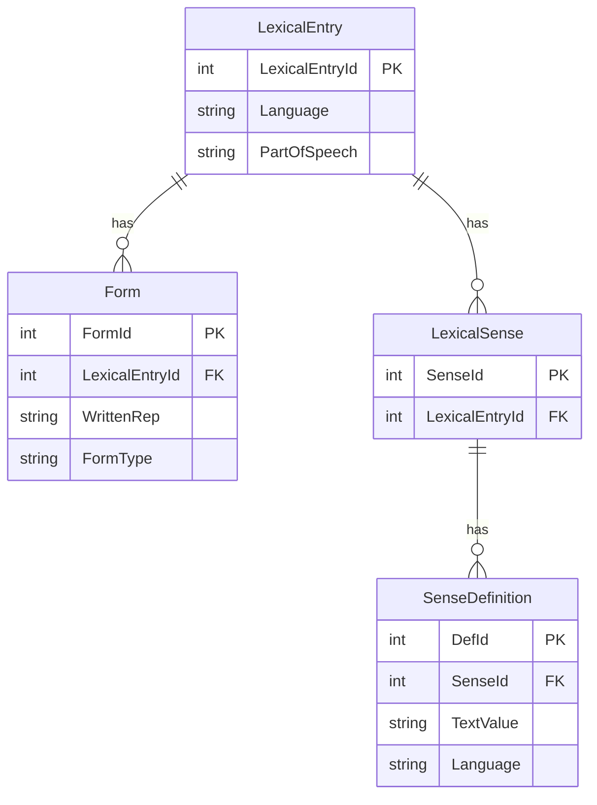
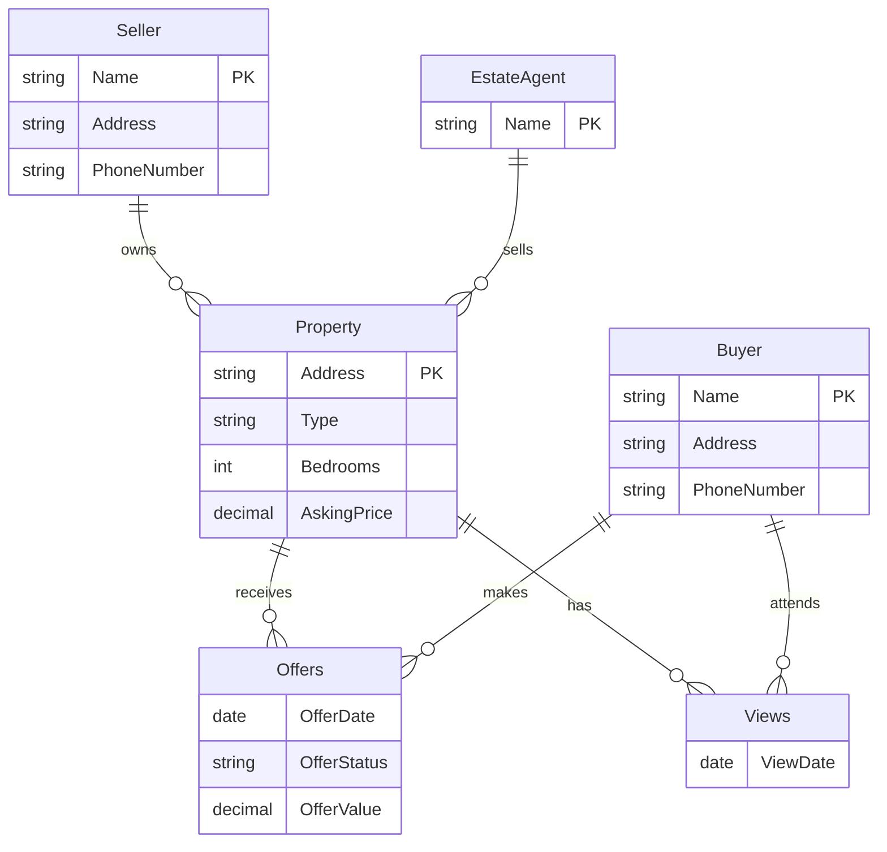

# Solution Sheet - September 2023

## Exam Overview

| Section | Questions | Marks |
|---------|-----------|-------|
| Section A | 10 MCQs | 40 |
| Section B | Answer 2 of 3 | 60 |
| **Total** | | **100** |

**Note:** Part A and Part B are completed online together on the Inspera platform. This solution sheet covers Section B questions.

---

# Section B

Candidates answer TWO of the following THREE questions.

---

# Question 1: Linked Data Question [30 marks]

## Context

RDF document retrieved from http://babelnet.org/rdf/post_n_EN:

```turtle
@prefix bn: <http://babelnet.org/rdf/> .
@prefix lemon: <http://www.lemon-model.net/lemon#> .
@prefix lexinfo: <http://www.lexinfo.net/ontology/2.0/lexinfo#> .

bn:post_n_EN a lemon:LexicalEntry ;
    lemon:canonicalForm <http://babelnet.org/rdf/post_n_EN/canonicalForm> ;
    lemon:language "EN" ;
    lexinfo:partOfSpeech lexinfo:noun .
```

---

## Question 1(a)(i) [1 mark]

**Question:** What is the generic data model this information is represented in?

---

### Answer

**RDF (Resource Description Framework)**

---

### Revision Notes

**Core Concept:** RDF is the foundational data model for the Semantic Web.

**Key Characteristics:**

| Feature | Description |
|---------|-------------|
| **Structure** | Subject-Predicate-Object triples |
| **Identifiers** | URIs for resources |
| **Flexibility** | Schema-free, can link across datasets |
| **Foundation** | Enables Linked Data and SPARQL querying |

**Triple Breakdown of the Given Data:**

| Subject | Predicate | Object |
|---------|-----------|--------|
| `bn:post_n_EN` | `rdf:type` | `lemon:LexicalEntry` |
| `bn:post_n_EN` | `lemon:canonicalForm` | `<.../canonicalForm>` |
| `bn:post_n_EN` | `lemon:language` | `"EN"` |
| `bn:post_n_EN` | `lexinfo:partOfSpeech` | `lexinfo:noun` |

---

## Question 1(a)(ii) [1 mark]

**Question:** What is the serialisation format used for the data model?

---

### Answer

**Turtle (Terse RDF Triple Language)**

---

### Revision Notes

**Core Concept:** RDF can be serialized in multiple formats. Identifying features help distinguish them.

**How to Identify Turtle:**

| Feature | Example from Data |
|---------|-------------------|
| `@prefix` declarations | `@prefix bn: <http://babelnet.org/rdf/> .` |
| Semicolon `;` | Continues same subject with new predicate |
| Period `.` | Ends a statement |
| Prefixed names | `bn:post_n_EN`, `lemon:language` |

**Comparison of RDF Serialization Formats:**

| Format | Identifying Features | Example |
|--------|---------------------|---------|
| **Turtle** | `@prefix`, `;`, `.`, human-readable | `bn:x a lemon:Entry .` |
| **RDF/XML** | XML tags, `<rdf:RDF>` root | `<rdf:Description rdf:about="...">` |
| **N-Triples** | Full URIs, one triple per line, no prefixes | `<http://...> <http://...> "value" .` |
| **JSON-LD** | JSON with `@context`, `@id`, `@type` | `{"@context": {...}, "@id": "..."}` |

---

## Question 1(b) [4 marks]

**Question:** One friend says it's impossible to know what word this RDF is talking about without more triples. Another says it's clearly the English word "post" as a noun. To what extent is either right? What further information would help?

---

### Answer

**Both friends have valid points:**

| Friend | Argument | Assessment |
|--------|----------|------------|
| **Friend 1 (Skeptic)** | The actual word "post" isn't in these triples - only a URI reference to `canonicalForm` | **Technically correct** - the written form is in a linked resource |
| **Friend 2 (Pragmatist)** | The URI `post_n_EN` strongly suggests "post", language="EN" and partOfSpeech=noun are explicit | **Practically correct** - context clues are strong |

**Detailed Analysis:**

**What IS explicitly stated:**
- The resource is a `LexicalEntry`
- The language is `"EN"` (English)
- The part of speech is `noun`

**What is NOT explicitly stated:**
- The actual written word "post" - this is only implied by the URI

**Further information needed:**
- Fetch `<http://babelnet.org/rdf/post_n_EN/canonicalForm>`
- This would return: `lemon:writtenRep "post"`

---

### Revision Notes

**Core Concept:** Linked Data requires following links (dereferencing URIs) to get complete information.

**Linked Data Principles (Tim Berners-Lee):**

1. Use URIs as names for things
2. Use HTTP URIs so people can look them up
3. When someone looks up a URI, provide useful information (using RDF, SPARQL)
4. Include links to other URIs to enable discovery

**Why the Skeptic Has a Point:**
```
bn:post_n_EN → canonicalForm → <.../canonicalForm> → writtenRep → "post"
     ↑                              ↑
  We have this              We need to fetch this
```

---

## Question 1(c)(i) [6 marks]

**Question:** Write a SPARQL query that finds the written representation and language for all nouns.

---

### Answer

```sparql
PREFIX lemon:   <http://www.lemon-model.net/lemon#>
PREFIX lexinfo: <http://www.lexinfo.net/ontology/2.0/lexinfo#>

SELECT ?writtenRep ?lang
WHERE {
  ?lexEntry a lemon:LexicalEntry ;
            lemon:canonicalForm ?form ;
            lemon:language ?lang ;
            lexinfo:partOfSpeech lexinfo:noun .

  ?form lemon:writtenRep ?writtenRep .
}
```

---

### Revision Notes

**Core Concept:** SPARQL uses graph pattern matching to query RDF data.

**Query Breakdown:**

| Line | Pattern | Purpose |
|------|---------|---------|
| `?lexEntry a lemon:LexicalEntry` | Type check | Find all LexicalEntry instances |
| `lemon:canonicalForm ?form` | Navigate link | Get the form node |
| `lemon:language ?lang` | Get property | Retrieve language value |
| `lexinfo:partOfSpeech lexinfo:noun` | Filter | Only nouns (not verbs, adj, etc.) |
| `?form lemon:writtenRep ?writtenRep` | Follow link | Get the actual written word |

**Visual Pattern Matching:**

```
?lexEntry ──a──────────────────→ lemon:LexicalEntry
    │
    ├──canonicalForm──→ ?form ──writtenRep──→ ?writtenRep ← SELECT
    │
    ├──language───────→ ?lang                             ← SELECT
    │
    └──partOfSpeech───→ lexinfo:noun                      ← FILTER
```

**SPARQL Syntax Reference:**

| Symbol | Meaning | Example |
|--------|---------|---------|
| `?var` | Variable | `?lexEntry`, `?form` |
| `a` | Shorthand for `rdf:type` | `?x a :Class` |
| `;` | Same subject, different predicate | Continues pattern |
| `.` | End of triple pattern | Separates patterns |
| `PREFIX` | Namespace shortcut | `PREFIX lemon: <...>` |

---

## Question 1(c)(ii) [4 marks]

**Question:** Write a SPARQL query that finds the language and part of speech for all words whose canonical form is written "post".

---

### Answer

```sparql
PREFIX lemon:   <http://www.lemon-model.net/lemon#>
PREFIX lexinfo: <http://www.lexinfo.net/ontology/2.0/lexinfo#>

SELECT ?language ?pos
WHERE {
  ?lexEntry a lemon:LexicalEntry ;
            lemon:canonicalForm ?form ;
            lemon:language ?language ;
            lexinfo:partOfSpeech ?pos .

  ?form lemon:writtenRep "post" .
}
```

---

### Revision Notes

**Query Breakdown:**

| Step | Pattern | What It Does |
|------|---------|--------------|
| 1 | `?form lemon:writtenRep "post"` | Find forms with exact text "post" |
| 2 | `?lexEntry lemon:canonicalForm ?form` | Find entries that have this form |
| 3 | `lemon:language ?language` | Get the language |
| 4 | `lexinfo:partOfSpeech ?pos` | Get the part of speech |

**Key Difference from (c)(i):**
- Q1(c)(i): Filter by `lexinfo:noun` (specific POS) → return `?writtenRep`
- Q1(c)(ii): Filter by `"post"` (specific word) → return `?pos` (any POS)

**Expected Results for "post":**

| ?language | ?pos |
|-----------|------|
| "EN" | lexinfo:noun |
| "EN" | lexinfo:verb |
| "DE" | lexinfo:noun |

(The word "post" exists in multiple languages with multiple parts of speech)

---

## Question 1(d)(i) [1 mark]

**Question:** What is the role of this document (the lemon ontology extract)?

---

### Answer

**Ontology/Schema Definition**

It defines the vocabulary (classes and properties) used to structure lexical data in the Lemon model.

---

### Revision Notes

**Core Concept:** Ontologies define the terms (classes, properties) that can be used in RDF data.

**What the Lemon Ontology Defines:**

| Type | Examples | Purpose |
|------|----------|---------|
| **Classes** | `LexicalSense`, `SenseDefinition` | Types of things |
| **Properties** | `definition`, `value` | Relationships between things |
| **Constraints** | `rdfs:domain`, `rdfs:range` | Valid usage rules |

---

## Question 1(d)(ii) [1 mark]

**Question:** What format is it in?

---

### Answer

**Turtle** (RDF serialization format)

Evidence: Uses `@prefix`-style declarations, `;` for same subject, `.` for statement end.

---

## Question 1(d)(iii) [1 mark]

**Question:** To what does the 'owl' prefix refer?

---

### Answer

**OWL (Web Ontology Language)**

- Namespace: `http://www.w3.org/2002/07/owl#`
- Provides expressive ontology constructs

---

### Revision Notes

**OWL Constructs in the Lemon Extract:**

| Construct | Meaning |
|-----------|---------|
| `owl:Class` | Defines a class (like `LexicalSense`) |
| `owl:ObjectProperty` | Property linking two resources |
| `owl:DatatypeProperty` | Property with a literal value |
| `owl:disjointWith` | Classes that cannot overlap |

---

## Question 1(d)(iv) [4 marks]

**Question:** Write triples to provide one definition for the English noun "post".

---

### Answer

```turtle
@prefix lemon: <http://www.lemon-model.net/lemon#> .
@prefix bn: <http://babelnet.org/rdf/> .
@prefix ex: <http://example.org/> .

# Link the LexicalEntry to a LexicalSense
bn:post_n_EN lemon:sense bn:post_n_EN_sense .

# Define the LexicalSense and link to SenseDefinition
bn:post_n_EN_sense a lemon:LexicalSense ;
    lemon:definition ex:post_n_EN_def .

# Provide the actual definition text
ex:post_n_EN_def a lemon:SenseDefinition ;
    lemon:value "A piece of wood or metal set upright to support something."@en .
```

---

### Revision Notes

**Core Concept:** The Lemon model separates lexical entries from their meanings (senses).

**Structure Diagram:**

```
bn:post_n_EN (LexicalEntry)
      │
      │ lemon:sense
      ▼
bn:post_n_EN_sense (LexicalSense)
      │
      │ lemon:definition
      ▼
ex:post_n_EN_def (SenseDefinition)
      │
      │ lemon:value
      ▼
"A piece of wood..."@en (literal)
```

**Required Triples:**

| Triple | Purpose |
|--------|---------|
| `entry lemon:sense sense` | Link entry to sense |
| `sense a LexicalSense` | Type the sense |
| `sense lemon:definition def` | Link sense to definition |
| `def a SenseDefinition` | Type the definition |
| `def lemon:value "text"@en` | Provide the text |

---

## Question 1(e) [7 marks]

**Question:** Sketch an ER diagram for a relational implementation of this model. Include cardinality.

---

### Answer

**ER Diagram:**



**Tables Summary:**

| Table | Columns | Primary Key | Foreign Keys |
|-------|---------|-------------|--------------|
| LexicalEntry | LexicalEntryId, Language, PartOfSpeech | LexicalEntryId | - |
| Form | FormId, LexicalEntryId, WrittenRep, FormType | FormId | LexicalEntryId → LexicalEntry |
| LexicalSense | SenseId, LexicalEntryId | SenseId | LexicalEntryId → LexicalEntry |
| SenseDefinition | DefId, SenseId, TextValue, Language | DefId | SenseId → LexicalSense |

**Cardinalities:**

| Relationship | Cardinality | Explanation |
|--------------|-------------|-------------|
| LexicalEntry → Form | 1:M | One entry can have many forms (e.g., "post", "posts", "posting") |
| LexicalEntry → LexicalSense | 1:M | One word can have many meanings |
| LexicalSense → SenseDefinition | 1:M | One sense can have definitions in multiple languages |

---

### Revision Notes

**Core Concept:** Converting RDF to relational requires identifying entities and relationships.

**Mapping RDF to Relational:**

| RDF Concept | Relational Equivalent |
|-------------|----------------------|
| Class (e.g., `LexicalEntry`) | Table |
| Instance URI | Row with primary key |
| Object property | Foreign key relationship |
| Datatype property | Column |
| 1:M relationship | FK in the "many" table |

---

# Question 2: ER Question - Estate Agency [30 marks]

## Context

Estate agency database with the following ER diagram:



---

## Question 2(a) [3 marks]

**Question:** Add cardinality indications for this diagram.

---

### Answer

| Relationship | Cardinality | Explanation |
|--------------|-------------|-------------|
| Seller → Property | 1:M | One seller can own multiple properties; each property has exactly one seller |
| EstateAgent → Property | 1:M | One agent handles multiple properties; each property assigned to one agent |
| Property → Offers | 1:M | One property can receive multiple offers |
| Buyer → Offers | 1:M | One buyer can make multiple offers (on different properties) |
| Property → Views | 1:M | One property can have multiple viewing appointments |
| Buyer → Views | 1:M | One buyer can attend multiple viewings |

---

### Revision Notes

**Core Concept:** Cardinality defines how many instances of one entity relate to another.

**Cardinality Notation:**

| Symbol | Meaning |
|--------|---------|
| `1` | Exactly one |
| `M` or `N` | Many (zero or more) |
| `1:1` | One-to-one |
| `1:M` | One-to-many |
| `M:N` | Many-to-many |

**Reading Cardinalities from Context:**
- "A single agent is assigned to each property" → Property:Agent is M:1 (or Agent:Property is 1:M)
- "Sellers approach with a property" → Seller can have multiple properties

---

## Question 2(b) [5 marks]

**Question:** How would you adapt this to a relational model? Be specific about new entities, relations, or attributes.

---

### Answer

**Adaptations Required:**

| Adaptation | Details |
|------------|---------|
| **1. Convert Offers relationship to table** | Create `Offers` table with FKs to `Property` and `Buyer`, plus attributes (OfferDate, OfferStatus, OfferValue) |
| **2. Convert Views relationship to table** | Create `Views` table with FKs to `Property` and `Buyer`, plus attributes (ViewDate) |
| **3. Add foreign keys to Property** | Add `SellerName` FK referencing `Seller`, Add `AgentName` FK referencing `EstateAgent` |
| **4. Define composite primary keys** | Offers: (PropertyAddress, BuyerName, OfferDate), Views: (PropertyAddress, BuyerName, ViewDate) |

---

### Revision Notes

**Core Concept:** ER diamond relationships become tables in the relational model.

**Why Diamonds Become Tables:**
- In ER diagrams, diamonds represent **relationships** with their own attributes
- Relationships can't have attributes in pure relational model
- Solution: Create a **junction/associative table**

**Before (ER):**
```
Property ◇──Offers──◇ Buyer
         (date, status, value)
```

**After (Relational):**
```
Property ←─FK─ Offers ─FK─→ Buyer
               (PK: Property+Buyer+Date,
                status, value)
```

---

## Question 2(c) [6 marks]

**Question:** List the tables, primary and foreign keys for a relational implementation.

---

### Answer

| Table | Columns | Primary Key | Foreign Keys |
|-------|---------|-------------|--------------|
| **Seller** | Name, Address, PhoneNumber | Name | - |
| **EstateAgent** | Name | Name | - |
| **Buyer** | Name, Address, PhoneNumber | Name | - |
| **Property** | Address, Type, Bedrooms, AskingPrice, SellerName, AgentName | Address | SellerName → Seller(Name), AgentName → EstateAgent(Name) |
| **Offers** | PropertyAddress, BuyerName, OfferDate, OfferStatus, OfferValue | (PropertyAddress, BuyerName, OfferDate) | PropertyAddress → Property(Address), BuyerName → Buyer(Name) |
| **Views** | PropertyAddress, BuyerName, ViewDate | (PropertyAddress, BuyerName, ViewDate) | PropertyAddress → Property(Address), BuyerName → Buyer(Name) |

---

### Revision Notes

**Why Composite Primary Keys?**

For `Offers`, we use `(PropertyAddress, BuyerName, OfferDate)` because:
- Same buyer can make multiple offers on same property (different dates)
- Same property can have offers from multiple buyers
- Need all three to uniquely identify an offer

**Alternative: Surrogate Keys**
```sql
-- Instead of composite key:
CREATE TABLE Offers (
    OfferId INT PRIMARY KEY AUTO_INCREMENT,  -- surrogate
    PropertyAddress VARCHAR(200),
    BuyerName VARCHAR(100),
    ...
    UNIQUE (PropertyAddress, BuyerName, OfferDate)  -- business key
);
```

---

## Question 2(d) [3 marks]

**Question:** Give the MySQL command for creating one of those tables.

---

### Answer

```sql
CREATE TABLE Property (
    Address VARCHAR(200) PRIMARY KEY,
    Type VARCHAR(50),
    Bedrooms INT,
    AskingPrice DECIMAL(12, 2),
    SellerName VARCHAR(100) NOT NULL,
    AgentName VARCHAR(100) NOT NULL,
    FOREIGN KEY (SellerName) REFERENCES Seller(Name),
    FOREIGN KEY (AgentName) REFERENCES EstateAgent(Name)
);
```

---

### Revision Notes

**CREATE TABLE Syntax Elements:**

| Element | Purpose | Example |
|---------|---------|---------|
| `PRIMARY KEY` | Unique identifier | `Address VARCHAR(200) PRIMARY KEY` |
| `NOT NULL` | Required field | `SellerName VARCHAR(100) NOT NULL` |
| `FOREIGN KEY` | Referential integrity | `FOREIGN KEY (SellerName) REFERENCES Seller(Name)` |
| `DECIMAL(p,s)` | Exact numeric | `DECIMAL(12,2)` = 12 digits, 2 after decimal |

---

## Question 2(e)(i) [6 marks]

**Question:** Write a MySQL query to calculate and list the commission earned since 1 January 2023 for each Estate Agent. Commission is 1% of sale price.

---

### Answer

```sql
SELECT
    p.AgentName AS EstateAgent,
    SUM(o.OfferValue * 0.01) AS TotalCommission
FROM Property p
INNER JOIN Offers o ON p.Address = o.PropertyAddress
WHERE o.OfferStatus = 'sale completed'
  AND o.OfferDate >= '2023-01-01'
GROUP BY p.AgentName;
```

---

### Revision Notes

**Query Breakdown:**

| Step | Clause | Purpose |
|------|--------|---------|
| 1 | `FROM Property p` | Start with properties (has agent info) |
| 2 | `INNER JOIN Offers o ON p.Address = o.PropertyAddress` | Link to offers |
| 3 | `WHERE o.OfferStatus = 'sale completed'` | Only completed sales |
| 4 | `AND o.OfferDate >= '2023-01-01'` | Since Jan 1, 2023 |
| 5 | `GROUP BY p.AgentName` | One row per agent |
| 6 | `SUM(o.OfferValue * 0.01)` | Total 1% commission |

**Visual Join:**

```
Property                    Offers
┌──────────┬───────────┐   ┌─────────────┬────────────┬────────────┐
│ Address  │ AgentName │   │ PropAddress │ OfferValue │ Status     │
├──────────┼───────────┤   ├─────────────┼────────────┼────────────┤
│ 10 Main  │ Grace     │◄──│ 10 Main     │ 240000     │ completed  │
│ 20 Baker │ Heidi     │◄──│ 20 Baker    │ 340000     │ completed  │
└──────────┴───────────┘   └─────────────┴────────────┴────────────┘
```

**Result:**

| EstateAgent | TotalCommission |
|-------------|-----------------|
| Grace | 2400.00 |
| Heidi | 3400.00 |

---

## Question 2(e)(ii) [2 marks]

**Question:** Modify your query to list just the top earning agent.

---

### Answer

```sql
SELECT
    p.AgentName AS EstateAgent,
    SUM(o.OfferValue * 0.01) AS TotalCommission
FROM Property p
INNER JOIN Offers o ON p.Address = o.PropertyAddress
WHERE o.OfferStatus = 'sale completed'
  AND o.OfferDate >= '2023-01-01'
GROUP BY p.AgentName
ORDER BY TotalCommission DESC
LIMIT 1;
```

**Changes from (e)(i):**
- Added `ORDER BY TotalCommission DESC` - sort highest first
- Added `LIMIT 1` - return only the top row

---

## Question 2(f) [5 marks]

**Question:** Give reasons specific to this use case for why a document database might be good or bad.

---

### Answer

**Reasons FOR Document Database:**

| Advantage | Specific Example from Estate Agency |
|-----------|-------------------------------------|
| **Flexible property schema** | Flats have floor number; houses have garden size; land has acreage - different attributes per type |
| **Embedded offer history** | All offers for a property stored in one document - no joins needed |
| **Media storage** | Property photos and virtual tour videos as embedded binary |

**Reasons AGAINST Document Database:**

| Disadvantage | Specific Example from Estate Agency |
|--------------|-------------------------------------|
| **Commission calculation hard** | Aggregating across all agents requires complex MapReduce or aggregation pipeline |
| **ACID requirements** | Offer status changes (made → accepted → completed) need transactional guarantees |
| **Cross-entity queries** | "Find all properties viewed by buyer X" requires joins across documents |
| **Data duplication** | Agent info repeated in every property document; updating agent requires updating all |
| **Referential integrity** | No automatic check that SellerName exists in Seller collection |

**Conclusion:** Relational database is better for this use case due to:
1. Structured relationships between entities
2. Transactional requirements for offer processing
3. Need for aggregate queries (commission calculations)

---

# Question 3: IR/Document DB Question - Hathi Trust [30 marks]

## Context

Hathi Trust Digital Library uses ML to classify book languages.
- German classifier: **80% precision**, **88% recall**
- Danish classifier: **100% precision**, **76% recall**

---

## Question 3(a) [2 marks]

**Question:** If the system lists 2,200,000 books as being in German, how many of these are likely to be in German?

---

### Answer

**Precision = True Positives / (True Positives + False Positives) = 80%**

```
Listed as German = True Positives + False Positives = 2,200,000
Precision = TP / (TP + FP) = 0.80

Therefore: TP = 2,200,000 × 0.80 = 1,760,000 books
```

**Answer: 1,760,000 books are actually German**

---

### Revision Notes

**Core Concept:** Precision measures the accuracy of positive predictions.

**Confusion Matrix:**

|  | Predicted German | Predicted Not German |
|--|-----------------|---------------------|
| **Actually German** | True Positive (TP) | False Negative (FN) |
| **Not German** | False Positive (FP) | True Negative (TN) |

**Key Formulas:**

| Metric | Formula | Interpretation |
|--------|---------|----------------|
| **Precision** | TP / (TP + FP) | Of items labeled German, how many ARE German |
| **Recall** | TP / (TP + FN) | Of actual German books, how many did we find |

**Calculation Steps:**
1. Listed = TP + FP = 2,200,000
2. Precision = TP / Listed = 0.80
3. TP = Listed × Precision = 2,200,000 × 0.80 = **1,760,000**

---

## Question 3(b) [3 marks]

**Question:** How many books in the whole collection are likely to be in German?

---

### Answer

**Recall = True Positives / All Actual German Books = 88%**

```
Recall = TP / (TP + FN) = TP / All_German = 0.88
TP = 1,760,000 (from part a)

Therefore: All_German = TP / Recall = 1,760,000 / 0.88 = 2,000,000 books
```

**Answer: 2,000,000 books in the collection are German**

---

### Revision Notes

**Step-by-Step Reasoning:**

| Step | Value | Explanation |
|------|-------|-------------|
| 1 | TP = 1,760,000 | From part (a) |
| 2 | Recall = 0.88 | Given |
| 3 | All German = TP / Recall | Rearrange recall formula |
| 4 | All German = 1,760,000 / 0.88 | Substitute |
| 5 | All German = **2,000,000** | Answer |

**What This Means:**
- 2,000,000 German books exist in the collection
- System found 1,760,000 of them (88% recall)
- System missed 240,000 German books (12% false negatives)

---

## Question 3(c) [5 marks]

**Question:** Danish is identified with 100% precision and 76% recall. Why might this be more useful for ML training than German's 80% precision?

---

### Answer

**For ML training data, precision is more important than recall:**

| Factor | Why 100% Precision Matters |
|--------|---------------------------|
| **Data purity** | Every labeled Danish book IS Danish - zero noise in training set |
| **No mislabeling** | ML models learn wrong patterns from incorrectly labeled examples |
| **Quality > Quantity** | Better to have fewer correct examples than many with 20% errors |
| **Garbage in, garbage out** | False positives (non-Danish labeled Danish) corrupt the model |

**Comparison:**

| Metric | German | Danish | Winner for ML Training |
|--------|--------|--------|------------------------|
| Precision | 80% | 100% | **Danish** - no mislabeled data |
| Recall | 88% | 76% | German - more data |
| **For Training** | 20% noise | 0% noise | **Danish** |

**Trade-off Explained:**
- Danish: Miss 24% of books, but 100% of what you have is correct
- German: Get more books, but 20% are mislabeled noise
- For ML training, clean data is essential - noise degrades model quality

---

## Question 3(d) [2 marks]

**Question:** What is an F1-measure?

---

### Answer

**F1 = Harmonic mean of Precision and Recall**

$$F1 = 2 \times \frac{Precision \times Recall}{Precision + Recall}$$

**Properties:**
- Ranges from 0 to 1 (higher is better)
- Balances precision and recall into single metric
- Penalizes extreme imbalance (high P with low R, or vice versa)
- F1 = 1 only when both P and R are perfect

---

### Revision Notes

**Why Harmonic Mean?**

The harmonic mean punishes extreme values more than arithmetic mean:

| P | R | Arithmetic Mean | F1 (Harmonic) |
|---|---|-----------------|---------------|
| 1.0 | 0.0 | 0.50 | **0.00** |
| 0.8 | 0.8 | 0.80 | **0.80** |
| 0.9 | 0.7 | 0.80 | **0.79** |

**Calculate F1 for German and Danish:**

```
German: F1 = 2 × (0.80 × 0.88) / (0.80 + 0.88) = 0.838
Danish: F1 = 2 × (1.00 × 0.76) / (1.00 + 0.76) = 0.864
```

Danish has higher F1 despite lower recall because of perfect precision.

---

## Question 3(e) [1 mark]

**Question:** What does `db.books.find({ lang: "German" })` do?

---

### Answer

**Queries the `books` collection and returns all documents where the `lang` field equals "German".**

---

### Revision Notes

**MongoDB find() Syntax:**

```javascript
db.collection.find(query, projection)
```

| Part | Purpose | Example |
|------|---------|---------|
| `db` | Database reference | Current database |
| `books` | Collection name | Like a table |
| `find()` | Query method | Returns cursor |
| `{ lang: "German" }` | Query filter | Field equality match |

---

## Question 3(f) [5 marks]

**Question:** Rewrite the command to include only volumes published in the nineteenth century.

---

### Answer

```javascript
db.books.find({
    lang: "German",
    year: { $gte: 1800, $lt: 1900 }
})
```

---

### Revision Notes

**Query Breakdown:**

| Part | Meaning |
|------|---------|
| `lang: "German"` | Exact match on lang field |
| `year: { $gte: 1800, $lt: 1900 }` | Range query on year |
| `$gte` | Greater than or equal (≥ 1800) |
| `$lt` | Less than (< 1900) |

**19th Century = 1800-1899:**
- Starts January 1, 1800
- Ends December 31, 1899
- Use `$lt: 1900` (not `$lte: 1899`) - both work but `$lt` is cleaner

**MongoDB Comparison Operators:**

| Operator | Meaning | Example |
|----------|---------|---------|
| `$eq` | Equals | `{ year: { $eq: 1850 } }` |
| `$ne` | Not equals | `{ lang: { $ne: "English" } }` |
| `$gt` | Greater than | `{ year: { $gt: 1800 } }` |
| `$gte` | Greater or equal | `{ year: { $gte: 1800 } }` |
| `$lt` | Less than | `{ year: { $lt: 1900 } }` |
| `$lte` | Less or equal | `{ year: { $lte: 1899 } }` |
| `$in` | In array | `{ lang: { $in: ["German", "Danish"] } }` |

---

## Question 3(g) [2 marks]

**Question:** How would you adjust your query to include only books containing the word "Strudel"?

---

### Answer

```javascript
db.books.find({
    lang: "German",
    year: { $gte: 1800, $lt: 1900 },
    text: { $regex: /Strudel/i }
})
```

**Alternative with text index:**
```javascript
db.books.find({
    lang: "German",
    year: { $gte: 1800, $lt: 1900 },
    $text: { $search: "Strudel" }
})
```

---

### Revision Notes

**Two Approaches to Text Search:**

| Method | Syntax | Pros | Cons |
|--------|--------|------|------|
| **$regex** | `{ text: { $regex: /Strudel/i } }` | No index needed, case-insensitive with `i` | Slow on large collections |
| **$text** | `{ $text: { $search: "Strudel" } }` | Fast with text index | Requires index creation |

**Regex Options:**

| Flag | Meaning | Example |
|------|---------|---------|
| `i` | Case-insensitive | `/strudel/i` matches "Strudel", "STRUDEL" |
| `m` | Multiline | `^` and `$` match line starts/ends |

---

## Question 3(h) [10 marks]

**Question:** What factors should the researcher consider when choosing between enriching the document database or switching to XML/TEI?

---

### Answer

**Comprehensive Factor Analysis:**

| Factor | Document DB (MongoDB) | XML/TEI Database |
|--------|----------------------|------------------|
| **Structural encoding** | Limited - flat or nested JSON | Excellent - hierarchical markup for chapters, paragraphs, footnotes, marginalia |
| **Query capability** | Field queries, aggregation pipeline | XQuery/XPath for fine-grained text structure queries |
| **Standards compliance** | Proprietary format | TEI is international scholarly standard |
| **Interoperability** | Custom API integration needed | Native exchange with other TEI projects |
| **Scalability** | Excellent horizontal scaling | Can be challenging for very large corpora |
| **Schema flexibility** | Easy schema changes | More rigid but well-defined vocabulary |
| **Developer familiarity** | Many general developers know MongoDB | Specialized digital humanities expertise needed |
| **Preservation** | Format may change over time | TEI is archival standard for humanities |
| **Mixed content** | Difficult (inline markup in text) | Natural fit - `<p>The <name>King</name> said...</p>` |
| **Full-text search** | Good with text indexes | Native support in XML databases (eXist-db, BaseX) |
| **Cost** | Free/cheap cloud options | May need specialized hosting |

**Decision Framework:**

| If the researcher needs... | Choose... |
|---------------------------|-----------|
| Simple metadata queries, millions of books | MongoDB |
| Detailed textual analysis, chapter/paragraph queries | XML/TEI |
| To share with other scholars | XML/TEI (standard format) |
| Rapid development with web developers | MongoDB |
| Long-term archival | XML/TEI |
| To encode footnotes, marginalia, corrections | XML/TEI |

---

# Quick Reference Summary

## RDF/SPARQL

```sparql
PREFIX prefix: <uri>
SELECT ?vars
WHERE {
  ?s ?p ?o .           # Triple pattern
  ?s a :Class .        # Type check (a = rdf:type)
  ?s :prop ?value ;    # Semicolon = same subject
     :prop2 ?value2 .  # Period = end pattern
  FILTER (condition)   # Filter results
}
```

## MongoDB Query Patterns

```javascript
// Exact match
db.collection.find({ field: "value" })

// Range query
db.collection.find({ year: { $gte: 1800, $lt: 1900 } })

// Text search with regex
db.collection.find({ text: { $regex: /pattern/i } })

// Multiple conditions (AND)
db.collection.find({ lang: "German", year: { $gte: 1800 } })

// Aggregation
db.collection.aggregate([
  { $match: { status: "completed" } },
  { $group: { _id: "$agent", total: { $sum: "$value" } } },
  { $sort: { total: -1 } },
  { $limit: 1 }
])
```

## Precision and Recall

| Metric | Formula | When to Prioritize |
|--------|---------|-------------------|
| **Precision** | TP / (TP + FP) | When false positives are costly (ML training, spam detection) |
| **Recall** | TP / (TP + FN) | When missing items is costly (medical diagnosis, search) |
| **F1** | 2PR / (P + R) | When you need to balance both concerns |

## SQL Aggregation Pattern

```sql
SELECT
    group_column,
    SUM(value_column) AS total
FROM table1
INNER JOIN table2 ON table1.key = table2.key
WHERE filter_condition
GROUP BY group_column
ORDER BY total DESC
LIMIT n;
```

---

*End of Solution Sheet - September 2023*
