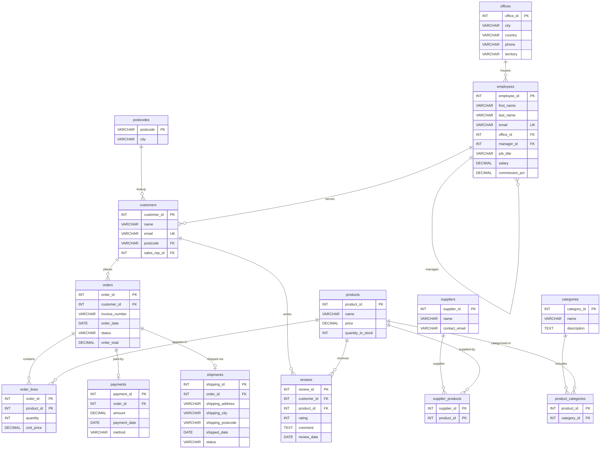

# Orders & Payments — Relational Schema Model

The canonical relational schema used across Chapters 2–5. Chapter 2 derives the base structure from an ERD; Chapter 3 normalises it to BCNF and adds the star schema; Ch4 extends the schema with offices/employees tables and queries it; Chapter 5 hardens it with constraints, access control, transactions, and indexes.

**14 tables** | **Orders & Payments domain** | **MySQL 8.0+**

---

## 1. Mermaid ERD



**Constraint annotations** (not expressible in Mermaid erDiagram syntax):

| Table | Column(s) | Constraint |
|-------|-----------|-----------|
| orders | (customer_id, invoice_number) | UNIQUE composite |
| orders | order_total | Derived — trigger-maintained |
| order_lines | order_id | FK with ON DELETE CASCADE |
| order_lines | quantity | CHECK (quantity > 0) |
| payments | order_id | UNIQUE (one payment per order) |
| payments | amount | CHECK (amount > 0) |
| shipments | order_id | UNIQUE (one shipment per order) |
| shipments | shipping_address, shipping_city, shipping_postcode | Snapshot (Ch3 justified downshift) |
| reviews | rating | CHECK (rating BETWEEN 1 AND 5) |
| employees | (manager_id) | Self-referencing FK |
| customers | sales_rep_id | FK to employees (Ch4 extension) |

---

## 2. dbdiagram.io (DBML)

Paste into [dbdiagram.io](https://dbdiagram.io) to generate an interactive diagram.

```dbml
// ============================================================
// Orders & Payments — Relational Schema (Chapters 2–5)
// ============================================================
// Chapter 2: base structure from ERD
// Chapter 3: BCNF normalisation (postcodes decomposition,
//            order_total derived attribute, star schema)
// Chapter 5: enforcement (CHECK, UNIQUE, CASCADE, triggers)
// ============================================================

Table postcodes {
  postcode  varchar(10)  [pk, note: 'Ch3 BCNF decomposition']
  city      varchar(50)  [not null]
}

Table customers {
  customer_id  int          [pk]
  name         varchar(100) [not null]
  email        varchar(100) [not null, unique, note: 'candidate key']
  postcode     varchar(10)  [note: 'optional — FK to postcodes']
  sales_rep_id int          [note: 'FK to employees — Ch4 extension, nullable']
}

Table orders {
  order_id        int          [pk]
  customer_id     int          [not null, note: 'FK to customers']
  invoice_number  varchar(20)  [note: 'UNIQUE(customer_id, invoice_number) — Ch5']
  order_date      date
  status          varchar(20)  [note: 'pending | paid | shipped | delivered | completed']
  order_total     decimal(10,2) [note: 'derived — trigger-maintained (Ch3 + Ch5)']
}

Table products {
  product_id       int          [pk]
  name             varchar(100)
  price            decimal(10,2)
  quantity_in_stock int         [default: 0]
}

Table order_lines {
  order_id    int          [not null, note: 'CASCADE on delete — weak entity (Ch2/Ch5)']
  product_id  int          [not null]
  quantity    int          [note: 'CHECK (quantity > 0) — Ch5']
  unit_price  decimal(10,2)

  indexes {
    (order_id, product_id) [pk]
  }
}

Table payments {
  payment_id    int          [pk]
  order_id      int          [not null, unique, note: 'one payment per order']
  amount        decimal(10,2) [note: 'CHECK (amount > 0) — Ch5']
  payment_date  date
  method        varchar(30)  [note: 'card | paypal | bank_transfer']
}

Table shipments {
  shipping_id       int          [pk]
  order_id          int          [not null, unique, note: 'one shipment per order']
  shipping_address  varchar(200) [note: 'snapshot — Ch3 justified downshift']
  shipping_city     varchar(50)  [note: 'snapshot']
  shipping_postcode varchar(10)  [note: 'snapshot']
  shipped_date      date
  status            varchar(20)
}

Table reviews {
  review_id    int   [pk]
  customer_id  int   [not null]
  product_id   int   [not null]
  rating       int   [note: 'CHECK (rating BETWEEN 1 AND 5) — Ch5']
  comment      text
  review_date  date
}

Table suppliers {
  supplier_id    int          [pk]
  name           varchar(100)
  contact_email  varchar(100)
}

Table supplier_products {
  supplier_id  int  [not null]
  product_id   int  [not null]

  indexes {
    (supplier_id, product_id) [pk]
  }
}

Table categories {
  category_id  int         [pk]
  name         varchar(50)
  description  text
}

Table product_categories {
  product_id   int  [not null]
  category_id  int  [not null]

  indexes {
    (product_id, category_id) [pk]
  }
}

Table offices {
  office_id  int          [pk]
  city       varchar(50)  [not null]
  country    varchar(50)  [not null]
  phone      varchar(20)
  territory  varchar(50)
}

Table employees {
  employee_id    int           [pk]
  first_name     varchar(50)   [not null]
  last_name      varchar(50)   [not null]
  email          varchar(100)  [not null, unique, note: 'candidate key']
  office_id      int           [not null, note: 'FK to offices']
  manager_id     int           [note: 'self-referencing FK — NULL for top-level']
  job_title      varchar(50)   [not null]
  salary         decimal(10,2)
  commission_pct decimal(4,2)  [note: 'NULL for managers']
}

// ============================================================
// Relationships
// ============================================================

// customers looks up postcode for city (Ch3 BCNF decomposition)
Ref: customers.postcode > postcodes.postcode

// customers places orders
Ref: orders.customer_id > customers.customer_id

// Order contains order lines (weak entity — CASCADE on delete)
Ref: order_lines.order_id > orders.order_id

// products appears in order lines
Ref: order_lines.product_id > products.product_id

// Order has at most one payment (1:0..1)
Ref: payments.order_id - orders.order_id

// Order has at most one shipment (1:0..1)
Ref: shipments.order_id - orders.order_id

// customers writes reviews
Ref: reviews.customer_id > customers.customer_id

// products receives reviews
Ref: reviews.product_id > products.product_id

// suppliers supplies products (M:N via junction table)
Ref: supplier_products.supplier_id > suppliers.supplier_id
Ref: supplier_products.product_id > products.product_id

// products belongs to categories (M:N via junction table)
Ref: product_categories.product_id > products.product_id
Ref: product_categories.category_id > categories.category_id

// offices houses employees
Ref: employees.office_id > offices.office_id

// employees reports to manager (self-reference)
Ref: employees.manager_id > employees.employee_id

// customers assigned to sales rep (nullable)
Ref: customers.sales_rep_id > employees.employee_id
```

---

## Schema Notes

### Chapter provenance

| Table | Introduced in | Notes |
|-------|--------------|-------|
| customers, orders, products, order_lines | Ch2 | ERD derivation — base structure |
| postcodes | Ch3 | BCNF decomposition (postcode → city extracted from customers) |
| payments, shipments | Ch2/Ch3 | Shipping address is a snapshot (Ch3 justified downshift) |
| reviews | Ch3 | Added for star schema comparison |
| suppliers, supplier_products | Ch3 | Added for multi-table join examples |
| categories, product_categories | Ch3 | Added for reporting dimension |
| `order_total` column on orders | Ch3 | Derived attribute — trigger-maintained (Ch5 Code 1) |
| `invoice_number` column on orders | Ch5 | Business key — UNIQUE(customer_id, invoice_number) |
| offices, employees | Ch4 | Sales organisation extension — self-referencing manager hierarchy |
| `sales_rep_id` column on customers | Ch4 | Links customers to their assigned sales representative |

### Chapter 5 enforcement additions

| Constraint | Table | Type |
|-----------|-------|------|
| `CHECK (quantity > 0)` | order_lines | Domain rule |
| `CHECK (amount > 0)` | payments | Domain rule |
| `CHECK (rating BETWEEN 1 AND 5)` | reviews | Domain rule |
| `UNIQUE (customer_id, invoice_number)` | orders | Business key uniqueness |
| `ON DELETE CASCADE` | order_lines → orders | Weak entity lifecycle |
| `trg_orderline_after_insert` | order_lines → orders | Trigger maintaining `order_total` |

### Relationship summary

| Relationship | Type | FK location | Cascade |
|-------------|------|-------------|---------|
| postcodes → customers | 1:0..* | customers.postcode | RESTRICT |
| customers → orders | 1:0..* | orders.customer_id | RESTRICT |
| orders → order_lines | 1:0..* | order_lines.order_id | **CASCADE** |
| products → order_lines | 1:0..* | order_lines.product_id | RESTRICT |
| orders → payments | 1:0..1 | payments.order_id (UNIQUE) | RESTRICT |
| orders → shipments | 1:0..1 | shipments.order_id (UNIQUE) | RESTRICT |
| customers → reviews | 1:0..* | reviews.customer_id | RESTRICT |
| products → reviews | 1:0..* | reviews.product_id | RESTRICT |
| suppliers ↔ products | M:N | supplier_products (junction) | RESTRICT |
| categories ↔ products | M:N | product_categories (junction) | RESTRICT |
| offices → employees | 1:0..* | employees.office_id | RESTRICT |
| employees → employees | 1:0..* (self) | employees.manager_id | RESTRICT |
| employees → customers | 1:0..* | customers.sales_rep_id | RESTRICT |

### BCNF analysis

**13 of 14 tables are in BCNF.** The two departures are intentional, documented in Chapter 3 as justified downshifts.

| Table | Non-trivial FDs | All determinants superkeys? | Verdict |
|-------|----------------|----------------------------|---------|
| postcodes | {postcode} → {city} | Yes (PK) | BCNF |
| customers | {customer_id} → all; {email} → all | Yes (both candidate keys) | BCNF |
| orders | {order_id} → all; {customer_id, invoice_number} → all | Yes (both candidate keys) | BCNF |
| products | {product_id} → all | Yes (PK) | BCNF |
| order_lines | {order_id, product_id} → {quantity, unit_price} | Yes (PK) | BCNF |
| payments | {payment_id} → all; {order_id} → all | Yes (both candidate keys) | BCNF |
| **shipments** | **{shipping_postcode} → {shipping_city}** | **No** | **Justified downshift** |
| reviews | {review_id} → all | Yes (PK) | BCNF |
| suppliers | {supplier_id} → all | Yes (PK) | BCNF |
| supplier_products | {supplier_id, product_id} → ∅ | Trivially | BCNF |
| categories | {category_id} → all | Yes (PK) | BCNF |
| product_categories | {product_id, category_id} → ∅ | Trivially | BCNF |
| offices | {office_id} → all | Yes (PK) | BCNF |
| employees | {employee_id} → all; {email} → all | Yes (both candidate keys) | BCNF |

**Justified downshift 1 — shipments (snapshot pattern).** The FD `shipping_postcode → shipping_city` violates BCNF: `shipping_postcode` is not a superkey of shipments. Decomposing into the postcodes lookup would break the historical record — if a borough is renamed, the shipping record must still show where the package was *actually sent*, not today's name. The snapshot freezes the delivery address at ship time. (Ch3 §3.6)

**Justified downshift 2 — orders.order\_total (derived attribute).** The column `order_total = SUM(order_lines.quantity × order_lines.unit_price)` introduces cross-table redundancy. Within the orders table the FD `{order_id} → {order_total}` has a superkey determinant, so BCNF is not violated *within the table*. The redundancy is *across* tables: the value can be computed from order_lines. The trigger (Ch5 Code 1) maintains consistency on every order_lines write, inside the same transaction. (Ch3 §3.6, Ch5 §3.7)
