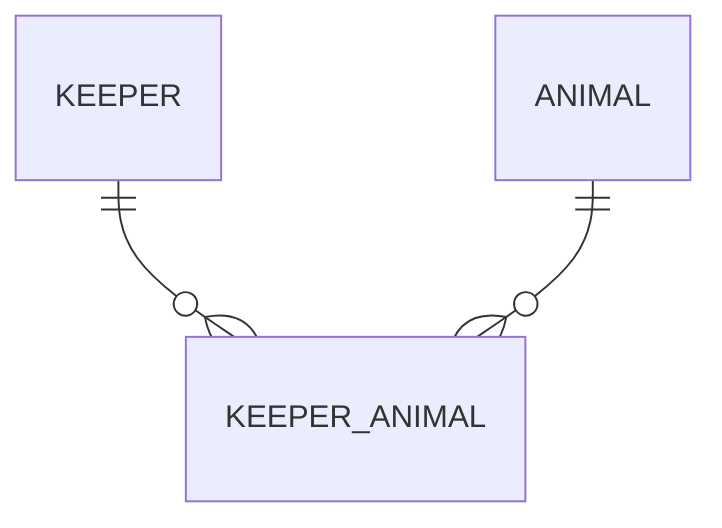

---

## **Question 1(a)**

**Question:**  
An E/R diagram for a zoo-breeding program shows **Keeper** and **Animal** in a **many-to-many** relationship. If this ER model is implemented in a **relational** database, what change is needed?

**Correct Answer:**  
**(ii)** The relationship between Keeper and Animal is many-to-many and requires a **new entity** (join/associative table) between them.

---

### **Explanation**

In **relational** databases, a direct many-to-many (M:N) link between two tables (e.g., `Keeper ↔ Animal`) is **not** possible without a **join table**. Instead, you create something like:



- **`Keeper_Animal`** table typically contains:
  - `KeeperID` (FK referencing `Keeper`)
  - `AnimalID` (FK referencing `Animal`)
  - Potentially other attributes, like `AssignedDate`, `Role`, etc.

This transforms one **M:N** relationship into **two** **1:N** relationships (`Keeper_Animal` → `Keeper`, `Keeper_Animal` → `Animal`).

---

### **Why Other Choices Are Incorrect**

- **(i)** **Renaming attributes** (e.g., `date of birth` → `dob`) is a best practice but **not** a structural fix for M:N.
- **(iii)** A circular loop in the ER diagram is not necessarily a problem; you can still implement it if each relationship makes sense logically.
- **(iv)** Spaces in attribute names are a **naming convention** concern, not a structural issue.

---

### **Edge Cases / “What If?”**

- **What if the relationship is actually 1:N instead of M:N?** You wouldn’t need a separate table. But the question explicitly states it’s M:N.

---

### **DIY Exploration**

- **Try** modeling a real scenario: “Students” and “Courses.”  
  1. Draw an ER diagram with M:N.  
  2. Create the bridging table (e.g., `StudentCourse`).  
  3. List the primary and foreign keys.

---

### **Key Terms**

- **Associative Entity / Join Table**: The table that breaks down a many-to-many relationship into two one-to-many relationships.  
- **Structural vs. Naming Conventions**: Structural changes (like adding a join table) are mandatory for correctness; naming changes (like removing spaces) improve clarity but are optional.

---

### **Common Pitfalls**

- **Forgetting** to add a join table for M:N relationships.  
- **Overemphasizing** attribute renaming while ignoring the fundamental M:N issue.

---

## **Question 1(b)**

**Question:**  
Evaluate the normalization level of this table:

| Animal  | Species      | Feed      |
|---------|--------------|-----------|
| Simba   | Lion         | Meat      |
| Hiss    | Royal python | Meat      |
| Eeyore  | Donkey       | Silage    |
| Fozzy   | Brown bear   | Nuts      |
| Fozzy   | Brown bear   | Berries   |
| Baloo   | Brown bear   | Nuts      |
| Baloo   | Brown bear   | Berries   |

**Correct Answer:**  
**(i)** The table is in **1NF** (First Normal Form) only.

---

### **Explanation**

- **1NF** requires **atomic** fields (no repeating groups, no arrays in a single cell). The table meets that:  
  - Each cell has a single value.  
  - No multi-valued attributes in the same column.

- **Not in 2NF** or higher:**  
  - If the primary key is `(Animal, Feed)` or `(Animal, Species)`, then `Species` or `Feed` might partially depend on **one** part of that key. That’s a **partial dependency**—violates 2NF.

---

### **Why Other Choices Are Incorrect**

- **Not 2NF**: Violates the partial dependency rule.  
- **Not 3NF**: You cannot be in 3NF if you fail 2NF.  
- **Not 4NF**: You must satisfy 3NF first.

---

### **Edge Cases / “What If?”**

- **If `Animal` alone were unique** (like an ID), we might have 2NF. But here, `Fozzy` repeats, so presumably `Animal` is **not** unique.

---

### **DIY Exploration**

- **Try** decomposing this table into separate tables to move toward 2NF or 3NF:  
  1. Possibly create an `Animal` table with `(Animal, Species)`.  
  2. A separate `Feeds` or `AnimalFeed` table.

---

### **Key Terms**

- **1NF**: No repeating groups; atomic columns.  
- **2NF**: No partial dependency on a part of a composite key.  
- **3NF**: No transitive dependency on non-key attributes.

---

### **Common Pitfalls**

- **Confusing** having multiple rows for an entity with being “fully normalized.” You must check functional dependencies, not just row repetition.

---

## **Question 1(c)**

**Question:**  
A temporary admin needs to add, update, delete records in the `Students` table. Which `GRANT` is best?

**Correct Answer:**  
**(iii)** `GRANT INSERT, UPDATE, SELECT, DELETE ON Students TO 'temp';`

---

### **Explanation**

- This allows the user to do **exactly** what they need:  
  - Insert new students, update existing, delete if needed, and select for viewing.  
- It **does not** grant other unnecessary privileges like altering or dropping the table.

---

### **Why Other Choices Are Incorrect**

- **(i)** `GRANT ALL ON * WITH GRANT OPTION` is too broad—impacts all tables, allows re-granting.  
- **(ii)** `GRANT SELECT` only gives read access, insufficient to add or edit data.  
- **(iv)** `GRANT ALL ON Students` includes schema-altering privileges (e.g., `ALTER TABLE`).

---

### **Edge Cases / “What If?”**

- **If** the admin should only insert new rows but not delete them, you’d omit `DELETE`. Tailor privileges carefully.

---

### **DIY Exploration**

- **Try** creating a test user in your own SQL environment and experiment with `GRANT` statements to see which commands become accessible.

---

### **Key Terms**

- **Principle of Least Privilege**: Only grant what’s needed.  
- **Role-based Access Control (RBAC)**: Typically, you create roles (e.g., `TemporaryAdmin`) and assign privileges to the role.

---

### **Common Pitfalls**

- Granting `ALL` or using `WITH GRANT OPTION` when not necessary, increasing security risks.

---

## **Question 1(d)**

**Question:**  
Count the RDF triples in the Turtle snippet:

```turtle
chEvents:22498 a event:Event, ecrm:E7_Activity, schema:Event ;
             dct:date "1952-11-30T17:30:00"^^xsd:dateTime ;
             rdfs:label "Cordelle Walcott"@en .
```

**Correct Answer:**  
**(iii)** 5

---

### **Explanation**

A triple = Subject + Predicate + Object. The snippet effectively expands to:

1. `chEvents:22498 a event:Event`  
2. `chEvents:22498 a ecrm:E7_Activity`  
3. `chEvents:22498 a schema:Event`  
4. `chEvents:22498 dct:date "1952-11-30T17:30:00"^^xsd:dateTime`  
5. `chEvents:22498 rdfs:label "Cordelle Walcott"@en`

---

### **Edge Cases / “What If?”**

- **If** you had more objects after `a` or additional predicates, you’d count each as a separate triple.  

---

### **DIY Exploration**

- **Try** writing a small Turtle file: define a single subject with multiple predicates and objects. Verify how many triples you get.

---

### **Key Terms**

- **Turtle**: A syntax for RDF.  
- **`a`**: Short for `rdf:type`.  
- **Triple**: (Subject, Predicate, Object).

---

### **Common Pitfalls**

- **Forgetting** each comma-separated object is a separate triple.  
- Overcounting or undercounting when multiple predicates appear on one line.

---

## **Question 1(e)**

**Question:**  
Why is the XML snippet **not well-formed**?

```xml
<movie>
  <title>Citizen Kane</title>
  <cast>
    <actor>Orson Welles</actor>
    <actor role="Jebediah Leland">Joseph Cotton</actor>
</movie>
```

**Associated Schema** with `<xs:all>` allows `<cast>`, `<releaseYear>`, `<title>` in any order.

**Select ALL correct**:  
1. cast should come before title  
2. **The cast element is not closed**  
3. title should have a lang attribute  
4. actor for Orson Welles needs role  
5. releaseYear is missing

**Correct Answer:**  
**(ii)** Only

---

### **Explanation**

- The `<cast>` tag never has a closing `</cast>`—that breaks **well-formedness** immediately.  
- “Well-formed” means matching start/end tags, proper nesting, etc.

---

### **Why Other Statements Don’t Break Well-Formedness**

- (i) The order is flexible with `<xs:all>` (not a well-formedness problem).  
- (iii), (v) Missing attributes/elements may break **schema validity** but not well-formedness.  
- (iv) `role` is likely optional, so also not a well-formedness issue.

---

### **Edge Cases / “What If?”**

- **If** it used `<xs:sequence>` with a strict order, then (i) might cause **invalid** XML—but still well-formed if tags are closed properly.  

---

### **DIY Exploration**

- **Try** removing the `</cast>` from a small XML file and see if your XML parser complains about “tag mismatch or unclosed tag.”

---

### **Key Terms**

- **Well-Formed XML**: Proper start/end tags, correct nesting, single root, etc.  
- **`<xs:all>`**: Child elements can appear in any order (once each unless `maxOccurs` changed).  
- **`<xs:sequence>`**: Child elements must appear in the declared order.

---

### **Common Pitfalls**

- Mixing up **well-formedness** with **schema validity**—they’re separate checks.

---

## **Question 1(f)**

**Question:**  
The same XML is **not valid** per the schema. Ignoring well-formedness, which statements identify the **schema violations**?

1. cast should come before title  
2. cast is not closed (that’s well-formedness)  
3. **title should have a lang attribute**  
4. actor for Orson Welles must have role  
5. **releaseYear is missing**

**Correct Answer:**  
**(iii) and (v)**

---

### **Explanation**

- **(iii)** The schema says `<title>` has a **required** `lang` attribute (e.g., `lang="en"`). Missing that breaks validity.  
- **(v)** The schema also requires `<releaseYear>` (within `<xs:all>`). The instance lacks `<releaseYear>`, so it’s invalid.

---

### **Why Others Aren’t Schema Violations**

- (i) `<xs:all>` → no strict order.  
- (ii) That’s **well-formedness** (not closed tag), not a schema compliance problem.  
- (iv) `role` is optional, so no violation.

---

### **Edge Cases / “What If?”**

- **If** `<xs:title>` was `lang="optional"`, then missing `lang` would be fine. Always check `use="required"` vs. `use="optional"`.

---

### **DIY Exploration**

- **Try** adding `<title lang="en">Citizen Kane</title>` and `<releaseYear>1941</releaseYear>` to make the XML valid, then validate it with an XML validator.

---

### **Key Terms**

- **XML Validity**: Conformance to the XSD or DTD constraints.  
- **`<xs:all>`** vs. `<xs:sequence>`**: All = any order, Sequence = strict order.  
- **Required attributes** (`use="required"`) vs. optional (`use="optional"`).

---

### **Common Pitfalls**

- Forgetting required attributes/elements in the XSD.  
- Confusing optional vs. required attributes.

---

## **Question 1(g)**

**Question:**  
Comparing **MongoDB** with **SQL**, which statements are **true**?

1. Unlike SQL, MongoDB has no explicit indexes.  
2. Unlike MongoDB, a SQL DBMS can guarantee ACID compliance in all transactions.  
3. A single MongoDB update would often map to more than one command in SQL.  
4. A MongoDB document can have a more complex structure than an SQL table.

**Correct Answer:**  
**(ii), (iii), (iv)**

---

### **Explanation**

- **(ii)** SQL DBMSs guarantee ACID for all transactions. MongoDB traditionally has partial/more-limited ACID (especially multi-document transactions introduced later).  
- **(iii)** Updating nested sub-documents in MongoDB can happen in a single statement. In SQL, you might need multiple `UPDATE`s across related tables.  
- **(iv)** MongoDB documents can have arrays and embedded documents—**far more flexible** than a single row in SQL.

- **(i) is false**: MongoDB **does** support explicit indexing. (E.g., `db.collection.createIndex({ field: 1 })`).

---

### **Edge Cases / “What If?”**

- **MongoDB** versions 4.0+ do allow multi-document ACID transactions, but it’s still not as *pervasive* as SQL’s built-in transactional model.

---

### **DIY Exploration**

- **Try** comparing a single MongoDB insert with multiple SQL inserts for a normalized schema.  
- **Create** indexes in MongoDB (e.g., `db.animals.createIndex({ name: 1 })`) to see how queries speed up.

---

### **Key Terms**

- **ACID**: Atomicity, Consistency, Isolation, Durability.  
- **BASE**: (Older NoSQL concept) Basically Available, Soft state, Eventually consistent.  
- **Document Model**: JSON-like structure for MongoDB.

---

### **Common Pitfalls**

- Believing MongoDB has zero transaction support. It does, but less historically robust than SQL.  
- Thinking MongoDB can’t index fields (it can—and should!).

---

## **Question 1(h)**

**Question:**  
A researcher wants a set of documents for quick, free digitization, then discards irrelevant items. Should the IR system focus on **precision** or **recall**?

**Correct Answer:**  
**(i)** Focus on **precision**; recall is less critical.

---

### **Explanation**

- The researcher can easily discard irrelevant items, but doesn’t want to be overwhelmed by false positives. High **precision** ensures fewer irrelevant items in the results.  
- If recall were crucial, we’d aim to catch **every** relevant document, even if we get many irrelevant ones.

---

### **Edge Cases / “What If?”**

- **If** the researcher absolutely couldn’t miss certain crucial documents, then **recall** might be more important.

---

### **DIY Exploration**

- **Try** analyzing your own searches (e.g., library or Google). Are you more annoyed by missing what you need or by having lots of junk? That helps decide whether to prefer precision or recall.

---

### **Key Terms**

- **Precision**: Among retrieved items, what fraction are relevant?  
- **Recall**: Among all relevant items, what fraction did we retrieve?

---

### **Common Pitfalls**

- Using the **F-measure** (which balances precision & recall) when the problem explicitly prioritizes one over the other.

---

## **Question 1(i)**

**Question:**  
What distinguishes a **general graph** from a **tree**?

1. A graph does not need a root node; a tree does.  
2. A tree can include text; a graph cannot.  
3. A node in a tree has exactly one parent node; a graph has no such constraint.  
4. A tree does not need a root node; a graph does.

**Correct Answer:**  
**(i) and (iii)**

---

### **Explanation**

- **(i)** Trees need exactly **one root** node. Graphs have no root requirement.  
- **(iii)** In a tree, each node except the root has exactly **one** parent; a general graph can have multiple incoming edges (multiple “parents”) or none.

- **(ii) is false**: Both trees and graphs can label nodes with text or any data.  
- **(iv) is false**: Opposite of (i)—trees do have a root; graphs don’t need one.

---

### **Edge Cases / “What If?”**

- **If** you remove cycles and designate a root in a graph, you essentially get a tree (or forest, if multiple roots).

---

### **DIY Exploration**

- **Sketch** a small tree (like a file directory) vs. a small graph (like a social network). Label each node’s parent(s).

---

### **Key Terms**

- **Tree**: Acyclic graph with a single root, exactly one parent per child.  
- **Graph**: Potentially cyclical or acyclic, no root needed, can have multiple parents.

---

### **Common Pitfalls**

- Confusing “trees” with “graphs.” All trees are graphs, but not all graphs are trees.

---

## **Question 1(j)**

**Question:**  
Which statements about **types of SQL joins** are correct?

1. A LEFT JOIN will produce at least as many rows as an INNER JOIN.  
2. An INNER JOIN will produce at least as many rows as a LEFT JOIN.  
3. A CROSS JOIN will produce at least as many rows as a LEFT JOIN.  
4. A LEFT JOIN will produce at least as many rows as a CROSS JOIN.  
5. No type of join can produce more rows than a CROSS JOIN.

**Correct Answer:**  
**(i), (iii), (v)**

---

### **Explanation**

1. **(i)** A **LEFT JOIN** returns all rows from the left table plus matching rows from the right—so it can’t have *fewer* rows than an **INNER JOIN**.  
2. **(iii)** A **CROSS JOIN** is the Cartesian product (all combinations). This typically yields *more or equal* to any left join.  
3. **(v)** No join returns *more* rows than a **CROSS JOIN**, which is `tableA_rows × tableB_rows`.

- **(ii)** is false (it’s the opposite of (i)).  
- **(iv)** is false because a CROSS JOIN generally yields more rows than any left join.

---

### **Edge Cases / “What If?”**

- **If** one table has 0 rows, CROSS JOIN yields 0 rows too—but it’s still the “maximum possible” approach when both tables have data.

---

### **DIY Exploration**

- **Try** a small example in SQL:
  1. `TableA` with 3 rows, `TableB` with 2 rows.  
  2. Compare `INNER JOIN`, `LEFT JOIN`, and `CROSS JOIN` results.

---

### **Key Terms**

- **INNER JOIN**: Only matched rows.  
- **LEFT JOIN**: All left rows + matched right.  
- **CROSS JOIN**: Cartesian product (all row combos).

---

### **Common Pitfalls**

- Assuming `LEFT JOIN` can produce more rows than a CROSS JOIN (it can’t).  
- Mixing up row counts for LEFT vs. INNER JOIN.

---

---

## **Quick Reference / “Cheat Sheet”**

### **E/R and Relational Modeling**
1. **Many-to-Many → Associative Entity**  
   - Always break M:N into two 1:N relationships.

2. **Normalization**  
   - **1NF**: Atomic columns (no repeating groups).  
   - **2NF**: No partial dependency on part of a composite key.  
   - **3NF**: No transitive dependency on non-key attributes.

### **SQL Grants**
- Always apply **principle of least privilege**.  
- `GRANT INSERT, UPDATE, SELECT, DELETE` suffices for typical data-entry tasks. Avoid `ALL` for temporary or limited users.

### **RDF / Turtle**
- Each `(subject, predicate, object)` = **1 triple**.  
- `a` is shorthand for `rdf:type`.  
- Semicolons (`;`) separate different predicates for the same subject, commas (`,`) separate multiple objects for the same predicate.

### **XML**  
1. **Well-Formed**  
   - Matching start/end tags, correct nesting, one root, etc.  
2. **Valid**  
   - Complies with XSD or DTD rules (e.g., required attributes/elements).

### **MongoDB vs. SQL**  
- **ACID**: SQL is fully ACID; MongoDB only partially (though improved in newer versions).  
- **Indexing**: Both support indexes (MongoDB definitely does).  
- **Documents** can be more complex than SQL rows.

### **IR (Precision vs. Recall)**  
- **Precision**: fraction of retrieved docs that are relevant.  
- **Recall**: fraction of all relevant docs that were retrieved.  
- **Choose** precision if you want to avoid large numbers of irrelevant items.

### **Graphs vs. Trees**  
- **Tree**: A special graph with a single root, no cycles, exactly 1 parent per child.  
- **General Graph**: Might have cycles, no single root, can have multiple parents.

### **SQL Joins**  
- **INNER JOIN**: matched rows only.  
- **LEFT JOIN**: all left + matched right.  
- **CROSS JOIN**: Cartesian product (maximum row count).

---
