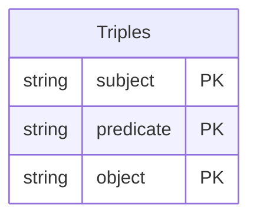

---

# **Question 2: Database Design and Querying**

---

### **(a) Which aggregate function is used here?**  
**Answer:**  
The aggregate function used is **`AVG()`**.

#### **Detailed Explanation**  
- **Role of `AVG()`**: `AVG()` calculates the mean of a set of values (e.g., test scores).  
- **Common Mistakes**: Mixing up `AVG()` with `SUM()` or forgetting a `GROUP BY` when also selecting non‐aggregated columns.

#### **Key Takeaways**  
- `AVG()` is a fundamental SQL aggregate.  
- In queries that combine `AVG()` with non‐aggregated columns, use `GROUP BY` appropriately.

---

### **(b) There is a problem with the database design that risks making the aggregation incorrect. What is it, and how could it be resolved?**  
**Answer:**  
The main issue is storing or using attributes that can become outdated or inconsistent—such as **Age**—rather than deriving them from a stable attribute (e.g., `BirthDate`). Additionally, free‐text fields like **City** or **School** may lead to inconsistent groupings.

#### **Solution Approach**  
1. **Avoid Storing Dynamic Attributes**  
   - Compute `Age` at query time (e.g., using `TIMESTAMPDIFF`) to prevent stale data.  
2. **Normalize the Database**  
   - Instead of storing `City` or `School` as free‐text, reference them by IDs in lookup tables, enforcing consistency and preventing “Birmingham, UK” vs. “Birmingham (UK)” style mismatches.

#### **Key Takeaways**  
- Proper **normalization** and consistently computed attributes ensure accurate aggregates.  
- Dynamic attributes (like Age) are best calculated rather than stored directly.

---

### **(c) For security reasons, the researcher should be given minimal, read‐only access to the database. Give a suitable command that the database administrator should run.**  
**Answer:**  
```sql
GRANT SELECT ON database_name.* 
       TO 'researcher'@'localhost' 
       IDENTIFIED BY 'password';
```

#### **Detailed Explanation**  
- **Principle of Least Privilege**: The `SELECT` privilege alone grants read‐only access.  
- In modern MySQL, you may need to create the user first with `CREATE USER` before `GRANT`.

---

### **(d) From the point of view of handling confidential information about minors, it would be better to give access only to aggregated data. How would you achieve that?**  
**Answer:**  
Create a **VIEW** that exposes only aggregated data (e.g., average scores, counts) rather than individual‐level records, then grant `SELECT` on that view only.

```sql
CREATE VIEW AggregatedData AS
SELECT Gender, City, AVG(Score) AS AvgScore
FROM Test
GROUP BY Gender, City;
```

#### **Key Takeaways**  
- **Views** can mask underlying sensitive data by surfacing only summaries.  
- This aligns with data protection standards (e.g., for minors).

---

### **(e) What limitation would that create for the researcher?**  
**Answer:**  
They cannot drill down to individual records. This **prevents** detailed, record‐level analysis (e.g., outlier detection, correlation studies at the individual level).

---

### **(f) The `Student` table is defined as**:
```sql
CREATE TABLE Student (
  ID VARCHAR(25) PRIMARY KEY,
  GivenName VARCHAR(80) NOT NULL,
  FamilyName VARCHAR(80) NOT NULL,
  Gender ENUM('M','F') NOT NULL,
  BirthDate DATE NOT NULL,
  School VARCHAR(130),
  City VARCHAR(130)
);
```
**What problems can you see with this table, and how would you resolve them?**  
**Answer:**  
1. **Primary Key as `VARCHAR(25)`**: This may be inefficient for indexing and lookups if the ID could instead be an integer.  
2. **Overly Restrictive Gender**: `ENUM('M','F')` might be insufficient for modern contexts.  
3. **Lack of Referential Integrity for City/School**: Storing them as free‐text invites inconsistencies.  
4. **Potential Redundancy**: Each record duplicates school/city info instead of referencing them by an ID.

#### **Possible Resolutions**  
- Use an integer (e.g., `INT AUTO_INCREMENT`) for `ID`, unless there is a strong reason to keep an external string ID.  
- Broaden or alter the `Gender` storage if required by real‐life constraints (or allow nulls, additional values, etc.).  
- Normalize `City` and `School` into their own tables with proper foreign keys.  

---

### **(g) How well would this data work in an object database like MongoDB? What would be the advantages or disadvantages?**  
**Answer:**  
- **Advantages**:  
  1. Schema flexibility (no strict schema needed).  
  2. Document‐oriented model makes embedding nested data easier.  
  3. Horizontal scaling is straightforward.  

- **Disadvantages**:  
  1. No traditional joins, which complicates cross‐document queries.  
  2. Potential duplication (e.g., city info repeated in many documents).  
  3. Weaker built‐in referential integrity.

---

# **Question 3: XML, XPath, and Relational Models**

---

### **(a) What markup language is being used? And what is the root node?**  
**Answer:**  
- **Markup Language:** XML (specifically TEI, which is an XML application).  
- **Root Node:** `<TEI>`.

---

### **(b) Is this fragment well‐formed? Justify your answer.**  
**Answer:**  
Likely **not** well‐formed if there are unclosed tags (e.g., `<fileDesc>`, `<teiHeader>`). Properly closed tags are essential for well‐formedness under XML rules.

---

### **(c) What would be selected by evaluating the XPath expression `//fileDesc//title/@type`?**  
**Answer:**  
It selects the **`type`** attribute value(s) on every `<title>` element nested under `<fileDesc>`. For example, `"collection"`.

---

### **(d) What would be selected by evaluating `//resp[text()='Cataloguer']/../persName`?**  
**Answer:**  
All `<persName>` elements whose parent also contains a `<resp>` element with text `'Cataloguer'`. The `../` means “go up one level to the parent, then find `<persName>`.”

---

### **(e) Why might you choose the expression given in part (d) rather than the simpler `persName`? Give two situations where it would be preferable.**  
**Answer:**  
1. **Disambiguation**: If the document has many `<persName>` elements, only those tied to a “Cataloguer” `<resp>` are relevant.  
2. **Context**: You only want `<persName>` that is specifically associated with `<resp>Cataloguer</resp>`.

---

### **(f) This element refers to the second textual item (such as a story or sermon) that the manuscript contains – hence `n=2`. How well would this way of listing contents work in a relational model? How would you approach the problem?**  
**Answer:**  
**Storing an order** via `n="2"` is not ideal. Relational tables do not inherently track ordering. A better solution is to have a separate table with columns like `(ManuscriptID, ItemNumber, ItemContent)`, so you can reorder or query items by their explicit sequence.

---

### **(g) Here is an extract of the file `msdesc.rng`. What is this file, and why is it referenced in the catalogue entry?**  
**Answer:**  
It is a **Relax NG schema** that defines the structure and constraints of the TEI XML. The catalogue entry references it so that the XML can be validated against the schema’s rules.

---

### **(h) What is the difference between valid and well‐formed XML?**  
**Answer:**  
- **Well‐formed XML**: All tags are properly opened/closed and nested; there is exactly one root element, etc.  
- **Valid XML**: XML that is **well‐formed** **and** conforms to a defined schema/DTD.

---

### **(i) If the first extract in this question had omitted the `respStmt` element, would the XML have been legal?**  
**Answer:**  
No, not if the schema requires `<respStmt>`. It would still be “well‐formed” if all tags are closed, but **not valid** (i.e., “not legal” per the schema).

---

### **(j) If the first extract had omitted the `title` elements, would the XML have been legal?**  
**Answer:**  
No, for the same reason. If `title` is mandatory in `<titleStmt>`, omitting it breaks validation.

---

### **(k) This catalogue entry is converted automatically to HTML whenever it changes. What two technologies would be most likely to be considered for the conversion?**  
**Answer:**  
1. **XSLT** (Extensible Stylesheet Language Transformations) for transforming XML to HTML.  
2. An **XSLT processor** (e.g., **Saxon** or **Xalan**) to run those transformations.

---

# **Question 4: RDF, Ontologies, and Linked Data**

Below is the revised solution focusing on a **single‐table triple store** approach where `(subject, predicate, object)` is used as a **composite primary key**.

---

### **(a) (i) What is the model?**  
**Answer:**  
**RDF** (Resource Description Framework).

### **(a) (ii) What is the serialization format?**  
**Answer:**  
**Turtle**.

---

### **(b) Name two ontologies used in this document.**  
**Answer:**  
1. **Dublin Core** (`dcterms:`)  
2. **FOAF** (`foaf:`)

*(Sometimes `oa:` for Open Annotation is also mentioned.)*

---

### **(c) For each ontology named in your previous answer, name all the properties from the ontology that are used in this document.**  
**Answer:**  
- **Dublin Core**: `dcterms:creator`, `dcterms:created`  
- **FOAF**: `foaf:name`

---

### **(d) This structure is a Web Annotation previously called Open Annotation. The BODY of the annotation contains a comment on the TARGET, which is often part of a SOURCE. The scholar wants a SPARQL query that returns the annotation body and the creator, filtered by `armadale:Chapter3`.**  
**Answer (SPARQL):**  
```sparql
SELECT ?body ?creator
WHERE {
  ?annotation a oa:Annotation ;
              oa:hasBody ?body ;
              dcterms:creator ?creator ;
              oa:hasTarget ?target .
  ?target oa:hasSource armadale:Chapter3 .
}
```

---

### **(e) Some Linked Data systems use a backend database to store the data and for quick retrieval, exporting it as needed. Draw an ER diagram for web annotations like this.**

#### **Single‐Table Triples Approach with Composite PK**

Instead of creating separate tables (e.g., Annotations, Persons, Sources), we store **all** RDF data in a single table called `Triples`, each row representing `(subject, predicate, object)`.



- **Composite Primary Key** `(subject, predicate, object)` ensures no duplicate triple.

---

### **(f) Identify the tables that you would need for a relational implementation and list the keys for each.**

#### **Revised Single‐Table Triple‐Store Answer**

You only need **one** table:

1. **`Triples`**  
   - **Columns**: `subject`, `predicate`, `object`  
   - **Primary Key**: `(subject, predicate, object)` (composite key)

*(Optional: add columns for data type, language, or named graph if needed.)*

---

### **(g) Give a MySQL query equivalent for the scholar’s query you corrected in question (d).**

In the triple‐store design, we do multiple **self‐joins** on the `Triples` table:

```sql
SELECT tBody.object     AS body,
       tCreator.object  AS creator
FROM Triples tAnno
  JOIN Triples tType
    ON tAnno.subject = tType.subject
  JOIN Triples tBody
    ON tAnno.subject = tBody.subject
  JOIN Triples tCreator
    ON tAnno.subject = tCreator.subject
  JOIN Triples tTarget
    ON tAnno.subject = tTarget.subject
  JOIN Triples tSource
    ON tTarget.object = tSource.subject
WHERE tType.predicate    = 'rdf:type'
  AND tType.object       = 'oa:Annotation'
  AND tBody.predicate    = 'oa:hasBody'
  AND tCreator.predicate = 'dcterms:creator'
  AND tTarget.predicate  = 'oa:hasTarget'
  AND tSource.predicate  = 'oa:hasSource'
  AND tSource.object     = 'armadale:Chapter3';
```

#### **Explanation**  
- **`tAnno`**: Baseline row from `Triples`, whose `subject` is the annotation resource.  
- **`tType`**: Ensures it is `rdf:type = oa:Annotation`.  
- **`tBody`**: Finds `oa:hasBody` triple for the same subject.  
- **`tCreator`**: Finds `dcterms:creator` triple for that subject.  
- **`tTarget`**: Finds `oa:hasTarget` triple for that subject.  
- **`tSource`**: Ensures `?target oa:hasSource armadale:Chapter3`.

---

## **Final Remarks**

1. **Design Choice**:  
   - A single‐table triple store is flexible but forces multiple self‐joins for complex queries.  
   - A multi‐table approach (Annotations, Persons, Sources, etc.) can be more “traditional” and potentially simpler for certain queries.  
2. **Keys & Constraints**:  
   - Using `(subject, predicate, object)` as a **composite PK** prevents duplicate statements in the store.  
3. **Relevance**:  
   - These approaches illustrate both **relational** and **linked data** mindsets. Depending on your environment, you may choose one or hybrid solutions.
